= 对象池
:sectnums:
:toclevels: 3
:toc: left
''''

== 对象池

==== 先看一个例子: 不用对象池技术, 来生成并销毁多个物体.

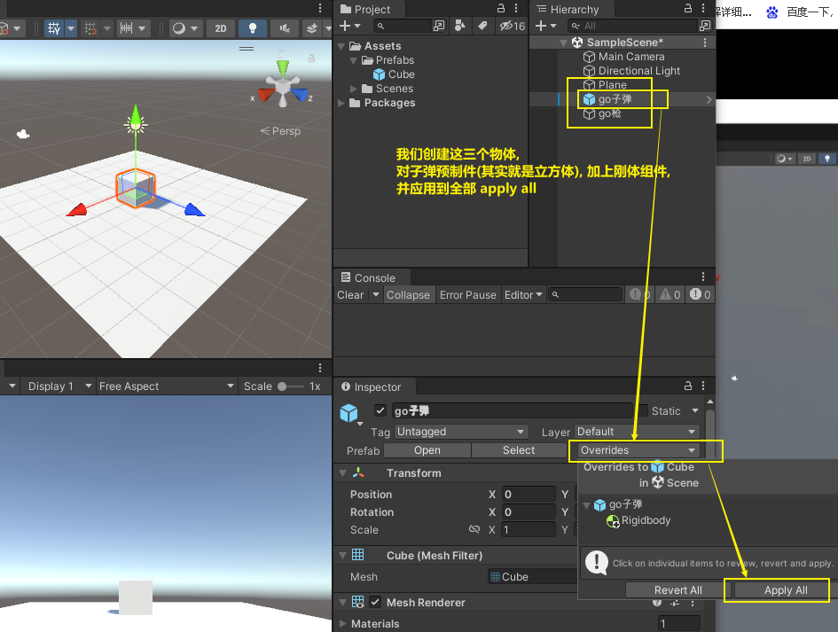

要创建两个脚本, 分别挂载到如下物体上:

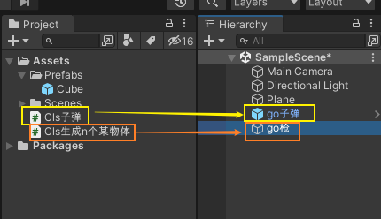

挂载到"枪"上的脚本:

[,subs=+quotes]
----
using System.Collections;
using System.Collections.Generic;
using UnityEngine;

public class Cls生成n个某物体 : MonoBehaviour
{
    *public GameObject go某预制件; //这个字段, 用来指针指向子弹预制件物体*

    // Start is called before the first frame update
    void Start()
    {

    }

    // Update is called once per frame
    void Update()
    {
        *Instantiate(go某预制件, transform.position,transform.rotation); //实例化(即复制)该预制件.* 由于该语句放在了 update里面, 它会每帧都生成一个新的"go某预制件"的物体.
    }
}
----

挂载到"子弹"上的脚本:

[,subs=+quotes]
----
using System.Collections;
using System.Collections.Generic;
using UnityEngine;

public class Cls子弹 : MonoBehaviour
{
    // Start is called before the first frame update
    void Start()
    {
        *Destroy(gameObject,2); //2秒后, 销毁本物体自己. 注意: 因为本子弹物体是预制件, 所以你在修改了本脚本后, 别忘了还要把本脚本"应用到所有预制件上". 即依然要点 apply all 按钮!*
    }

    // Update is called once per frame
    void Update()
    {

    }
}
----

'''

==== 使用"对象池"技术(有bug)

新建一个脚本 "Cls对象池", 挂载在"枪"物体上.

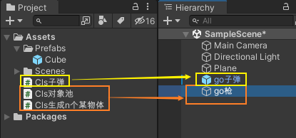

Cls对象池
[,subs=+quotes]
----
using System.Collections;
using System.Collections.Generic;
using UnityEngine;

public class Cls对象池 : MonoBehaviour
{
    *//本对象池类, 要保持单例模式*
    public static Cls对象池 instance本类的单例;

    public GameObject go预制件; //这个字段, 之后会指针指向预制件物体.即, 你在unity中, 把预制件物体(即子弹)拖到这个字段上来.

    *//对象池, 可以用"队列"类型来存储*
    public Queue<GameObject> queue预制件队列 = new Queue<GameObject>();

    private void Awake()
    {
            instance本类的单例= this; //将本脚本挂载的物体自己, 赋值给本类的字段. 即单例模式
    }

    public GameObject fnGet从对象池中取出物体()
    {
        if (queue预制件队列.Count > 0) //如果队列(对象池)里有物体存在, 即非空, 就来取出一个
        {
            GameObject go取出的物体 = queue预制件队列.Dequeue(); //用于从Queue的开头删除一个对象/元素，并返回该对象/元素
            go取出的物体.SetActive(true); //对象池里的物体, 默认都是"非激活"状态的, 所以我们取出来后, 要先激活它, 才能在游戏画面中显示出来.
            return go取出的物体;
        }
        else
        {
            //如果对象池中, 已经空了, 没有物体了(没有子弹了), 那我们就创建出一个预制件物体(新子弹), 放到池子里.
            GameObject go新预制件 = Instantiate(go预制件);
            return go预制件;
        }
    }

    public void fnReturn把某物体放回对象池中(GameObject go预制件物体)
    {
        go预制件物体.SetActive(false); //对象池中的物体, 要保持"非激活"状态.
        queue预制件队列.Enqueue(go预制件物体); //把该物体, 加入队列(即对象池)中. ← C#中的Queue.Enqueue()方法, 用于将对象添加到Queue的末尾。
    }

    public int fn返回对象池物体的数量()
    {
        return queue预制件队列.Count;
    }

}
----

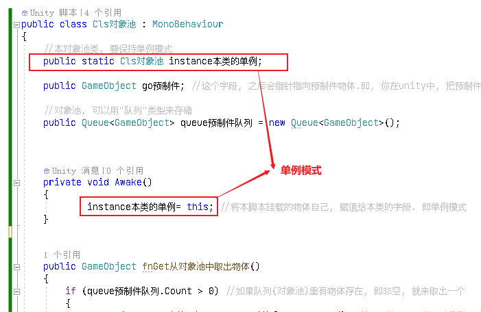

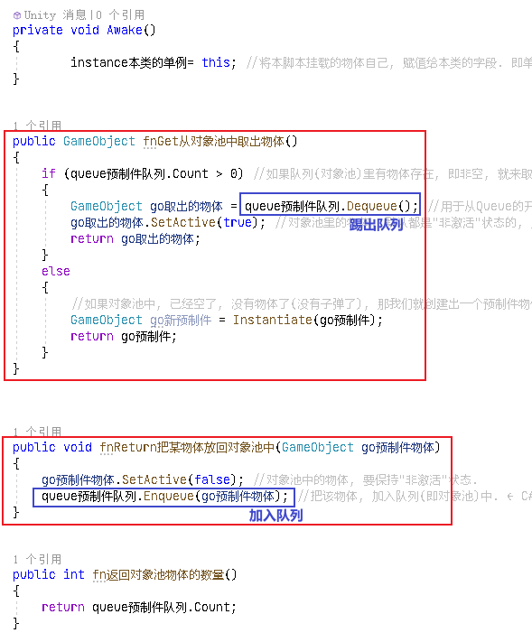

Cls子弹
[,subs=+quotes]
----
using System.Collections;
using System.Collections.Generic;
using UnityEngine;

public class Cls子弹 : MonoBehaviour
{

    //协程
    IEnumerator fn执行将本物体放回对象池中()
    {
        yield return new WaitForSeconds(2); //2秒后再执行后面的代码
        //调用Cls对象池中的单例身上的方法 -- 把本物体放回对象池中
        Cls对象池.instance本类的单例.fnReturn把某物体放回对象池中(this.gameObject);

    }

    void OnEnable() //OnEnabled() 和 OnDisEnabled(), 就是脚本的激活与失活, 会调用这两个函数. 为什么下面的开启协程, 我们不能放在 Awake()里面? 因为一个游戏物体挂载的脚本中Awake、Start只会执行一次，当这个游戏物体被取消激活, 再重新激活的时候，脚本中的Awake、Start都不会再重新执行。而OnEnable 则能够重新在物体再次被激活的第一帧执行一次！即, OnEnable能够在物体的每一次复活(被激活)时, 都能调用到.  而 Awake()则只会在物体第一次激活时被调用, 物体第二次, 第三次...复活时, 就不会再被调用Awake()了.
        *//虽然写在这里, 解决了所有实例化出的预制体, 能够实现"取消激活"的问题, 但这又造成了一个新问题: 因为这会导致对象池中元素的数量, 会永远递增, 而丧失了保持在一个少数数量的功能.*
    {
        StartCoroutine(fn执行将本物体放回对象池中()); //开启协程
    }

    // Update is called once per frame
    void Update()
    {

    }
}

----

Cls生成n个某物体(枪)
[,subs=+quotes]
----
using System.Collections;
using System.Collections.Generic;
using UnityEngine;

public class Cls生成n个某物体 : MonoBehaviour
{

    // Start is called before the first frame update
    void Start()
    {

    }

    // Update is called once per frame
    void Update()
    {
        //从对象池中, 拿出物体
        GameObject go某预制件 = Cls对象池.instance本类的单例.fnGet从对象池中取出物体();

        //实例化(即复制)该预制件.
        Instantiate(go某预制件, transform.position, transform.rotation);

        //查看对象池中的物体数量
        Debug.Log(Cls对象池.instance本类的单例.fn返回对象池物体的数量());

    }
}

----

'''

== ★ 使用 unity 自带的"对象池 ObjectPool" api

官方文档:
https://docs.unity3d.com/2021.1/Documentation/ScriptReference/Pool.ObjectPool_1.html

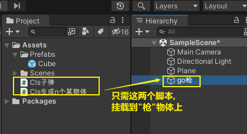

Cls子弹
[,subs=+quotes]
----
using System.Collections;
using System.Collections.Generic;
using UnityEngine;
using UnityEngine.Pool;
using static UnityEngine.UIElements.UxmlAttributeDescription;

public class Cls子弹 : MonoBehaviour
{
    public IObjectPool<Cls子弹> ins对象池;

    //协程
    IEnumerator fn执行将本物体放回对象池中()
    {
        yield return new WaitForSeconds(2); //2秒后再执行后面的代码
        ins对象池.Release(this); //Returns the instance back to the pool. 将本物体实例, 拿回对象池中.
        //this表示的是这个代码类，this.gameobject表示这个代码所挂载在的那个游戏对象。

        Debug.Log($"对象池中当前 available 的元素数量: {ins对象池.CountInactive}"); //  CountInactive	: Number of objects that are currently available in the pool.

    }

    void OnEnable() //OnEnabled() 和 OnDisEnabled(), 就是脚本的激活与失活, 会调用这两个函数. 为什么下面的开启协程, 我们不能放在 Awake()里面? 因为一个游戏物体挂载的脚本中Awake、Start只会执行一次，当这个游戏物体被取消激活, 再重新激活的时候，脚本中的Awake、Start都不会再重新执行。而OnEnable 则能够重新在物体再次被激活的第一帧执行一次！即, OnEnable能够在物体的每一次复活(被激活)时, 都能调用到.  而 Awake()则只会在物体第一次激活时被调用, 物体第二次, 第三次...复活时, 就不会再被调用Awake()了.
        //虽然解决了所有实例化出的预制体, 能够实现"取消激活"的问题, 但这又造成了一个新问题: 因为这会导致对象池中元素的数量, 会永远递增, 而丧失了保持在一个少数数量的功能.
    {
        StartCoroutine(fn执行将本物体放回对象池中()); //开启协程
    }

    // Update is called once per frame
    void Update()
    {

    }
}

----

Cls生成n个某物体
[,subs=+quotes]
----
using System.Collections;
using System.Collections.Generic;
using UnityEngine;
using UnityEngine.Pool; //导入这个命名空间, 才能使用unity自带的对象池功能.

public class Cls生成n个某物体 : MonoBehaviour
{

    public GameObject go预制体;

    //对象池, 是IObjectPool类型, 它是一个接口, 即 Interface for ObjectPools.
    public IObjectPool<Cls子弹> ins对象池; //声明一个对象池类型. 该对象池中, 只存放我们的"Cls子弹"类型的实例.

    // Start is called before the first frame update
    void Start()
    {
        ins对象池 = new ObjectPool<Cls子弹>(fnCreatePooledItem, fnOnTakeFromPool, fnOnReturnedToPool, fnOnDestroyPoolObject, false, 10, 100); //ObjectPool()方法是构造函数, 即 Creates a new ObjectPool instance.
        //这个构造方法中,要传入的参数是: new ObjectPool<你的预制体类的脚本>(CreatePooledItem, OnTakeFromPool, OnReturnedToPool, OnDestroyPoolObject, collectionChecks, 10(池子的初始大小), maxPoolSize(池子能扩容的最大容量)) ,其中前几个参数, 其实是回调函数的名字. 要你自己来编写这几个函数.
        //中间的那个 collectionChecks 参数, 其作用是:  Collection checks will throw errors if we try to release an item that is already in the pool. 默认是打开状态的, 即 public bool collectionChecks = true;

    //下面的函数, 创建"要放到对象池中的物体".
    Cls子弹 fnCreatePooledItem()
        {
           var newGo预制体 =   Instantiate(go预制体).GetComponent<Cls子弹>(); //复制出新的预制体物体, 并拿到该预制体物体身上的"Cls子弹"组件, 因为我们要调用该组件(class类)身上的"ins对象池"字段. (你预制体身上如果有挂载脚本, 则克隆它后, 脚本似乎也会跟着复制. 你要再验证一下)
            newGo预制体.ins对象池 = ins对象池; //让复制出的新预制体实例身上的"ins对象池"字段, 指针指向本(手枪)类中的这个"ins对象池"字段值. 即, n个克隆出的预制件物体实例, 它们的"ins对象池"字段, 指针会指向同一个对象池.
            newGo预制体.gameObject.SetActive(false); //对象池中的物体, 要呈"非激活"状态.
            return newGo预制体;
        }

        //下面的方法, 是从对象池中取出对象时, 会调用的方法.
        void fnOnTakeFromPool(Cls子弹 go子弹预制体)
        {
            go子弹预制体.gameObject.SetActive(true);
        }

        //将预制件物体拿回对象池时, 会调用下面的方法. Called when an item is returned to the pool using Release
        void fnOnReturnedToPool(Cls子弹 go子弹预制体)
        {
            go子弹预制体.gameObject.SetActive(false);
        }

        //下面的方法, 当池子里的物体数量, 已经到达最大容量时, 还从外界往池子里面放时, 就会触发下面的方法. 即, 直接销毁超过容量数量的物体.
        // If the pool capacity is reached then any items returned will be destroyed.
        // We can control what the destroy behavior does, here we destroy the GameObject.
        void fnOnDestroyPoolObject(Cls子弹 go子弹预制体)
        {
            Destroy(go预制体);
        }

    }

    // Update is called once per frame
    void Update()
    {
        Cls子弹 go取出的子弹预制体 = ins对象池.Get(); //从对象池中, 拿出物体
        go取出的子弹预制体.transform.position = transform.position;
        go取出的子弹预制体.transform.rotation = transform.rotation;

    }
}

----

把子弹预制件, 挂载到下面的字段中, 然后运行.

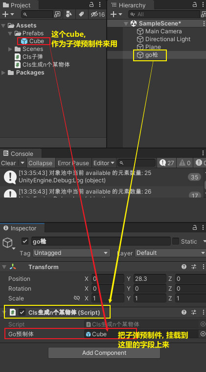

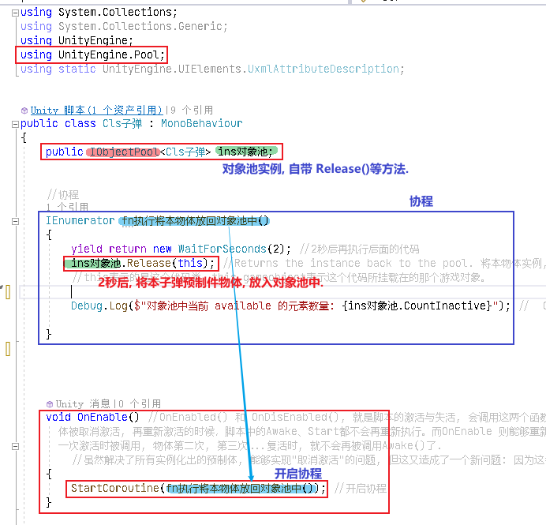

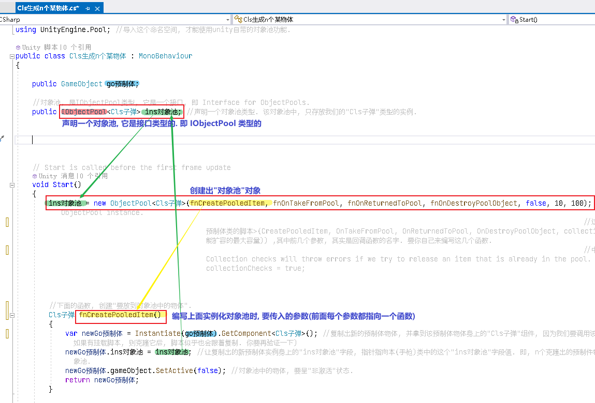

下面是官网上的 对象池对象在 new 实例化时, 其构造方法要传入的参数说明:

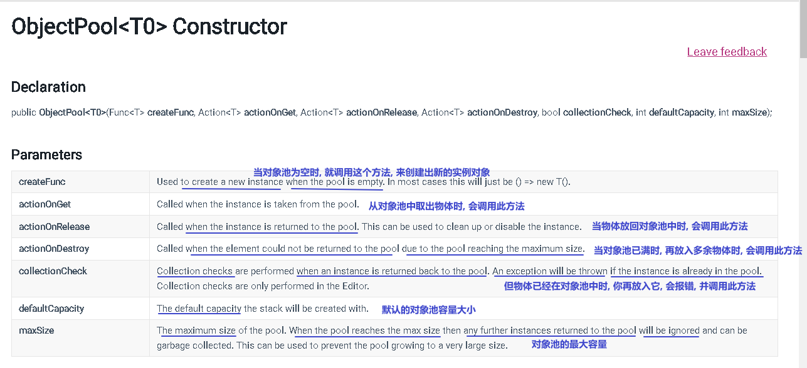

官网说明:
https://docs.unity3d.com/2021.1/Documentation/ScriptReference/Pool.ObjectPool_1-ctor.html

'''

== 对象池 The Object Pool Pattern

技能不断被释放出来后, 不断将效果物体, 创建, 销毁, 很耗费cpu资源, 所以我们就要重复利用创建出来的资源.

我们可以创建一个"池子"对象池（也称为资源池）, 将用过的对象保存起来，等下一次需要这种对象的时候，再拿出来重复使用。这可以减少频繁销毁和创建对象所造成的开销。

对象池技术包括: 线程池、数据库连接池、任务队列池、图片资源对象池等。

当然，如果要实例化的对象较小，不需要多少资源开销，就没有必要使用对象池模式了.

对象池的模式是这样的:
[options="autowidth"]
|===
|Header 1 |Header 2

|在初始化池子的时候, 就创建好对象, 并设置为非激活状态.
|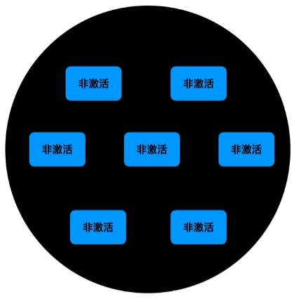

|当我们需要创建物体时, 就激活池子里的对象
|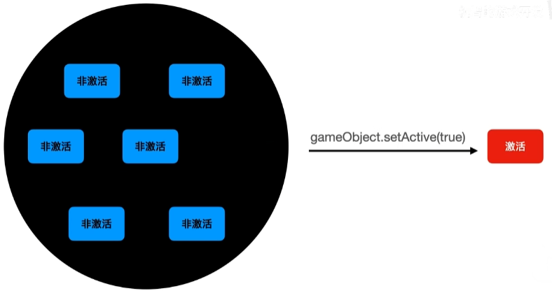

|当我们要销毁物体时,就将物体的状态设置为非激活
|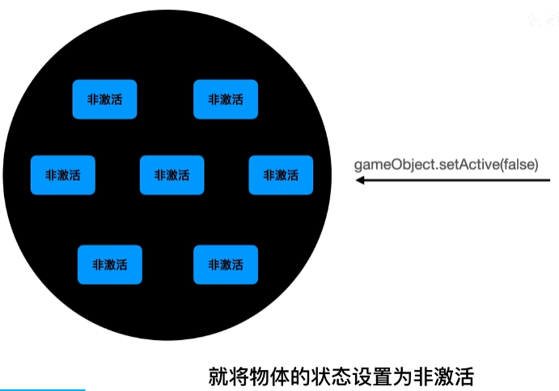

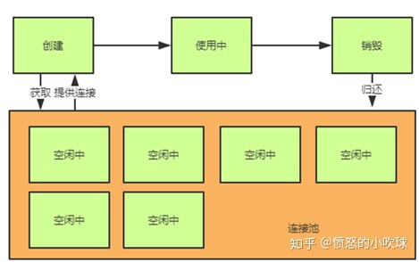

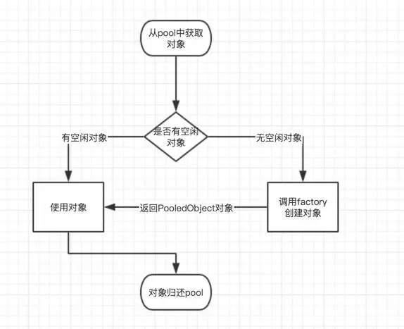
|===

- 同一类型的多个物体, 我们就把它们放在列表中: List<T>
- 不同类型的, 每个类型都有多个物体, 我们就把它们放在字典中: Dictionary<key=string, value=List<T>>  //key代表类别, value代表该类别下的多个游戏对象.

