= 有限状态机
:sectnums:
:toclevels: 3
:toc: left
'''

== 有限状态机(FSM)

游戏AI的实现通常分为两种，有限状态机(FSM)以及行为树(+ai感知+blackboard);

Finite State Machine,  FSM定义: 有限状态机系统，是指**在不同阶段会呈现出不同的运行状态**的系统,这些状态是有限的、不重叠的。*这样的系统, 在某一时刻, 一定会处于其所有状态中的一个状态，此时它接收一部分允许的输入，产生一部分可能的响应, 并且迁移到一部分可能的状态。*

白话:一个东西，有几个不同的状态，它可以在这几个状态转换。(人:睡觉、静止、走路、跑步、开车)

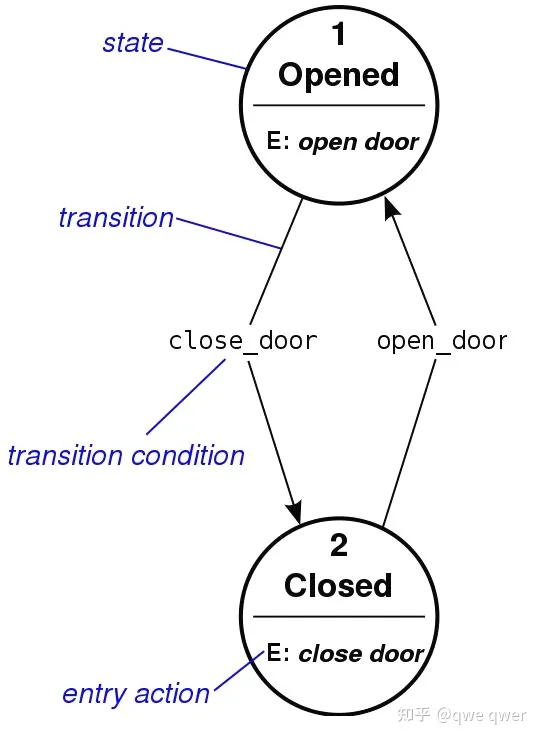

状态机由下列几部分组成：

- 状态集(States)：包括现态和次态(新人和旧人)在内的一系列状态，用来描述状态机所处的状态。
- 事件(Event)：又被称为“条件”，当满足条件时，将会触发一个动作，或者执行一次状态的迁移。
- 动作(Action)：条件满足后执行的动作(新旧状态交接手续)。动作执行完毕后，可以迁移到新的状态，也可以仍旧保持原状态。*动作不是必需的，当条件满足后，也可以不执行任何动作，直接迁移到新状态。*
- 转换(Transition)：通过转换函数, 将状态从"现态"迁移到"次态"的动作。迁移后, 次态变为现态。

有限状态机维护了一张图(如图结构，方框是状态，箭头是状态之间的联系），图中的结点代表不同的状态，状态之间通过某种条件触发转换，如果不满足条件则维持原状态。

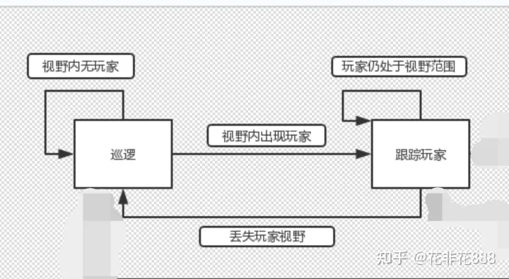

从图中可以看出，有限状态机表示的AI不可能同时处于图示状态中的多个，而只可能处于其中一种状态，状态的转换取决于转换条件和当前所处状态。

状态模式就是：Allow an object to alter its behavior when its internal state changes. The object will appear to change its class.

允许对象在当内部状态改变时, 改变其行为，就好像此对象改变了自己的类一样。”

有限状态机（FSM）是一种最基本的数学计算模型。FSM包含一系列状态、转换和事件。

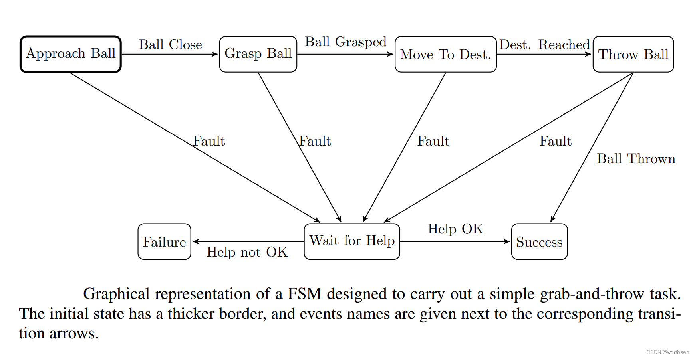

当系统模块的复杂性和状态数增加时，FSM的缺点会带来如下问题： 系统复杂时，FSM难以维护,难以修改.

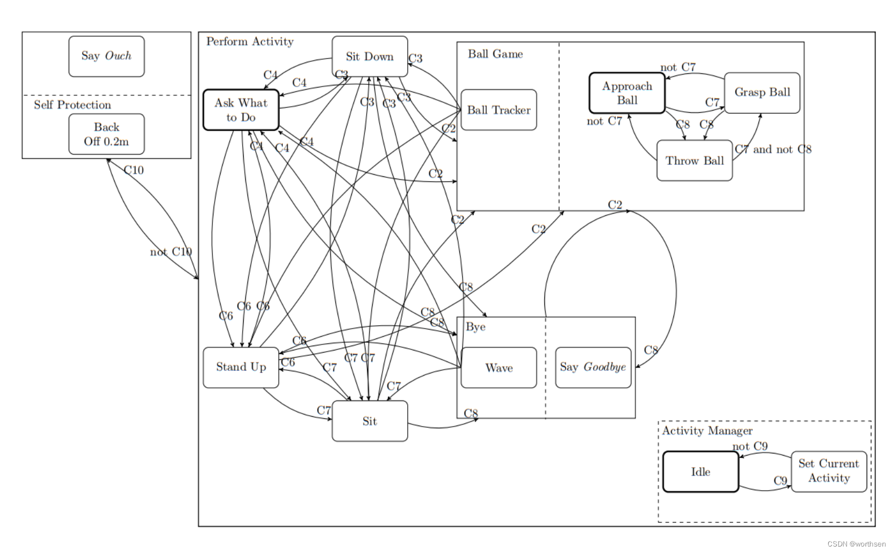

分层有限状态机（HFSM）也称为状态图，是为了弥补有限状态机的缺点而建立的。在HFSM中，状态可以反过来包含一个或者多个子状态。包含两个或两个以上状态的状态称为超状态。广义转换是在超状态之间的转换，通过连接两个超状态而不单独连接多个子状态来减少转换次数。

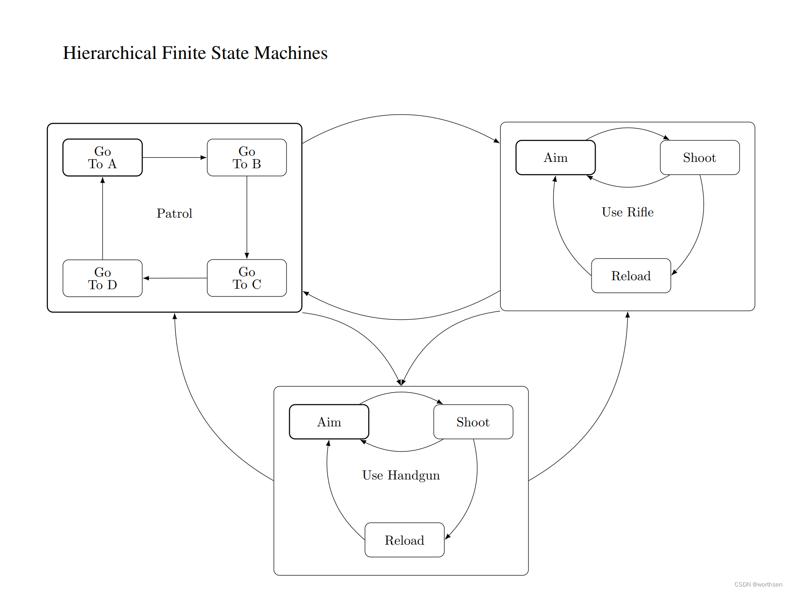

'''

== "有限状态机的"最简单逻辑框架

[,subs=+quotes]
----
using System.Collections;
using System.Collections.Generic;
using UnityEngine;

public class ClsFSM简单状态机 : MonoBehaviour
{

    *//各种状态, 我们定义成枚举类*
    public enum EnmState状态
    {
        Idle空闲,
        Patrol巡逻,
        Chase追逐,
        Attack攻击,
    }

    *//静态字段*
    *static EnmState状态 enmState当前状态 = EnmState状态.Idle空闲; //角色的当前状态, 我们先设为"空闲"*

    // Start is called before the first frame update
    void Start()
    {

    }

    // Update is called once per frame
    void Update()
    {
        *//状态切换判断*
        *switch (enmState当前状态)*
        {
            *case EnmState状态.Idle空闲:*
                *fn空闲状态时的行为ProcessStateIdle();*
                break;

            case EnmState状态.Patrol巡逻:
                fn巡逻状态时的行为();
                break;

            case EnmState状态.Chase追逐:
                fn追逐状态时的行为();
                break;

            case EnmState状态.Attack攻击:
                fn攻击状态时的行为();
                break;
        }
    }

    *void fn空闲状态时的行为ProcessStateIdle()*
    {
        //to do

        if (condition条件) //如果满足某个条件, 就切换状态.
        {
            enmState当前状态 = EnmState状态.Chase追逐; //将当前状态, 重新切换成进入另一个状态.
        }
    }

    void fn巡逻状态时的行为()
    {
        //1.当前状态下, 会做的行为
        //2.当条件满足什么时, 就切换成另一种状态
    }

    void fn追逐状态时的行为()
    {
    }

    void fn攻击状态时的行为()
    {
    }

}

----

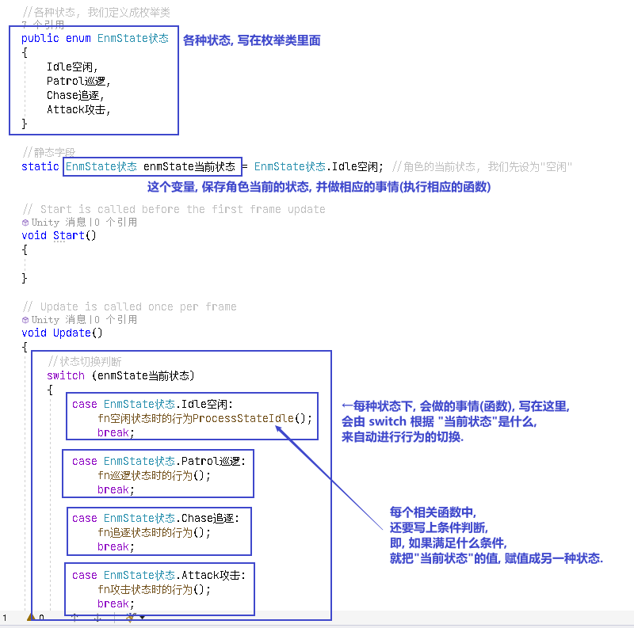

'''

== ★ 有限状态机(正式)

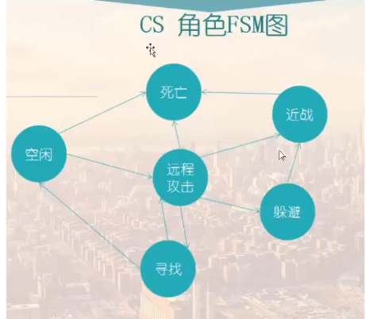

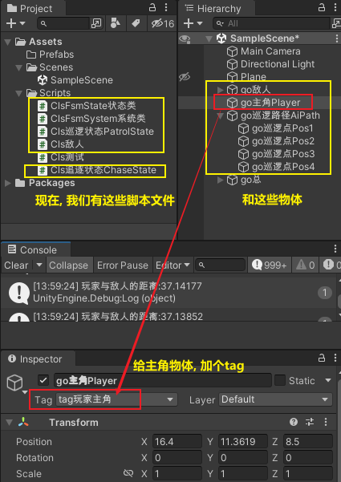

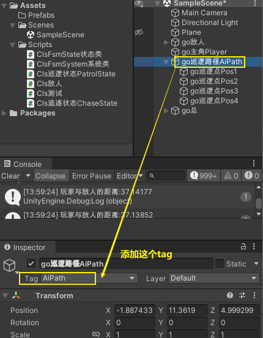

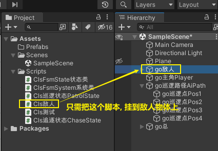

脚本如下

==== (1) ClsFsmState状态类

[,subs=+quotes]
----
using System.Collections;
using System.Collections.Generic;
using UnityEngine;

//枚举类, 让每个"状态"都有一个ID
public enum EnmStateID
{
    Id_NullState = 0, //表示"空状态", 即不处在任何状态中.
    Id_patrol巡逻 =1,
    Id_Chase追逐 =2,

}

//枚举类, 用来定义"状态间的转换条件"
public enum EnmTransition转换条件
{
    NullTransition = 0, //空的"转换条件"
    condition敌人发现玩家,
    condition敌人追丢了玩家,

}

public abstract class ClsFsmState状态类 //这个类会作为父类使用. 所以我们把它设为抽象类, 由子类来实现里面的方法.
{

    protected EnmStateID enmStateID本状态的id = EnmStateID.Id_NullState;

    //把上面的字段, 变成属性
    public EnmStateID EnmStateID本状态的id属性
    {
        get { return enmStateID本状态的id; }
    }

    //下面的字典, 用来保存所有的转换条件. 键值对的 key的类型, 就是 "EnmTransition转换条件"类型, value的类型, 就是"EnmStateID"类型.
    protected Dictionary<EnmTransition转换条件, EnmStateID> map字典 = new Dictionary<EnmTransition转换条件, EnmStateID>();

    public ClsFsmSystem系统类 ins系统; //一个系统里面, 会包含多个state状态.

    //构造方法. 即在实例化本类时, 要给它传入一个参数. 类型是"ClsFsmSystem系统类"类型的.
    protected ClsFsmState状态类(ClsFsmSystem系统类 ins系统)
    {
        this.ins系统 = ins系统; //把传入的"ClsFsmSystem系统类"实例对象, 由自己身上的"ins系统"字段来指针指向它. 方便我们今后随时调遣该系统类的实例. (相当于在你自己身上, 存了个对方的电话号码, 以后可以随时召唤他.)
    }

    public void fn添加转换条件AddTransition(EnmTransition转换条件 key转换条件trans, EnmStateID value状态的id)
    {
        if (key转换条件trans == EnmTransition转换条件.NullTransition)
        {
            Debug.LogError("不允许空的转换条件!");
            return;
        }

        if (value状态的id == EnmStateID.Id_NullState)
        {
            Debug.LogError("不允许空的状态ID!");
            return;
        }

        //再判断, 你添加进来的转换条件, 是否已经在字典中存在了.
        if (map字典.ContainsKey(key转换条件trans))
        {
            Debug.LogError($"字典中, 该 {key转换条件trans} 转换条件已经存在了");
            return;
        }

        //上面三个判断条件都通过后, 就能继续执行下面的代码了:
        map字典.Add(key转换条件trans, value状态的id); //给字典, 添加一个新的键值对.
    }

    //如果你要从字典中, 删除某个键值对, 就调用下面的函数
    public void fn删除转换条件DeletTransition(EnmTransition转换条件 key转换条件trans)
    {
        if (key转换条件trans == EnmTransition转换条件.NullTransition)
        {
            Debug.LogError("不允许空的转换条件!");
            return;
        }

        //如果字典中, 该key存在的话, 才能删除它的键值对
        if (map字典.ContainsKey(key转换条件trans) == false)
        {
            Debug.LogError("该key(转换条件)在字典中不存在, 无法删除该 key-value对");
            return;
        }

        map字典.Remove(key转换条件trans);

    }

    //下面的函数, 作用是, 输入"转换条件"(即字典中的 key), 并返回当满足该条件时, 会转换到的新的目标状态(即字典中的 value), 该状态的id值.
    public EnmStateID fn拿到新的目标状态的id值GetOutState(EnmTransition转换条件 key转换条件trans)
    {
        if (map字典.ContainsKey(key转换条件trans)) //包含该key,就返回value
        {
            return map字典[key转换条件trans]; //将该key对应的value返回. 这个value
        }
        else
        {
            //如果不包含该key, 就返回"空状态"
            return EnmStateID.Id_NullState;
        }

    }

    //下面三个方法, 是进入某个状态的, 业务逻辑代码.

    //虚方法, 子类可以选择重写.
    public virtual void fnDoBeforeEntering刚进入某个状态时会有的行为() { } //这个函数动作, 相当于是新人入职时, 新人(新状态)要做的准备工作.

    //抽象方法. 这个方法, 会由子类去实现具体的"进入某个状态后, 该状态要做的具体的业务逻辑".
    public abstract void fnAct某状态下会做的具体行为(GameObject go敌人); //可以选择传参

    //虚方法, 子类可以选择重写.
    public virtual void fnDoAfterLeaving刚离开某个状态时会有的行为() { } //这个函数动作, 相当于是老人的离职时, 老人(老状态)要做的收尾工作.

    //下面的方法, 是"条件转换"代码. 作用: 判断传入的参数(这个敌人), 这个影响, 是否造成了条件的改变, 从而达到了满足"状态改变"的程度. 注意: 本函数只判断"条件是否达到了某个临界值", 从而会激起状态的改变. 本函数不去处理"状态改变"的事实. "状态改变"的具体操作, 会由 system类中的函数去做!   换言之, 本类中的这个函数, 只处理(心动), 不处理(行为上的行动)
    public abstract void fnCondition判断转换条件是否满足临界值(GameObject go敌人); //可以选择传参

}

----

'''

==== (2) ClsFsmSystem系统类

[,subs=+quotes]
----

using System.Collections;
using System.Collections.Generic;
using UnityEngine;

public class ClsFsmSystem系统类 //该系统类, 用来保存"所有的状态"
{

    //下面的字典,保存了所有状态的集合.
    private Dictionary<EnmStateID, ClsFsmState状态类> dict全状态字典 = new Dictionary<EnmStateID, ClsFsmState状态类>();

    private ClsFsmState状态类 ins当前状态CurrentState; //这个字段, 用来存放"当前的状态"是哪个状态.

    public void fnAddState添加状态到字典中(ClsFsmState状态类 ins状态state)
    {
        if (ins状态state == null)
        {
            Debug.LogError("传入的状态不能为空");
            return;
        }

        //下面, 如果"当前状态"是空的话, 我们就将新添加进来的状态, 作为"当前状态"来使用. 其实, 你可以给"当前状态"先在其他地方设置一个初始值. 就不需要再在本 add方法里来写这个逻辑了. 这个逻辑写在这里也是有点奇怪.
        if (ins当前状态CurrentState == null)
        {
            ins当前状态CurrentState = ins状态state;
        }

        if (dict全状态字典.ContainsKey(ins状态state.EnmStateID本状态的id属性))
        {
            Debug.LogError($"状态[{ins状态state}]已经存在在全状态字典中, 不能重复添加");
            return;
        }

        //上面都通过后, 就能正式添加进字典中了
        dict全状态字典.Add(ins状态state.EnmStateID本状态的id属性, ins状态state);
    }

    public void fnDeletState将某状态从字典中删除(EnmStateID id)
    {
        if (id == EnmStateID.Id_NullState)
        {
            Debug.LogError("无法删除空状态");
            return;
        }

        if (dict全状态字典.ContainsKey(id) == false)
        {
            Debug.LogError($"无此id:{id}, 所以无法删除不存在的'该状态'");
            return;
        }

        dict全状态字典.Remove(id);
    }

    //下面的函数, 会根据你传入的"转换条件", 来进行状态的装换.
    public void fnPerformTransition着手执行实际的状态改变(EnmTransition转换条件 enm转换条件trans)
    {
        if (enm转换条件trans == EnmTransition转换条件.NullTransition)
        {
            Debug.LogError("转换条件为空, 所以无法转换状态");
            return;
        }

        //调用"状态类的实例对象"身上的 "fn拿到新的目标状态的id值GetOutState"函数, 能拿到 满足"本转换条件"时, 会转换到的新状态的"状态id值".
        EnmStateID enm新状态的id = ins当前状态CurrentState.fn拿到新的目标状态的id值GetOutState(enm转换条件trans);

        if (enm新状态的id == EnmStateID.Id_NullState)
        {
            Debug.LogError("该状态的id值, 为空 = Id_NullState");
            return;
        }

        //再来判断"全状态字典"中, 是否存在此key值(即id值).
        if (dict全状态字典.ContainsKey(enm新状态的id) == false)
        {
            Debug.LogError("全状态字典中, 无此id值的状态存在");
            return;
        }

        //下面就能进行状态切换了. 即, 将当前状态currentState(老状态), 转换到 -> id值的那个状态(新状态)
        ClsFsmState状态类 ins新状态 = dict全状态字典[enm新状态的id]; //先根据id值, 拿到该id值对应的状态(即满足条件后, 会转变到的这个新状态)

        //然后执行"状态在发生了改变"时, 会立即执行的函数动作 (离开告别仪式).
        ins当前状态CurrentState.fnDoAfterLeaving刚离开某个状态时会有的行为();

        //"当前状态"的变量指针, 就重新指向了新状态
        ins当前状态CurrentState = ins新状态;

        //然后执行"在进入一个新状态时, 会立即执行的函数动作" (入职仪式)
        ins当前状态CurrentState.fnDoBeforeEntering刚进入某个状态时会有的行为();
    }

    public void fnUpdate升级(GameObject go敌人)
    {
        Debug.Log("调用:fnUpdate升级()方法");
        ins当前状态CurrentState.fnAct某状态下会做的具体行为(go敌人);
        ins当前状态CurrentState.fnCondition判断转换条件是否满足临界值(go敌人);

    }

}

----

'''

==== (3) Cls巡逻状态PatrolState

[,subs=+quotes]
----
using System.Collections;
using System.Collections.Generic;
using UnityEngine;

public class Cls巡逻状态PatrolState : ClsFsmState状态类
{

    private List<Transform> list巡逻点的Transform组件 = new List<Transform>(); //专门用来存放所有"巡逻点物体"身上的Transform组件

    private int index要去往的巡逻点的索引 = 0;

    private Transform tsf玩家的Transform;

    //构造方法
    public Cls巡逻状态PatrolState(ClsFsmSystem系统类 ins系统) : base(ins系统)
    {
        enmStateID本状态的id = EnmStateID.Id_patrol巡逻; //"enmStateID本状态的id"这个字段, 是从父类(状态类)继承过来的.

        //下面 , 找到所有"巡逻点"物体的Transform组件
        Transform go巡逻路径AiPath物体的Transform组件 = GameObject.Find("go巡逻路径AiPath").transform;

        Transform[] arrTransform组件 = go巡逻路径AiPath物体的Transform组件.GetComponentsInChildren<Transform>();
        //获取子物体(GetComponentInChildren) / 父物体(GetComponentInParent)的组件。经过测试，GetComponentInChildren，会优先判断物体自身是否有目标组件，若有直接返回该组件，不便利子物体；若物体自身没有目标组件，遍历子物体，按照子物体顺序查找（比如：先判断第一个子物体，若没有获取到目标组件，再遍历第一个子物体的子物体(目标物体孙物体)，然后再判断目标物体的第二个子物体，以此递归查找）。GetComponentsInChildren，会获取包含物体自身、节点下所有子物体、孙物体的目标组件，也是递归.

        //因为上面的获取"所有子物体组件的方法", 会把当前物体(即父物体, 即"go巡逻路径AiPath" )自身的该组件, 也包括在里面, 所以, 我们还必须把本物体身上的这个组件, 在"arrTransform组件"列表中排除出去.

        foreach (var singleTransform组件 in arrTransform组件)
        {
            if (singleTransform组件 != go巡逻路径AiPath物体的Transform组件)
            {
                list巡逻点的Transform组件.Add(singleTransform组件);
            }
        }

        //拿到玩家(主角)物体的Transform组件
        tsf玩家的Transform = GameObject.FindGameObjectWithTag("tag玩家主角").transform;

    }

    //实现父类中的抽象方法
    public override void fnAct某状态下会做的具体行为(GameObject go敌人)
    {
        //让敌人物体, 面向我们"所有巡逻点"中的索引值是"第[0]个巡逻点"的坐标位置.
        go敌人.transform.LookAt(list巡逻点的Transform组件[index要去往的巡逻点的索引].position);

        //让敌人向该巡逻点的位置, 进行移动.
        //transform.Translate()函数中，前一个变量是物体的移动速度，这里的速度是一个矢量，既包含大小写包含方向，后一个变量是相对坐标系，这里的相对坐标系有两个值，一个是世界坐标，一个是自身坐标，如果第一个坐标不填写的话，默认为自身坐标系。该函数, 会让物体按照你给的速度方程, 进行移动。
        go敌人.transform.Translate(Vector3.forward * Time.deltaTime * 8); //每秒向前移动8米

        //如果敌人和巡逻点1 的距离, 小于0.1f了, 就表明敌人已经到达了巡逻点1处, 就让敌人转到巡逻点2处去. 就这样, 在四个"巡逻点"中不断绕圈, 这就是巡逻效果了
        if (Vector3.Distance(go敌人.transform.position, list巡逻点的Transform组件[index要去往的巡逻点的索引].position) < 0.1f)
        {
            index要去往的巡逻点的索引++;

            //如果一直让"index要去往的巡逻点的索引"递增下去的话, 就会超过所有巡逻点的数量了, 所以转一圈完毕后, 我们要及时让该索引重新回到[0]处.
            if (index要去往的巡逻点的索引 > list巡逻点的Transform组件.Count - 1)
            {
                index要去往的巡逻点的索引 = 0;
            }
        }

    }

    //实现父类中的抽象方法
    public override void fnCondition判断转换条件是否满足临界值(GameObject go敌人)
    {
        float num玩家与敌人的距离 = Vector3.Distance(tsf玩家的Transform.position, go敌人.transform.position);

        Debug.Log($"玩家与敌人的距离:{num玩家与敌人的距离}");

        //如果敌人和玩家的距离, 小于15米的话, 即满足这个条件后, 就发生状态转变. 状态由本"巡逻状态", 转变到"追逐状态".
        if (num玩家与敌人的距离 < 15)
        {
            Debug.Log("敌人发现玩家");
            //调用系统类的实例身上的"着手实际改变状态"方法, 来进行状态的改变.
            ins系统.fnPerformTransition着手执行实际的状态改变(EnmTransition转换条件.condition敌人发现玩家);
        }

    }

}

----

'''

==== (4) Cls追逐状态ChaseState

[,subs=+quotes]
----
using System.Collections;
using System.Collections.Generic;
using UnityEngine;

public class Cls追逐状态ChaseState : ClsFsmState状态类
{

    private Transform tsf玩家的Transform;

    //构造方法
    public Cls追逐状态ChaseState(ClsFsmSystem系统类 ins系统) : base(ins系统)
    {
        enmStateID本状态的id = EnmStateID.Id_Chase追逐; //"enmStateID本状态的id"这个字段, 是从父类(状态类)继承过来的.

        //拿到玩家(主角)物体的Transform组件
        tsf玩家的Transform = GameObject.FindGameObjectWithTag("tag玩家主角").transform;

    }

    public override void fnAct某状态下会做的具体行为(GameObject go敌人)
    {

        go敌人.transform.LookAt(tsf玩家的Transform.position); //敌人先面向玩家
        go敌人.transform.Translate(Vector3.forward * Time.deltaTime * 8); //敌人每秒向前移动8米
    }

    public override void fnCondition判断转换条件是否满足临界值(GameObject go敌人)
    {
        float num玩家与敌人的距离 = Vector3.Distance(tsf玩家的Transform.position, go敌人.transform.position);

        Debug.Log($"玩家与敌人的距离:{num玩家与敌人的距离}");

        //如果玩家与敌人的距离超过30米, 敌人就会追丢玩家, 满足这个条件后, 敌人就会重新回到巡逻状态.
        if (num玩家与敌人的距离 > 30)
        {
            Debug.Log("敌人追丢玩家");
            //调用系统类的实例身上的"着手实际改变状态"方法, 来进行状态的改变.
            ins系统.fnPerformTransition着手执行实际的状态改变(EnmTransition转换条件.condition敌人追丢了玩家);
        }
    }

}

----

'''

==== (5) Cls敌人

[,subs=+quotes]
----
using System.Collections;
using System.Collections.Generic;
using UnityEngine;

public class Cls敌人 : MonoBehaviour
{
    private ClsFsmSystem系统类 ins系统类实例fsm;

    // Start is called before the first frame update
    void Start()
    {
        fnInitFSM对系统做初始化();
    }

    // Update is called once per frame
    void Update()
    {
        //让"状态机"运行起来
        ins系统类实例fsm.fnUpdate升级(this.gameObject); //参数要传入敌人物体, 而本代码, 就是挂载在"敌人"物体上的. 所以 this.gameObject 就是本"敌人"物体了.

    }

    void fnInitFSM对系统做初始化()
    {
        //创建出系统类的实例
        ins系统类实例fsm = new ClsFsmSystem系统类();

        //创建出两个状态的实例
        ClsFsmState状态类 insPatrolState巡逻状态实例 = new Cls巡逻状态PatrolState(ins系统类实例fsm);
        ClsFsmState状态类 insChaseState追逐类实例 = new Cls追逐状态ChaseState(ins系统类实例fsm);

        //根据转换条件, 转到新的状态上去.
        //如果发生"敌人发现玩家"的条件, 就把状态, 转到"追逐状态"上去
        insPatrolState巡逻状态实例.fn添加转换条件AddTransition(EnmTransition转换条件.condition敌人发现玩家, EnmStateID.Id_Chase追逐);

        //如果发生"追丢了玩家"的条件, 就把状态, 转到"巡逻状态"上去
        insChaseState追逐类实例.fn添加转换条件AddTransition(EnmTransition转换条件.condition敌人追丢了玩家, EnmStateID.Id_patrol巡逻);

        //我们要把上面的两个状态类实例, 添加到系统类里面, 进行管理起来.
        ins系统类实例fsm.fnAddState添加状态到字典中(insPatrolState巡逻状态实例); //第一个添加进去的状态, 会成为"默认状态"
        ins系统类实例fsm.fnAddState添加状态到字典中(insChaseState追逐类实例);

    }

}
----

image:img/0232.svg[,]

'''

== 有限状态机

有限状态机: 又称"有限状态自动机"，简称"状态机"。

1.定义:有限的多个状态, 在不同条件下, 相互转换的流程控制系统。

2.状态:物体表现出来的状况，多指行为。 +
例如: 身体的状态，健康、感冒、康复中。

3．条件:状态改变的依据。 +
例如:淋雨，吃药，打针，休息。

4.状态转换表: +
健康-(休息)->健康; +
健康-(淋雨)->感冒; +
感冒-(打针)->健康; +
感冒-(吃药）->康复中; +
康复中-(休息）→ 健康。

5.状态机:管理所有状态,协调组织状态的迁移。

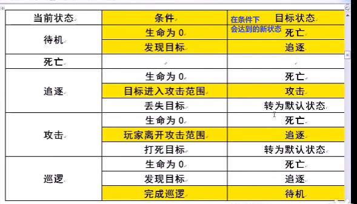

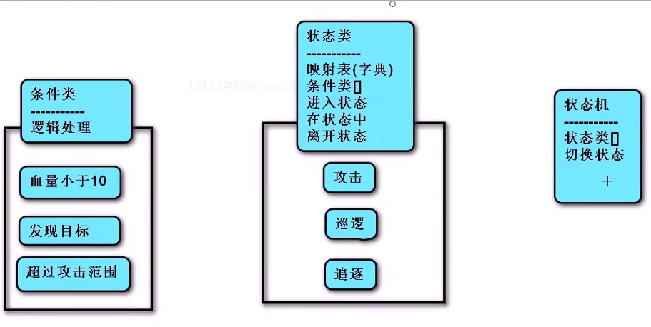

https://www.bilibili.com/video/BV1464y1u79N?p=2&vd_source=52c6cb2c1143f8e222795afbab2ab1b5

