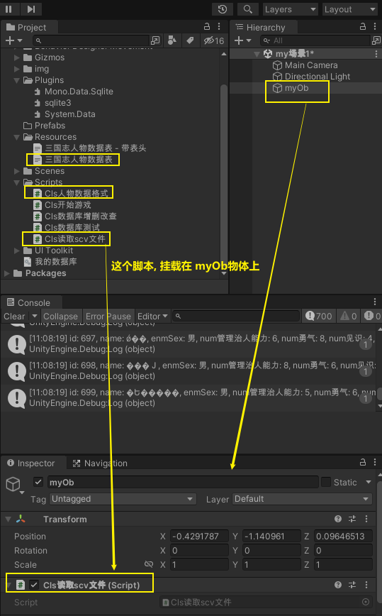
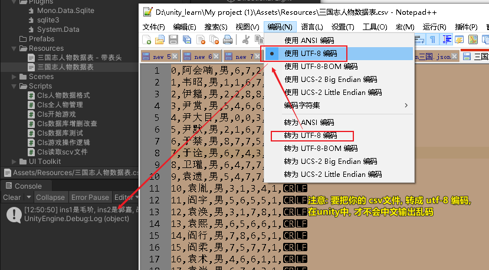
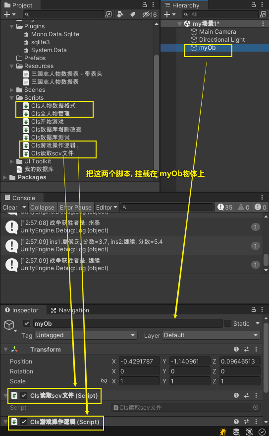

= 我的试验
:sectnums:
:toclevels: 3
:toc: left
---

== csv文件-> 转 list

读取 csv文件, 并把里面的内容, 每一行是一个人物数据. 转成 class类的实例. 并把所有这些人物实例, 放到一个list中.

==== Cls人物数据格式

[,subs=+quotes]
----
using System.Collections;
using System.Collections.Generic;
using UnityEngine;

public class Cls人物数据格式
{
    int id;
    string name;
    EnmSex enmSex;
    int num管理治人能力;
    int num勇气;
    int num见识;
    int num政治情商;
    Enm生死 enm生死;
    Enm所在城市 enm所在城市;

    //无参构造方法
    public Cls人物数据格式()
    {
    }

    //构造方法
    public Cls人物数据格式(int id, string name, EnmSex enmSex, int num管理治人能力, int num勇气, int num见识, int num政治情商, Enm所在城市 enm所在城市, Enm生死 enm生死)
    {
        this.Id = id;
        this.Name = name;
        this.EnmSex = enmSex;
        this.Num管理治人能力 = num管理治人能力;
        this.Num勇气 = num勇气;
        this.Num见识 = num见识;
        this.Num政治情商 = num政治情商;
        this.Enm生死 = enm生死;
        this.Enm所在城市 = enm所在城市;
    }

    public int Id { get => id; set => id = value; }
    public string Name { get => name; set => name = value; }
    public EnmSex EnmSex { get => enmSex; set => enmSex = value; }
    public int Num管理治人能力 { get => num管理治人能力; set => num管理治人能力 = value; }
    public int Num勇气 { get => num勇气; set => num勇气 = value; }
    public int Num见识 { get => num见识; set => num见识 = value; }
    public int Num政治情商 { get => num政治情商; set => num政治情商 = value; }
    public Enm所在城市 Enm所在城市 { get => enm所在城市; set => enm所在城市 = value; }
    public Enm生死 Enm生死 { get => enm生死; set => enm生死 = value; }

    public override string ToString()
    {
        return $"{nameof(id)}: {id}, {nameof(name)}: {name}, {nameof(enmSex)}: {enmSex}, {nameof(num管理治人能力)}: {num管理治人能力}, {nameof(num勇气)}: {num勇气}, {nameof(num见识)}: {num见识}, {nameof(num政治情商)}: {num政治情商}, {nameof(enm生死)}: {enm生死}, {nameof(enm所在城市)}: {enm所在城市}";
    }
}

public enum EnmSex
{
    男,
    女,
}

public enum Enm生死
{
    生,
    死
}

public enum Enm所在城市
{
    云游四海中,
    长安,
    洛阳,
    成都,
    建业,

}
----

==== Cls读取scv文件

[,subs=+quotes]
----
using System.Collections;
using System.Collections.Generic;
using UnityEngine;
using UnityEngine.Networking;

public class Cls读取scv文件 : MonoBehaviour
{

    string pathScv文件地址 = "三国志人物数据表";
    string strScv;  //从scv文件读取出来的所有字符串, 放在这个变量里
    List<Cls人物数据格式> listCls人物 = null;  //存放所有人物的数据, 每个人是一个"Cls人物数据格式"类的实例, 然后所有人都放在一个List中.

    // Start is called before the first frame update
    void Start()
    {
        strScv = fn读取scv文件(pathScv文件地址);
        //Debug.Log(strScv);

        //拿到所有人物的一个列表, 并把里面的人物(是"Cls人物数据格式"类型的实例)打印出来看看
        listCls人物 = fn将scv字符串转成listCls(strScv);

        foreach (var ins人物 in listCls人物)
        {
            Debug.Log(ins人物);
        }

    }

    // Update is called once per frame
    void Update()
    {

    }

    public string fn读取scv文件(string path)
    {
        TextAsset textAsset = Resources.Load(path) as TextAsset;
        return textAsset.text;
    }

    //将scv文件中的字符串内容, 转成一个列表, 里面的元素, 就是"Cls人物数据格式"实例. 即将scv文件中存储的每一个角色的数据, 封装到一个人物类中, 然后再把它们装在一个list中.
    public List<Cls人物数据格式> fn将scv字符串转成listCls(string strScv)
    {
        List<Cls人物数据格式> listCls人物 = new List<Cls人物数据格式>();

        //按行切割, 把切割出的所有行, 放到一个字符串数组中.
        string[] arrLine = strScv.Split("\r\n");

        foreach (var line in arrLine)
        {
            //Debug.Log(line);

            string[] arr每一单元格中的值 = line.Split(',');
            Cls人物数据格式 ins人物 = new Cls人物数据格式();

            for (int i = 0; i < arr每一单元格中的值.Length; i++)
            {

                ins人物.Id = int.Parse(arr每一单元格中的值[0]);
                ins人物.Name = arr每一单元格中的值[1];

                if (arr每一单元格中的值[2] == "男") { ins人物.EnmSex = EnmSex.男; }
                if (arr每一单元格中的值[2] == "女") { ins人物.EnmSex = EnmSex.女; }

                ins人物.Num管理治人能力 = int.Parse(arr每一单元格中的值[3]);
                ins人物.Num勇气 = int.Parse(arr每一单元格中的值[4]);
                ins人物.Num见识 = int.Parse(arr每一单元格中的值[5]);
                ins人物.Num政治情商 = int.Parse(arr每一单元格中的值[6]);

                if (arr每一单元格中的值[7] == "1") { ins人物.Enm生死 = Enm生死.生; }
                if (arr每一单元格中的值[7] == "0") { ins人物.Enm生死 = Enm生死.死; }

                ins人物.Enm所在城市 = Enm所在城市.云游四海中;

            }

            listCls人物.Add(ins人物);
        }

        return listCls人物;
    }

}

----

== 判断两人的战争胜负

==== Cls读取scv文件

[,subs=+quotes]
----
using System.Collections;
using System.Collections.Generic;
using UnityEngine;
using UnityEngine.Networking;

public  class Cls读取scv文件 : MonoBehaviour
{

    string pathScv文件地址 = "三国志人物数据表";
    string strScv;  //从scv文件读取出来的所有字符串, 放在这个变量里
    private static List<Cls人物数据格式> listCls人物 = null;  //存放所有人物的数据, 每个人是一个"Cls人物数据格式"类的实例, 然后所有人都放在一个List中.

    public static List<Cls人物数据格式> ListCls人物 { get => listCls人物; set => listCls人物 = value; }

    // Start is called before the first frame update
    void Start()
    {
        strScv = fn读取scv文件(pathScv文件地址);
        //Debug.Log(strScv);

        //拿到所有人物的一个列表, 并把里面的人物(是"Cls人物数据格式"类型的实例)打印出来看看
        ListCls人物 = fn将scv字符串转成listCls(strScv);

    }

    // Update is called once per frame
    void Update()
    {

    }

    public string fn读取scv文件(string path)
    {
        TextAsset textAsset = Resources.Load(path) as TextAsset;
        return textAsset.text;
    }

    //将scv文件中的字符串内容, 转成一个列表, 里面的元素, 就是"Cls人物数据格式"实例. 即将scv文件中存储的每一个角色的数据, 封装到一个人物类中, 然后再把它们装在一个list中.
    public List<Cls人物数据格式> fn将scv字符串转成listCls(string strScv)
    {
        List<Cls人物数据格式> listCls人物 = new List<Cls人物数据格式>();

        //按行切割, 把切割出的所有行, 放到一个字符串数组中.
        string[] arrLine = strScv.Split("\r\n");

        foreach (var line in arrLine)
        {
            //Debug.Log(line);

            string[] arr每一单元格中的值 = line.Split(',');
            Cls人物数据格式 ins人物 = new Cls人物数据格式();

            for (int i = 0; i < arr每一单元格中的值.Length; i++)
            {

                ins人物.Id = int.Parse(arr每一单元格中的值[0]);
                ins人物.Name = arr每一单元格中的值[1];

                if (arr每一单元格中的值[2] == "男") { ins人物.EnmSex = EnmSex.男; }
                if (arr每一单元格中的值[2] == "女") { ins人物.EnmSex = EnmSex.女; }

                ins人物.Num管理治人能力 = int.Parse(arr每一单元格中的值[3]);
                ins人物.Num勇气 = int.Parse(arr每一单元格中的值[4]);
                ins人物.Num见识 = int.Parse(arr每一单元格中的值[5]);
                ins人物.Num政治情商 = int.Parse(arr每一单元格中的值[6]);

                if (arr每一单元格中的值[7] == "1") { ins人物.Enm生死 = Enm生死.生; }
                if (arr每一单元格中的值[7] == "0") { ins人物.Enm生死 = Enm生死.死; }

                ins人物.Enm所在城市 = Enm所在城市.云游四海中;

            }

            listCls人物.Add(ins人物);
        }

        return listCls人物;
    }

}

----

==== Cls人物数据格式

[,subs=+quotes]
----
using System.Collections;
using System.Collections.Generic;
using UnityEngine;

public class Cls人物数据格式
{
    int id;
    string name;
    EnmSex enmSex;
    int num管理治人能力;
    int num勇气;
    int num见识;
    int num政治情商;
    Enm生死 enm生死;
    Enm所在城市 enm所在城市;

    //无参构造方法
    public Cls人物数据格式()
    {
    }

    //构造方法
    public Cls人物数据格式(int id, string name, EnmSex enmSex, int num管理治人能力, int num勇气, int num见识, int num政治情商, Enm所在城市 enm所在城市, Enm生死 enm生死)
    {
        this.Id = id;
        this.Name = name;
        this.EnmSex = enmSex;
        this.Num管理治人能力 = num管理治人能力;
        this.Num勇气 = num勇气;
        this.Num见识 = num见识;
        this.Num政治情商 = num政治情商;
        this.Enm生死 = enm生死;
        this.Enm所在城市 = enm所在城市;
    }

    public int Id { get => id; set => id = value; }
    public string Name { get => name; set => name = value; }
    public EnmSex EnmSex { get => enmSex; set => enmSex = value; }
    public int Num管理治人能力 { get => num管理治人能力; set => num管理治人能力 = value; }
    public int Num勇气 { get => num勇气; set => num勇气 = value; }
    public int Num见识 { get => num见识; set => num见识 = value; }
    public int Num政治情商 { get => num政治情商; set => num政治情商 = value; }
    public Enm所在城市 Enm所在城市 { get => enm所在城市; set => enm所在城市 = value; }
    public Enm生死 Enm生死 { get => enm生死; set => enm生死 = value; }

    public override string ToString()
    {
        return $"{nameof(id)}: {id}, {nameof(name)}: {name}, {nameof(enmSex)}: {enmSex}, {nameof(num管理治人能力)}: {num管理治人能力}, {nameof(num勇气)}: {num勇气}, {nameof(num见识)}: {num见识}, {nameof(num政治情商)}: {num政治情商}, {nameof(enm生死)}: {enm生死}, {nameof(enm所在城市)}: {enm所在城市}";
    }
}

public enum EnmSex
{
    男,
    女,
}

public enum Enm生死
{
    生,
    死
}

public enum Enm所在城市
{
    云游四海中,
    长安,
    洛阳,
    成都,
    建业,

}

----

==== Cls全人物管理

[,subs=+quotes]
----
using System.Collections;
using System.Collections.Generic;
using System.Linq;
using UnityEngine;

public class Cls全人物管理
{

    public static void fn查看全部人物信息(List<Cls人物数据格式> listCls人物)
    {
        //拿到所有人物的一个列表, 并把里面的人物(是"Cls人物数据格式"类型的实例)打印出来看看
              foreach (var ins人物 in listCls人物)
        {
            Debug.Log(ins人物);
        }
    }

    public static Cls人物数据格式 fn根据id来获取人物实例(int id)
    {
        var list结果 = (from ins人物 in Cls读取scv文件.ListCls人物
                    where ins人物.Id == id
                    select ins人物).ToList();

        return list结果[0];
    }

}

----

==== Cls游戏操作逻辑

[,subs=+quotes]
----
using System.Collections;
using System.Collections.Generic;
using UnityEngine;

public class Cls游戏操作逻辑 : MonoBehaviour
{

    // Start is called before the first frame update
    void Start()
    {
    }

    // Update is called once per frame
    void Update()
    {
        //检测鼠标的点击(只会触发一次). 0代表左键, 1是右键, 2是滚轮.
        if (Input.GetMouseButtonDown(0))
        {
            int numId1 = fn随机获取一个人();
            int numId2 = fn随机获取一个人();

            Cls人物数据格式 insP1 = Cls全人物管理.fn根据id来获取人物实例(numId1);
            Cls人物数据格式 insP2 = Cls全人物管理.fn根据id来获取人物实例(numId2);

            int num获胜者的Id =  fn判断战争胜负(insP1, insP2);
            Cls人物数据格式 ins获胜者 = Cls全人物管理.fn根据id来获取人物实例(num获胜者的Id);

            Debug.Log($"战争获胜者是: {ins获胜者.Name}");

        }

    }

    public int fn随机获取一个人()
    {
        int num随机数 = Random.Range(0, 700); //我们的三国数据中,一共就699人
        return num随机数;
    }

    //判断战争胜负的公式是: 比较两人的这个加权公式后的结果: 0.5* Num管理治人能力 + 0.4* num见识 + 0.1 num政治情商. 注意, 这里还没有包括进军队数量参数. 本函数返回获胜者的id.
    public int fn判断战争胜负(Cls人物数据格式 ins1,Cls人物数据格式 ins2)
    {
        double numIns1总值 = 0.5 * ins1.Num管理治人能力 + 0.4 * ins1.Num见识 + 0.1 * ins1.Num政治情商;
        double numIns2总值 = 0.5 * ins2.Num管理治人能力 + 0.4 * ins2.Num见识 + 0.2 * ins1.Num政治情商;

        Debug.Log($"ins1:{ins1.Name}, 分数={numIns1总值}, ins2:{ins2.Name}, 分数={numIns2总值}");

        if (numIns1总值 > numIns2总值)
        {
            return ins1.Id;
        }
        else if(numIns1总值 < numIns2总值)
        {
            return ins2.Id;
        }
        return 0; //平局则返回0

    }
}

//Id	Name	Sex	Num管理治人能力	num勇气	num见识	num政治情商	enm生死	enm所在城市

----
