= unity
:sectnums:
:toclevels: 3
:toc: left

''''

== unity 个人证书过期, 打不开软件

进入C盘ProgramData>Unity>找到后缀名为ulf的lic文件删除，重启unity即可正常运行。

'''

== unity中, 搜狗输入法无法切换成中文

点开设置界面, 下图中这俩随便进一个,窗口点开后就能正常切换了.

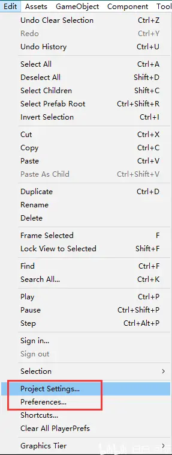

'''

== 安装

英语官网下载地址
https://unity.com/download

'''

== unity 中打开  vs, 没有代码提示

在unity中 Edit->preferences ->External Tools中

External Script Editor 选择VS2019， 并点击Regenerate project files.

image:img/0003.png[,]

'''

== 快捷键

下面几个最常用移动缩放旋转等功能的快捷键: 就是键盘左上角连续的几个键位: q,w,e,r,t,y

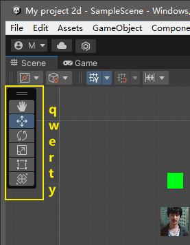

'''

== 手动调整多个脚本的执行顺序

随便选中一个脚本, 按 execution order

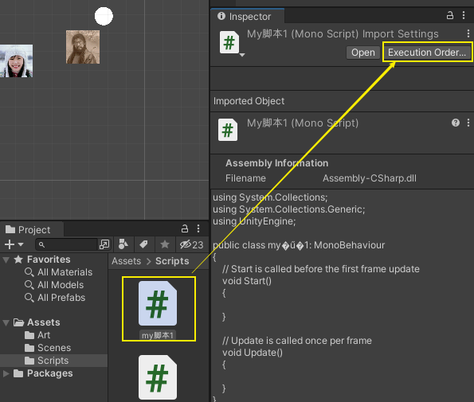

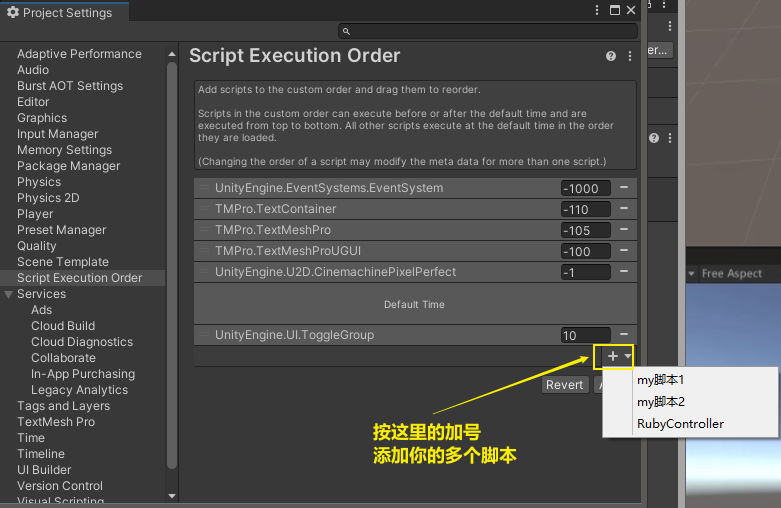

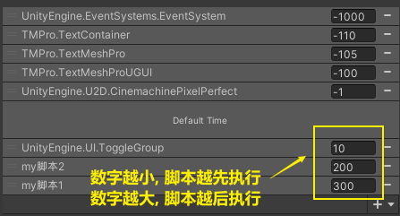

---

== 预设体(相当于 illustrator中的"符号")

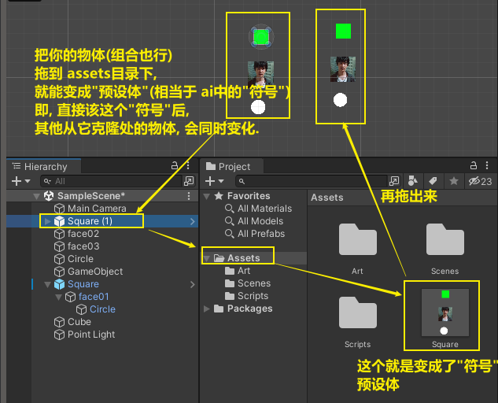

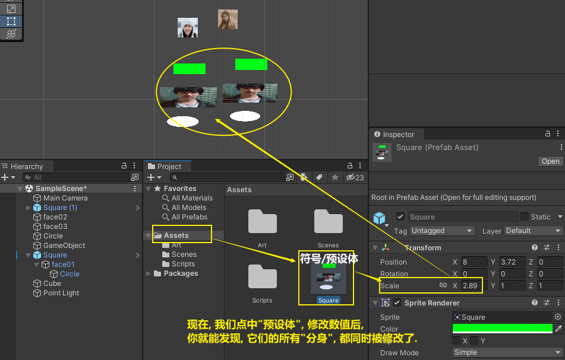

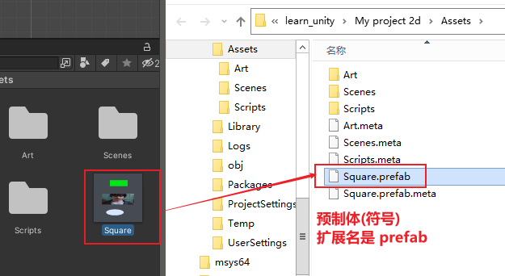

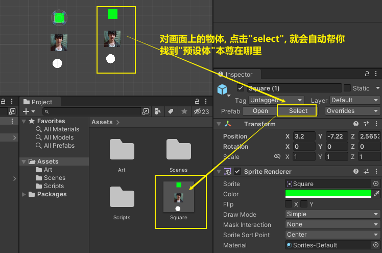

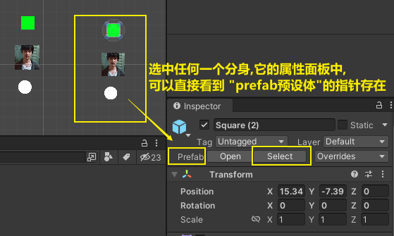

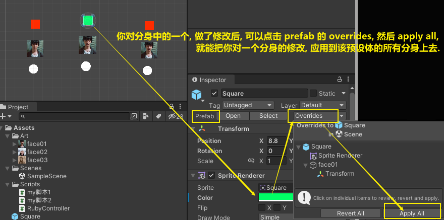

'''

==== 创建一个有自己独立修改属性的预设体"符号"

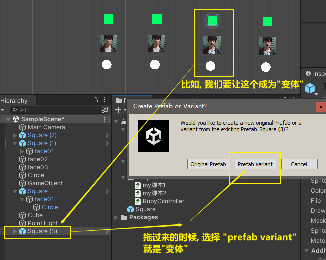

''''

== 图片资源无法拖动到场景里, 怎么办?

image:img/0001.png[,]

更改纹理类型 选择Sprite 2d , 再 apply 应用一下, 就能拖动到场景里了.

image:img/0002.png[,]

'''

== 无法显示中文的解决办法

把中文字体拖进来, 然后右键, 如下图. 生成的那个 F图标的字体, 才是unity内可用的中文字体.

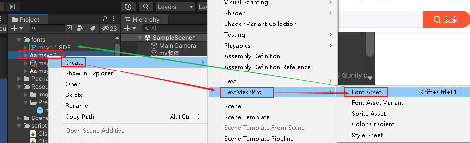

== 查找脚本到底挂载在了哪些物体上

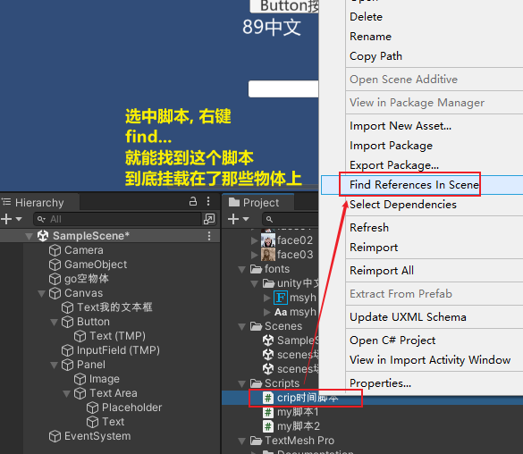
