= unity项目, 上传到github
:sectnums:
:toclevels: 3
:toc: left
''''

== unity项目, 上传github

[options="autowidth"]
|===
|Header 1 |Header 2

|先在github上新建仓库, 要使用它提供的 .gitignore 的Unity模板.
|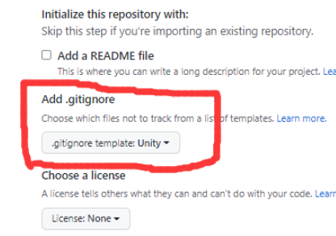

|然后, 把仓库地址拷贝下来
|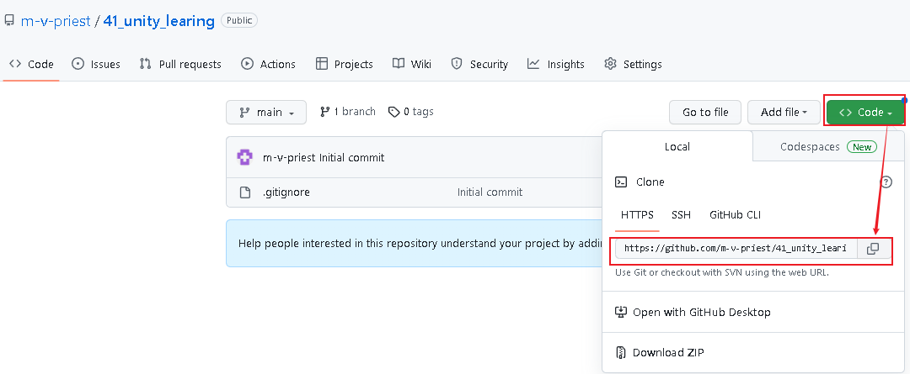

|进入你电脑上的 unity项目文件夹, 右击选择 Git Bash Here
|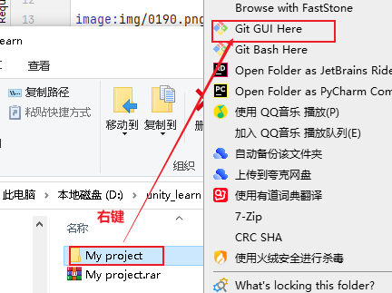

|输入
|git init  //初始化仓库 +
git remote add origin https://github.com/m-v-priest/41_unity_learing.git（之前复制的仓库地址） //建立远程连接 +
git config --global user.name "m-v-priest" +
git config --global user.email "346669129@qq.com" +
git config -l //配置好之后可以使用这个命令, 来查看你的配置信息.

注意: 下面截图中的邮箱打错了, 中间应该是@.
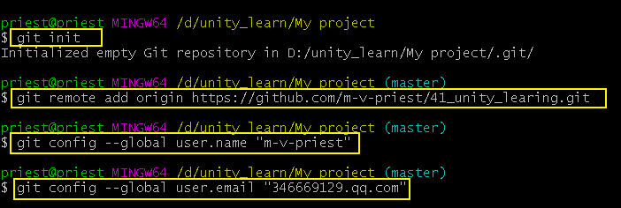

你会发现你的项目文件夹内多了一个“.git”的文件夹，同时你的命令行界面后面会多一个“(master)”标识，表明你已经把这个文件夹设置为了Git本地仓库.

同样, 在你电脑上的unity项目目录上右键, 能看到:

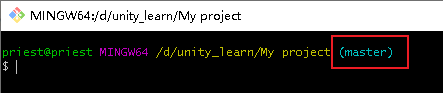

在命令行中键入如下命令： +
git remote add origin 你的仓库SSH地址 //这步好像也不用做了, 提示已经建立过连接了.

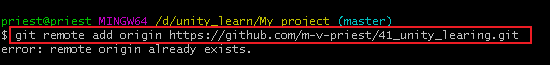

此时已经将你的本地仓库与GitHub连接上了，下面就可以上传Unity项目到GitHub上.

|(这步可以不做:)生成SSH key
|可以用下面的命令, 来查看你是否已经生成过这个key : +
cd ~/.ssh  //如果输出为空, 就说明你已经有这个key了.

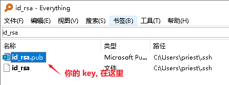

|===

'''

== ★ 必须要上传的文件夹

Unity项目中必须上传的3个文件夹:

[options="autowidth"]
|===
|Header 1 |Header 2

|Assets
|关系到项目的资源. Assets文件夹主要用来存放项目的资源，例如脚本文件、贴图、材质、声音资源等等。

|ProjectSettings
|关系到你的项目设置.  ProjectSettings文件夹则用来存放一些项目的设置，例如输入设置、物理系统的设置、Player设置、Layer、Tags等等。我们可以在Unity的编辑器中的Edit->Project Settings菜单来调整这些设置信息。

|Packages
|关系到导入的一些包.

|meta文件
|Assets文件夹里的以meta为后缀的文件也要上传.  +
我们还需要将Unity为导入资源生成的.meta文件也纳入版本管理，和相应的资源一同维护。*meta文件的重要性在于: Unity会利用它来处理对应资源之间的引用关系。*

为了处理资源之间的引用关系，*Unity在序列化时会通过两个数据, 来保证正确的引用关系。即: 文件GUID, 及本地ID，其中文件GUID便保存在meta文件中。*

只要使用文本工具打开meta文件, 即可以看到其内容。
|===

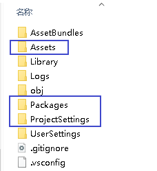

'''

== C# 脚本文件

[options="autowidth"]
|===
|Header 1 |Header 2

|Assembly-CSharp.csproj
|如果Assets文件夹中包括C#脚本文件，则Unity会在目录生成C#工程文件Assembly-CSharp.csproj。

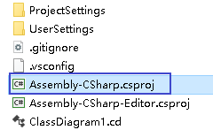

|Assembly-CSharp-Editor
|Unity的一些特殊的文件夹也会生成一些工程文件。例如Editor文件夹内如果有C#脚本，则会生成一个Assembly-CSharp-Editor工程文件。

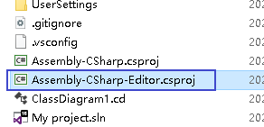
|===

'''

== 临时文件 & 缓存文件

[options="autowidth"]
|===
|Header 1 |Header 2

|Library
|Library文件夹的内容, 主要是在项目中导入资源时, 产生的一些本地的缓存。

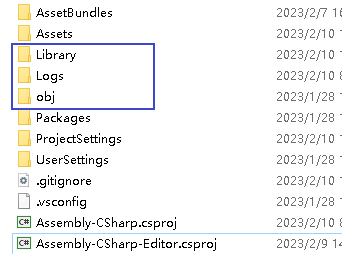

|Temp
|

|obj
|Temp 和 obj这两个文件夹, 则是在项目构建时产生的临时文件。

|===

'''

