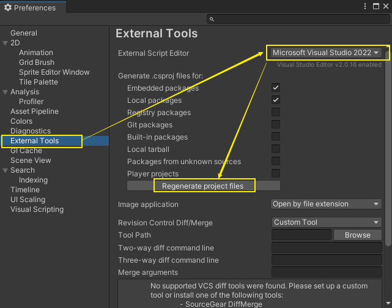
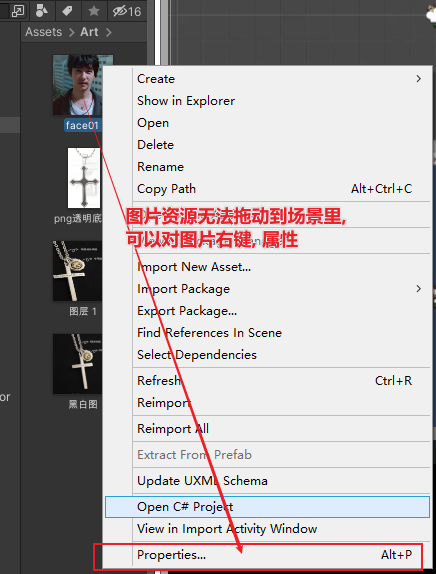
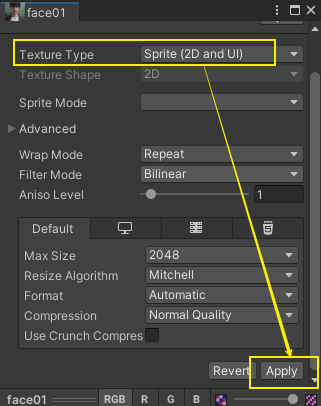

= unity
:sectnums:
:toclevels: 3
:toc: left

---

== 安装

英语官网下载地址
https://unity.com/download

---

== unity 中打开  vs, 没有代码提示

在unity中 Edit->preferences ->External Tools中

External Script Editor 选择VS2019， 并点击Regenerate project files.

---

== 图片资源无法拖动到场景里, 怎么办?

更改纹理类型 选择Sprite 2d , 再 apply 应用一下, 就能拖动到场景里了.

