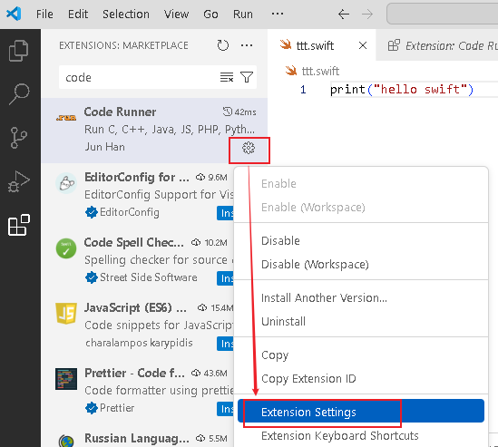
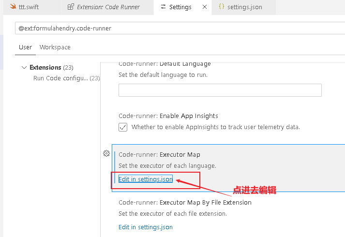
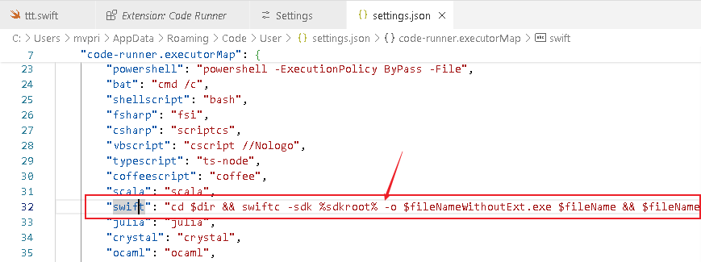
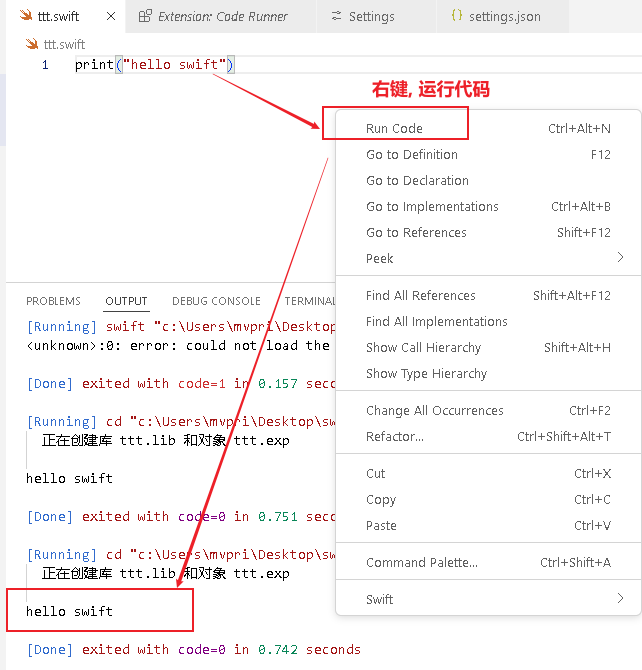

= swift 安装和设置
:toc: left
:toclevels: 3
:sectnums:
:stylesheet: myAdocCss.css

'''

== 安装 swift

[.small]
[options="autowidth" cols="1a,1a"]
|===
|Header 1 |Header 2

|直接用 swift
|1. 在windows上安装, 地址是 https://www.swift.org/download/ +
下载 Windows 10 x86_64 的即可.
2. 在微软官方市场里, 下载 plain swift . 不用管它的"付费"字样, 直接下载即可.

|在 vscode 中用 swift
|1. 安装 code runner 插件
2. 安装 code LLDB 插件
3. 安装 swift 插件

然后进入code runner 插件的设置中, +

在code-runner.executorMap 里找到 swift,  将内容替换成: +
"cd $dir && swiftc -sdk %sdkroot% -o $fileNameWithoutExt.exe $fileName && $fileNameWithoutExt.exe" +
保存即可.

现在, 就可以运行 swift程序了: +

|===

