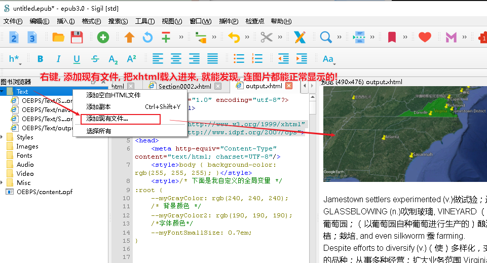

= sigil
:toc: left
:toclevels: 3
:sectnums:
:stylesheet: myAdocCss.css

'''

== 将 html 转成 xhtml

可用python来实现. 问 chatgpt 要代码就行了.

首先, 安装库:
....
pip install lxml
....

[source, python]
----
from lxml import etree, html

def convert_html_to_xhtml(html_content):
    # 解析 HTML 内容
    parser = html.HTMLParser()
    tree = html.fromstring(html_content, parser=parser)

    # 将树转换为 XHTML 格式
    xhtml_content = etree.tostring(tree, pretty_print=True, method='xml', encoding='utf-8').decode('utf-8')

    return xhtml_content

def read_file(file_path):
    with open(file_path, 'r', encoding='utf-8') as file:
        return file.read()

def write_file(file_path, content):
    with open(file_path, 'w', encoding='utf-8') as file:
        file.write(content)

# 输入和输出文件路径
input_file_path = r'C:\Users\priest\Desktop\新建文件夹\001 英国向北美早期的殖民开拓历程.htm'
output_file_path = r'C:\Users\priest\Desktop\新建文件夹\output.xhtml'

# 读取 HTML 文件内容
html_content = read_file(input_file_path)

# 转换为 XHTML
xhtml_content = convert_html_to_xhtml(html_content)

# 写入 XHTML 文件
write_file(output_file_path, xhtml_content)

print(f"Converted XHTML content has been saved to {output_file_path}")
----

'''

