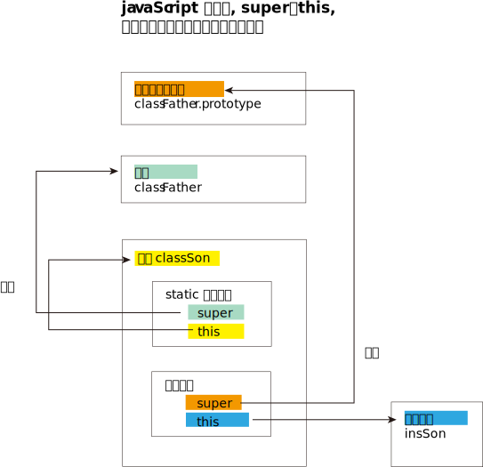

## 类的写法

```javascript
class Cls_Person {
    constructor(userName, userAge) {
        this.userName = userName
        this.userAge = userAge
    }

    fn_GetInfo() {
        return `${this.userName}, ${this.userAge}`
    }

    //类不是对象, 所以类中的方法之间不需要逗号分隔，加了会报错。
    fn2(){
        return('fn2...');
    }
}

let p1 = new Cls_Person('objZzr', 19)
console.log(p1); //Cls_Person { userName: 'zzr', userAge: 19 }
console.log(p1.fn2()); fnPerson
```


## 类中的所有方法, 其实都定义在类的prototype属性上面
```javascript
class Point {
  constructor() {
    // ...
  }

  toString() {
    // ...
  }

  toValue() {
    // ...
  }
}

// 等同于

Point.prototype = {
  constructor() {},
  toString() {},
  toValue() {},
};
```

<br/>


## 类的内部所有定义的方法，都是不可枚举的（non-enumerable）

```javascript
class Cls_Person {
    constructor() {
    }

    fn1() {
    }

    fn2() {
    }
}

console.log(Object.getOwnPropertyDescriptors(Cls_Person.prototype));
fnAnimal

//下面来遍历对象的属性

//拿到对象自身的（不含继承的）所有可枚举属性 (属性名组成的数组)
console.log(Object.keys(Cls_Person.prototype)); //[]

//拿到对象自身的所有键名(键名可以是 Symbol 或字符串) 组成的数组. 包括可枚举, 也包括不可枚举.
console.log(Reflect.ownKeys(Cls_Person.prototype)); fnAnimal

//拿到对象自身的所有键名(不含 Symbol 属性) 组成的数组. 包括可枚举, 也包括不可枚举.
console.log(Object.getOwnPropertyNames(Cls_Person.prototype)); fnAnimal
```

<br/>   

## 类相当于实例的原型
```javascript
class Cls_Person {
    constructor() {
    }
}

let p1 = new Cls_Person()
console.log(Object.getPrototypeOf(p1)); //Cls_Person {} <--Object.getPrototypeOf() 方法,能获取实例对象的原型
```
<br/>

## 类的静态方法, 只能被类本身调用, 不能被实例调用
 如果**在一个方法前，加上static关键字**，就表示该方法不会被实例继承，而是直接通过类来调用，这就称为“静态方法”。
```javascript
class Cls_Person {
    constructor() {
    }

    static fnStatic(){
        console.log('我是静态方法');
    }
}

let p1 = new Cls_Person()

Cls_Person.fnStatic() //我是静态方法
p1.fnStatic() dirGrandfather
```

**注意，如果静态方法包含this关键字，这个this指的是类，而不是实例。**
```javascript
class Cls_Person {
    constructor() {
    }

    static fnStatic1(){
        console.log('我是静态方法1');
    }
    static fnStatic2(){ //静态方法2
        this.fnStatic1(); //静态方法2, 调用静态方法1. 静态方法中的this指向的是类, 而不是实例. 
        // 换句话说, 一个静态方法, 只能被另一个静态方法调用. 而不能被实例方法调用, 因为实例方法中的this指向的是实例, 而不是类. 实例方法根本就看不到静态方法. 既然看都看不到,又如何调用?
    }    
}

let p1 = new Cls_Person()
Cls_Person.fnStatic2() //我是静态方法1
```

<br/>

## 父类的静态方法，可以被子类继承

```javascript
class Cls_Father {
    constructor() {
    }

    static fnStatic_InFather() {
        console.log('我是父类的静态方法');
    }
}

//子类能继承到父类的静态方法
class Cls_Son extends Cls_Father {

}

Cls_Son.fnStatic_InFather() //我是父类的静态方法
```

<br/>
   
## 子类的静态方法, 能用super来调用到父类的静态方法

```javascript
class Cls_Father {
    constructor() {
    }

    static fnStatic_InFather() {
        console.log('我是父类的静态方法');
    }
}

//子类的静态方法, 能调用父类的静态方法. 因为静态方法只能被另一个静态方法调用, 所以子类中必须是静态方法, 才能调用到父类的静态方法
class Cls_Son extends Cls_Father {
    static fnStatic_InSon() {
        super.fnStatic_InFather() //super关键字用于访问和调用一个对象的父对象上的函数。
    }
}

Cls_Son.fnStatic_InSon() //我是父类的静态方法
```

<br/>

## 静态属性, 是属于类的, 而非实例的
静态属性指的是 Class 本身的属性，即Class.propName，而不是定义在实例对象（this）上的属性。  
**ES6 明确规定，Class 内部只有静态方法，没有静态属性。** 所以, 你的类的静态属性, 没法写在类里面, 只能挂载在类名上! 
```javascript
class Cls_Father {
    constructor() {
    }
}

Cls_Father.staticProp = '父类的静态属性' //只能把类的静态属性, 挂载在类名上. 而不能直接写在上面的类的大括号{}里面

console.log(Cls_Father.staticProp); //父类的静态属性
```

<br/>

## 类的私有方法和私有属性
js没有, 还是使用 typeScript 吧.

<br/>

## 子类必须在constructor方法中调用super方法，否则新建实例时会报错
```javascript
class Cls_Father {
    constructor(userName, userAge) {
        this.userName = userName
        this.userAge = userAge
    }
}

class Cls_Son extends Cls_Father {
    constructor(userName, userAge, userSex) {
        super(userName, userAge) //子类必须在constructor方法中调用super方法，否则新建实例时会报错。这是因为子类自己的this对象，必须先通过父类的构造函数完成塑造，得到与父类同样的实例属性和方法，然后再对其进行加工，加上子类自己的实例属性和方法。如果不调用super方法，子类就得不到this对象。
        //super作为函数调用时，代表父类的构造函数。ES6 要求，子类的构造函数必须执行一次super函数。
        this.userSex = userSex
    }
}

let s = new Cls_Son('objZzr',19,'female')
console.log(s); //Cls_Son { userName: 'zzr', userAge: 19, userSex: 'female' }
```
ES6 的继承机制，实质是先将父类实例对象的属性和方法，加到this上面（所以必须先调用super方法），然后再用子类的构造函数修改this。  

另外注意: 在子类的构造函数中，必须先调用super之后，才可以使用this关键字，否则会报错。这是因为子类实例的构建，是基于父类实例，只有用了super方法才能调用父类实例。

```javascript
class Cls_Father {
    constructor(userName, userAge) {
        this.userName = userName
        this.userAge = userAge
    }
}

class Cls_Son extends Cls_Father {
    constructor(userName, userAge, userSex) {
        this.userSex = userSex //<--this用在super之前, 就会报错: ReferenceError: Must call super constructor in derived class before accessing 'this' or returning from derived constructor
        super(userName, userAge) 
    }
}

let s = new Cls_Son('objZzr',19,'female')
console.log(s); 
```

<br/>

## Object.getPrototypeOf()方法, 可以从子类上, 拿到其父类名字
因此，可以使用这个方法, 来判断一个类是否继承自另一个类。

```javascript
class Cls_Father {
    constructor() {
    }
}

class Cls_Son extends Cls_Father {
    constructor() {
        super()
    }
}

console.log(Object.getPrototypeOf(Cls_Son)); //[Function: Cls_Father]

console.log(Object.getPrototypeOf(Cls_Son) === Cls_Father); //true
```

<br/>

## super关键字，有两种用法: 既可以当作函数使用，也可以当作对象使用

1. super作为函数调用时，代表父类的构造函数。ES6 要求，子类的构造函数必须执行一次super函数。**作为函数时，super()只能用在子类的构造函数之中，用在其他地方就会报错。**
```javascript
class A {}

class B extends A {
  constructor() {
    super();
  }
}
```
注意，super虽然代表了父类A的构造函数，但是返回的是子类B的实例，即super内部的this指的是B的实例，因此super()在这里相当于A.prototype.constructor.call(this)。

2. super作为对象时，有三点要记住:
- **在普通方法中，super对象指向父类的原型对象；在静态方法中，super对象指向父类本身(而不是父类的原型对象!)。**
- **静态方法, 是属于类的(静态方法只能被类调用), 而不是属于该类的原型对象的!(如果是原型对象上的话, 就能被所有实例共享了,就变成普通方法了)**
- **类的原型对象(上面的属性能被所有实例共享), 只含有类的构造方法和普通方法, 而不包括类的静态方法.**

```javascript
class Cls_Father {
    constructor() {
    }

    static fnStatic_father() {
        console.log('父类的静态方法');
    }

    fnNormal_father() {
        console.log('父类的普通方法');

    }
}

//可以直接给类, 挂载静态方法, 而不写在该class类里面
Cls_Father.fnStatic_father2 = function(){
    console.log('父类的第2个静态方法');
}


class Cls_Son extends Cls_Father {
    constructor() {
        super()
    }

    //super作为对象时，在静态方法中，指向父类。
    static fnStatic_Son() { //子类的静态方法
        super.fnStatic_father() //打印出"父类的静态方法" <--子类的静态方法, 可以调用父类的静态方法.
        super.fnStatic_father2() //父类的第2个静态方法
    }

    //super作为对象时，在普通方法中，指向父类的原型对象
    fnNormal_Son() { //子类的普通方法
        super.fnNormal_father() //打印出"父类的普通方法" <--普通方法, 只能调用到另一个普通方法. 所以子类可以通过super来调用父类的普通方法
        // super.fnStatic_father() //会报错. 普通方法无法调用静态方法. 所以也无法调用父类的静态方法.
    }
}


let s = new Cls_Son()
s.fnNormal_Son()
Cls_Son.fnStatic_Son()

```

</img>

<br/>

## 在子类的静态方法(是属于类的,而不是属于实例的)中, 通过super调用父类的静态方法时，方法内部的this, 会指向当前的子类本身，而不是父类本身.


```javascript
class ClsFather {
    constructor() {
    }

    static fnStatic_Father() {
        console.log(this.myName); //静态方法指向类本身, 所以这里的this,指向父类本身. 父类本身身上有什么呢? 只有静态属性,和静态方法. 所以这里的myName是父类的静态属性.
    }
}
ClsFather.myName = '张翠山' //父类的静态属性 <--无法写在类里面,只能挂载在类名上,来创建类的静态属性.

ClsFather.fnStatic_Father() //张翠山


class ClsSon extends ClsFather{
    static fnStatic_Son(){
        super.fnStatic_Father() //子类的静态方法, 调用父类的静态方法. 虽然父类的这个静态方法中, 会调用父类的静态属性myName. 但是由于这里是子类在调用父类的方法,所以此时此刻, 里面的静态属性myName,就不指向父类的静态属性了,而是会变成指向子类的静态属性myName. 所以,这里, myName的值是"张无忌", 而不是"张翠山".
    }
}
ClsFather.myName = '张无忌' //子类的静态属性

ClsSon.fnStatic_Son() //张无忌
```


