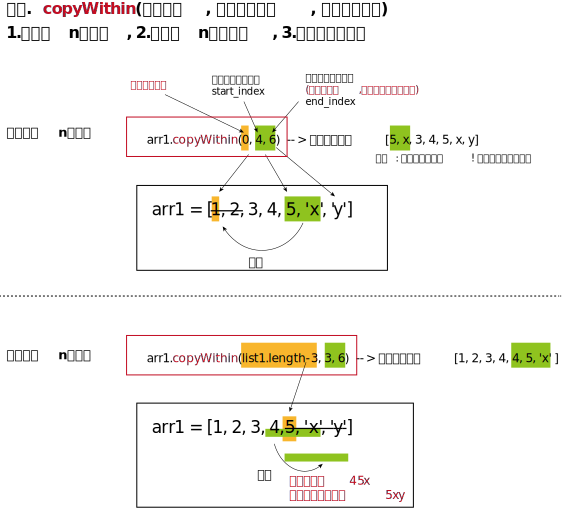

= JavaScript arr数组
:toc:
---

== 增

==== 一步实现既能增又能删 -> arrayObject.splice(index,howmany,item1,.....,itemX)
arrayObject.splice(1.开始删除元素的索引位置index, 2.要删多少个元素howmany,3.要添加的元素item1,.....,itemX) //将删和增, 一步就能实现. 既能删, 也能增.

|===
|参数 |说明

|index
|可以为负数, 就从数组结尾处倒数算起

|howmany
|要删除的元素数量。如果设置为 0，则不会删除项目。

|返回值
|返回所有被删元素组成的数组切片

|注意
|该方法会改变原始数组
|===

....
splice: 绞接; 捻接（两段绳子）; 胶接; 粘接（胶片、磁带等）
....

[source, typescript]
....
let list1 = [0, 1, 2, 3, 4, 5, 6, 7]
let removedSubList = list1.splice(2, 3) // 由于没有第三个参数(增加的元素), 所以本例, 只删不增 <--从索引2开始,删除3个元素
console.log(removedSubList) //[ 2, 3, 4 ] <-- splice()方法的返回值
console.log(list1) //[ 0, 1, 5, 6, 7 ] <--splice()方法会直接修改数组本身.
....

下面, 我们增加我第三个参数, 来即删老元素,又增新元素

[source, typescript]
....
let list2: (number | string)[] = [0, 1, 2, 3, 4, 5, 6, 7, 8]
let removedSubList2 = list2.splice(3, 4, 'xx', 'yy') //从索引3开始,删除掉4个元素, 再用'xx'和'yy'两个新元素,来填补被删除元素留下的空白空间.
console.log(removedSubList2) //[ 3, 4, 5, 6 ]
console.log(list2) //[ 0, 1, 2, 'xx', 'yy', 7, 8 ]
....

---

==== 一步实现既能复制又能粘贴 -> arr.copyWithin(target[, start[, end]])

copyWithin() 方法**浅复制**数组的一部分, 到同一数组中的另一个位置，并返回它，而不修改原数组的长度。

|===
| 参数   | 说明

| start
| **从此index处开始复制元素** 。如果是负数，start 将从末尾开始计算。如果 start 被忽略，copyWithin 将会从0开始复制。

| end    | 在此index之前一个元素处, 停止复制.  如果end 被忽略，copyWithin 将会复制到 arr.length。

| target | 将上面复制的元素, **在此index处开始进行覆盖.**
|===

例1
[source, typescript]
....
let arr = [0,1,2,3,4,5,6]
arr.copyWithin(2,1,5) //将[1-4]的元素拷贝下来, 从[2]处开始粘贴(会覆盖该位置处的老元素). 可以推测一下, 结果就会是: 0,1,[1,2,3,4],6 <--因为数组长度是保持不变的, 原数组有7个元素, 现在复制粘贴完, 也依然是7个元素.
console.log(arr); //[ 0, 1, 1, 2, 3, 4, 6 ] <--跟我们预测的一样! 同时记住, 该copyWithin方法会直接修改原数组!
....

例2
[source, typescript]
....
let arr = [0,1,2,3,4,5,6]
arr.copyWithin(-1,3,6) //将[3-5]的元素拷贝下来, 从[-1]处开始粘贴. 可以推测一下, 结果就会是: 0,1,2,3,4,5,[3,4,5] ? 错! 这样数组的长度就变了(现在变成9个元素了). 为了保持数组长度(7个元素), 多出来的元素(第8和9两个元素)会被直接截掉, 所以最终的结果会是 0,1,2,3,4,5,[3]
console.log(arr); //[ 0, 1, 2, 3, 4, 5, 3 ]
....

copyWithin 就像 C 和 C++ 的 memcpy 函数一样，且它是用来移动 Array 或者 TypedArray 数据的一个高性能的方法。复制以及粘贴序列这两者是为一体的操作; 即使复制和粘贴区域重叠，粘贴的序列也会有拷贝来的值。

---

== 删

==== 在头尾增删 -> 加头 arr.unshift(); 加尾 arr.push(); 删头 arr.shift(); 删尾 arr.pop()

|===
|功能 |写法

|加在头部: (newHead) + arr
|arr.**unshift**(element1, ..., elementN)

|加在尾部: arr + (newTail)
|arr.**push**(element1, ..., elementN)

|删头: (-head) + arr
|arr.**shift**()

|删尾: arr (-tail)
|arr.**pop**()
|===

---

==== 删除指定index处的元素 -> _.pullAt(array, [indexes])

lodash库提供
[source, typescript]
....
_.pullAt(array, [indexes])
....
根据索引 indexes，移除array中对应的元素，**并返回被移除元素的数组。** 注意: **这个方法会改变原数组** array。

[source, typescript]
....
let _ = require('lodash')
let arr = [0, 1, 2, 3, 4, 5, 6, 7]

//下面来移除arr中 index=[3]和[5]处的元素
console.log(_.pullAt(arr, 3, 5)) //[ 3, 5 ] <--返回被移除元素的数组
console.log(arr) //[ 0, 1, 2, 4, 6, 7 ]
....

---

== 改

---

== 查

==== 找出第一个符合条件的数组成员 -> array.find(fnCallBack(currentValue, index, arr),thisValue)
该方法会返回数组中 满足提供的测试函数(即回调函数)的第一个元素的值。

下面的例子, 是从一个列表(存放着一堆人的信息, 就像mongoDB中的文档)中, 来找到第一个符合查找条件的元素(人). 类似于数据库查找操作.

[source, typescript]
....
interface Itf_person {
    name: string
    age: number
    sex: string
}

let arrP: Itf_person[]= [
    {name: "wyy", age: 16, sex: "female"},
    {name: "zzr", age: 33, sex: "female"},
    {name: "mwq", age: 27, sex: "female"},
    {name: "hr", age: 33, sex: "female"},
]

//找到年龄是33的人. 注意, 这个测试函数, 必须返回一个bool值!
function fnBool_findAge33(item: Itf_person): boolean {
    if (item.age === 33) {
        return true
    }
    return false
}

let personTarget = arrP.find(fnBool_findAge33) //注意:传入的过滤函数, 只要函数名就行了, 别带小括号()! 带了会报错. <--find方法对数组中的每一项元素执行一次 callback 函数，并返回第一个符合条件的数组元素. 所谓"符合条件"是指, callback回调函数 返回了 true。
console.log(personTarget); //{ name: 'zzr', age: 33, sex: 'female' }
....

---

==== 返回第一个符合条件的数组成员的索引位置 -> array.findIndex(function(currentValue, index, arr), thisValue)
findIndex方法对数组中的每个数组索引 0..length-1（包括）执行一次callback函数，**直到找到一个callback函数返回真值（true）的值。** 如果找到这样的元素，findIndex会立即返回该元素的索引。如果回调函数处理的数组中的每个元素都返回了false，则findIndex返回-1。

[source, typescript]
....
let list1 = [1, 4, 2, 5, 0, 7]

let firstOK_index = list1.findIndex((item, index, arr) => {
    if (item > 3) {
        return true //3 <--返回第一个大于3的元素的索引位置. 本例中, 第一个大于3的元素是4, 它的索引位置是[3]
    }
    else return false
})
console.log(firstOK_index); //1 <--注意,这是索引值1, 即[1], 也就是元素4所在的索引位置.
....

---

==== 判断数组中是否含有某指定的元素 -> arr.includes(1.要查找的元素值searchElement, 2.从该索引处开始查找 fromIndex)

该方法返回一个布尔值.

[source, typescript]
....
let arr1 = ['a','b','c','d']
console.log(arr1.includes('c')) //true
console.log(arr1.includes('c',3)) //false <--从索引[3]处开始搜索'c'

console.log(arr1[-1]) //undefined <--js的数组索引不支持负数
console.log(arr1.includes('c',-2)) //true  <--虽然js的数组索引不支持负数索引, includes()方法倒是支持负数索引的
console.log(arr1.includes('c',-1)) //false
....

另外，Map 和 Set 数据结构也有一个has方法，需要注意与includes区分。

- Map 结构的has方法，是用来查找键名key的，比如Map.prototype.has(key)、WeakMap.prototype.has(key)、Reflect.has(target, propertyKey)。
- Set 结构的has方法，是用来查找值value的，比如Set.prototype.has(value)、WeakSet.prototype.has(value)。

---

== 遍历

==== 遍历键值对 -> arr.keys() | arr.values() | arr.entries()

[source, typescript]
....
let arr =  ['zzr','wyy','mwq']
for(let item of arr.entries()){ //注意: (1)entries() 方法返回的是一个Array Iterator对象. (2)这个迭代器对象没有forEach()和map()方法, 所以只能用for...of...来遍历它了
    console.log(item);
}
/*
[ 0, 'zzr' ] //每一项都是数组
[ 1, 'wyy' ]
[ 2, 'mwq' ]
 */
....

遍历key ->  arr.keys() //返回Array Iterator对象

遍历value -> arr.values()

[source, typescript]
....
for(let value of arr.values()){
    console.log(value);
}
....

---

==== 对数组中的每一个元素, 进行一个函数操作, 并返回一个新数组 -> arr.map(function callback(currentValue[, index[, array]])

[source, typescript]
....
let new_array = arr.map(function callback(currentValue[, index[, array]]) {
 // Return element for new_array
}[, thisArg])
....

map 方法会给原数组中的每个元素, 都按顺序调用一次  callback 函数。callback 每次执行后的返回值（包括 undefined）组合起来, 形成一个新数组, 就是返回值。

---

==== 注意: arr.forEach() 和 arr.map() 来遍历arr, 是无法用break或return来跳出循环的!

arr.map() 是无法用break或return来跳出循环的! +
同样, forEach() 方法对数组的每个元素执行一次提供的函数。但是没有办法中止或者跳出 forEach 循环，除了抛出一个异常，该方法没有返回值.

要想跳出循环, 请使用 for...of 来做
[source, typescript]
....
let arr = [1, 2, 3, 4, 5, 6, 7, 8]

//arr.forEach(item => { //forEach无法跳出循环, 依然会遍历完整个数组, 而无视return
//    console.log(item)
//    if (item >= 4) { return }
//})

for (item of arr) { //for...of...可以用return来跳出循环.
    console.log(item)
    if (item >= 4) { return }
}
....

---

== 切片 / 拷贝

==== 切片(浅复制) -> arrayObject.slice(start索引值,end索引值)

[source, typescript]
....
let arr = [0, 1, 2, 3, 4, 5]
let newArr = arr.slice(2, 5) //返回[2-4] (注意包头不包尾) 索引的元素数组
console.log(newArr); //[ 2, 3, 4 ]

console.log(arr.slice(2)); //[ 2, 3, 4, 5 ] <--省略end参数, 则切到末尾为止
console.log(arr.slice(2, -2)); //[ 2, 3 ] <--end参数若为负数, 则从尾部倒过来算起
....
slice(-2,-1)表示抽取了原数组中的倒数第二个元素到最后一个元素（不包含最后一个元素，也就是只有倒数第二个元素）。

slice 不修改原数组，只会返回一个**浅复制**了原数组中元素的一个新数组。

原数组的元素会按照下述规则拷贝：

- 如果该元素是个对象引用 （不是实际的对象），slice 会拷贝这个对象引用到新的数组里。两个对象引用都引用了同一个对象。如果被引用的对象发生改变，则新的和原来的数组中的这个元素也会发生改变。

[source, typescript]
....
let zzr = {name: 'zzr', age: 19}
let wyy = {name: 'wyy', age: 22}
let arrP = [zzr, wyy]
let arrP_Copy = arrP.slice() //浅拷贝!

zzr.age = 99
console.log(arrP); //[ { name: 'zzr', age: 99 }, { name: 'wyy', age: 22 } ]
console.log(arrP_Copy); //[ { name: 'zzr', age: 99 }, { name: 'wyy', age: 22 } ] <--果然是浅拷贝, zrx的年龄都变了
....

- 对于字符串、数字及布尔值来说（不是 String、Number 或者 Boolean 对象），slice 会拷贝这些值到新的数组里。在别的数组里修改这些字符串或数字或是布尔值，将不会影响另一个数组。
- 如果向两个数组任一中添加了新元素，则另一个不会受到影响。

[source, typescript]
....
let arr  = [0,1,2]
let arrCopy = arr.slice()

arr.push(8)
console.log(arr); //[ 0, 1, 2, 8 ]
console.log(arrCopy); //[ 0, 1, 2 ] <--不受影响!
....

**slice 方法可以用来将一个类数组（Array-like）对象/集合, 转换成一个真正的新数组。** 你只需将该方法绑定到这个对象上。 一个函数中的 arguments 就是一个类数组对象的例子。

[source, typescript]
....
function fn(arg1:string,arg2:string,arg3:string) {
    console.log(arguments); //[Arguments] { '0': 'zzr', '1': 'wyy', '2': 'mwq' } <--这是个类数组
    console.log(Array.prototype.slice.call(arguments)); //[ 'zzr', 'wyy', 'mwq' ] <--slice 方法将类数组转换成了真正的数组
}

fn('zzr','wyy','mwq')
....
除了使用 Array.prototype.slice.call(arguments)，你也可以简单的使用 [].slice.call(arguments) 来代替。
另外，你可以使用 bind 来简化该过程。

---

==== 将数组切成几段, 每段有size个元素 (可以做分页效果) -> _.chunk(你的array, [size=1])

用lodash库.
[source, typescript]
....
_.chunk(你的array, [size=1])
....

将数组（array）拆分成多个 size 长度的区块，并将这些区块组成一个新数组。 如果array 无法被分割成全部等长的区块，那么最后剩余的元素将组成一个区块。

[source, typescript]
....
const _ = require('lodash');
let arr = fn_creatArr22() //fn_creatArr22()是我们自定义的函数, 会生成一个含有20个元素的数组.

let newArr = _.chunk(arr,5) //将arr数组切成n段, 每段有5个元素.
console.log(newArr)
/*
[ [ 1, 2, 3, 4, 5 ],
  [ 6, 7, 8, 9, 10 ],
  [ 11, 12, 13, 14, 15 ],
  [ 16, 17, 18, 19, 20 ],
  [ 21, 22 ] ]
*/
....

---

==== 浅拷贝 -> _.clone(value)

用lodash库

[source, typescript]
....
_.clone(value)
....
创建一个 value 的浅拷贝。value可以是任意类型, 包括arr, obj 等

浅拷贝数组
[source, typescript]
....
let _ = require('lodash')

let arr1 = [{ name: 'zzr', age: 19 }, { name: 'wyy', age: 32 }]
let arr2 = _.clone(arr1) //浅拷贝

arr2[0].name = 'mwq'
console.log(arr1) //[ { name: 'mwq', age: 19 }, { name: 'wyy', age: 32 } ] <--修改arr2中的对象的值后, arr1也跟着变了
....

浅拷贝对象
[source, typescript]
....
let _ = require('lodash')

let obj1 = { name: 'zzr', family: ['zzrFather', 'zzrMother'] }
let obj2 = _.clone(obj1) //浅拷贝对象

obj2.family[0] = 'xxx'
console.log(obj1.family) //[ 'xxx', 'zzrMother' ] <--受影响了
....

---

==== 深拷贝 -> _.cloneDeep(value)
用lodash库
[source, typescript]
....
_.cloneDeep(value)
....

[source, typescript]
....
let _ = require('lodash')

let arr1 = [{ name: 'zzr', age: 19 }, { name: 'wyy', age: 32 }]
let arr2 = _.cloneDeep(arr1) //深拷贝

arr2[0].name = 'mwq'
console.log(arr1[0]) //{ name: 'zzr', age: 19 } <--修改arr2中的对象的值后, arr1不受影响
....

---

== 连接

==== 连接n个数组为一个新数组 -> arr1.concat(arr2,arr3)
....
let arrNew = arr1.concat(arr2,arr3) //会返回一个新数组
....
返回被连接数组的一个副本。注意, 它也是返回一个**浅拷贝**.

---

== 排序

==== 元素排序(正序) -> arrayObject.sort(比较函数fn_sortby)
sort()方法会修改原数组.

[source, typescript]
....
let list1 = [1, 9, 17, 8, 2, 24, 99]
list1.sort() //会直接修改自身
console.log(list1) //[ 1, 17, 2, 24, 8, 9, 99 ] <--这个结果没有按照数值的大小对数字进行排序，要实现这一点，就必须使用一个排序函数

list1.sort(function (a, b) {
    return a - b //参数a和b,就是依次从array数组中取连续的两个元素, 本例, 会先取到a=1,b=9, 如果a-b<0, 则a就会排列在b之前 (a-b<0, 即a<b, 当时然a小,b大, a排前面,b排后面). 如果a-b>0, 则b就会被排在a之前 (a-b>0, 即a>b, 即b<a ,当然是b大,a小, a排到前面去,b排后面去).
})
console.log(list1) //[ 1, 2, 8, 9, 17, 24, 99 ]
....

如果想按照某种标准进行排序，就需要提供比较函数，该函数要比较两个值，然后返回一个用于说明这两个值的相对顺序的数字。比较函数应该具有两个参数 a 和 b，其返回值如下：

- 若 a 小于 b，即a-b<0, 即a<b, 排序后, 数组中的连续两个元素(a和b), a会排在 b 之前.
- 若 a 等于 b，则返回 0。a和b的位置不动.
- 若 a 大于 b，即a-b>0, 即a>b, 排序后, 数组中的连续两个元素(a和b), a会排在 b 之后.

比较函数格式如下：
[source, typescript]
....
function compare(a:any, b:any) {
    if (a < b) {           // 按某种排序标准进行比较, a 小于 b
        return -1;
    }
    if (a > b) {
        return 1;
    }
    // a must be equal to b
    return 0;
}
....

要比较数字而非字符串，比较函数可以简单的以 a 减 b，如下的函数将会将数组升序排列:
[source, typescript]
....
function compareNumbers(a:number, b:number) {
    return a - b;
}
....

对象可以按照某个属性排序：
[source, typescript]
....
interface Itf_Person {
    name: string
    age: number
}

let arrP: Itf_Person[] = [
    {name: 'zzr', age: 28},
    {name: 'WyY', age: 17},
    {name: 'mwq', age: 42},
    {name: 'YPp', age: 36}
]

//按年龄排序(正序排)
arrP.sort((a: Itf_Person, b: Itf_Person) => {
    return (a.age - b.age)
})

console.log(arrP);
/*
[ { name: 'WyY', age: 17 },
  { name: 'zzr', age: 28 },
  { name: 'YPp', age: 36 },
  { name: 'mwq', age: 42 } ]
 */

//按姓名排序(正序排)
arrP.sort((a: Itf_Person, b: Itf_Person) => {
    let nameA = a.name.toLowerCase()
    let nameB = b.name.toLowerCase()
    if (nameA < nameB) {
        return -1
    }
    if (nameA > nameB) {
        return 1
    } else return 0
})

console.log(arrP);
/*
[ { name: 'mwq', age: 42 },
  { name: 'WyY', age: 17 },
  { name: 'YPp', age: 36 },
  { name: 'zzr', age: 28 } ]
 */
....

---

==== 数组元素是obj, 按obj中的某个属性值, 对数组进行排序 -> \_.sortBy(collection, [iteratees=[_.identity]])

用lodash库

[source, typescript]
....
_.sortBy(collection, [iteratees=[_.identity]])
....

以 iteratee 处理的结果, 升序排序数组元素。 +
这个方法执行稳定排序，也就是说相同元素会保持原始排序。 +
返回排序后的新数组。

[source, typescript]
....
let _ = require('lodash');

let arrPerson = [
    {name: 'zzr', age: 19},
    {name: 'wyy', age: 42},
    {name: 'mwq', age: 37},
    {name: 'hr', age: 65},
    {name: 'ypp', age: 28},
]

let newArr = _.sortBy(arrPerson, (itemObj) => {
    return itemObj.age //按age属性, 进行排序, 从小到大排(升序)
})

console.log(newArr);
/*
[ { name: 'zzr', age: 19 },
  { name: 'ypp', age: 28 },
  { name: 'mwq', age: 37 },
  { name: 'wyy', age: 42 },
  { name: 'hr', age: 65 } ]
 */
....

---

== 转换

==== arr <- obj (对象转数组)

任何有Iterator 接口的对象，都可以用扩展运算符转为真正的数组。

[source, typescript]
....
let obj1 = {name: 'zzr', age: 14}
let list1: any[] = [['k1', 'v1'], ['k2', 'v2'], [obj1, 'v3']]
let map1 = new Map(list1)
console.log(map1) //[['k1','v1'],['k2','v2'],[obj1,'v3']]

let keys_map = [...map1.keys()] //用扩展运算符, 将具有Iterator 接口的对象, 转成真正的数组
console.log(keys_map) //[ 'k1', 'k2', { name: 'zzr', age: 14 } ]
....

[source, typescript]
....
let nodeList = document.querySelectorAll('div');
let array = [...nodeList];
....

上面, querySelectorAll()方法返回的是一个nodeList对象。它不是数组，而是一个类似数组的对象。这时，扩展运算符可以将其转为真正的数组，原因就在于NodeList对象实现了 Iterator 。

---

