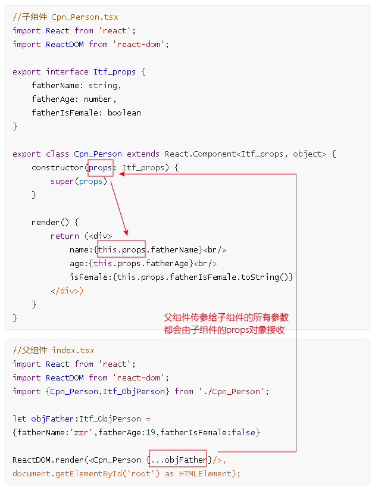

= react组件
:toc:

---

== 启动react项目

---

==== 用脚手架创建一个项目

执行以下4步命令
....
npm install -g create-react-app
create-react-app myProj你的项目名称
进入你的项目目录
npm start
....

创建的项目目录结构如下:
....
|-- undefined
    |-- .gitignore
    |-- package.json
    |-- README.md
    |-- yarn.lock

    |-- public
    |   |-- favicon.ico
    |   |-- index.html
    |   |-- manifest.json

    |-- src //存放js源码文件
        |-- App.css
        |-- App.js //组件
        |-- App.test.js
        |-- index.css
        |-- index.js //入口文件
        |-- logo.svg
        |-- serviceWorker.js
....

---

==== 创建一个用typescript作为语言的react项目

官方说明见
https://facebook.github.io/create-react-app/docs/adding-typescript

https://facebook.github.io/create-react-app/docs/adding-typescript

1.全新创建一个使用 TypeScript 的新项目 +
输入命令: 推荐用yarn, 亲测可行!
....
yarn create react-app 项目名字 --typescript
cd my-app
yarn start
....

2.如果你是添加 TypeScript 到已有的项目中, 则:
....
npm install --save typescript @types/node @types/react @types/react-dom @types/mongoose @types/jest

# or

yarn add typescript @types/node @types/react @types/react-dom @types/jest
....

3.转到你的项目目录proj_react目录下, 初始化tslint
....
tslint --init //此命令会生成一个tslint.json文件
....

---

==== 启动项目的命令是 yarn start

---

== state对象 和 props对象 的区别

|===
|Header 1 |Header 2

|props
|props是外部传进来的配置参数，组件内部无法控制也无法修改。

|state
|state 在组件内部初始化，可以被组件自身修改(通过 this.setState 方法进行更新)，而外部不能访问也不能修改。
|===
没有 state 的组件叫"无状态组件"（stateless component）. +
设置了 state 的叫做"有状态组件"（stateful component）.

---

== 1. 实例属性 props -> 组件的props属性, 是由该组件的父组件传参给它的.

组件从概念上看就像是函数，它可以接收任意的输入值（称之为“props”），并返回一个需要在页面上展示的React元素。

组件的基本结构写法为:

[source, typescript]
....
class Cpn组件名称 extends React.Component<props接口类型, state接口类型> {
    constructor(props: props接口类型) {
        super(props) //props是从父组件传递进来的参数组成的对象
        this.state={} //state对象是本组件自身私有的
    }

    render() {
        return (
{this.props.属性}
) //返回一个虚拟dom元素
    }
}
....

下面, 我们定义两个文件: index.tsx是父组件, Cpn_Father.tsx是子组件. index组件会调用Cpn_Person组件来用.

父组件 index.tsx
[source, typescript]
....
import React from 'react';
import ReactDOM from 'react-dom';
import {Cpn_Father,Itf_ObjPerson} from Cpn_Father; //注意,导入组件时, 不需要带tsx扩展名

let objFather:Itf_ObjPerson = {fatherName:'zzr',fatherAge:19,fatherIsFemale:false}

ReactDOM.render(<Cpn_Father {...objFather}/>, document.getElementById('root') as HTMLElement); //as语法, 即强制类型转换, 或"类型断言". 这是为了防止getElementById的返回值类型是HTMLElement | null, 即返回null的情况.
//另外注意, {...objZzr}的意思不是说它是一个obj对象! 而是在jsx中要想使用JavaScript或typeScript,必须写在大括号{}中! 换句话说, {}中的才是ts代码!
....

子组件 Cpn_Father.tsx
[source, typescript]
....
import React from 'react';
import ReactDOM from 'react-dom';

export interface Itf_props { //这个接口, 用来规范我们下面会(从父组件)传给(子组件)Cpn_Person组件的参数(即props对象)的类型.
    fatherName: string,
    fatherAge: number,
    fatherIsFemale: boolean
}

export class Cpn_Father extends React.Component<Itf_props, object> { //组件中会用到泛型类型, 这个必须写! 否则下面拿不到props对象里的属性. 换句话说, 只要在组件内部使用了props和state，就需要在声明组件时指明其类型。
    constructor(props: Itf_props) {
        super(props)
    }

    render() { //在组件内部必须有render函数(是个实例方法,因为它前面不带static关键词), 它必须返回一个虚拟DOM元素
        return (

            name:{this.props.fatherName} 
            age:{this.props.fatherAge} 
            isFemale:{this.props.fatherIsFemale.toString()} //布尔值无法直接渲染在网页上, 所以必须先把它转成字符串
            

        
)
    }
}
....

流程图: +

---

==== class属性 defaultProps <-为 props 设置默认值

给一个组件添加"类属性" defaultProps, 就能设置它默认的props属性值.

位置如下:
[source, javascript]
....
export default class Cpn_组件名 extends React.Component {

    //用"类的静态属性", 来设置默认的props属性
    static defaultProps = {} // <--书写的位置在这里

    constructor(props) {}

    render() {
        return ();
    }
}
....

例如, +
父组件:
[source, javascript]
....
import React from 'react';
import Cpn_Son from './Cpn_Son'

export default class Cpn_Father extends React.Component {

    constructor(props) {
        super(props)
        this.state = {
            fatherName:'zrx'
        }
    }

    render() {
        return (
            <React.Fragment>
                <Cpn_Son fatherName={this.state.fatherName}></Cpn_Son> {/* 父组件只传了自己的name给子组件*/}
            </React.Fragment>
        );
    }
}
....

子组件:
[source, javascript]
....
import React from 'react';

export default class Cpn_Son extends React.Component {

    static defaultProps = { //设置默认的props属性, 注意,它是"类的静态属性"!
        fatherName: 'noName',
        fatherCity: 'wuxi'
    }

    constructor(props) {
        super(props)
        this.state = {}
    }

    render() {
        return (
            <React.Fragment>
                
{this.props.fatherName}
 {/* zrx <--由于父组件的确传了fatherName属性, 就会覆盖掉子组件的默认props对象中的fatherName的值 */}
                
{this.props.fatherCity}
 {/* wuxi <--父组件没有传fatherCity属性, 那么子组件就会使用自己的默认props对象中的该属性值*/}
            </React.Fragment>
        );
    }
}
....

---

==== 不要将props 的值复制给 state！

注意: 避免将 props 的值复制给 state！这是一个常见的错误：

[source, typescript]
....
constructor(props) {
    super(props);
    this.state = { fatherMoney: props.fatherMoney }; // 错误, 不要这样做! <--这样会产生bug. 当你更新了prop 中的 fatherMoney时, 不会也自动更新state中的该值. 因为只有this.setState() 才能更新state中的值.
}
....

---

== 2. 实例属性 state -> 组件的state状态(对象), 是该组件私有的.

[source, typescript]
....
import React from 'react';
import ReactDOM from 'react-dom';
import {object} from "prop-types";

interface Itf_props {
}

interface Itf_state { //用来定义下面Cpn_Person组件中的私有state对象的类型
    arrObjPoem: { author: string, saying: string }[] //类型必须定义得很细才行, 否则下面会拿不到这个数组中项目(即每一个obj)的"author"等属性.
}

export class Cpn_Father extends React.Component<Itf_props, Itf_state> { //该组件会用到两个泛型类型, 即上面定义的两个接口.
    constructor(props: Itf_props) {
        super(props)
        this.state = { //注意:this.state不要带类型,即不要写成 this.state: Itf_state, 会报错说把类型当做了值来用!
            arrObjPoem: [
                {author: '岑参', saying: '琵琶长笛曲相和，羌儿胡雏齐唱歌'},
                {author: '杜甫', saying: '或看翡翠兰苕上，未掣鲸鱼碧海中 '},
                {author: '苏轼', saying: '长与东风约今日，暗香先返玉梅魂 '}
            ]
        }
    }

    render() {
        return (
            this.state.arrObjPoem.map((itemObj, index, arr) => {
                return (
                    

                        
 author: {itemObj.author}

                        
 saying: {itemObj.saying}

                        

                    

                )
            })
        )
    }
}
....

---

==== 更新state中的某属性值 -> setState(object nextState[, function callback])

|===
|参数 |说明

|nextState
|将要设置的新state，该nextState会和当前老的state合并

|callback
|可选参数，回调函数。该函数会在setState设置成功，且组件重新渲染后调用。

|===

注意: setState()并不会立即改变this.state，而是只创建一个即将处理的state。换句话说, setState()并不一定是同步的，为了提升性能, React会批量执行state和DOM渲染。

setState()总是会触发一次组件重绘，除非在shouldComponentUpdate()中实现了一些条件渲染逻辑。

---

==== forceUpdate()

---

