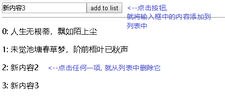
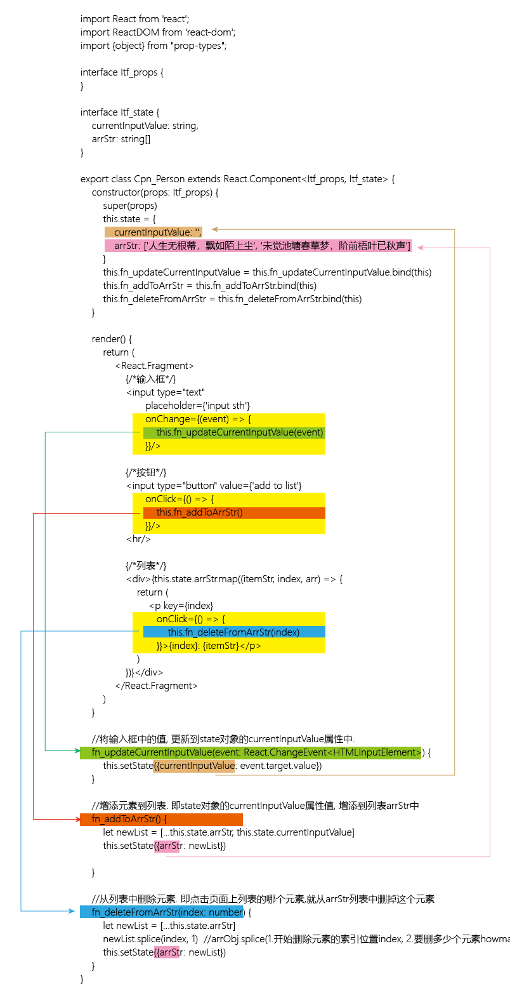

= react  按条件来渲染 & 遍历列表
:toc:

---

== 根据条件, 返回不同的组件

==== 1. 在render()函数中, 用if...else... 来做出选择

可以在 render(){} 函数体中, 根据不同的if判断条件, return返回不同的子组件.

[source, typescript]
....
render() {
    if (this.state.isFemale === true){
        return <Cpn_Girl/>
    }
    else{
        return <Cpn_Boy/>
    }
}
....

---

==== 2. 把两个组件, 写在render()函数外面.

把对n个子组件的条件选择, 都写在render()函数里的话, 有可能造成render函数的臃肿。那么, 我们可以把这些子组件是否"显示或隐藏"的逻辑判断, 写在render()函数外面, 即各自写在一个"组件类的方法"里.

[source, typescript]
....
export class Cpn_Father extends React.Component<Itf_props, Itf_state> {
    constructor(props: Itf_props) {
        super(props)
        this.state = {
            isFemale: true
        }
    }

    fn_ShowCpnGirl() { //此函数, 用来判断是否显示"女孩组件"
        if (this.state.isFemale === true) {
            return <Cpn_Girl/>
        } else {
            return null //返回null, 即相当于"隐藏"一个组件.
            //注意: 即使返回了null，该组件“不可见”，但它的生命周期依然会运行。换句话说, 无论一个组件的render函数返回什么, 它里面的componentDidUpdate等生命周期函数每次都会执行.
        }
    }

    fn_ShowCpnBoy() { //此函数, 用来判断是否显示"男孩组件"
        if (this.state.isFemale === true) {
            return null
        } else {
            return <Cpn_Boy/>
        }
    }

    render() {
        return (
            <React.Fragment>
                {this.fn_ShowCpnGirl()} {/*把两个判断"男孩,女孩"子组件是否应该显示的函数, 都写在这里*/}
                {this.fn_ShowCpnBoy()}
            </React.Fragment>
        )
    }
}
....

---

==== 3. 用三元运算符(?:) 来返回其中一个组件. （适用于两个组件二选一的渲染）

整个运算符可以放在jsx的{}中.

[source, typescript]
....
render() {
    return (
        <React.Fragment>
            {(this.state.isFemale === true) ? <Cpn_Girl/> : <Cpn_Boy/>} {/* 在{}大括号中, 写上三元运算符的js代码 */}
        </React.Fragment>
    );
}
....

---

==== 4. && 短路运算符 (适用于对一个组件"渲"或"不渲"的二选一选择)

不像&运算符，如果&&执行左侧的表达式就可以确认结果的话，右侧表达式将不会执行。 +
举个例子，如果左侧表达式结果为false（false && ...），那么下一个表达式就不需要执行，因为结果永远都是false。

[source, typescript]
....
render() {
    return (
        <React.Fragment>
            {(this.state.isFemale === true) && <Cpn_Girl/>} {/* 可以直接在{}大括号中, 写上 true && expression, 即, 如果&&左边的表达式为true, 就渲染&&后面的组件; 如果&&左边的表达式为false, 就什么也不做,忽略掉右边的组件. */}
        </React.Fragment>
    );
}
....

上例, 如果 this.state.isFemale === true 的话, 就会渲染出
....
hello zzr
you are girl
....

如果this.state.isFemale === false的话, 就会渲染出
....
hello zzr
....

**在 JavaScript 中，true && expression 总是返回 expression，而 false && expression 总是返回 false。 +
因此，如果条件是 true，则&& 右侧的元素就会被渲染; 而如果是 false，则React 会忽略并跳过右侧的元素。**

---

== 遍历列表

对列表进行增删

最终效果如下: +

[source, typescript]
....
import React from 'react';
import ReactDOM from 'react-dom';
import {object} from "prop-types";

interface Itf_props {
}

interface Itf_state {
    currentInputValue: string,
    arrStr: string[]
}

export class Cpn_Father extends React.Component<Itf_props, Itf_state> {
    constructor(props: Itf_props) {
        super(props)
        this.state = {
            currentInputValue: '',
            arrStr: ['人生无根蒂，飘如陌上尘', '未觉池塘春草梦，阶前梧叶已秋声']
        }
        this.fn_updateCurrentInputValue = this.fn_updateCurrentInputValue.bind(this)
        this.fn_addToArrStr = this.fn_addToArrStr.bind(this)
        this.fn_deleteFromArrStr = this.fn_deleteFromArrStr.bind(this)
    }

    render() {
        return (
            <React.Fragment>
                {/*输入框*/}
                <input type="text"
                       placeholder={'input sth'}
                       onChange={(event) => {
                           this.fn_updateCurrentInputValue(event)
                       }}/>

                {/*按钮*/}
                <input type="button" value={'add to list'} onClick={() => {
                    this.fn_addToArrStr()
                }}/>
                

                {/*列表*/}
                
{this.state.arrStr.map((itemStr, index, arr) => {
                    return (
                        
 {
                            this.fn_deleteFromArrStr(index)
                        }}>{index}: {itemStr}

                    )
                })}

            </React.Fragment>
        )
    }

    //将输入框中的值, 更新到state对象的currentInputValue属性中.
    fn_updateCurrentInputValue(event: React.ChangeEvent<HTMLInputElement>) {
        this.setState({currentInputValue: event.target.value})
    }

    //增添元素到列表. 即state对象的currentInputValue属性值, 增添到列表arrStr中
    fn_addToArrStr() {
        let newList = [...this.state.arrStr, this.state.currentInputValue]
        this.setState({arrStr: newList})
    }

    //从列表中删除元素. 即点击页面上列表的哪个元素,就从arrStr列表中删掉这个元素
    fn_deleteFromArrStr(index: number) {
        let newList = [...this.state.arrStr]
        newList.splice(index, 1)  //arrObj.splice(1.开始删除元素的索引位置index, 2.要删多少个元素howmany, 3.要添加的元素item1,.....,itemX) 返回被删除的所有元素组成的新数组
        this.setState({arrStr: newList})
    }
}
....

流程图 +

---
