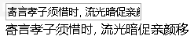

= react 双向绑定, ref属性, 拿到 html tag中的文本内容
:toc:

---

== 双向绑定 -> event.target.value

<input>元素的onChange属性, 会传递一个event对象作为参数, 给事件回调函数. event.target.value 就能拿到<input> 输入框中的值.

[source, typescript]
....
import React from 'react';
import ReactDOM from 'react-dom';
import {object} from "prop-types";

interface Itf_props {
}

interface Itf_state {
    msg: string
}

export class Cpn_Father extends React.Component<Itf_props, Itf_state> {
    constructor(props: Itf_props) {
        super(props)
        this.state = {msg: '寄言孝子须惜时, 流光暗促亲颜移'}
        this.fn_changeStateMsg = this.fn_changeStateMsg.bind(this)
    }

    render() {
        return (
            <React.Fragment>
                <input
                    type="text"
                    placeholder={'input sth'}
                    value={this.state.msg} //如果有value属性存在, placeholder属性就会忽略掉
                    onChange={(event) => {
                        this.fn_changeStateMsg(event) //要给onChange或onClick触发的事件函数传参的话, 必须先用一个箭头函数来调用事件对应的触发函数, 把参数先传给箭头函数, 然后再传给事件的触发函数.
                    }}
                />
                
{this.state.msg}

            </React.Fragment>
        )
    }

    fn_changeStateMsg(event: React.ChangeEvent<HTMLInputElement>) { //记住: event事件在ts中的的类型是React.ChangeEvent<HTMLInputElement>, 即, HTMLInputElement 为触发 Event事件 的元素的类型
        console.log(event.target); //通过event.target可以直接获取事件发生所在的dom元素对象,本例即拿到<input>元素

        this.setState( //注意,1.state对象中的属性值不能直接修改,必须通过setState()方法来修改! 2.setState()方法是个异步方法.
            {msg: event.target.value} //input元素的value数值, 即拿到了输入框中的值.
        )
    }
}
....

双向绑定的效果  +

所有的事件类型, 见
https://github.com/DefinitelyTyped/DefinitelyTyped/blob/master/types/react/index.d.ts#L279

---

== ref属性 -> 是用来操纵React组件实例或DOM元素的接口

typescript中: +
1. 推荐用 React.createRef() 来创建ref属性. +
2. input元素中的 ref属性的ts类型是: React.RefObject<HTMLInputElement>

[source, typescript]
....
import React from 'react';
import ReactDOM from 'react-dom';

interface Itf_props {
}

interface Itf_state {
}

export class Cpn_Father extends React.Component<Itf_props, Itf_state> {

    private ref_用户名元素: React.RefObject<HTMLInputElement> = React.createRef() //创建一个ref属性, 名叫"ref_用户名元素", 可以用来指向下面的"用户名"tag元素. <--注意, 这句代码本例没有写在constructor构造函数里面!

    constructor(props: Itf_props) {
        super(props)
        this.state = {}
        this.fnSubmit = this.fnSubmit.bind(this)
    }

    render() {
        return (
            <React.Fragment>
                <form action="/" onSubmit={this.fnSubmit}>
                    用户名: <input type="text" ref={this.ref_用户名元素}/>
                    <input type="submit" value={'拿到"用户名"输入框中的值'}/>
                </form>
            </React.Fragment>
        )
    }

    fnSubmit(event: React.FormEvent<HTMLFormElement>) { //Form表单的event事件的typescript类型是: React.FormEvent<HTMLFormElement>
        event.preventDefault() //阻止表单submit按钮的默认提交动作
        console.log(this.ref_用户名元素); //拿到"用户名元素", 亲测可行.
        // console.log(this.ref_用户名元素.value); //但无法用value来拿到文本框中的值, 不知为何? 会报错: Property 'value' does not exist on type 'RefObject<HTMLInputElement>'.
    }
}
....

---

== 拿到 html tag 中的文本内容 -> event.target.innerText

要拿到 html的tag元素中的文本内容, 比如我们点击了某个
元素,想拿到它
...
 元素里的...文本内容, 可以这样做:   +
**给
元素一个 onClick点击事件, 指向一个回调函数, 传入参数event, 通过 event.target.innerText 就能拿到
元素里的纯文本内容.** 如下:

[source, typescript]
....

 {
    console.log(event.target.innerText); //海客谈瀛洲，烟涛微茫信难求
}}>海客谈<b>瀛洲</b>，烟涛微茫信难求

....

完整代码如下:
[source, typescript]
....
import React from 'react';
import ReactDOM from 'react-dom';

export default class Cpn_Index extends React.Component {
    constructor(props) {
        super(props)
        this.state = {}
    }

    render() {
        return (
            <React.Fragment> 
            
                //给p元素, 添加onClick点击事件, 传入参数event, 然后通过 event.target.innerText 就能拿到p元素里面的纯文本内容.
                
 {
                    this.fn_拿到HtmlTag中的文本内容(event)
                }}>海客谈<b>瀛洲</b>，烟涛微茫信难求

            </React.Fragment>
        )
    }

    fn_拿到HtmlTag中的文本内容(event) {
        console.log('ok');
        console.log(event.target); //拿到tag, 即: 
海客谈<b>瀛洲</b>，烟涛微茫信难求

        console.log(event.target.innerHTML); //拿到tag中的html, 即: 海客谈<b>瀛洲</b>，烟涛微茫信难求
        console.log(event.target.innerText); //拿到tag中的纯文本, 即: 海客谈瀛洲，烟涛微茫信难求
    }
}
....

---

