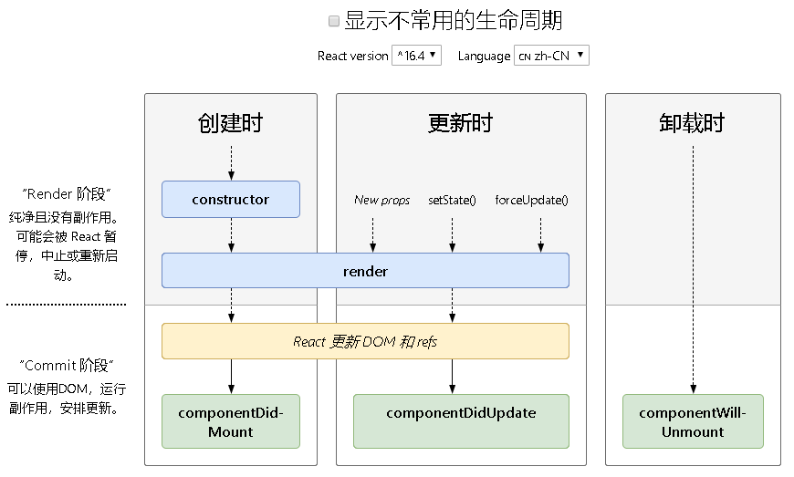
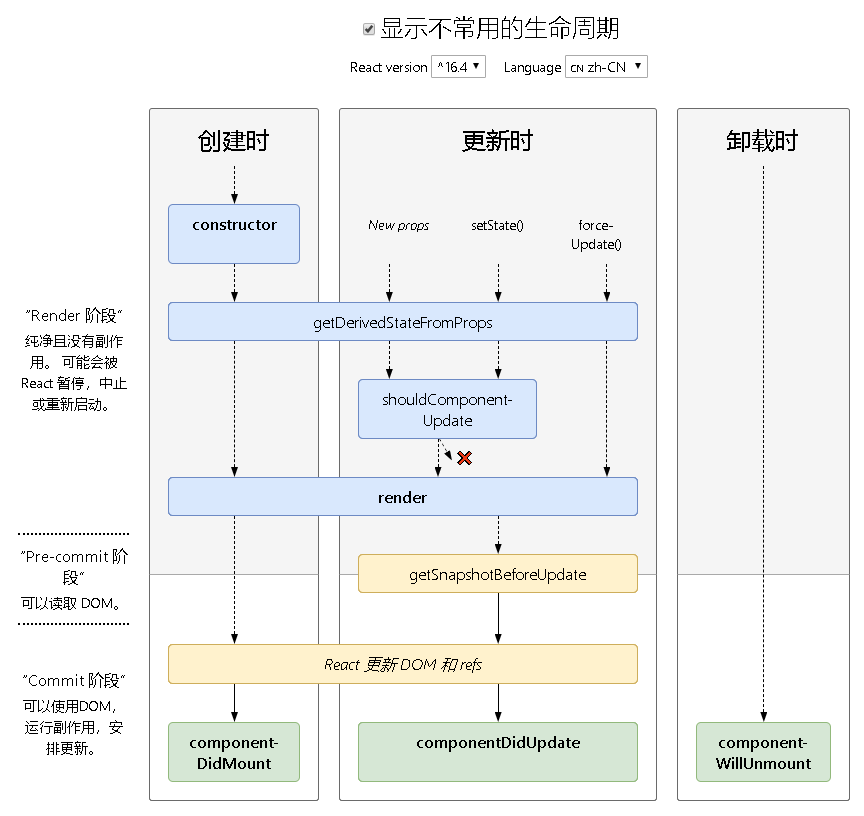
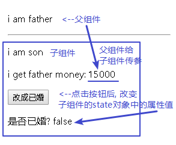

= react 生命周期函数
:toc:

---

== 生命周期函数
"生命周期"的概念:  每个组件的实例, 从创建, 到运行, 直到销毁, 在这个过程中, 会触发一系列事件, 这些事件, 就叫做组件的生命周期函数.

官方生命周期函数图
http://projects.wojtekmaj.pl/react-lifecycle-methods-diagram/

下面是常用的"生命周期函数图"(隐藏掉不常用的函数)

下面是完整显示的"生命周期函数图"

---

==== 1. 组件创建(挂载)阶段(Mounting)

特点:一辈子只执行一次.

当组件实例被创建并插入 DOM 中时，其生命周期调用顺序如下：

|===
|生命周期函数 |介绍

|constructor(props)
| 如果你组件中不需要state, 或不需要进行组件中方法的绑定, 组件中可以不写constructor()构造函数.

注意: 构造函数中, 里面第一句必须为 super(props), 否则在构造函数中, this.props 可能会出现未定义的 bug。 +

即: +
constructor(props) { +
  super(props); //第一句必须先调用父类的构造方法! +
  this.state = {}; +
}

|static getDerivedStateFromProps()
|

|render()
|组件被渲染出来.

render() 方法是 class 组件中唯一必须实现的方法。而其他方法都是可选的.

**render() 函数应该为纯函数**，这意味着在不修改组件 state 的情况下，每次调用时都返回相同的结果，**并且它不会直接与浏览器交互。** +
**如需与浏览器进行交互，请在 componentDidMount() 或其他生命周期方法中执行你的操作。**

|componentDidMount()
|**在组件被"挂载到页面之后", 自动执行** +
**AJAX请求一般放在componentDidMount()里面。**

|===

注意: 下述方法已废弃：

- UNSAFE_componentWillMount()

---

==== 2. 组件更新阶段(Updating props)

当组件的 props 或 state 发生变化时会触发更新。组件更新的生命周期调用顺序如下：

|===
|生命周期函数 |介绍

|static getDerivedStateFromProps()
|

|shouldComponentUpdate(nextProps, nextState, nextContext)
|每次父组件更新时, 会强迫子组件重新渲染. 如果你不想要子组件重新渲染, 可以给子组件添加 shouldComponentUpdate()生命周期函数. +
会**在组件的"私有state对象被更新之前", 自动执行.**

该函数如果返回true, 就表示你同意本组件需要被更新, 返回false就是你阻止本组件被更新.  +
即, 如果 shouldComponentUpdate() 返回 false，则不会调用 render()。

nextProps是父组件传给子组件的值，
nextState是数据更新之后值.

第二步当确认更新数据之后, componentWillUpdate()将要更新数据，第三步依旧是render(). 数据发生改变后,render()重新进行了渲染。第四步是componentDidUpdate()数据更新完成。

|render()
|

|getSnapshotBeforeUpdate()
|

|componentDidUpdate(prevProps, prevState, snapshot)
|**在组件的"私有state对象被更新完成之后", 自动执行.**

|===

注意: 下述方法已废弃：

- UNSAFE_componentWillUpdate()
- UNSAFE_componentWillReceiveProps()

---

==== 3. 组件卸载阶段(Unmounting)

当组件从 DOM 中移除时会调用如下方法：

|===
|生命周期函数 |介绍

|componentWillUnmount()
|当这个组件"即将被从页面中删除"的时候, 会自动执行.

|===

---

==== 3.2 从 DOM 中卸载组件 -> ReactDOM.unmountComponentAtNode(container)

如果组件被移除, 会返回 true，如果没有组件可被移除就返回 false。

---

==== 4. 错误处理

当渲染过程，生命周期，或子组件的构造函数中, 抛出错误时，会调用如下方法：

|===
|生命周期函数 |介绍

|static getDerivedStateFromError()
|

|componentDidCatch()
|

|===

---

==== 例子

父组件 Cpn_Father.jsx
[source, javascript]
....
import React from 'react';
import Cpn_Son from './Cpn_Son'

export default class Cpn_Father extends React.Component {
    constructor(props) {
        super(props)
        this.state = {
            money: 15000
        }
    }

    render() {
        return (
            <React.Fragment>

                
i am father 

                <Cpn_Son fatherMoney={this.state.money}/> {/*父组件将自己的money属性值, 传给子组件*/}
            </React.Fragment>
        );
    }
}
....

子组件 Cpn_Son.jsx
[source, javascript]
....
import React from 'react';

export default class Cpn_Son extends React.Component {
    constructor(props) {
        super(props)
        this.state = {
            isMarried: false //子组件有个私有属性"是否已婚"
        }

        this.fn_changeIsMarried_ToTrue = this.fn_changeIsMarried_ToTrue.bind(this)
    }

    render() {
        console.log('render() <-- 1-1. 组件被render出来');
        return (
            <React.Fragment>
                

                
i am son

                
i get father money: {this.props.fatherMoney}
 {/* 子组件在自己的props对象中, 拿到父组件传来的值. */}

                {/*按钮, 点击后, 将子组件的私有属性"是否已婚"改成true */}
                <input type="button" value={'改成已婚'} onClick={this.fn_changeIsMarried_ToTrue}/>
                
是否已婚? {this.state.isMarried.toString()}

            </React.Fragment>
        );
    }

    componentDidMount() {
        console.log('componentDidMount() <-- 1-2.在组件被"挂载到页面之后", 自动执行');
    }

    //----------------------------------------

    //每次父组件更新时, 会强迫子组件重新渲染. 如果你不想要子组件重新渲染, 可以给子组件添加 shouldComponentUpdate()生命周期函数.
    shouldComponentUpdate(nextProps, nextState, nextContext) {
        console.log('shouldComponentUpdate(nextProps, nextState, nextContext) <-- 2-1. 会在组件的"私有state对象被更新之前", 自动执行');
        // console.log("nextProps:", nextProps); //{fatherMoney: 15000}
        // console.log("nextState:", nextState); //{isMarried: true}
        // console.log("nextContext:", nextContext); //{}
        return true //返回true就表示你同意本组件需要被更新, 返回false就是你阻止本组件被更新.
    }

    componentDidUpdate(prevProps, prevState, snapshot) {
        console.log('componentDidUpdate(prevProps, prevState, snapshot) <-- 2-2.在组件的"私有state对象被更新完成之后", 自动执行');
        // console.log('prevProps:', prevProps);
        // console.log('prevState:', prevState);
        // console.log('snapshot:', snapshot); //undefined
    }

    //----------------------------------------
    componentWillUnmount() {
        console.log('已废弃! componentWillUnmount() <-- 3.当这个组件"即将被从页面中删除"的时候, 会自动执行')
    }

    //----------------------------------------

    fn_changeIsMarried_ToTrue() {
        this.setState({isMarried: true})
    }
}
....

页面刚刷新时, 会打印出:
....
render() <-- 1-1. 组件被render出来

componentDidMount() <-- 1-2.在组件被"挂载到页面之后", 自动执行
....

当点击按钮后, 会继续打印出:
....
shouldComponentUpdate(nextProps, nextState, nextContext) <-- 2-1. 会在组件的"私有state对象被更新之前", 自动执行

render() <-- 1-1. 组件被render出来

componentDidUpdate(prevProps, prevState, snapshot) <-- 2-2.在组件的"私有state对象被更新完成之后", 自动执行
....

---

