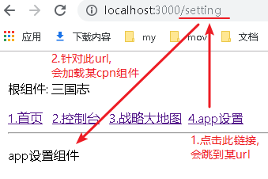

= react-router
:toc:

---

== 安装 yarn add @types/react-router-dom

|===
|安装 |说明

|yarn add react-router-dom
|注意, 安装ts版的@types/react-router-dom之前, 必须首先安装 js版的react-router-dom, 不装的话会报错

|yarn add @types/react-router-dom
|浏览器用

|react-router-native
|React Native原生用

|===

英文官网 https://reacttraining.com/react-router/web/guides/quick-start

react-router可以让根组件, 根据用户访问的地址, 动态地去挂载不同的子组件.

---

== 路由配置 的基本写法

[source, typescript]
----
import React from "react";
import { BrowserRouter as Router, Route, Link } from "react-router-dom";

//路由配置, 要写在根组件的render()函数里面. 伪代码如下:
render(){
    <Router> /*Router组件本身只是一个容器，真正的路由要通过Route组件定义。*/
        <Link to='/url地址'>板块名</Link> /*点击此超链接, 就跳到某url地址上.*/
        <Route path='/url地址' component={某Cpn组件}/>  /*Route组件定义了URL路径与组件的对应关系, 换句话说, 就在这里设置路由规则: 针对此url地址, 就路由到某组件页面.*/
    </Router>
}
----

例如, 我们来做这个效果: +

[source, typescript]
----
import React from 'react';
import {BrowserRouter as Router, Route, Link} from 'react-router-dom'

import Cpn_Console from './Cpn/Cpn_Console'
import Cpn_Map from './Cpn/Cpn_Map'
import Cpn_Setting from './Cpn/Cpn_Setting'

interface Itf_props {
}

interface Itf_state {
}

export default class Cpn_Father extends React.Component<Itf_props, Itf_state> {
    constructor(props: Itf_props) {
        super(props)
        this.state = {}
    }

    render() {
        return (
            <React.Fragment>
                
根组件: 三国志

                <Router>
                    {/* 注意:Link组件, 必须写在 <Router>组件内层, 否则会就报错 :You should not use <Link> outside a <Router> <--提示说should not 不应该写在外面!!*/}
                    <Link to={"/"}>1.首页</Link> {/*本link超链接, 会跳转到"/"这个url路径 */}
                    &nbsp; <Link to={"/console"}>2.控制台</Link> {/*本link超链接, 会跳转到"/console"这个url路径 */}
                    &nbsp; <Link to={"/map"}>3.战略大地图</Link>
                    &nbsp; <Link to={"/setting"}>4.app设置</Link>
                    

                    

                        <Route exact path='/' component={Cpn_Console}/> {/* 进行路由导航, 若前端访问的url地址是'/', 就导航到控制台组件页面*/}
                        <Route path='/console' component={Cpn_Console}/>
                        <Route path='/map' component={Cpn_Map}/>
                        <Route path='/setting' component={Cpn_Setting}/>
                    

                </Router>
            </React.Fragment>
        )
    }
}
----

---

