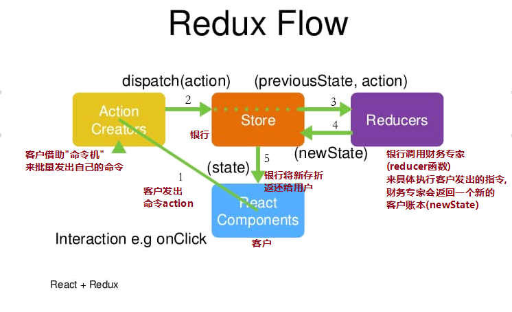
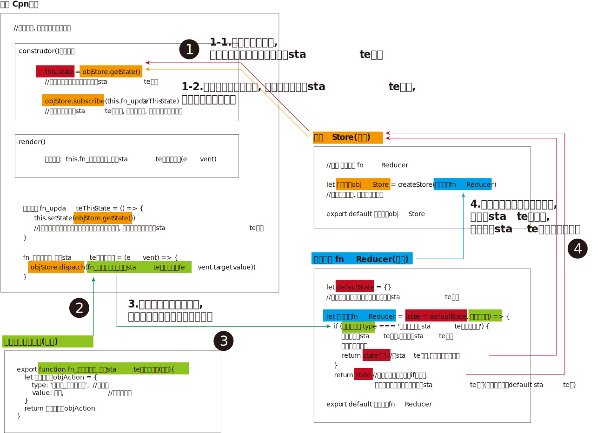
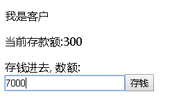

= reudx
:toc:
---

== 安装redux
....
npm install --save redux react-redux redux-devtools
....

---

== 用 TypeScript 写 redux

http://cn.redux.js.org/docs/advanced/UsageWithTypeScript.html

---

== reudx 流程

整个工作流程：

==== 1. Reducer函数 (财务专家)

客户(组件)的state对象, 是托管在财务专家那里的.

客户如果想更新自己的state, 就要通过dispatch()方法, 向银行发出命令书, Store(银行)会自动调用Reducer函数(银行里的财务专家)来处理客户发出的指令.

Reducer函数接收两个参数: (1)当前State(老的客户账本) 和(2)收到的Action(客户的新指令).

注意, Reducer函数在修改state对象中的属性值时, 不能直接修改原始的state对象, 必须先深拷贝一份后, 来修改state副本. 然后再把这本副本返回.  +
另外, 修改时, 就不需要使用this.setState()这个方法了, 而是直接用JavaScript原生的方式来操作就行了.

伪代码如下:
[source, typescript]
....
let 财务专家函数Reducer = (state = defaultState, 命令书对象) => {
    if (命令书对象.type === ...) {
        将本state深拷贝一份为newState
        将objAction.value的值赋值给 newState对象中的某属性
        返回 newState对象
    }
    如果不执行if语句, 也要返回一个state对象, 这是本财务专家函数的使命, 它必须返回一个state对象, 无论是修改前的(defaultState), 还是修改后的(newState)
}
....

reducer(财务专家)执行完客户的要求后, 会返回新的State(新的客户账本).

---

==== 2. Store对象 (银行)

整个应用只能有一个Store。

银行实例, 是以财务专家为输入参数, 创建出来的:
[source, typescript]
....
let objStore = createStore(fnReducer)
....

财务专家一旦修改完客户的账本, 即State(客户账本)一旦有变化，Store(银行)就会调用监听函数，来更新View(客户手里的老账本)。

---

==== 3. Action Creator函数 (创建命令书的工厂)

该函数 专门用来生产制造命令书对象(objAction). 并返回该命令书对象.

一个命令书对象, 也只负责表达客户的一条指令; 换言之, 客户有多少条不同的指令要求, 就要创建多少条不同的命令书对象.

命令书对象, 形如:
[source, typescript]
....
let objAction ={
    type:'本命令的名字', //比如叫"涨薪"
    value:新值, //比如, 涨薪的幅度
}
....

一个命令书制造函数, 只负责创建特定命令的一个命令书对象. 即, 一个模具(制造函数), 只生产一个道具(命令对象).

---

==== 4. 前端react组件页面 (客户)

客户, 会导入objStore(银行), 和fn_CreateObjAction(命令书制作工厂).

客户通过以下函数,来发出命令书:
[source, typescript]
....
objStore银行实例.dispatch(fn创建某条命令书的函数(newValue))
....

要监听财务专家已经修改完state, 可以用这个函数: 银行实例.subscribe(回调函数), 来监听:
[source, typescript]
....
银行实例objStore.subscribe(this.回调函数fn_updateThisState)

回调函数fn_updateThisState = () => {
        this.setState(objStore.getState())
        //将从银行实例拿到的财务专家手里的新账本, 重新整个替换掉给本组件的state对象.
    }
....

上面的操作, 即, 如果的确财务专家修改了他那里保存的state对象, 本客户就要执行一个同步更新的操作, 这个同步更新的操作函数, 就写在Store.subscribe(fn同步更新) 的参数里面. +
所谓"同步更新"操作, 就是把财务专家那里的state对象, 整体赋值给本客户这里保存的state对象. 就是通过 this.setState(objStore.getState()) 方法来做.

总结: 可以看到，在整个流程中数据都是单向流动的，这种方式保证了流程的清晰。

redux详细流程:

---

== 第一个案例

效果: +

项目目录结构如下:
....
|-- undefined
    |-- package.json
    |-- server.js                   //node.js服务器代码

    |-- pages
    |   |-- Cpn_User.jsx            //客户组件
    |   |-- index.jsx               //react前端首页

    |-- src
    |   |-- myFunc.js

    |-- static
    |   |-- +arr所有柯林斯单词.json
    |   |-- +json所有柯林斯单词.json
    |   |-- css
    |       |-- css.js

    |-- store
        |-- fnCreateObjAction.js    //命令书工厂
        |-- fnReducer.js            //财务专家函数
        |-- objStore.js             //银行对象
....

==== fnReducer.js 财务专家

[source, typescript]
....
//财务专家

let defaultState = { //最原始的客户的老账本
    money: 300, //当前的总存款额
    newSave: 0, //新存入的款项
}

/*
1. Reducer 是一个函数，它接受 Action(客户下达的指令书) 和当前 State(客户托管在财务专家这里的state对象) 作为参数，并返回一个新的 State。
 */
let fnReducer = (state = defaultState, objAction) => { //state是上一次老的state数据, action是用户传递过来的指令obj内容
    if (objAction.type === '命令书_更新money') { //如果客户的指令是要修改他账户上的money属性的话...
        let newState = JSON.parse(JSON.stringify(state)) //由于state对象不能直接修改, 所以必须先把老的state对象(老的客户账本)深拷贝一份, 对后者来做修改, 再返回回去.
        newState.money += parseInt(objAction.value) //将客户在命令书中附带的value值, 赋值给客户账户上的money属性.
        return newState //把newState对象返回回去, 别忘了这句!
        // 那么这个newState被返回给了谁呢? 其实会返回给 store/objStore.js文件, 即返回给了银行实例对象.
    }

    if (objAction.type === '命令书_更新newSave') {
        let newState = JSON.parse(JSON.stringify(state))
        newState.newSave = objAction.value
        return newState
    }

    return state
    /*
    2. 记住!! 无论有没有执行上面的返回一个newState的操作, 本fnReducer函数永远要返回一个state对象.
    即, 如果不进入上面的if语句的话, 这里就返回老的state了! 即 返回的是default state对象.
     */
}

export default fnReducer
....

---

==== objStore.js 银行

[source, typescript]
....
// 银行

import {createStore} from 'redux'
import fnReducer from './fnReducer.js'

let objStore = createStore(fnReducer)  //以财务专家(fnReducer)为基石, 创建一个银行实例对象(objStore)
/*
3. 把引进的reducer函数,传给store的构造函数, 用来初始化store实例.
客户会发出的命令书, 是使用store.dispach(objAction)方法发出的,
store.dispatch()方法会触发 银行的财务专家Reducer函数 的自动执行。
为此，Store银行 需要知道 Reducer 函数，做法就是在生成本 Store 的时候，将 财务专家Reducer 传入createStore方法。

Store 就是保存客户的state数据的地方，你可以把它看成一个容器。整个应用只能有一个 Store。
 */

export default objStore
....

---

==== fnCreateObjAction.js 命令书工厂

[source, typescript]
....
//命令书制造工厂

/*
Action对象(即命令书), 用来描述客户想要银行操作的事情。
改变 客户的State对象的唯一办法，就是使用 Action命令书。
Action命令书会携带着客户想要更改的数据(value字段) 到 objStore银行中。
 */

export function fn_创建命令书_更新money(valueNew) {
    let objAction = { //命令书, 是一个object对象!
        type: '命令书_更新money', //type属性, 表示客户下达的指令的名称. 这里, 本type类型表明专门是用来"更新money".
        value: valueNew, //value属性, 存放着客户想要对state中的某属性更新的新值.
    }
    return objAction
}

export function fn_创建命令书_更新newSave(valueNew) {
    let objAction = {
        type: '命令书_更新newSave',
        value: valueNew,
    }
    return objAction
}
....

---

==== Cpn_User.jsx 客户组件

[source, typescript]
....
//银行的客户

import React from 'react';
import objStore from '../store/objStore.js' //4.导入银行(银行会自动携带财务专家一起进来)

import * as moduleAction from '../store/fnCreateObjAction.js'
/*
8.导入命令表制造机
本句的意思是, 将fnCreateObjAction.js模块中导出的所有变量, 都挂载在本组件中的一个moduleAction对象身上.
按es6的规范 import * as obj from "xxx" 会将 "xxx" 中所有 export 导出的内容组合成一个对象返回。.
*/

export default class Cpn_User extends React.Component {
    constructor(props) {
        super(props)

        // this.fn_updateThisState = this.fn_updateThisState.bind(this)

        this.state = objStore.getState()
        /*
        5. 注意! 我们本组件的state对象里的属性,没有写在本组件文件中,
        而是写在了 fnReducer.js文件(财务专家)里了, 由财务专家托管着.
        由于objStore.js(银行)是以财务专家为基石, 创建出来的(捆绑着财务专家),
        所以银行(Store对象)也相当于就拥有着本组件的state对象里的内容了.

        Store对象(银行)中包含着state对象里的所有数据。
        如果想得到某个时点的数据，就要对 Store(银行) 生成快照。
        这种时点的数据集合，就叫做 State。
        当前时刻的 State，可以通过store.getState()拿到。
        本句, 此时 objStore.getState()赋值给本组件的state对象的值, 其实是 default state对象!

        换言之, 我们其实有两个state对象存在,
        一个是本组件的state对象, 一个是总财务专家那里的state对象.
        本组件的state对象, 永远要从财务专家那里的state对象中, 来同步更新最新数据!
        就好比, 财务专家那里的是最新的getHub上的npm库,
        本组件的是用户下载到个人电脑的npm库,
        本组件的库永远要紧随gihub上的最新库版本才行!
         */

        objStore.subscribe(this.fn_updateThisState)
        /*
        意思是, 只要store中的state(对象)数据被改变(更新)了,
        则它接收的回调函数(即fn_updateThisState),就会立刻执行.
        注意这句话的位置! 必须写在上面的绑定了this的语句之后! 不能写在它前面! 否则会报错.

        Store 允许使用store.subscribe()方法设置监听函数，
        一旦财务专家reducer那里保管的 State 发生了变化，就自动执行括号中的监听函数。
         */

    }

    render() {
        return (
            <React.Fragment>
                
我是客户

                
当前存款额:{this.state.money}

                
存钱进去, 数额:
                    <input type="text"
                           value={this.state.newSave}
                           onChange={() => {
                               this.fn_发送命令书_更新newSave(event)
                           }}/>

                    <input
                        type="button"
                        value={'存钱'}
                        onClick={() => {
                            this.fn_发送命令书_更新money(this.state.newSave)
                        }}/>
                

            </React.Fragment>
        );
    }

    //10. 将从财务专家哪里拿到的最新的state对象, 赋值给本组件的state对象. 本组件就会重新渲染.
    fn_updateThisState = () => {
        this.setState(objStore.getState())
        //objStore.getState()表示, 从银行中拿到财务专家修改后的客户的新账本.
    }

    //发送指令书, 要求银行(的财务专家), 将客户账本(state对象)中的money属性, 增加款项.
    fn_发送命令书_更新money = (valueNew) => {
        objStore.dispatch(moduleAction.fn_创建命令书_更新money(valueNew))
    }
    /*
    客户使用store.dispatch(objAction)方法, 来发出指令书.
    换言之, View视图不能直接操作state对象, 它只能通过发出Action命令书, 来传给Store银行,
    由Store银行中的财务专家Reducer函数, 来帮你执行更新state对象的操作事情.

    store.dispatch()方法, 会触发财务专家Reducer函数 的自动执行。

     本View视图再通过 Store.subscribe()函数,来监听财务专家(Reducer函数)更新完state对象后, 返回的新state对象!
     监听到改变后, 就再执行一个操作, 把new state对象, 替换掉自己的老的state对象. 于是本View视图就会被重新渲染.
     */

    fn_发送命令书_更新newSave = (event) => {
        objStore.dispatch(moduleAction.fn_创建命令书_更新newSave(event.target.value))
    }
}
....

---
