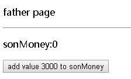
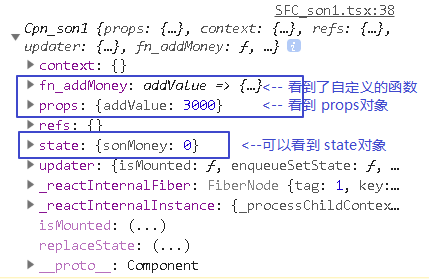

= typescript 在 facebook的 react中的使用
:toc:

---

== github上的教程

强烈推荐 React & Redux in TypeScript - Static Typing Guide +
https://github.com/piotrwitek/react-redux-typescript-guide#installation

---

== 安装模块
....
npm i -D typescript @types/react @types/react-dom @types/react-redux
....

---

== 注意点

==== 类型断言要用 as, 不要用 <> 的写法

原因是 jsx中用到大量的html标签的<> , 所以会和typescript中的用<>来类型断言的语法起冲突. 因此, 我们只能用另一种ts的类型断言写法: as.
[source, typescript]
....
//let foo = <foo>bar; //已被禁止使用!
let foo = bar as foo;  //只能使用这种类型断言写法!
....

---

== 无状态的函数组件 FC (Function Components) -> React.FC<Itf_props>

类型是:
[source, typescript]
....
React.FC<Props> | React.FunctionComponent<Props>
....

"FC"类型, 以前被称为"SFC"类型, 不过SFC现在已经被废弃了.

This PR renames "React.SFC" and "React.StatelessComponent" to *"React.FunctionComponent"*, while introducing deprecated aliases for the old names.

详情可见 https://stackoverflow.com/questions/53885993/react-16-7-react-sfc-is-now-deprecated

例子: 父组件来给子组件传参.

|===
|组件 |类型

|子组件(函数组件)
|React.FC<Itf_props>

|父组件(类组件)
|React.Component<Itf_props, Itf_state>
|===

子组件(函数组件)
[source, typescript]
....
import * as React from 'react';

interface Itf_props {
    fatherName: string,
    fatherAge: number,
    fnFatherInfo: () => string
}

//函数组件, 类型是 FC<Itf_props>
export let SFC_son1: React.FC<Itf_props> = (props: Itf_props) => {
    return (
        <React.Fragment>
            
{props.fatherName}

            
{props.fatherAge}

            <input type="button"
                   value="run fnFatherInfo"
                   onClick={() => {
                       console.log(props.fnFatherInfo());
                   }}/>
        </React.Fragment>
    )
}
....

父组件
[source, typescript]
....
import React from 'react';
import {SFC_son1} from './SFC_son1'

interface Itf_props {
}

interface Itf_state {
    fatherName: string,
    fatherAge: number,
}

export class Cpn_Father extends React.Component<Itf_props, Itf_state> {
    constructor(props: Itf_props) {
        super(props)
        this.state = {
            fatherName: 'zrx',
            fatherAge: 88,
        }
    }

    render() {
        return (
            <React.Fragment>
                
father page

                

                {/*下面, 父组件给子组件传值*/}
                <SFC_son1 fatherName={'zrx'} fatherAge={77} fnFatherInfo={this.fnFatherInfo}/>

            </React.Fragment>
        )
    }

    fnFatherInfo = () => {
        return `info => fatherName:${this.state.fatherName}, fatherAge:${this.state.fatherAge}`
    }
}

export default Cpn_Father;
....

---

== 类组件 (Class Components) -> React.Component<itfProps, itfState>

效果如下, 点击按钮, 就给子组件的账户打钱进去,钱是父组件给的 : +

[source, typescript]
....
import React from 'react';

interface Itf_props {
    addValue: number, //父组件给子组件的账户汇钱
}

interface Itf_state {
    sonMoney: number,
}

//类组件的ts类型是: React.Component<Itf_props, Itf_state>
export default class Cpn_son1 extends React.Component<Itf_props, Itf_state> {
    constructor(props: Itf_props) {
        super(props)
        this.state = {
            sonMoney: 0,
        }
    }

    static defaultProps = { //给本组件设置一个默认的props, 注意:它是类的"静态属性"!
        addValue: 3000
    }

    render() {
        return (
            <React.Fragment>
                
sonMoney:{this.state.sonMoney}

                <input type="button"
                       value={`add value ${this.props.addValue} to sonMoney`}
                       onClick={() => {
                           this.fn_addMoney(this.props.addValue)
                       }}
                />
            </React.Fragment>
        )
    }

    componentDidMount(): void {
        console.log(this); //把本组件的this 打印出来看看到底是什么内容?
    }

    fn_addMoney = (addValue: number): void => {
        this.setState({sonMoney: this.state.sonMoney + addValue})
    }
}
....

类组件的this, 打印出来是什么内容? +

react-redux-typescript-guide 教程的"类组件"写法的案例如下:
[source, typescript]
....
import * as React from 'react';

type Props = {
  label: string;
};

type State = {
  count: number;
};

export class ClassCounter extends React.Component<Props, State> {
  readonly state: State = { //state对象没有写在constructor函数中?
  //并且把state对象设置为只读的了, 即不能通过直接赋值来修改, 必须要通过 this.setState()方法才能修改.
    count: 0,
  };

  handleIncrement = () => {
    this.setState({ count: this.state.count + 1 });
  };

  render() {
    const { handleIncrement } = this;  //把this解包了! 上面我们已经知道this的内容了, 里面的确有自定义的函数被挂靠在this上.
    const { label } = this.props; //解包props对象
    const { count } = this.state; //解包state对象

    return (
      

        
          {label}: {count}
        
        <button type="button" onClick={handleIncrement}>
          {`Increment`}
        </button>
      

    );
  }
}
....

//官方教程的例子如下, 让父组件真的给子组件传值了, 而不是只让子组件用自己定义的默认props中的值:
[source, typescript]
....
//子组件的state对象

this.state = {
    addValue: this.props.addValue //子组件的addValue属性的初始值, 是由父组件传进来赋值的
}
....

另外, 关于双向绑定, "输入文本框"中的事件类型为-> event:ChangeEvent<HTMLInputElement>

[source, typescript]
....
<input type="text"
   value={this.state.addValue}
   onChange={(event:ChangeEvent<HTMLInputElement>) => { //注意, event的ts类型为: ChangeEvent<HTMLInputElement>
       this.fn_updateAddMoney(event) //双向绑定
   }}
/>
....

---

== React.ComponentType<Props>

Type representing union of (React.FC | React.Component) - used in HOC +
类型 React.Component<Props> 是"类组件"与"函数组件"的组合.

---

==== 一个 HTML 标签 <foo> 被标记为 JSX.IntrinsicElements.foo 类型

React 既能渲染 HTML 标签（strings）, 也能渲染 React 组件（classes）。

一个 HTML 标签 <foo> 被标记为 JSX.IntrinsicElements.foo 类型。

....
intrinsic  /ɪn'trɪnsɪk, -zɪk/

ADJ If something has intrinsic value or intrinsic interest, it is valuable or interesting because of its basic nature or character, and not because of its connection with other things. 内在的; 本质的
Flexibility is intrinsic to creative management. 灵活变通是创新管理的基本特质。

ADV 固有地
Sometimes I wonder if people are intrinsically evil.
 有时我怀疑人是否生来就是邪恶的。
....

---

==== 可以将一个变量, 标记成某组件类型, 它就不能被赋值为其他类型的值了.

比如:
[source, typescript]
....
let insSon1: React.ReactElement<Cpn_Son> = <Cpn_Son/> //insSon1是个"组件类型"的变量.
insSon1 = 123 //报错

//上面的变量, 可以直接被父组件渲染, 用法如下:
render() { //这是父组件中的render函数
    return (
        <React.Fragment>
            {insSon1} //可以直接使用组件变量
        </React.Fragment>
    )
}
....

---

== style(css样式的类型) -> React.CSSProperties

[source, typescript]
....
import * as React from 'react';

interface itf_props {
}

//函数组件, 类型是 FC<itf_props>
export let SFC_son1: React.FC<itf_props> = (props: itf_props) => {
    return (
        <React.Fragment>

            
 {/*使用css样式*/}
                son page...
            

        </React.Fragment>
    )
}

//css样式的ts类型是: React.CSSProperties
let objSstyle:React.CSSProperties = {backgroundColor:'#FFB273'}
....

---

