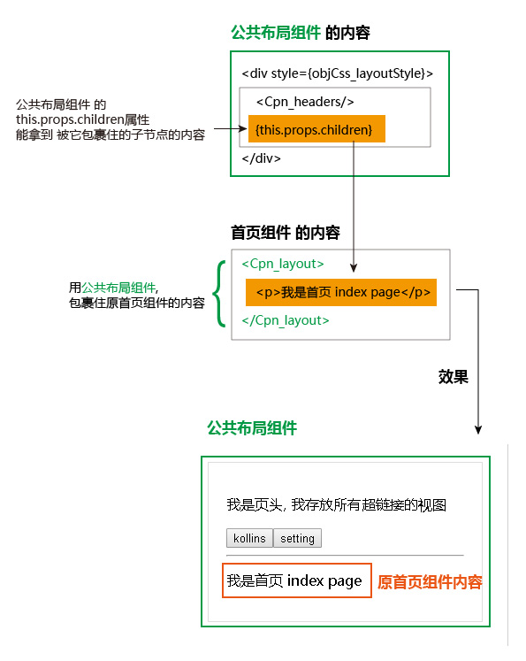
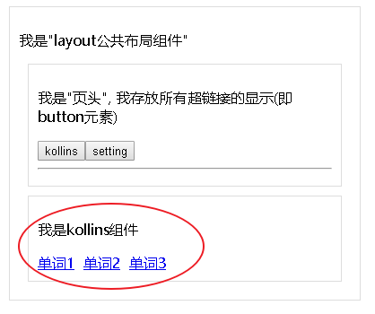
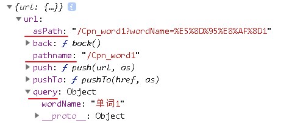
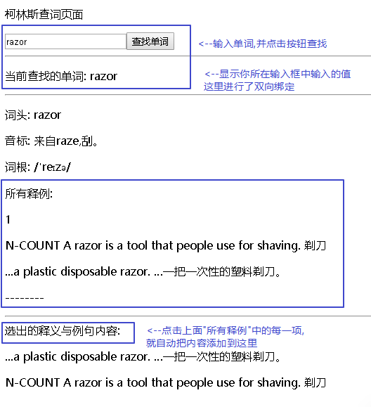

= Next :  React 服务端渲染框架
:toc:
---

== 安装

英文官方文档 https://github.com/zeit/next.js

|===
|安装库 |说明

|npm init -y
|初始化 package.json

|npm install --save next react react-dom
|安装next库

|===

将下面脚本添加到 package.json 中:
[source, typescript]
....
{
  "scripts": {
    "dev": "next",
    "build": "next build",
    "start": "next start"
  }
}
....

注意: 如果package.json文件中已经存在某个字段, 比如 "start"已经存在的话, 就把它整个替换掉, 而不要用 // 把老的字段注释掉! 因为package.json不支持注释语法! 会报错.

---

== 第一个例子: 显示首页 -> 运行: npm run dev

在你的项目根目录下, 创建以下子文件夹 (注意, 目录名必须如下一模一样! 不要改名字, 否则报错):

|===
|目录 |说明

|pages //注意:是复数有s!
|pages目录中的每个.js 文件, 将变成一个路由，自动被处理和渲染。

pages目录就像Web服务器的根目录一样, 通过自然的目录 /URL路径, 你可以访问到 pages 目录下的组件. 就像Linux文件系统一样, URL中的PATH, 和文件系统的路径, 是一一对应的.

|static
|该目录用作静态文件服务.

注意：不要去自定义静态文件夹的名字，只能叫static ，因为只有这个名字 Next.js 才会把它当作静态资源。

|===

目录结构如下:
....
|-- undefined
    |-- package-lock.json
    |-- package.json
    |-- .next

    |-- pages //该目录, 会作为相当于服务器的根目录来用. 注意, 该目录必须叫'pages', 不能改名!
        |-- index.jsx //每一个组件, 就是每一个页面

    |-- static
        |-- json.json
....

在pages目录下, 创建一个名称为 index.jsx 的文件(**注意:首页文件名字必须叫index,不能改成其他名字, 否则next框架会找不到首页! **), 内容如下:

[source, typescript]
....
import React from 'react';

//注意: 本组件会构成首页的内容. 但由于首页文件名必须叫"index", 所以这里组件名, 定义成任何名字(Cpn_index 或 Index), 其实都无所谓了. 只要你这个文件的名字是"index"即可.
export default class Index extends React.Component {
    constructor(props) {
        super(props)
        this.state = {}
    }

    render() {
        return (
            <React.Fragment>
                
index page

            </React.Fragment>
        );
    }
}
....

如何运行程序呢? 输入命令
....
npm run dev
....

然后打开 http://localhost:3000 , 就可看到首页页面.

next框架 会自动帮我们热更新, 自动打包编译 (使用 webpack 和 babel), 所以不需要你再安装什么 supervisor模块的!

---

== 超链接

现在, 在pages目录下再创建两个jsx文件: Cpn_kollins.jsx 和 Cpn_setting.jsx, 这两个文件会作为首页上的超链接来用. 即, 我们的index.jsx首页, 会超链接这两个组件文件.

内容为:
[source, typescript]
....
//超链接所指向的各个组件页面的内容

import React from 'react';

export default class Cpn_kollins extends React.Component {
    constructor(props) {
        super(props)
        this.state = {}
    }

    render() {
        return (
            <React.Fragment>
                
kollins page
  {/*这里改一下文字即可*/}
            </React.Fragment>
        );
    }
}
....

现在来修改 首页index.jsx的内容,如下. 注意:为了能运行成功, 你实际运行是, 要把注释都删掉, 否则可能会报错. 因为注释有可能会干扰代码的运行.

[source, typescript]
....
//首页文件 pages/index_old2.jsx

import React from 'react';
import Link from 'next/link' //要实现超链接功能, 必须引入next提供的Link组件来用, 而不能直接使用html原生的<a>标签.

export default class Index extends React.Component {
    constructor(props) {
        super(props)
        this.state = {}
    }

    render() {
        return (
            <React.Fragment>
                
index page

                {/* 用Link组件, 来包裹住你的超链接文字. 然后 href属性, 也写在Link组件上, 而不要写在<a>标签上! */}
                <Link href={'./Cpn_kollins'}> {/*注意, 虽然我们的文件叫Cpn_kollins.jsx, 但这里引用该文件时, 千万不要带上扩展名! 即不要写成 <Link href={'./Cpn_kollins.jsx'}> 这样会报错, 会找不到该文件! */}
                    <a>kollins</a> {/*这里用
也可以,用<a>是为了让该文字显示出超链接的外貌而已.*/}
                </Link>

                <Link href={'./Cpn_setting'}>
                    <a>setting</a>
                </Link>

            </React.Fragment>
        );
    }
}
....

再次访问 http://localhost:3000/

当你点击后退按钮的时候, Next.js 会把你带回了Index页面, 这个过程完全是客户端实现的; next/link 为你处理了所有 location.history相关的事情. 你甚至不需要编写任意一行客户端路由代码.

---

==== + 获取json -> 使用按钮, 进行链接, 并用axios读取json文件

[source, typescript]
....
// pages/index_old2.jsx

import React from 'react';
import Link from 'next/link'
import axios from 'axios'

export default class Index extends React.Component {
    constructor(props) {
        super(props)
        this.state = {}
    }

    render() {
        return (
            <React.Fragment>
                
index page

                <Link href={'./Cpn_kollins'}>
                    <input type="button" value={'kollins'}
                           onClick={this.fn_printKollins}/> {/*用按钮来作为超链接, 并且点击事件,依然能生效!*/}
                </Link>

                <Link href={'./Cpn_setting'}>
                    <input type="button" value={'setting'}
                           onClick={this.fn_getJson}/> {/*这里点击按钮会做两件事: 1.跳转到setting页面, 2.读取json文件*/}
                </Link>

            </React.Fragment>
        );
    }

    fn_printKollins = () => {
        console.log('kollins');
    }

    fn_getJson = () => {
        let urlJson = '../static/json.json'

        axios.get(urlJson)
            .then(res => {
                console.log(res);
                let objJson = res.data //真正的json对象在res的data属性中
            })
            .catch(err => {
                console.log(err);
            })
    }
}
....

事实上, **你可以在Link中放置任何你的自定义React组件**, 甚至是一个div元素.放在Link中的组件的唯一要求是, 它能够接受一个 onClick 属性.

下面, 我们将获取到的json, 显示在页面上:
[source, typescript]
....
import React from 'react';
import ReactDOM from 'react-dom';
import axios from 'axios'
import fetch from 'isomorphic-unfetch'

export default class Cpn_Index extends React.Component {
    constructor(props) {
        super(props)
        this.state = {
            urlJson_local: '../static/json.json', //本地json文件地址
            objJsonData: '' //用来存放读取json文件后拿到的json对象
        }
    }

    render() {
        return (
            <React.Fragment>
                
本页, 点击按钮后, 获取本地json文件, 并转成json字符串后显示在页面上

                <input type="button" value="get json"
                       onClick={() => {
                           this.fn_getJson(this.state.urlJson_local) //获取json
                       }}/>
                
{JSON.stringify(this.state.objJsonData)}

            </React.Fragment>
        )
    }

    fn_getJson = (urlJson) => {
        axios.get(urlJson)
            .then(res => {
                console.log(res.data);
                this.setState({objJsonData: res.data}) //
            })
            .catch(err => {
                console.log(err)
            })
    }
}
....

---

== static async getInitialProps() -> 返回一个默认的props对象

从远程数据源, 获取数据 -> getInitialProps()

我们通常需要从远程数据源, 获取数据. Next.js 提供了一个 async 函数 getInitialProps(), 来达到获取数据的目的.

我们可以使用 isomorphic-unfetch库来获取ajax数据,  它是一个浏览器 fetch 的简单实现, 并且可以同时工作在客户端和服务器端环境中. +
**这类能够同时在客户端和服务器运行的应用程序, 我们称之为"同构应用程序". **

isomorphic-unfetch 官网: +
https://www.npmjs.com/package/isomorphic-fetch

安装
....
npm install --save isomorphic-fetch es6-promise
....

下面, 我们用 getInitialProps() 来获取远程json:

[source, typescript]
....
import React from 'react';
import ReactDOM from 'react-dom';
import axios from 'axios'
import fetch from 'isomorphic-unfetch' // isomorphic-unfetch库是一个浏览器 fetch 的简单实现, 可以同时工作在客户端和服务器端环境中.

let urlJson = 'http://api.tvmaze.com/search/shows?q=batman' //远程跨域json文件地址
/*
下面我们会用getInitialProps()来获取上面这个json地址的json文件,
但由于getInitialProps()是个本组件类的静态方法, 无法调用实例属性(即无法调用到this.state对象中的属性),
所以, 我们不给你把json地址写在this.state中, 只能写在本组件类的外面, 变成一个模块内的"全局变量"了.
*/

export default class Cpn_Index extends React.Component {
    constructor(props) {
        super(props)
        this.state = {}
    }

    render() {
        return (
            <React.Fragment>
                
本页面,会用getInitialProps()方法来获取远程json, 返回一个props对象

                
{JSON.stringify(this.props.objJsonData)}

            </React.Fragment>
        )
    }

    static async getInitialProps() { //这个是异步的本组件静态方法!
        const res = await fetch(urlJson)
        const data = await res.json()
        console.log(data);
        return {objJsonData: data} //getInitialProps()方法必须返回一个对象, 该对象就是props对象! 所以里面的属性, 也就是props对象的属性.
    }
}

....

一个页面组件只要把访问外部资源的代码(比如获取json的操作), 放在 getInitialProps() 中就足够，其余的不用管，Next.js 自然会在服务器端或者浏览器端, **调用 getInitialProps() 来获取外部资源，并把外部资源以 props 的方式, 传递给页面组件。**

getInitialProps() 是 Next.js 对代表页面的 React 组件生命周期的扩充。 +
 React 组件的生命周期函数, 缺乏对异步操作的支持，所以 Next.js 干脆定义出一个新的生命周期函数 getInitialProps()，** 在调用 React 原生的所有生命周期函数之前，Next.js 会调用 getInitialProps() 来获取数据，然后把获得数据作为 props 来启动 React 组件的原生生命周期过程。**

getInitialProps()这个生命周期函数没有侵入 React 原生生命周期函数，以前的 React 组件该怎么写还是怎么写.

如果 getInitialProps 中有调用 API 的异步操作，只在服务器端做一次，浏览器端就不用做了。

---

== ++ 前后端结合! next.js和 express的结合 -> 后端用express, 前端用next, 并且共享同一个ip地址

在项目根目录下, 创建express服务器, 文件名叫 server.js 内容如下: +
代码有点地方看不懂没关系, 照抄就可!

**首先, 把package.json中的 scripts字段的内容改成**:

[source, typescript]
....
"scripts": {
  "dev": "node server.js",
  "build": "next build",
  "start": "NODE_ENV=production node server.js"
},
....

本案例的最终项目结构目录如下:
....
|-- undefined
    |-- package-lock.json
    |-- package.json
    |-- server.js //express服务器 后端代码

    |-- pages //该目录会作为服务器根目录. 里面的内容是react组件
    |   |-- Cpn_Daughter.jsx
    |   |-- Cpn_Son.jsx
    |   |-- index.jsx //首页组件
    |-- static
        |-- json.json
        |-- txt.txt
....

下面首先使用express做后端, 但我的试验结果, 它对表单提交的查询字符串有bug, 表单提交给某一存在的页面时, 会该页面显示不出来, 丢失??? 比如, 你的表单提交给 http://localhost:3000/Cpn_Daughter?name_readFile=value_readFile, 虽然Cpn_Daughter该页面存在, 但表单提交后, Cpn_Daughter页面却显示不出来??? 原因未知. 所以推荐下面第二种官方的不用express的方法. 官方的方法,不会有这个bug. Cpn_Daughter组件页面依然能够显示出来

==== express的方法, 不太推荐

在项目根目录下, 创建express服务器文件: server.js
[source, typescript]
....
//server.js

const express = require('express')
const next = require('next')

const dev = process.env.NODE_ENV !== 'production'
const app = next({dev})
const handle = app.getRequestHandler()

app.prepare()
    .then(() => {
        const server = express()

        server.get('/Cpn_Son', (req, res) => { //注意, url路径必须与组件名字完全一致! 否则会找不到组件!
            const actualPage = '/Cpn_Son.jsx'
            app.render(req, res, actualPage)
            console.log(req.query); //这是express的获取get请求中内容的方法. 可以拿到get请求的内容, 但是无法显示Cpn_Son页面
        })

        server.get('/Cpn_Daughter', (req, res) => {
            const actualPage = '/Cpn_Daughter.jsx'
            app.render(req, res, actualPage)
            console.log(req.query);
        })

        server.get('*', (req, res) => {
            return handle(req, res)
        })

        server.listen(3000, (err) => {
            if (err) throw err
            console.log('> Ready on http://localhost:3000')
        })
    })
    .catch((ex) => {
        console.error(ex.stack)
        process.exit(1)
    })
....

然后运行 npm run dev
访问下面几个url地址, 就能看到效果: +
http://localhost:3000 +
http://localhost:3000/Cpn_Son +
http://localhost:3000/Cpn_Daughter

本知识点 教材上的说明见:  +
https://github.com/developerworks/learnnextjs-cn-docs/blob/master/06.server-side-support-for-clean-urls.md

---

==== 官方文档提供的方法, 推荐!

首先, 前端代码为:
[source, html]
....
<form action="/Cpn_Daughter" method={'get'}> //表单提交给"/Cpn_Daughter"这个地址
    <input type="submit" name={'name_readFile'} value={'value_readFile'}/>
    <input type="submit" name={'name_writeFile'} value={'value_writeFile'}/>
</form>
....

后端代码为: +
下面是推荐使用的官方文档的方法, 似乎没有使用express? 但却没有bug:

从 if...else...语句可以看出, 逻辑是这样的: 当后端服务器检测到用户请求的url是 '/Cpn_Son' 时, 我们就把 next_proj/pages/Cpn_Son.jsx 这个地址的组件, 渲染出来并发送回去. +
同理, 当服务器检测到用户请求的url是 '/Cpn_Daughter' 时, 我们就把 next_proj/pages/Cpn_Daughter.jsx 这个地址的组件, 渲染出来并发送回去.

[source, typescript]
....
const {createServer} = require('http')
const {parse} = require('url')
const next = require('next')
const url = require('url')

const dev = process.env.NODE_ENV !== 'production'
const app = next({dev})
const handle = app.getRequestHandler()

app.prepare().then(() => {
    createServer((req, res) => {
        // Be sure to pass `true` as the second argument to `url.parse`.
        // This tells it to parse the query portion of the URL.
        const parsedUrl = parse(req.url, true)
        const {pathname, query} = parsedUrl

        if (pathname === '/Cpn_Son') {
            app.render(req, res, '/Cpn_Son', query)
            console.log(url.parse(req.url, true).query); //获取发送给"/Cpn_Son"这个url地址的 GET请求内容
            /*
            注意, 由于这里没有用express,而是node.js, 所以我们获取get请求的内容时,
            不能用express的req.query, 而要用node.js的获取get请求的方法, 即: url.parse(req.url, true).query
             */
        }

        else if (pathname === '/Cpn_Daughter') {
            app.render(req, res, '/Cpn_Daughter', query)
            console.log(url.parse(req.url, true).query); //获取发送给本pathname的 GET请求内容
        }

        else {
            handle(req, res, parsedUrl)
        }
    }).listen(3000, err => {
        if (err) throw err
        console.log('> Ready on http://localhost:3000')
    })
})
....

官方说明见 https://github.com/zeit/next.js#custom-server-and-routing

---

== 添加css样式

css样式(即style属性), 要添加在 html原生标签上, 而不要添加在 Link组件上!

比如, 我们来给<a>链接, 添加css样式.

[source, typescript]
....
// pages/index_old2.jsx

import React from 'react';
import Link from 'next/link'

export default class Index extends React.Component {
    constructor(props) {
        super(props)
        this.state = {}
    }

    render() {
        return (
            <React.Fragment>
                
index page

                <Link href={'./Cpn_kollins'}>
                    <a style={{fontSize: 20}}>kollins</a>  {/* css样式, 添加在html原生的tag上, 用原生的style属性! */}
                </Link>

                <Link href={'./Cpn_setting'}>
                    <a style={{fontSize: 20}}>setting</a>
                </Link>

            </React.Fragment>
        );
    }
}
....

超链接(Link组件), 仅仅是一个高阶组件(HOC:Higher Order Component). +
实际上, 样式属性在 next/link 上是没有效果的. 因为 next/link 仅仅是一个能够接收 href 属性, 以及其他属性的高阶主键. 如果你要给它设置样式, 需要在底层的组件上进行设置.

---

== 创建用来"共享"的组件 (可以作为每一页的固定"页头,页尾"来用)

其实react的组件, 本身就可以引入到任何其他组件中, 来复用, 自带"共享"功能, 没什么稀奇的. 常规用法而已!

先来创建一个"页头"组件, 起名叫 Cpn_headers.jsx

[source, typescript]
....
// pages/Cpn_headers.jsx

import React from 'react';
import Link from "next/link"; //由于本"页头"组件会使用到超链接功能, 所以别忘了引入Link组件

export default class Cpn_headers extends React.Component {
    constructor(props) {
        super(props)
        this.state = {}
    }

    render() {
        return (
            <React.Fragment>
                
我是页头, 我存放所有超链接的视图

                <Link href={'./Cpn_kollins'}>
                    <input type="button" value={'kollins'}
                           onClick={''}/>
                </Link>

                <Link href={'./Cpn_setting'}>
                    <input type="button" value={'setting'}
                           onClick={''}/>
                </Link>

                

            </React.Fragment>
        );
    }
}
....

然后, 把上面这个"页头"组件, 引入到首页组件中.
[source, typescript]

....
// pages/index_old2.jsx

import React from 'react';
import Cpn_headers from './Cpn_headers' //引入"页头"组件

export default class Index extends React.Component {
    constructor(props) {
        super(props)
        this.state = {}
    }

    render() {
        return (
            <React.Fragment>
                <Cpn_headers/> //使用"页头"组件
                
index page

            </React.Fragment>
        )
    }
}
....

---

== 创建用来"布局"的组件

我们可以在多个页面之间, 共享一个公共的样式. 为此我们可以创建一个公共的布局组件, 并且在多个页面使用它.

比如, 我们创建一个 Cpn_layout.jsx 组件, 用作"公共布局"的组件.

[source, typescript]
....
// next_proj/pages/Cpn_layout.jsx

import React from 'react';
import Cpn_headers from './Cpn_headers' //导入"页头组件"

const objCss_layoutStyle = { //该对象作为css样式来用
    margin: 20,
    padding: 20,
    border: '1px solid #DDD'
}

export default class Cpn_layout extends React.Component {
    constructor(props) {
        super(props)
        this.state = {}
    }

    render() {
        return (
            <React.Fragment>
                
 //style属性是html tag原生的, 所有不能用在上面的<React.Fragment>上!
                    <Cpn_headers/> //使用页头
                    {this.props.children} //this.props.children属性, 它表示本组件的所有子节点(注意, 是子节点! 而不是子组件)。
                

            </React.Fragment>
        );
    }
}
....

---

==== 用法1: 用公共布局组件, 包裹住另一个组件

在首页中, 使用上上面这个"公共布局组件":

[source, typescript]
....
// next_proj/pages/index_old2.jsx

import React from 'react';
import Cpn_layout from './Cpn_layout' //引入"公共布局组件"

export default class Index extends React.Component {
    constructor(props) {
        super(props)
        this.state = {}
    }

    render() {
        return (
            <React.Fragment>
                <Cpn_layout> //使用"公共布局组件", 把首页原本的内容, 包裹在"公共布局组件"中, 这样, 被包裹的内容(本处是p元素), 就是"公共布局组件" Cpn_layout 的子节点了, 可以被 Cpn_layout中的 this.props.children 拿到.
                    
我是首页 index page

                </Cpn_layout>
            </React.Fragment>
        )
    }
}
....

效果 +

如果你删除了 {this.props.chidren}, 布局组件Layout就不能再渲染它所包含的子节点内容.

---

==== 用法2: 把另一个组件作为"公共布局组件"的属性

注意:这第二种写法, 就不是写在首页的index.jsx里面了, 而是写在每一个子组件文件里面. **即, "公共布局组件"包裹子组件的操作, 这件事, 不是最后发生在首页里, 而是我们先让它发生在各个子组件里! 子组件文件直接返回一个 经过了"公共布局组件"包裹后的子组件. ** 首页拿到的直接就是经过了包裹封装后的子组件, 而非原始子组件.

[source, typescript]
....
// next_proj/pages/Cpn_kollins.jsx

import React from 'react';
import Cpn_layout from './Cpn_layout'

class Cpn_kollins extends React.Component {
    constructor(props) {
        super(props)
        this.state = {}
    }

    render() {
        return (
            <React.Fragment>
                
kollins page

            </React.Fragment>
        );
    }
}

//如下操作: 导出一个函数, 该函数返回一个"公共布局组件", 它有一个属性, 名字和值, 就是本Cpn_kollins组件!
export default () => {
    return (
        <Cpn_layout Cpn_kollins={Cpn_kollins}/>
    )
}
....

---

== 发送查询字符串

本例, 效果如下: +

先创建一个 Cpn_word1.jsx, 作为我们柯林斯组件会链接到的各个单词页面之一:

[source, typescript]
....
// next_proj/pages/Cpn_word1.jsx

import React from 'react';

class Cpn_word1 extends React.Component {
    constructor(props) {
        super(props)
        this.state = {}
    }

    render() {
        return (
            <React.Fragment>
                <h1>{this.props.url.query.wordName}</h1>
                //URL属性, 包含当前URL相关的详细信息
                //query对象, 包含着查询串参数

                
单词1页面的内容....

                <input type="button" value='print props' onClick={this.fnPrintProps}/>
            </React.Fragment>
        );
    }

    fnPrintProps = () => {
        console.log(this.props); //把父组件传递给本子组件的参数, 打印出来看看
    }
}

export default (props) => { //导出一个匿名函数, 并传入参数props, 因为下面要用到这个props
    return (
        <Cpn_word1 url={props.url}/> //用到了这个props
    )
}
....

props对象是长啥样的呢? 可以发现, 里面有几个属性: +
asPath属性: 是前端req请求的发送地址(带有查询字符串部分). +
path属性: 是前端req请求的发送地址(不带查询字符串部分). +
query对象: 里面包含着所有的查询参数 kv键值对.

然后, 把Cpn_kollins.jsx, 改成:

[source, typescript]
....
// next_proj/pages/Cpn_kollins.jsx

import React from 'react';
import Cpn_layout from './Cpn_layout'
import Link from 'next/link'
import objCss from '../static/css/css.js'

//先创建一个word组件, 该组件的内容目前就是一个超链接, 会链接到具体的该word单词页面上.
class Cpn_word extends React.Component {
    constructor(props) {
        super(props)
        this.state = {}
    }

    render() {
        return (
            <React.Fragment>
                <Link href={`/Cpn_word1?wordName=${this.props.wordName}`}>
                /*
                要发送查询字符串, 就直接在 Link组件的 href属性里, 写上你的查询字符串内容. 点击链接后, 浏览器就会跳转到这个href值所表示的url上.
                wordName是父组件<Cpn_kollins>传递给子组件<Cpn_word>的参数.
                点击该链接后, 浏览器url会跳到: http://localhost:3000/Cpn_word1?wordName=单词1,
                由于该路径正好符合我们Cpn_word1.jsx组件的所在地址(http://localhost:3000/Cpn_word1), 所以就能链接到Cpn_word1页面上.
                */
                    <a>{this.props.wordName}</a>
                </Link>
            </React.Fragment>
        );
    }
}

// 在柯林斯组件中, 把上面创建的word组件, 作为子组件来用.
export default class Cpn_kollins extends React.Component {
    constructor(props) {
        super(props)
        this.state = {}
    }

    render() {
        return (
            <React.Fragment>
                <Cpn_layout> //用"公共布局组件"来包裹住本<Cpn_kollins>组件
                    
 //用上css样式
                        
我是kollins组件

                        

                            <Cpn_word wordName={'单词1'}/> &nbsp; //父组件<Cpn_kollins> 给子组件<Cpn_word>传参 wordName
                            <Cpn_word wordName={'单词2'}/> &nbsp;
                            <Cpn_word wordName={'单词3'}/>
                        

                    

                </Cpn_layout>
            </React.Fragment>
        );
    }
}

....

---

== 路由掩码 -> 使用Link组件的as属性, 来设置你希望的url外貌

上面, 我们在 Cpn_kollins组件中, 点击了"单词1"的连接后, 会请求这个url地址: http://localhost:3000/Cpn_word1?wordName=%E5%8D%95%E8%AF%8D1, 显然, 这个地址外貌不好看. 现在, 我们想隐藏掉查询字符串部分, 只显示 http://localhost:3000/Cpn_kollins/Cpn_word1 , 该怎么做呢?  Next.js提供的**"路由掩码"功能**, 能帮我们实现这一点.  基本上, **它能帮我们在浏览器地址栏上, 显示一个不同于实际URL的地址.**

[source, typescript]
....
<Link
    as={`/Cpn_kollins/${this.props.wordName}`} //Link组件的as属性, 用来设定我们希望的url的外貌长相
    href={`/Cpn_word1?wordName=${this.props.wordName}`} //href属性, 是url外貌背后的 实际访问地址
>
....

换句话说, href中的地址才是真正的访问地址; 而as属性中的地址, 只是经过了美颜, 给用户养眼用的, 并非服务器实际所访问的地址.

正因此, 当你刷新了 http://localhost:3000/Cpn_kollins/单词1  这个页面后, 就会404报错. 因为这个地址是假的么, 不能用来直接访问的啊.

但你不可能只让客户养眼一次啊, 第二次刷新就页面不存在了, 所以, 我们要解决这个问题. ---- 我们使用Next.js的自定义服务器API, 来解决这个问题.

---

== 案例

==== 查找柯林斯单词, 但尚未添加写入文件功能

本例效果如下: +

本例的目录结构如下:
....
|-- undefined
    |-- package-lock.json
    |-- package.json
    |-- server.js //express服务器 后端代码

    |-- pages //该目录会作为服务器根目录. 里面的内容是react组件
    |   |-- index.jsx //首页组件
    |-- static
        |-- +json所有柯林斯单词.json //这就是kollins json文件
....

前端首页index.jsx的react代码:
[source, typescript]
....
// /pages/index_old2.jsx

import React from 'react';
import ReactDOM from 'react-dom';
import axios from 'axios'

export default class Cpn_Index extends React.Component {
    constructor(props) {
        super(props)
        this.state = {
            url_jsonKollins: './static/+json所有柯林斯单词.json', //kollins json路径
            objJson_kollins: {}, //存放从json中读取到的kollins object
            word_currentFind: '', //当前查找的词头
            word_name: '', //词头
            word_ciGeng: '', //词根
            word_yinBiao: '', //音标
            word_ArrDef: [], //释例数组, 已经过扁平化一维处理.

            arr_selectedDef: [], //存放选出的释义与例句内容
        }
    }

    render() {
        return (
            <React.Fragment>
                
柯林斯查词页面

                <input type="text"
                       onChange={(event) => {
                           this.fn_update_wordCurrentFind(event) //双向绑定
                       }}/>
                <input type="button"
                       value={'查找单词'}
                       onClick={() => {
                           this.fn_findWord_AndUpdateState(this.state.word_currentFind)
                       }}/>
                

                
当前查找的单词: {this.state.word_currentFind}

                

                

                    
词头: {this.state.word_name}

                    
音标: {this.state.word_yinBiao}

                    
词根: {this.state.word_ciGeng}

                    {/*
所有释例: {this.state.word_ArrDef}
*/}
                    
所有释例:
                        {this.state.word_ArrDef.map((strItem, index, arr) => {
                            return (
 {
                                           this.fn_getTagText(event) //点击本tag元素, 就获取本元素的纯文本内容
                                       }}>{strItem}
)
                        })}
                    

                

                

                
 选出的释义与例句内容:
                    {this.state.arr_selectedDef
                        .map((item, index, arr) => {
                            return (
{item}
)
                        })}
                

            </React.Fragment>
        )
    }

    //---------------

    //ajax请求推荐放在ComponentDidMount()中
    componentDidMount() {
        axios.get(this.state.url_jsonKollins)
            .then(res => {
                this.setState({objJson_kollins: res.data})
            })
            .catch(err => {
                console.log(err);
            })
    }

    //---------------

    //双向绑定到state中的word_currentFind属性上
    fn_update_wordCurrentFind = (event) => {
        this.setState({word_currentFind: event.target.value})
    }

    //---------------

    //在柯林斯obj中查找单词(key)对应的value, 并更新state对象中的单词信息字段
    fn_findWord_AndUpdateState = (wordName) => {
        // console.log(this.state.objJson_kollins[wordName]);
        if (wordName in this.state.objJson_kollins) {
            const obj_wordValue = this.state.objJson_kollins[wordName]

            this.setState({
                word_name: obj_wordValue.key词头,
                word_ciGeng: obj_wordValue.key音标,
                word_yinBiao: obj_wordValue.key词根,
                word_ArrDef: this.fn_处理所有释例到一维数组(obj_wordValue.key所有释例),
                arr_selectedDef: [], //重新查询单词时, 就将上一次选出的释义例句内容清空
            })
        }
        else {
            this.setState({word_currentFind: '你查找的单词不存在'})
        }
    }

    //---------------

    fn_处理所有释例到一维数组 = (arr所有释例) => {
        let newArr = [] //存放"arr所有释例"在经过处理后的扁平化一维数组

        arr所有释例.forEach((item单个释例, index, arr) => {
            newArr.push(index + 1) //把编号也作为数组的一个item添加进去, 方便我们查看该单词到底有多少条释义.

            let arr单个释例的释义与例句 = item单个释例.split('|') //str.split([separator[, limit]])方法, 使用指定的分隔符字符串将一个String对象分割成字符串数组. 返回一个字符串数组,不包括 separator 自身。
            arr单个释例的释义与例句.forEach((item, index, arr) => {
                newArr.push(item)
            })
            newArr.push('--------')
        })

        return newArr
    }

    //---------------

    //点击任意html tag元素,就获取该元素的纯文本内容, 并添加到state对象中的arr_selectedDef属性中
    fn_getTagText = (event) => {
        console.log(event.target.innerText);
        let newArr = [...this.state.arr_selectedDef] //先深拷贝一份
        // 注意!! state对象中的属性,不能直接修改, 必须先深拷贝一份,对深拷贝进行修改后, 再用setState()方法替换回去
        newArr.push(event.target.innerText)
        this.setState({arr_selectedDef: newArr})
    }

}
....

后端服务器代码(里面内容其实和我们案例的逻辑无关, 只是为了开启后端服务器而已):
[source, typescript]
....
// /server.js

const express = require('express')
const next = require('next')
const fs = require('fs')

const dev = process.env.NODE_ENV !== 'production'
const app = next({dev})
const handle = app.getRequestHandler()

app.prepare()
    .then(() => {
        const server = express()

        server.get('/Cpn_Son', (req, res) => { //这里不写路由, 也没任何关系, 和我们案例逻辑无关.
            const actualPage = '/Cpn_Son.jsx'
            console.log(req.query);
            app.render(req, res, actualPage)
        })

        server.get('*', (req, res) => {
            return handle(req, res)
        })

        server.listen(3000, (err) => {
            if (err) throw err
            console.log('> Ready on http://localhost:3000')
        })
    })
    .catch((ex) => {
        console.error(ex.stack)
        process.exit(1)
    })
....

