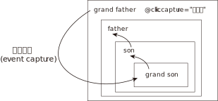

= swift 绑定事件
:toc:

---

== 绑定事件 -> v-on: click="方法名"

所有的事件, 都写在 methods:{} 这个对象里面.

页面上的html元素, 要调用事件, 有两种写法:

|===
|写法 |说明

|普通写法
|<tag *v-on: click="方法名(参数)"*>

|简写法
|<tag *@click="方法名(参数)"*>
|===

即 ,点击等事件, 函数名后带不带小括号, 都行. 但如果带了小括号, 就能给函数传参了!

下面, 点击按钮, 就修改objZzr中的各种属性值:
[source, JavaScript]
----
let vm = new Vue({
    el: "#app",

    data: {
        objZzr: {name: "zzr", age: 19}
    },

    methods: {
        fnChangeName: function (newValue) {
            this.objZzr.name = newValue //注意, data对象和methods对象中的内容, 可以直接用this来调用它们.
            //即, 要调用data中的变量, 或函数之间相互调用, 要使用this来指向自身实例对象vm.
        },

        fnChangeAge: function (newValue) {
            this.objZzr.age = newValue
        },
    }
})
----

[source, HTML]
----

    <input type="button" value="change name" v-on:click="fnChangeName('wyy')"> <!--正常写法-->
    <input type="button" value="change age" @click="fnChangeAge(39)"> <!--简写法-->
    

----

---

== 事件修饰符

==== html默认是使用"冒泡事件流（event bubbling）", 而非"捕获事件流".

所谓事件的"冒泡机制"就是, 比如两个父子关系的div, 点击son, 会导致除了son身上的事件被触发外, father身上的事件也被触发了. (因为son的身体就是father身体的一部分嘛! 点击son的身体就相当于也点击了father的身体).

例子如下:

[source, html]
----

    
 grandFather
        
 father
            
 son
                
grandSon

            

        

    

----

上面的代码, 点击最里层的grandSon后, 由于事件冒泡的存在, 会打印出:
....
i am grandSon
i am son
i am father
i am grandFather
....
即, 从内向外, 一层层触发嵌套的各级元素身上的事件.

---

==== 阻止事件的冒泡触发 -> @click.stop = "方法名"

如果不想冒泡, 可以使用vue提供的事件修饰符. 如下, 在@click后,加上 .stop 属性就行了!

[source, html]
----

    
 father
        
 son
 <!-- 用 @click.stop="方法名", 就能阻止事件冒泡发生, 只触发本元素的事件, 不触发嵌套了自己的父辈元素身上的事件. -->
    

----

---

==== 实现"捕获事件流(event capturing)机制" -> @click.capture="方法名"

所谓"捕获事件流", 就是: 事件的处理将从DOM层次的根开始，而不是从触发事件的目标元素开始. 即, 从祖宗->目标元素自己->爸爸->爷爷->曾祖, 这样的流程来触发各元素身上的事件. 即, **当事件从最高层元素到达目标元素后，它会反过来接着通过DOM节点再进行"冒泡"。**

**想要实现这一机制, 只要在最老的祖先元素身上, 加上这个属性即可: @click.capture="方法名".**

即:

|===
|元素层级 |Header 2

|grandFather
| *写上 @click.capture="方法名"* +
注意, 点击本元素, 不会触发"捕获事件流机制". 要点击其他子层元素, 才会触发"捕获事件流".

| -- father
|点击本元素, 会按以下路径触发各级事件: +
 grandFather -> father

| --  -- son
|点击本元素, 会按以下路径触发各级事件: +
grandFather -> son -> father

| --  --  -- grandSon
|点击本元素, 会按以下路径触发各级事件: +
**grandFather -> grandSon -> son -> father**

|===

例如:
[source, html]
----

    
 <!-- @click.capture ="方法名", 要写在最老的祖先元素身上!-->
        grandFather
        
 father
            
 son
                
grandSon

            

        

    

----

---

==== 不要"事件冒泡", 也不要"事件捕获", 点到什么元素, 就触发该元素身上的事件, 而不触发它父亲或儿子身上的事件!  -> 使用 .self 属性即可!

在每层元素上, 都设成 @click.self="方法名" 即可.

[source, html]
----

    

        grandFather
        
 father
            
 son
                
grandSon

            

        

    

----

注意, .self属性, 只阻止别人的冒泡事件传递到自己(比如是b元素)身上时, 在自己身上失效!
但不会阻止a的事件流过自己(b)身上后, 往往c身上冒泡!

比如, 有四个元素如下嵌套, 其中son身上有".self属性".
grandFather > father > son(有.self属性) > grandSon
则:

|===
|点击 |事件触发顺序

|点击grandSon
|grandSon -> (跳过son!) -> father -> grandFather

|点击son (有.self属性)
|son -> father -> grandFather

|===

---

==== 只让事件触发一次  ->  @click.once="方法名"

[source, html]
----

----

即, 该元素只会在第一次点击时, 会触发事件. 之后再次点击, 就无效了.

---

==== 阻止html标签元素的默认事件 ->  @click.prevent="方法名"

[source, html]
----
<a href="http://www.google.com" @click.prevent="fnA">to google!</a>
----
上例, 在加上 @click.prevent="方法名" 后, 就会阻止掉 a元素的默认的认跳转链接事件, 而只执行我们自定义的方法事件.

---

==== 事件修饰符, 也可以串联, 连着写几个
[source, html]
----
<a href="http://www.twitter.com" @click.prevent.once="fnSon">to twitter</a>
----
上例, 在第一次点击时, 会阻止掉a元素的默认跳转链接事件, 并执行我们自定义的fnSon方法. +
但是第二次点击时, 就会恢复a元素的跳转链接事件. (因为我们的阻止".prevent" 只阻止一次".once")

