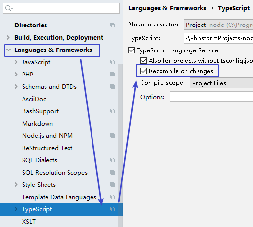
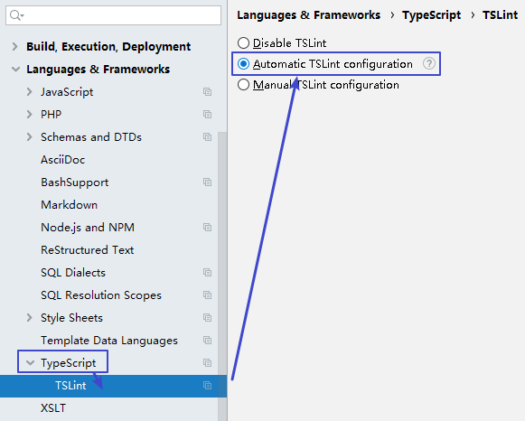
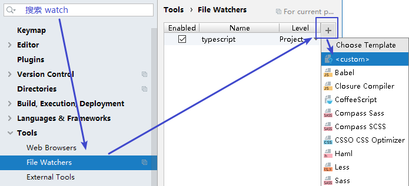
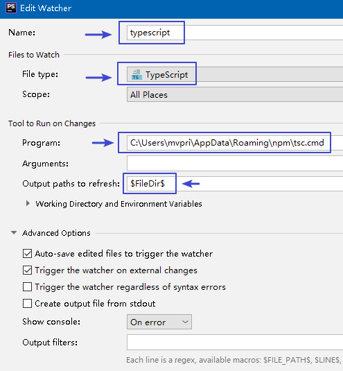
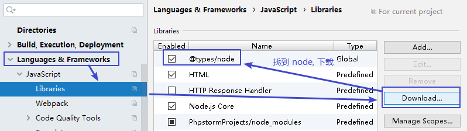

= 启用typescript & 总结
:toc:

---

== github上的 typescript教程

英文

react-redux-typescript-guide +
https://github.com/piotrwitek/react-redux-typescript-guide

TypeScript Deep Dive +
https://github.com/basarat/typescript-book

中文

深入理解 TypeScript  +
https://jkchao.github.io/typescript-book-chinese/project/compilationContext.html#%E7%BC%96%E8%AF%91%E9%80%89%E9%A1%B9

https://github.com/zhongsp/TypeScript

---

== 如何启用 typescript?

|===
|步骤 |方法

|安装或升级typescript
|npm install -g typescript

|查看安装typescript编译器的版本
|tsc -v

|进入你的项目文件夹, 生成package.json文件
|npm init -y

|创建tsconfig.json文件(即typescript项目的配置文件)
|tsc --init +
关于tsconfig.json文件的配置, 见下文.

|安装 ts-node (必装!!)
|npm install -g ts-node

|安装@types/node模块
|npm install --save @types/node

|安装tslint模块
|yarn add tslint

|查看已经全局安装的模块, 在什么目录下? (注意, 最后一个单词是globa, 不要画蛇添足在后面加个小写字母"l" !)
|npm list --depth=0 -globa

|让phpStorm中, 对ts文件, 右键有 "run" 命令(快捷键 shift + f10 或 ctrl + shift + f10)
| 安装phpStorm插件 Run Configuration for TypeScript

|phpStorm 的设置
|见下文

|编译一个 TypeScript 文件
|tsc 文件名.ts //由于我们右键已经能run了, 所以这个手动编译操作就不需要了

|===

---

==== 启用tsconfig.json文件中的以下配置:
....
{
  "compilerOptions": {
    "module": "commonjs",
    "target": "es6",
    "sourceMap": true,

    "outDir": "./jsDir",  //指向了编译后的js代码输出的地方。即你用ts编译出的 js文件的存放目录.
    "rootDir": "./tsDir"   //此目录下的文件需要经过编译。即 你的 ts文件 的所在目录

    "strict": true,
    "esModuleInterop": true,
    "experimentalDecorators": true, //启用es7的装饰器功能
  },
  "exclude": [
    "node_modules"
  ]
}
....

---

==== phpStorm 的typescript设置

1.设置 -> languages & frameworks -> TypeScript -> 打钩 Recompile on changes +

2.启用tslint +

3.进行对ts文件的监视 +

4.language & frameworks -> JavaScript -> Libraries -> download -> 找到node,下载, 就会多一个 @types/node +

---

== DefinitelyTyped <- 高质量TypeScript类型定义的存储库

typescript 2.0以后不再需要typings或者tsd了，所有的type都只需要用npm来安装: @types/<library name>

**一个库只要编写了 *.d.ts 文件, 就能给你带来代码智能提示.** 你可以上 DefinitelyTyped 网站去找主流前端类库/框架的.d.ts文件, 地址如下: +
https://github.com/DefinitelyTyped/DefinitelyTyped

---

==== 小技巧: 在phpStorm中查看数据在ts中的类型: 按住ctrl, 悬停在变量上

按Ctrl键,并用鼠标悬停在变量上, 可以启动phpStorm中对数据ts类型的逻辑推理.

---
== 基本的类型

|===
|数据 |类型

|数字
|number

|布尔值
|boolean

|数组
| [] 或 Array<元素类型>
比如: Array<number>, string[]

|元组 +
(里面元素可以不是同一类型的)
| [string,number,boolean]

|枚举
| enum 枚举名 {} //先定义一个枚举类 +
  let 变量:枚举名 = ... //枚举类的名字, 就可以当做枚举类型来用

|任何类型
|any

|没有任何类型
|void

|永不存在的值
|never

|非原始类型
|object //也就是除number，string，boolean，symbol，null 或 undefined之外的类型。 +

 任何类型的值, 你都可以赋值给object类型的变量身上, 但是, 一旦赋值后, 原类型就丢失了. 比如, 一个字符串类型的值, 赋值给object类型的变量后, 就会丢失字符串特有的方法. 但是, any类型则没有这个缺陷.

|拥有多种类型的特征 (并的关系)
|typeA & typeB

|多种类型中的一种 (或的关系)
|ItfFish \| ItfBird +
注意: 联合类型意味着, 在你最终传入确切的值之前, ts只能摒弃掉某一个类型特有的方法和属性, 而使用"联合类型"中这几个类型所共有的方法和属性. +

你可以使用强制类型转化, 来明确恢复为某一类型: (<ItfFish>arg).fn_Swim

type typeCombine = ItfA \| ItfB \| ItfC \| ItfD +
function fn(type: typeCombine) {  +
   switch (type.kind) { //用kind属性来进行不同接口的辨识 +
   }

| 强制类型转换
| <string>userName +
或 userName as string

|类型别名
|type alina联合类型 = aliaString | aliaFn

|===

---

==

