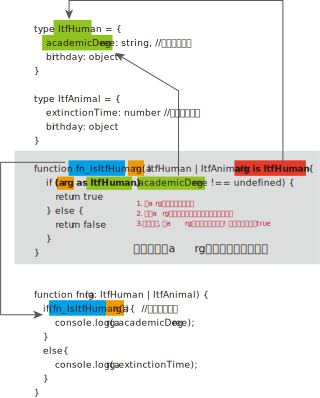

= 类型保护, 与类型判断/区分类型（Type Guards and Differentiating Types）
:toc:

---

== 类型判断

==== typeof -> 判断类型

用typeof来判断联合类型对象的最终类型,到底是哪一种.

[source, typescript]
....
function fn(arg: string | number | object) {
    if (typeof arg === 'string') {
        console.log(`${arg}是字符串`);
    }
    else if (typeof arg === 'number') {
        console.log(`${arg}是数字`);
    }
    else if (Array.isArray(arg)) {
        console.log(`${arg}是数组`);
    }
    else if (typeof arg === 'object') {
        console.log(`${JSON.stringify(arg)}是对象`);
    }
}

fn(123) //123是数字
fn('zrx') //zrx是字符串
fn({name: 'wyy', age: 32}) //{"name":"wyy","age":32}是对象
fn([5, 6, 7]) //5,6,7是数组
....

注意, 用typeof来识别类型时, 只能使用以下两种写法:

- typeof v === "typename"
- 和 typeof v !== "typename"，

并且, "typename"必须是 "number"， "string"， "boolean"或 "symbol"。 但是TypeScript并不会阻止你与其它字符串比较(比如'object'?)，只是语言不会把那些表达式识别为类型保护。(看来typescript还是无法原生区分"数组类型"和"对象类型")(js中, arr, json, nul, date, reg, error 全部被检测为object类型.)

---

==== instanceof -> 判断类型

....object instanceof constructor....
instanceof的右侧, 要求是一个构造函数(即类名)

**instanceof 运算符, 用来检测 constructor.prototype 是否存在于参数 object 的原型链上。 换句话说, 是用来判断: 对象是否是特定类的一个实例。**
instanceof通过返回一个布尔值来指出，这个对象是否是这个特定类或者是它的子类的一个实例。

[source, typescript]
....
function fn实例找类(ins: any, Cls: any): boolean {
    if (ins instanceof Cls) { //如果ins是Cls类的实例的话...
        return true
    }
    else
        return false
}

class ClsFahter {

}

class ClsSon extends ClsFahter {

}
let s = new ClsSon()

console.log(fn实例找类(s, ClsSon)); //true
console.log(fn实例找类(s, ClsFahter)); //true
console.log(fn实例找类({}, ClsFahter)); //false
....

---

== (OPTC法) Object.prototype.toString.call(value) -> 全类型判断

[source, typescript]
....
console.log(Object.prototype.toString.call(999)); //[object Number]
console.log(Object.prototype.toString.call('zzr'));

console.log(Object.prototype.toString.call([3, 4, 5])); //[object Array]
console.log(Object.prototype.toString.call({name: 'wyy', age: 34})); //[object Object]

console.log(Object.prototype.toString.call(true)); //[object Boolean]
console.log(Object.prototype.toString.call(function fn(){})); //[object Function]

console.log(Object.prototype.toString.call(undefined)); //[object Undefined]
console.log(Object.prototype.toString.call(null)); //[object Null]
console.log(Object.prototype.toString.call(new Date())); //[object Date]

console.log(Object.prototype.toString.call(/正则表达式主体/)); //[object RegExp]
console.log(Object.prototype.toString.call(new Error())); //[object Error]
....

Object.prototype.toString.call(变量)输出的是一个字符串，字符串里有一个数组，第一个参数是Object，第二个参数就是这个变量的类型，而且，所有变量的类型都检测出来了，我们只需要取出第二个参数即可。
或者可以使用Object.prototype.toString.call(arr)=="object Array"来检测变量arr是不是数组。

---

==== Object.prototype.toString.call()的官方说明

....
1. Object.prototype.toString( ) When the toString method is called, the following steps are taken:
2. Get the [[Class]] property of this object.
3. Compute a string value by concatenating the three strings “[object “, Result (1), and “]”.
4. Return Result (2)
....

首先，取得对象的一个内部属性[[Class]]，
然后依据这个属性，返回一个类似于”[object Array]”的字符串作为结果（看过ECMA标准的应该都知道，[[]]用来表示语言内部用到的、外部不可直接访问的属性，称为“内部属性”）。
利用这个方法，再配合call，我们可以取得 任何对象的内部属性[[Class]]，然后把类型检测转化为字符串比较，以达到我们的目的。

**注意: OPTC法, 无法区分自定义对象类型，自定义类型还是要用instanceof()来区分.**

---

==== obj.toString()的结果和Object.prototype.toString.call(obj)的结果不一样，这是为什么？

**这是因为toString为Object的原型方法，而Array 、Function等类型作为Object的实例，都重写了toString方法。** 不同的对象类型调用toString方法时，根据原型链的知识，调用的是对应的重写之后的toString方法（Function类型返回内容为函数体的字符串，Array类型返回元素组成的字符串.....），而不会去调用Object上原型toString方法（返回对象的具体类型），所以采用obj.toString()不能得到其对象类型，只能将obj转换为字符串类型；因此，在想要得到对象的具体类型时，应该调用Object上原型toString方法。

---

== 类型保护(Type Guards)

==== 方法1: 属性名 in 某对象 -> 判断某对象上是否存在某个属性

in 操作符可以安全的检查一个对象上(假设它是联合类型)是否存在一个属性，它通常也被做为类型保护使用：

[source, typescript]
....
interface ItfStr {
    strProp:string,
    boolProp:boolean
}

interface ItfNum{
    numProp:number
    boolProp:boolean
}

function fn(arg:ItfStr|ItfNum) {
    console.log(arg.boolProp); //ok, <--只能访问到联合类型中的共有属性. 其他的各自接口中的特有属性, 则访问不到.

    //那么如何判断arg到底是联合类型中的哪种类型呢? 用in来判断, 用in来检查一个对象上是否存在某个属性.
    if('strProp' in arg){ //由于strProp属性只存在于ItfStr接口中, 所以arg就是该接口的类型!
        console.log(arg.strProp); //就能访问到专属于ItfStr接口中的特有属性了.
    }
    else{ //ts能自动判断出, 既然上面if代码块中的arg是ItfStr接口类型,则这里的else代码块中的arg就一定是联合类型中剩下的ItfNum接口类型
        console.log(arg.numProp);
    }
}
....

---

==== 字面量 类型保护

当你在"联合类型"里使用"字面量类型"时，可以用 "if(obj.字面量属性 === 某字面量类型){} else{}" 来对这个变量, 区分出它到底是联合口中的哪一个类型.

[source, typescript]
....
type ItfHuman = {
    kind: 'human' //字面量类型, 该kind属性的值只能取"Human"这个字符串!
    academicDegree: string, //学位, 人类专属属性
    birthday: object
}

type ItfAnimal = {
    kind: 'animal' //字面量类型
    extinctionTime: number //灭亡时间, 动物专属属性
    birthday: object
}

function fn(arg: ItfHuman | ItfAnimal) {
    if (arg.kind === 'human') { //从这个条件, 可以判断出, arg是ItfHuman接口类型
        console.log(arg.academicDegree); //ok
    } else { //则,此else中的arg 一定是ItfAnimal接口类型
        console.log(arg.extinctionTime); //ok
    }
}
....

---

==== 方法2: 创建"用户自定义"的"类型保护函数"

对于是"联合类型"的变量，如何确切的知道是哪一种类型呢？javascript中常用的方式是检查成员是否存在，但是typescript中联合类型只能访问"联合类型"中"共同拥有的"成员。

可以通过"类型断言"来进行类型判断，但有个问题, 就是每个分支都需要进行类型判断.

typescript提供了一个"类型保护机制", 可以解决上面的问题.

**要定义一个"类型保护"，我们只要简单地定义一个函数，它的返回值是一个"类型谓词"**, 比如, 下例中, 有一个函数 function fn判断是否是飞鸟(arg: ItfFish | ItfBird): arg is ItfBird {... }, **其返回值类型 arg is ItfBird , 就是一个"类型谓词".**

**你可以创建"用户自定义的类型保护函数"，这仅仅是一个返回值为类似于someArgumentName is SomeType 的函数.**

谓词为 parameterName is Type这种形式， **parameterName必须是来自于当前函数签名里的一个参数名**。

比如
[source, typescript]
....
type ItfHuman = {
    kind: 'human' //字面量类型, 该kind属性的值只能取"Human"这个字符串!
    academicDegree: string, //学位, 人类专属属性
    birthday: object
}

type ItfAnimal = {
    kind: 'animal' //字面量类型
    extinctionTime: number //灭亡时间, 动物专属属性
    birthday: object
}

//下面这个函数, 专门用来判断传入的参数arg, 是否是ItfHuman接口类型
function fn_IsItfHuman(arg: ItfHuman | ItfAnimal): arg is ItfHuman {
    if ((arg as ItfHuman).academicDegree !== undefined) { //如果属于ItfHuman中的特有属性academicDegree存在的话, 那arg就是ItfHuman接口类型
        return true
    } else {
        return false
    }
}
/*上面函数的意思是:
1.先把arg(是联合类型), 先断言成人类接口类型,
2.如果arg上有人类专属的"学位"属性, 则arg一定是人类接口类型, 那就返回true.
3.即, 本函数对arg参数做出了判断, 如果函数返回了true, 就表明arg参数收到的实参,是人类接口类型.
*/

function fn(arg: ItfHuman | ItfAnimal) {
   if(fn_IsItfHuman(arg)){ //调用上面的"是否属于人类接口类型"的判断函数fn_IsItfHuman
       console.log(arg.academicDegree);
   }
   else{
       console.log(arg.extinctionTime);
   }
}
....

上面的"判断函数"的流程为:

又例:
[source, typescript]
....
interface ItfBird {
    fn_Fly(): void;

    fn_LayEggs(): any;
}

interface ItfFish {
    fn_Swim(): void;

    fn_LayEggs(): any;
}

let objBird: ItfBird = {
    fn_Fly(): void {
        console.log('bird fly...');
    },
    fn_LayEggs(): any {
        console.log('bird lay egg..');
    }
}

let objFish: ItfFish = {
    fn_Swim(): void {
        console.log('fish swim...');
    },
    fn_LayEggs(): any {
        console.log('fish lay egg...');
    }
}

function fn判断是否是飞鸟(arg: ItfFish | ItfBird): arg is ItfBird { //返回值 arg is ItfBird 就是类型谓词。 谓词为 parameterName is Type这种形式， parameterName必须是来自于当前函数签名里的一个参数名。
    let res = (<ItfBird>arg).fn_Fly !== undefined //判断是否有飞翔方法, 即飞翔方法不为"未定义". 有飞翔方法, arg就是飞鸟
    console.log(res); //true或false
    return res //虽然返回的是一个布尔值, 但本函数的返回类型,却是写作了 arg is ItfBird, 而不能写成boolean! 如果你写成布尔的话, ts依然无法区分该arg对象到底是飞鸟还是鱼. 即拿不到它们各自的专有方法.
    //换句话说, 我的理解是: 如果函数返回true的话,则你的 arg is ItfBird语句, 规定了这个arg一定是个飞鸟类型! 相当于你直接告诉了ts, 只要arg含有飞翔方法, 则arg就是飞鸟类.
}

function fn执行某类型的独特功能(arg: ItfFish | ItfBird) {
    if (fn判断是否是飞鸟(arg)) { //如果为true,则是飞鸟, 有飞翔的方法
        arg.fn_Fly()
    } else {
        arg.fn_Swim()
    }
}

fn执行某类型的独特功能(objBird) //bird fly...
fn执行某类型的独特功能(objFish) //fish swim...
....

---