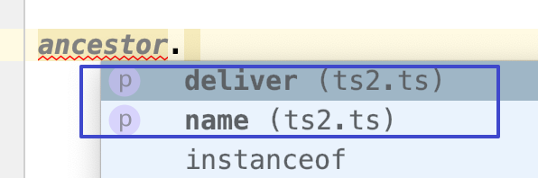
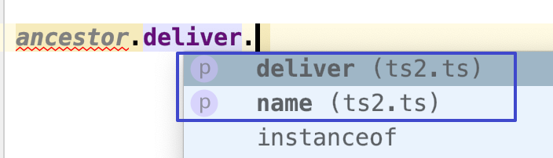

= 类型别名
:toc:

---

== 写法: type 某类型的别名 = 某类型

"类型别名"会给一个类型起个新名字。

TypeScript 提供使用类型注解的便捷语法，你可以使用:
[source, typescript]
....
 type SomeName = someValidTypeAnnotation
....
的语法, 来创建别名.

例如:
[source, typescript]
....
type type_strOrNum = string | number //将一个联合类型, 起个类型别名
let prop: type_strOrNum = 'zzr' //既可以赋值string类型的值
prop = 22 //也可以赋值number类型的值
....

类型别名有时和接口很像，但是可以作用于原始值，联合类型，元组以及其它任何你需要手写的类型。

[source, typescript]
....
type aliaString = string //给string类型起个别名, 叫做aliaString类型. 事实上, 给原始类型起别名通常没什么用.
type aliaFn = () => any

type alina联合类型 = aliaString | aliaFn

function fn(arg: alina联合类型): alina联合类型 {
    if (typeof arg === 'string') { //注意, typeof无法识别你自定义的类型别名, 其实, 起别名不会新建一个类型 ---- 它只是创建了一个新 名字来引用那个类型。 所以这里不能写成 typeof arg === 'aliaString', 会报错.
        return arg
    }
    else {
        return arg()
    }
}
....

对于"联合类型"和"交叉类型", 往往对它们的定义比较长, 你就可以使用"类型别名"来给它们起个简短好记的类型名字.

又如
[source, typescript]
....
type Text = string | { text: string }; //给"联合类型", 起个类型别名

type Coordinates = [number, number]; //给"元组", 起个类型别名

type Callback = (data: string) => void; //给"某函数类型", 起个类型别名
....

---

== 对一个数据起个类型别名, 里面可以用上泛型类型

[source, typescript]
....
//类型合同
type alia_objHasSex<T> = { name: string, isFemale: T } //给一个含有name和isFemale属性的对象,该类型起个"类型别名", 叫做alia_objHasSex. 并且它还含有一个泛型类型,用T来代表任何可能的传给isFemale值的类型.

let zzr: alia_objHasSex<boolean> = {name: 'zzr', isFemale: true}
let wyy: alia_objHasSex<string> = {name: 'wyy', isFemale: "female"}

let mwq: alia_objHasSex<string> = {isFemale: "female"} //报错 error TS2741: Property 'name' is missing in type '{ isFemale: string; }' but required in type 'alia_objHasSex<string>'.
//缺少类型合同中规定的必须存在的name属性
....

---

== 在定义类型别名时, 里面的属性的类型, 也可以用上这个类型别名自己.

[source, typescript]
....
type Tree<T> = { //树枝类型
    value: T;
    left: Tree<T>; //树枝的分岔, 依然是树枝类型
    right: Tree<T>;
}
....

这样使用类型别名, 就有点"class类"的意思了. 相当于你用基础类型构建出一个复杂的对象后, 把这个复杂对象再单独起个"类型名字", 然后你可以在其他地方直接复用"类型别名"对新创建的复杂对象进行类型约束. 免得后者不符合"类型合同"的规定.
再举个例子, 就好像apple公司对每一台生产的内部零件复杂的iphone手机, 都用一个"类型别名"来约束它们, 免得它们生产出来后不符合iphone规格的要求!

---

== 与交叉类型一起使用，我们可以创建出一些十分稀奇古怪的类型。

[source, typescript]
....
//下面的"alia类型别名_能繁殖",里面会用到一个泛型类型T.
// 并且,该"alia类型别名_能繁殖"是个交叉类型(即它是多个类型的"合体", 拥有多个类型的全部属性),本例, 它带有deliver(分娩,生小孩)属性,该属性的值也是一个"alia类型别名_能繁殖"
type alia类型别名_能繁殖<T> = T & { deliver: alia类型别名_能繁殖<T> }

interface ItfPerson {
    name: string
}

let ancestor: alia类型别名_能繁殖<ItfPerson> //祖先变量, 是个交叉类型, 它即含有"alia类型别名_能繁殖"类型中的属性(能繁衍后代, 生小孩), 也含有 "ItfPerson"接口中的属性(有人的姓名)
//换句话说, 祖先ancestor,有两种功能:1.有自己的名字, 2.能生小孩. 而生出的小孩, 依然和祖先一样有这两种功能. 于是就像愚公移山里面的愚公一样, 子子孙孙, 迭代无穷尽. 也像一些单性繁殖的生物一样.

ancestor.name //虽然会报错error TS2454: Variable 'ancestor' is used before being assigned. 但是依然可以访问到name属性和deliver属性, 有代码提示!
ancestor.deliver.name
ancestor.deliver.deliver.name
ancestor.deliver.deliver.deliver.deliver
....

可以看到, 有代码提示:

注意: 类型别名不能出现在声明右侧的任何地方。

[source, typescript]
....
type Yikes = Array<Yikes>; // error
....

---

== 接口 vs. 类型别名 的区别

在 typescript 中, 我们定义类型有两种方式： 接口(interface) , 和类型别名(type alias)

|===
|功能支持度 |interface |type aliasTypeName

|定义对象类型
|√
|√

|定义组合类型，交叉类型，原始类型
|×
|√

|实现接口的 extends 和 implements
|√
|×

|实现接口的 merge
|√
|×

|===

---

==== 1. 接口是实实在在创建了一个新的"类型名", 而类型别名, 只是创建了一个指向某种类型的指针引用而已.

接口创建了一个新的名字，可以在其它任何地方使用。 而"类型别名"并不创建新的类型名字, 比如，报错信息中就不会使用别名。

[source, typescript]
....
//用接口来约束一个对象
interface ItfHasSex<T> {
    name: string
    isFemale: T
}

let zzr_UseItf: ItfHasSex<boolean> = {
    name: 'zzr',
    isFemale: true
}

//用类型别名, 来约束一个对象
// 对下面的对象类型, 起个类型别名. 注意, 别忘了=等号, 这也暗示了"类型的别名",只是一个指针引用而已, 指向了等号后面的含有特定属性的对象的类型
type aliasHasSex<T> = {
    name: string,
    isFemale: T
}

let wyy_useAilas: aliasHasSex<string> = {
    name: 'zzr',
    isFemale: 'female'
}
....

---

==== 2. 类型别名, 不能被继承(extends)和实现(implements)

另一个重要区别是, **类型别名不能被 extends和 implements（自己也不能 extends和 implements其它类型）。** 因为 软件中的对象应该对于扩展是开放的，但是对于修改是封闭的，**你应该尽量去使用接口代替类型别名。**

另一方面，**如果你无法通过"接口"来描述一个类型, 并且需要使用"联合类型"或"元组类型"，这时通常才会去使用"类型别名"。**

---
