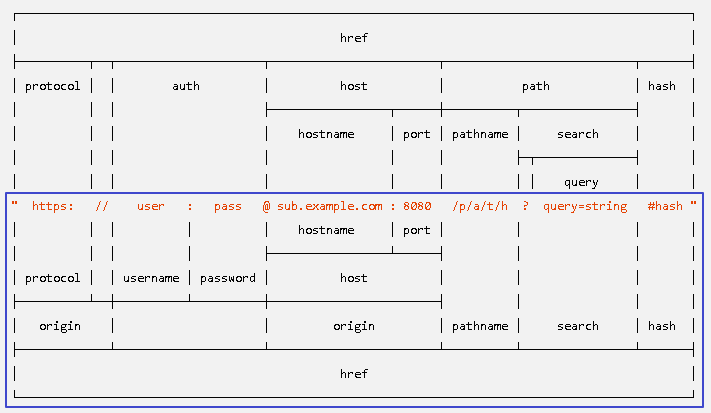

= 拿到前端所访问的 url地址
:toc:

---

== req.url -> 拿到前端访问的"url路径"

[source, typescript]
....
let http = require("http");

let server = http.createServer((req, res) => {
    res.writeHead(200, {"Content-Type": "text/html; charset=utf-8"});
    res.write(req.url); // 比如你访问 http://127.0.0.1:8000/a/b/c, 则 req.url的输出就是->  /a/b/c
    res.end("");

});
server.listen(8000, "127.0.0.1");
....

---

== 更细致的url解析

图中的下半部分, 就是推荐使用的新方法. +
WHATWG URL的源属性包括协议和主机，但不包括用户名或密码。

我们在浏览器访问 http://127.0.0.1:8000/abc/def.html?name=wyy&age=18#hash +
下面来用旧的和新的方法, 来解析这段url.

---

====  url.parse(req.url) <- 已不推荐使用的老方法. 因为无法拿到ip地址, 端口号, hash.

[source, typescript]
....
let http = require("http");
let url = require("url");

let server = http.createServer((req, res) => {
    res.writeHead(200, {"Content-Type": "text/html; charset=utf-8"});

    console.log(req.url); // 输出 /abc/def.html?name=wyy&age=18

    const objUrl = url.parse(req.url); //老的解析url的方法, 已不推荐使用!
    console.log(objUrl); //输出见下

    res.end("");
});
server.listen(8000, "127.0.0.1");

/*
Url {
  protocol: null,
  slashes: null,
  auth: null,
  host: null,
  port: null,
  hostname: null,
  hash: null,
  search: '?name=wyy&age=18',
  query: 'name=wyy&age=18',
  pathname: '/abc/def.html',
  path: '/abc/def.html?name=wyy&age=18',
  href: '/abc/def.html?name=wyy&age=18' }
*/
....

---

==== new url.URL(urlStr) <- 新的推荐方法

使用 new url.URL(strUrl)

注意: 不能写成  new url.URL(req.url), 因为 **new url.URL()函数,要接收的参数, 必须是一个完整的url地址(即要包括http://www...主机ip地址才行!)**,而 req.url只能拿到后半段路径地址, 所以不符合new url.URL()函数的传参要求!

[source, typescript]
....
let http = require("http");
let url = require("url");

let strUrl = "http://127.0.0.1:8000/abc/def.html?name=wyy&age=18#hash" //完整的url地址的字符串形式

let server = http.createServer((req, res) => {
    res.writeHead(200, {"Content-Type": "text/html; charset=utf-8"});

    const objUrl = new url.URL(strUrl); //想的推荐使用的解析url的方法.
    console.log(objUrl); //输出见下

    res.end("");
});
server.listen(8000, "127.0.0.1");

/*
URL {
  href: 'http://127.0.0.1:8000/abc/def.html?name=wyy&age=18#hash',
  origin: 'http://127.0.0.1:8000',
  protocol: 'http:',
  username: '',
  password: '',
  host: '127.0.0.1:8000',
  hostname: '127.0.0.1',
  port: '8000',
  pathname: '/abc/def.html',
  search: '?name=wyy&age=18',
  searchParams: URLSearchParams { 'name' => 'wyy', 'age' => '18' },
  hash: '#hash' }
 */
....

---

== 对不同的 url, 进行不同的"路由"

拿到url后, 我们就能针对不同的url, 进行"路由", 导向不同的服务器上文件地址.

[source, typescript]
....
let http = require("http");

let server = http.createServer((req, res) => {
    if (req.url === "/zzr.html") {
        res.writeHead(200, {"Content-Type": "text/html; charset=utf-8"});
        res.end("zrx page...");
    }
    else if (req.url === "/wyy") {
        res.writeHead(200, {"Content-Type": "text/html; charset=utf-8"});
        res.end("wyy page...");
    }
    else if (req.url === "/") {
        res.writeHead(200, {"Content-Type": "text/html; charset=utf-8"});
        res.end("首页 page...");
    }
    else {
        res.writeHead(404, {"Content-Type": "text/html; charset=utf-8"});
        res.end("error:你访问的页面不存在");
    }
});

server.listen(8000, "127.0.0.1");
....

---

== 读取 image图片 和 css

下面, 当用户访问"/" url时, 我们就读取一个html1.html文件(该htlm会链接一个img和css), 并把它的内容写入前端页面中.

我们的目录结构如下:
....
|-- 工程目录
    |-- ts1.ts //这是我们写node.js的文件
    |-- src
    |   |-- public
    |   |   |-- css
    |   |   |   |-- css1.css //html1.html里, 会调用这个css文件
    |   |   |-- html
    |   |   |   |-- html1.html //如果前端访问了"/"这个url, 则我们后端服务器, 就用fs.readFile()读取html1.html文件的字符串内容, 并写入浏览器页面中返回.
    |   |   |-- images
    |   |   |   |-- img_1.jpg //html1.html里, 会调用这个jpg文件
    |   |   |-- js
....

html1.html内容为:

[source, html]
....
<head>
    <link rel="stylesheet" href="/fakeUrl/css1.css">
</head>

<body>
    
index页面的内容如下

    
</body>
....

ts1.ts内容为:
[source, typescript]
....
let http = require("http");
let util = require("util");
let fs = require("fs");
let path = require("path");

let trulUlr_html1 = "./src/public/html/html1.html"; //各种文件在服务器上的真实地址
let trulUlr_img1 = "./src/public/images/img_1.jpg";
let trulUlr_css = "./src/public/css/css1.css";

let fnPms_readFile = util.promisify(fs.readFile); //把传统的异步函数, 变成一个返回promise对象的函数.

let server = http.createServer((req, resServer) => {

    if (req.url === "/") { //前端可以在浏览器中访问任何"虚假"的url, 我们都能通过路由, 来导向"正确"的服务器上的文件地址.
        fnPms_readFile(trulUlr_html1)
            .then((resHtml: string) => {
                    resServer.writeHead(200, {"Content-Type": "text/html; charset=utf-8"});
                    resServer.end(resHtml.toString());
                }
            );
    }

    else if (req.url === "/fakeUrl/img_1.jpg") {
        fnPms_readFile(trulUlr_img1)
            .then((resImg) => {
                    resServer.writeHead(200, {"Content-Type": " image/webp"}); //注意! 图片的响应头, "Content-Type"字段有自己独特的值!
                    resServer.end(resImg);
                }
            );
    }

    else if (req.url === "/fakeUrl/css1.css") {
        fnPms_readFile(trulUlr_css)
            .then((resCss) => {
                    resServer.writeHead(200, {"Content-Type": " text/css"}); //注意! css的响应头, "Content-Type"字段有自己独特的值!
                    resServer.end(resCss);
                }
            );
    }
});

server.listen(8000, "127.0.0.1");
....

注意上例中, 我们的"路由"映射操作:

|===
|html中的资源的**虚假地址** | -> "路由"会导向的服务器上的**真实文件地址**

|/
|./src/public/html/html1.html

|/fakeUrl/img_1.jpg
|./src/public/images/img_1.jpg

|/fakeUrl/css1.css
|./src/public/css/css1.css

|===

注意, 由于node.js中, **"路由"扮演者"指路者"的角色, 所以不管你在网页中写上什么虚假的地址, 都可以由"路由"来重新指向正确的地址. 所以, 在网页html中加载的css和图片地址, 可以和正确路径毫无关系!

比如上例, 我们服务器上, 根本就没有fakeUrl目录, 但是无所谓! 通过"路由"(指路人), 我们可以把虚假的url, 映射到正确的服务器文件地址上去.

即, 你可以在html网页里,全写上虚假的资源地址, 这是为了保护服务器上, 文件的真实地址,不被暴露, 防止真实文件被黑客攻击.  **路由就相当于一个解密程序:  虚假地址(加密)-->路由(解密程序)-->真实地址(解密).**

---

