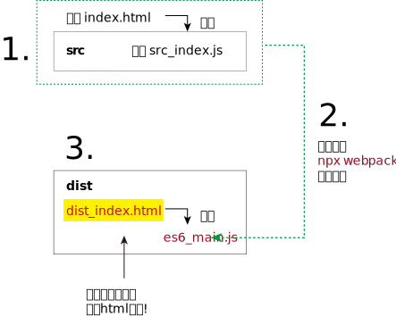

= webpack
:toc:
---

== 安装 webpack

英文官网 https://webpack.js.org/ +
中文文档 https://www.webpackjs.com/guides/getting-started/ +
https://www.webpackjs.com/guides/installation/

webpack 的工作, 就是把应用程序用到的所有模块, 打包成一个或多个 bundle。

Node.js 从最一开始就支持模块化编程。同样，在 web 中, 存在多种支持 JavaScript 模块化的工具.

---

==== 本地安装

[source, typescript]
....
npm install --save-dev webpack //安装最新版本
npm install --save-dev webpack@<version> //安装特定版本

npm install --save-dev webpack-cli //还需要安装 CLI, 此工具用于在命令行中运行 webpack
....

对于大多数项目，我们建议"本地安装"。在本地安装 webpack 后，就能从 node_modules/.bin/webpack 来访问它的 bin 版本。

---

====  全局安装
[source, typescript]
....
npm install --global webpack
....

不推荐全局安装 webpack!

---

== 四个核心概念

==== 入口(entry) -> 默认为 "./src"

https://www.webpackjs.com/concepts/entry-points/

webpack 会从入口起点(entry point)模块开始, 来找出有哪些模块和库, 是入口起点（直接和间接）所依赖的。每个依赖项, 都会随即被处理，最后会输出到称之为 bundles 的文件中.

**默认的入口起点,为 ./src。也可以通过在 webpack 配置中, 来配置 entry 属性，来指定一个或多个入口起点。**

一个 entry 配置的最简单例子：
[source, typescript]
....
//webpack.config.js

module.exports = {
  entry: './path/to/my/entry/file.js'
}; //入口起点位置
....

---

==== 输出的位置(output) -> 默认为 "./dist"

https://www.webpackjs.com/configuration/output/

**output 属性告诉 webpack 在哪里输出它所创建的 bundles，以及如何命名这些文件，默认值为 ./dist。**

基本上，整个应用程序结构，都会被编译到你指定的输出路径的文件夹中。**你可以通过在配置中指定一个 output 字段，来配置这些处理过程：**

[source, typescript]
....
//webpack.config.js

const path = require('path');

module.exports = {
  entry: './path/to/my/entry/file.js', //入口的地址

  output: { //出口的地址
    path: path.resolve(__dirname, 'dist'), //指定 bundle文件要生成(emit)到哪里。
    filename: 'my-first-webpack.bundle.js' //指定 bundle文件的名称
  }
};
....

在上面的示例中，我们通过 output.filename 和 output.path 属性，来告诉 webpack bundle 的名称，以及我们想要 bundle **生成(emit)**到哪里。

注意: 生成(emitted 或 emit) 这个术语, 会贯穿我们整个文档和插件 API。它是“生产(produced)”或“释放(discharged)”的特殊术语。

---

==== loader

https://www.webpackjs.com/concepts/loaders/

**webpack 只能理解理解 JavaScript文件, 所以对于那些不属于js的文件(比如css等), 则需要借助于loader. loader 可以将所有类型的文件, 转换为 webpack 能够处理的有效模块**，然后你就可以利用 webpack 的打包能力，对它们进行处理。

loader 能够 import 导入任何类型的模块（例如 .css 文件）.

[source, typescript]
....
//webpack.config.js

const path = require('path');

const config = {
  output: {
    filename: 'my-first-webpack.bundle.js'
  },

  module: {
    rules: [ //rules 属性，里面必须包含两个必须的属性：test 和 use。
      { test: /\.txt$/, use: 'raw-loader' }
      //test 属性，标识出 loader 要对哪个文件进行转换?
      //use 属性，表示进行转换时，应该使用哪个 loader?
    ]
  }
};

module.exports = config;
....

在上面的配置中，对一个单独的 module 对象, 定义了 rules 属性，里面包含两个必须属性：test 和 use。这告诉 webpack 编译器(compiler) 如下信息： +
“嘿，webpack 编译器，当你碰到「在 require()/import 语句中被解析为 '.txt' 的路径」时，在你对它打包之前，先使用 raw-loader 转换一下。”

重要的是**要记得，在 webpack 配置中定义 loader 时，要定义在 module.rules 中，而不是 rules中。**

---

==== 插件(plugins)

https://www.webpackjs.com/concepts/plugins/

插件能用来执行范围更广的任务, 包括: 打包优化和压缩; 重新定义环境中的变量。

**要想使用一个插件，你只需要 require() 它，然后把它添加到 plugins 数组中。** +
多数插件可以通过选项(option)自定义。

你也可以在一个配置文件中, 因不同目的而多次使用同一个插件，这时需要通过使用 new 操作符, 来创建它的一个实例。

[source, typescript]
....
//webpack.config.js

const HtmlWebpackPlugin = require('html-webpack-plugin'); // 通过 npm 来安装插件, 然后导入它
const webpack = require('webpack'); // 用于访问内置插件

const config = {
  module: {
    rules: [
      { test: /\.txt$/, use: 'raw-loader' }
    ]
  },

  plugins: [ //把插件添加在这个数组中
    new HtmlWebpackPlugin({template: './src/index.html'}) //生成一个插件实例对象
  ]
};

module.exports = config;
....

webpack 提供许多开箱可用的插件！插件列表见 https://www.webpackjs.com/plugins/

---

==== 模式

https://www.webpackjs.com/concepts/mode/

通过选择 development 或 production 之中的一个，来设置 mode 参数，你可以启用相应模式下的 webpack 内置的优化.

[source, typescript]
....
module.exports = {
  mode: 'production'
};
....

---

== 第一个打包案例

我们先创建一个目录, 叫 webpack-demo, 来作为我们的实验项目目录.

然后, 输入命令:
[source, typescript]
....
npm init -y
npm install webpack webpack-cli --save-dev
....

现在我们将创建以下目录结构、文件和内容：
....
|-- 本项目目录webpack-demo
    |-- index.html      //原始首页, 注意:它不是浏览器最终会去执行的对象! 经过webpack打包后, 浏览器最终会去执行dist/dist_index.html, 后者是最终的首页!
    //由于本原始html没有被浏览器用到, 所以我们有理由猜测, 其实这个原始html, 已经和原始js等文件, 都被webpack打包到dist/main.js中了! 所以这个原始html的内容还是存在于main.js里面的. 但似乎这一点存疑.

    |-- package-lock.json
    |-- package.json
    |-- yarn.lock

    |-- dist            //这个"分发"目录下, 会存放webpack将src源目录下的原始js文件, 经过打包, 优化, 并输出为新的js文件, 默认会起名叫main.js.
    |   |-- dist_index.html  //这个才是浏览器最后会真正执行的首页html. 该html会将main.js链接进来!
    |   |-- main.js     //这个就是webpack对src目录下所有原始js文件(还包括css,图片等资源)的合体, 合体成唯一的一个main.js文件.

    |-- src             //这个"源"目录下,存放我们的原始js, css, image文件
        |-- index.js    //这些原始js文件, 会被原始html载入.
....

原始首页index.html
[source, html]
....
<head>
    
</head>
....

**注意, 这个原始index.html, 如果里面有tag内容的话, 似乎不会被打包到 dist_index.html里面. 你要把tag直接写在 dist_index.html里面才行!**

src/index.js  //原始首页html会载入这个js文件
[source, typescript]
....
import axios from 'axios' //载入一个库

let fn = () => {
    console.log(123456);
}

fn()
....

dist/dist_index.html //浏览器最终会调用的首页

[source, html]
....
<head>
        <!-- 注意: 它加载的是webpack打包后的main.js -->
</head>
....

现在, 执行这个命令:
....
npx webpack
....

然后运行 dict/dist_index.html文件, 就能看到结果.

npx webpack 该命令会将我们的脚本(即 src/index.js)作为入口起点，然后打包它里面用到的所有依赖项, 一起输出为 main.js。 +
通过声明模块所需的依赖，webpack 能够利用这些信息, 去构建"依赖图"，然后使用图生成一个优化过的，会以正确顺序执行的 bundle。

---

==== 用上配置文件 webpack.config.js

使用上配置文件, 比在终端(terminal)中手动输入大量命令, 要高效的多.

我们对上面的案例, 进一步操作:

目录结构如下:
....
|-- undefined
    |-- directoryList.md
    |-- index.html          //原始首页
    |-- package-lock.json
    |-- package.json
    |-- webpack.config.js   //现在添加这个文件! 就是webpack的配置文件!
    |-- yarn.lock

    |-- dist
    |   |-- bundle.js       //注意: 经过配置后, webpack会打包为bundle.js, 即, 我们将原来默认的main.js, 可以自定义改名成其他名字.
    |   |-- dist_index.html //最终浏览器执行的首页

    |-- src                 //原始资源文件目录
        |-- src_index.js
....

webpack.config.js 内容如下:
[source, typescript]
....
const path = require('path');

module.exports = {
    entry: './src/src_index.js',
    output: {
        filename: 'bundle.js', //这里, 我们把打包后的输出文件名, 改成了 bundle.js, 而不再是默认的main.js了.
        path: path.resolve(__dirname, 'dist')
    }
};
....

然后, 别忘了把 dist/dist_index.html 中的js链接, 改成bundle.js
[source, html]
....
<head>
    
</head>
....

现在, 执行以下命令:
[source, typescript]
....
npx webpack --config webpack.config.js

//注意，当在 windows 中通过调用路径去调用 webpack 时，必须使用反斜线()。例如 node_modules\.bin\webpack --config webpack.config.js。
....

再在浏览器中打开 dist/dist_index.html, 就能看到结果.

其实, 如果 webpack.config.js 存在，则 webpack 命令将默认选择使用它。我们在这里使用 --config 选项, 只是向你表明，你可以传递任何名称的配置文件。这对于需要拆分成多个文件的复杂配置, 是非常有用。

我们可以通过配置方式指定 loader 规则(loader rules)、插件(plugins)、解析选项(resolve options)，以及许多其他增强功能。 https://www.webpackjs.com/configuration/

---

==== NPM 脚本(NPM Scripts)

考虑到用 CLI 这种方式来运行本地的 webpack 不是特别方便，我们可以设置一个快捷方式。在 package.json 添加一个 npm 脚本(npm script)：

package.json
[source, typescript]
....
"scripts": {
    "build": "webpack"
}
....

**现在，可以使用 npm run build 命令，来替代我们之前使用的 npx 命令。**

运行以下命令:
....
npm run build
....

再用浏览器打开 dist/dist_index.html, 就能看到结果.

**通过向 npm run build 命令和你的参数之间, 添加两个中横线，可以将自定义参数, 传递给 webpack**，例如：npm run build \-- --colors。

---

==== 载入css

在 webpack 出现之前，前端开发人员会使用 grunt 和 gulp 等工具来处理资源，并将它们从 /src 文件夹移动到 /dist 或 /build 目录中。同样方式也被用于 JavaScript 模块，但是，像 webpack 这样的工具，能够动态打包(dynamically bundle)所有依赖项（通过创建所谓的"依赖图"(dependency graph)）。这能令我们避免打包未使用的模块。

webpack 除了能引入 JavaScript外，**还可以通过 loader 引入任何其他类型的文件。**

**为了在 JavaScript 文件(即模块)中 import 一个 CSS 文件，你需要在 webpack.config.js的module 配置中, 安装并添加 style-loader 和 css-loader**：

安装这两个加载器:
[source, typescript]
....
npm install --save-dev style-loader css-loader
....

对配置文件进行添加:
webpack.config.js
[source, typescript]
....
const path = require('path');

module.exports = {
    entry: './src/src_index.js',
    output: {
        filename: 'bundle.js',
        path: path.resolve(__dirname, 'dist')
    },

    module: {
        rules: [ //各种加载器loader的规则, 都写在这里
            {
                test: /\.css$/, //webpack 根据正则表达式，来确定应该查找哪些文件，并将其提供给指定的 loader。
                use: [ //本rule规则表示, 以 .css 结尾的全部文件，都将被提供给 style-loader 和 css-loader
                    'style-loader',
                    'css-loader'
                ]
            }
        ]
    }
};
....

上面的规则, 每个规则都是一个object对象, 里面有两个key, "test"和"use", 意思就是, 如果经过测试(test)后发现,文件的扩展名是css的话, 就对该文件使用(use)某些个加载器. 这样, 我们就能在js文件中, 使用import语句, 如同导入模块一样, 来导入这些css文件了!

当该css加载器模块运行时，含有 CSS 字符串的 <style> 标签，将被插入到 html 文件的 <head> 中。

现在,我们在项目目录中, 插入一个css文件:

....
|-- undefined
    |-- directoryList.md
    |-- index.html
    |-- package-lock.json
    |-- package.json
    |-- webpack.config.js
    |-- yarn.lock

    |-- dist
    |   |-- bundle.js
    |   |-- dist_index.html
    |   |-- main.js
    |-- src

        |-- src_index.js
        |-- cssStyle    //css文件放在这个目录下
            |-- index_css.css
....

index_css.css的内容为:
[source, typescript]
....
.important {
    color: red;
}
....

在原始的index.js文件中, import导入该css文件 +
src/src_index.js内容如下:
[source, typescript]
....
import axios from 'axios'
import './cssStyle/index_css.css' //导入css文件

let fn = () => {
    console.log(123);
}
fn()
....

dist/dist_index.html的内容改为:
[source, html]
....
<head>
    
</head>

<body>
    
 白日依山尽 

    
 黄河入海流
  <!-- 这段文字会受css影响变成红色 -->
</body>
....

注意, 为什么我们这里改了dist_index.html, 而没有去改原始的index.html呢? 因为webpack不会把原始的index.html里面的tag内容, 打包输出到dist_index.html中, 所以我们只能直接在 dist_index.html中来插入tag了.

现在运行构建命令：
....
npm run build
....

再用浏览器打开 dist/dist_index.html, 就能看到结果.

---

==== 加载图片

使用 file-loader, 可以加载图片.

安装该加载器
....
npm install --save-dev file-loader
....

写入配置文件 webpack.config.js
[source, typescript]
....
const path = require('path');

module.exports = {
    entry: './src/src_index.js',
    output: {
        filename: 'bundle.js',
        path: path.resolve(__dirname, 'dist')
    },

    module: {
        rules: [ //各种加载器loader的规则, 都写在这里
            {
                test: /\.css$/,
                use: [
                    'style-loader',
                    'css-loader'
                ]
            },

            { //对读取图片的加载器, 设定规则
                test: /\.(png|svg|jpg|gif)$/,
                use: [
                    'file-loader'
                ]
            }
        ],
    }
};
....

现在，当你 import MyImage from './my-image.png'，该图像将被处理并添加到 output 目录，并且 MyImage 这个变量, 将包含该图像在处理后的最终 url。

当使用 css-loader 时，如上所示，你的 CSS 中的 url('./my-image.png') 会使用类似的过程去处理。loader 会识别这是一个本地文件，并将 './my-image.png' 路径，替换为输出目录中图像的最终路径。

html-loader 以相同的方式处理 。

---

