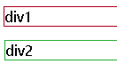
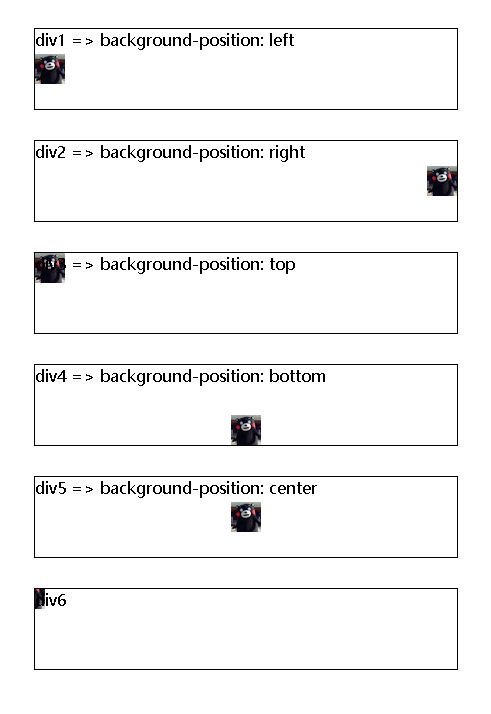
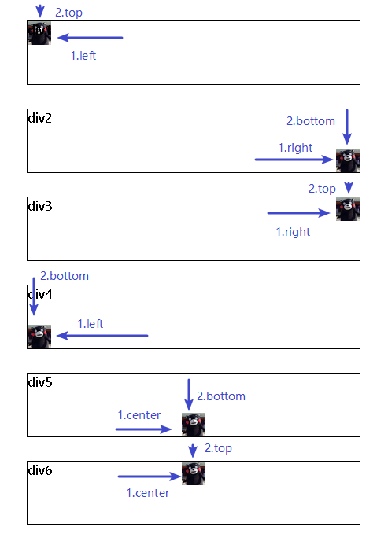
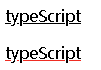
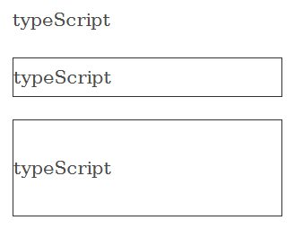
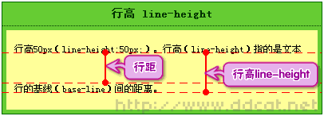
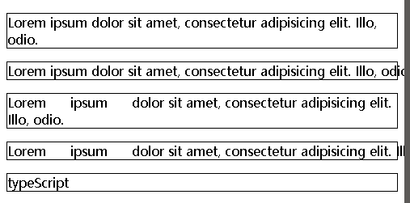
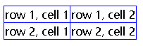
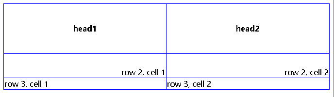
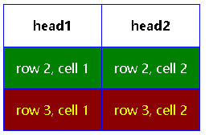

= css3
:toc:

---

== 样式表

==== 外链样式表

[source, html]
....
<head>
    <meta charset="UTF-8">
    <title>Title</title>

    <link rel="stylesheet" type="text/css" href="mystyle.css"/>
</head>
....

**type参数: 规定被链接文档的 MIME 类型。**该属性最常见的 MIME 类型是 "text/css"，该类型描述样式表。

外部样式表mystyle.css的写法:
[source, typescript]
....
hr {color: sienna;}
p {margin-left: 20px;} # 注意: 不要在属性值与单位之间留有空格! 本例中, 不要在20和px之间有空格!
body {background-image: url("images/back40.gif");}
....

---

==== 写在head中的内部样式表

[source, html]
....
<head>
    <meta charset="UTF-8">
    <title>Title</title>

    

</head>
....

---

==== 不推荐: 内联样式

用style属性, 把所有css样式写在一个大字符串中.
[source, html]
....

This is a paragraph

....

---

== 元素

==== 边框线 -> border 和 outline

border 和 outline 属性, 都可以设置元素的边框线.

[source, css]
....
#div1 {
    outline: 1px solid #b00020;
}

#div2 {
    border: 1px solid #28b03b;
}
....

效果 +

区别:

|===
|不同点 |border |outline

|
|border 可应用于几乎所有有形的html元素.
| outline 是针对链接、表单控件和ImageMap等元素设计.

|
|border可以单独设置border-top、border-right等.
|outline**不可以单独设置某一条边**，因而它总是闭合的。

|
|
|outline 是不占空间的，不会像 border 那样影响元素的尺寸或者位置，既不会增加额外的 width 或者 height. +
outline不影响盒模型，因此它不会破坏文档流，不会影响网页布局。

|
|border-color的默认值, 是字体的颜色
|outline-color的默认值, 是黑色

|===

---

== 图像

==== 背景图像 ->  background-image

[source, css]
....
body { /*大多数背景都应用到 body 元素*/
    background-image: url("img.jpg"); /*背景图, 默认平铺*/
}
....

让背景图只垂直平铺
[source, css]
....
body {
    background-image: url("img.jpg");
    background-repeat: repeat-y; /*垂直平铺*/
}
....

|===
|background-repeat的值 |功能

|repeat-x
|只水平平铺

|repeat-y
|只垂直平铺

|no-repeat
|不允许图像在任何方向上平铺, 即只左上角出现一张图
|===

---

==== 背景图坐标相对定位 -> background-position

[source, css]
....
body {
    background-image: url("img.png");
    background-repeat: no-repeat; /*必须先禁止平铺才行!*/
    background-position: 50px 200px; /*距离左边界的值，距离上边界的值. 注意:使用px时, 两个值之间不需要用逗号隔开*/
}
....

如果图像位于 0% 0%，其左上角将放在元素内边距区的左上角。 +
如果图像位置是 100% 100%，会使图像的右下角放在右边距的右下角。 +
因此，如果你想把一个图像放在水平方向 2/3、垂直方向 1/3 处，可以这样声明：
[source, css]
....
{
    background-image:url('/i/eg_bg_03.gif');
    background-repeat:no-repeat;
    background-position:66% 33%;
}
....

x y也可以用“left、right、top、bottom、center”这五个对齐方式来表示.

如果只出现一个关键字，则认为另一个关键字是 center。

[source, css]
....

div {
    border: 1px solid;
    margin: 30px;
    height: 80px;
}

#div1 {
    background-image: url("img.png");
    background-repeat: no-repeat;
    background-position: left; /*x为left, 表示图片的左边和容器的左边对齐*/
}

#div2 {
    background-image: url("img.png");
    background-repeat: no-repeat;
    background-position: right; /*x为right, 表示图片的右边和容器的右边对齐*/
}

#div3 {
    background-image: url("img.png");
    background-repeat: no-repeat;
    background-position: top; /*x为top, 表示图片的顶部和容器的顶部对齐*/
}

#div4 {
    background-image: url("img.png");
    background-repeat: no-repeat;
    background-position: bottom; /*x为bottom, 表示图片的底部和容器的底部对齐*/
}

#div5 {
    background-image: url("img.png");
    background-repeat: no-repeat;
    background-position: center; /*居中对齐*/
}

#div6 {
    background-image: url("img.png");
    background-repeat: no-repeat;
    background-position: -20px -10px;
    /*
    x为负数时候, 表示图片左顶点在容器左顶点的左侧，
    y为负数时, 表示图片的左顶点在容器的左顶点的上方。
    也就是向左和向上, 都超出容器的范围。
    */
}

....

效果: +

又例:

[source, css]
....
div {
    border: 1px solid;
    margin: 30px;
    height: 80px;
}

#div1 {
    background-image: url("img.png");
    background-repeat: no-repeat;
    background-position: left top;
}

#div2 {
    background-image: url("img.png");
    background-repeat: no-repeat;
    background-position: right bottom;
}

#div3 {
    background-image: url("img.png");
    background-repeat: no-repeat;
    background-position: right top; /*right top 和 top right 效果是完全一样的*/
}

#div4 {
    background-image: url("img.png");
    background-repeat: no-repeat;
    background-position: left bottom; /*left bottom 和 bottom left 效果是完全一样的*/
}

#div5 {
    background-image: url("img.png");
    background-repeat: no-repeat;
    background-position: center bottom;
}

#div6 {
    background-image: url("img.png");
    background-repeat: no-repeat;
    background-position: center top;
    /*
    x为负数时候, 表示图片左顶点在容器左顶点的左侧，
    y为负数时, 表示图片的左顶点在容器的左顶点的上方。
    也就是向左和向上, 都超出容器的范围。
    */
}
....

效果: +

---

==== 背景图像锁定, 不随滚动条而上下滚动 ->  background-attachment: fixed

[source, css]
....
#div1 {
    background-image: url("img.png");
    background-repeat: no-repeat;
    background-position: 100px 50px;
    background-attachment:fixed; /*锁定图像绝对定位, 不随滚动条而滚动*/
}
....

---

== 文字

==== 文字颜色 -> color

[source, css]
....
p:nth-child(1) {
    color: #b00020;
}
....

---

==== 文本背景色 -> background-color

[source, css]
....
#div1 {background-color:darkorchid}
....

效果 +
image:./img_ui\css_background_color.png[]

---

==== 文字大小 -> font-size

[source, html]
....

16px

1em

1.5em

2em

....

效果
++++

16px

1em

1.5em

2em

++++

W3C 推荐使用 em 为尺寸单位。 +
1em 等于当前的字体尺寸。浏览器中默认的文本大小是 16 像素。因此 **1em 的默认尺寸是 16 像素。**

转换公式为:
....
pixels/16=em
....

---

==== 文字粗细 -> font-weight

最简单的用法, 就是只设置两种值: lighter 和 bold.  在chrome中亲测有效果.

[source, html]
....

lighter

normal

bold

....

效果
++++

lighter

normal

bold

++++

更多可设置的值, 见 +
https://www.w3school.com.cn/cssref/pr_font_weight.asp

---

==== 下划线 -> text-decoration

[source, html]
....

typeScript

typeScript
 //红色下划线
....

效果 +

---

==== 文本在一行中的"靠左/居中/靠右"对齐方式 -> text-align

[source, css]
....
p:nth-child(1) {
    text-align: left;
}

p:nth-child(2) {
    text-align: center;
}

p:nth-child(3) {
    text-align: right;
}
....

效果
++++

Lorem ipsum dolor sit amet.

Lorem ipsum dolor sit amet.

Lorem ipsum dolor sit amet.

++++

---

==== 字间距 -> letter-spacing

[source, html]
....

typeScript

typeScript

typeScript

typeScript

....

效果
++++

typeScript

typeScript

typeScript

typeScript

++++

---

==== 行高 -> line-height

[source, html]
....

typeScript

typeScript

typeScript

....

效果 +

---

文字行高(line-height属性), 和元素盒子高度(height属性)的区别

一个div元素, 如果没有设置height高度, 它是塌陷的. 如果在里面写了文字, div的高度就是文字行高的高度. 因为这个div的高度被文字行高撑起来了.

行高（line-height）：可以认为是相邻文本行基线间的距离。

更多见 +
https://www.cnblogs.com/keyi/p/5841348.html

---

==== 对空白字符, 和换行 的处理 -> white-space

|===
|white-space属性的值 |保留空白字符 |能换行

|nowrap
|×
|×

|pre-line
|×
|√

|pre-wrap
|√
|√
|===

[source, css]
....
p {
    border: 1px solid;
}

p:nth-child(2) {
    white-space: nowrap /*不保留空白字符; 也不换行, 除非后面有   */
}

/***************************/

p:nth-child(3) {
    white-space: pre-wrap /*保留空白字符, 也换行 */
}

p:nth-child(4) {
    white-space: pre /*保留空白字符, 但不换行 */
}
....

效果 +

---

== 段落

---

== 链接

==== 去掉下划线 -> text-decoration:none

[source, css]
....
a:link {text-decoration:none;}
....

---

== 列表

==== 列表项前的符号类型 -> list-style-type

[source, css]
....
li {
    list-style-type : none
}
....

|===
|list-style-type的值 |说明

|none
|无标记

|decimal
|数字

|decimal-leading-zero
|0开头的数字标记

|upper-alpha
|大写英文字母 (A, B, C, D, E, 等。)
|===

更多见 +
https://www.w3school.com.cn/cssref/pr_list-style-type.asp

---

== 表格

==== 单线表格 -> border-collapse: collapse

[source, css]
....
table, th, td {
    border: 1px solid blue;
}

table {
    border-collapse: collapse; /*将表格边框, 从默认的双线边框, 折叠为单线边框*/
}
....

效果 +

---

==== 表格单元格的行高, 表格中内容的水平对齐和垂直对齐

[source, html]
....
<table border="1">
    <tr>
        <th>head1</th>
        <th>head2</th>
    </tr>
    <tr>
        <td>row 2, cell 1</td>
        <td>row 2, cell 2</td>
    </tr>
    <tr>
        <td>row 3, cell 1</td>
        <td>row 3, cell 2</td>
    </tr>

</table>
....

[source, css]
....
table, th, td {
    border: 1px solid blue;
}

table {
    border-collapse: collapse; /*将表格边框, 从默认的双线边框, 折叠为单线边框*/
    width: 100%; /*自动扩展到页面宽度的100%*/
}

th {
    height: 100px; /*表头行的高度*/
}

tr:nth-child(1) /*第一行, 是表头行*/
{
    text-align: center; /*设置水平对齐方式，比如左对齐、右对齐或者居中*/
}

tr:nth-child(2) /*第二行, 是数据部分的第一行*/
{
    text-align: right; /*水平上, 右对齐*/
    height: 50px;
    vertical-align: bottom; /*设置垂直对齐方式，比如顶部对齐、底部对齐或居中对齐*/
}
....

效果 +

---

==== 表格颜色

[source, css]
....
table, th, td {
    border: 1px solid blue;
}

table {
    border-collapse: collapse; /*将表格边框, 从默认的双线边框, 折叠为单线边框*/
}

th, td {
    padding:15px;
    /*
    注意!! 对表格单元格的内边距, 只能设置在th,td里面.
    写在其他元素, 比如table, tr 里面, 都没用!
    */
}

tr:nth-child(2) {
    padding: 15px;
    color: white; /*文本颜色*/
    background-color: green; /*表格单元格的背景色*/
}

tr:nth-child(3) {
    color: yellow;
    background-color: darkred;
}
....

效果 +

---

