= css 盒子模型
:toc:

---

== 盒子模型

image:./img_ui/box-model.gif[]

要区分以下三者:

1.内容的宽高(只由 width / height属性 设置)

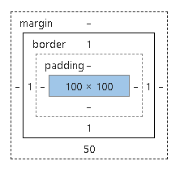

2.元素的宽高 = 内容 + padding + border

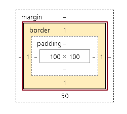

3.元素空间的宽高 = 内容 + padding + border + margin

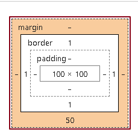

---

== 1. padding

==== padding和margin的百分比, 是相对于父元素而言的

因此, 在固定比例布局中, 使用百分比的padding，就可以实现等比例缩放，这对于自适应布局很有效果。

---

==== 在增加border 或 padding尺寸时, 让盒子尺寸不变, 而向内压缩内容的宽高 -> box-sizing: border-box

即, 元素的宽高(=边框+内边距+内容), 会永远等于width属性.

**box-sizing: border-box 的意思就是: 以border边框线为box盒子的边界(国境线), 向里(内部)来压缩内容.** +
**因此, box-sizing 只对 border 和padding有限制作用, 而对外边距margin不起作用.**

box-sizing(边框+内边距+压缩后的内容) === 内容的原始width  //注意, 不包括外边距!

[source, css]
....
div {
    float: left;
}

.cls_father {
    width: 200px;
    height: 200px;
    border: 5px solid #b00020;
}

.cls_son {
    width: 100px;
    height: 100px;
    border: 5px solid #61dafb;
}
....
上例, 由于子元素的边框, 让两个子元素的总宽高, 超出了父元素的内容宽高, 所以就破出去了.

效果 +
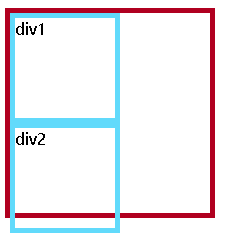

为了解决这个问题, 我们可以给子元素, 加上box-sizing属性. 保留子元素border和padding的值, 而去侵蚀子元素内容的宽高.

[source, css]
....
div {
    float: left;
}

.cls_father {
    width: 200px;
    height: 200px;
    border: 5px solid #b00020;
}

.cls_son {
    width: 100px;
    height: 100px;
    border: 5px solid #61dafb;
    box-sizing: border-box; /*加上这个属性!*/
    /*
    这个border-box值代表什么意思?
    即: 在你设定的"元素内容宽高区域内", 来绘制border和padding.
    */
}
....

效果 +
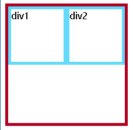

下图就是现在子元素的盒子模型值, 可以看到, 子元素的内容宽高, 变成了90px, 被侵蚀掉了10px, 即子元素两边border的值之和. +
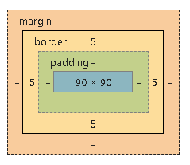

但是box-sizing属性对margin无效, 无法制约

[source, css]
....
div {
    float: left;
}

.cls_father {
    width: 200px;
    height: 200px;
    border: 5px solid #b00020;
}

.cls_son {
    width: 100px;
    height: 100px;
    background-color: #61dafb;
    margin: 5px; /*但box-sizing属性对margin无效, 无法制约*/
    box-sizing: border-box;
}
....

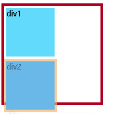

---

== 2. border

---

== 3. margin

==== 背景色会影响padding, 但不影响margin

给元素填充背景色的话, padding也会同时上色, 但margin是无法上色的.

[source, css]
....
div {
    width: 100px;
    height: 100px;
    float: left;
}

div:nth-child(1) {
    padding:30px;
    border: 10px dotted #282c34;
    margin: 50px;
    background-color: #61dafb;
}
....

效果 +

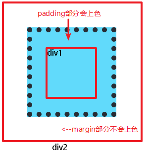

---

==== 在"标准流"中, 两元素的垂直margin, 会叠加

在标准流中, 两个元素的左右外边距, 不会叠加; 而垂直外边距, 会叠加. 合并规则是谁大就用谁的. +
但是在"非标准流"中, 就不会有这种情况。

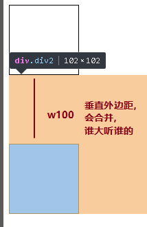

所以, 如果你想上下相连的两个盒子之间的空白，需要相互抵消时(如15px + 20px的margin，将得到20px的空白), 就用margin. +
如果你想上下相连的两个盒子之间的空白，希望等于两者之和时(如15px + 20px的padding，将得到35px的空白), 就用padding.

---

==== margin可以设负值 -> 当两个元素重叠时，后面元素, 会覆盖前面元素.

margin可以设负值, 就能做出 "圣杯布局","双飞翼布局" 等常用布局效果.

当两个元素重叠时，后面元素, 会覆盖前面元素.

---

==== 如果不设边框, 则给子元素加上margin属性, 会影响到父元素一起产生margin-top效果

不设置边框的话, 如果你给子元素设置magin属性, 会导致其父元素的头上(即 margin-top上)也一起产生外边距效果.

[source, css]
....
.cls_father {
    background-color: #abe2fb;
    width:100px;
    height:100px;
}

.cls_son {
    width: 50px;
    height: 50px;
    background-color: #b0939a;
}

.cls_son:nth-child(1){
    margin: 30px /*子元素的margin, 会影响父元素产生margin-top效果. 即使父元素没有这个属性.*/
}
....

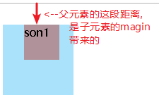

换句话说, **如果父级元素没有边框border，则子容器的margin是相对于"标准流的<body>"产生的，父级容器会跟着子容器掉下来。**即，本来给子容器设置的margin, 会传递到父元素上。

---

==== -> 解决方法1: 给父元素div1添加上border边框属性就行了

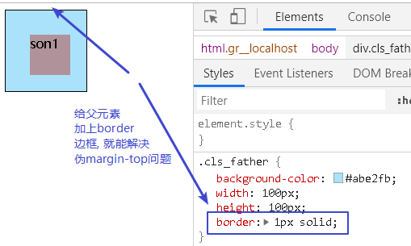

---

==== -> 解决方法2: 给父元素添加上文字, 似乎也会消除子元素的margin对父元素的影响

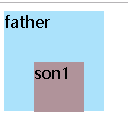

---

== 总结

==== 什么时候用margin, 什么时候用padding?

一般的原则是:

- margin本质上是用于控制"兄弟元素"关系之间的间隙, 而不是控制"父子元素"距离关系的.
- 建议尽量用padding, 因为margin对不同的浏览器显示很多不同.
- 尽量用padding标签。因为两个元素的margin垂直边距, 会产生叠加的效果。
- 在企业开发中, **如果要控制嵌套关系盒子之间的距离, 应该首先考虑padding, 其次再考虑margin. **
- margin标签少用，在开发比较大型的网站的时候，太多的margin标签会把自己弄晕。

---