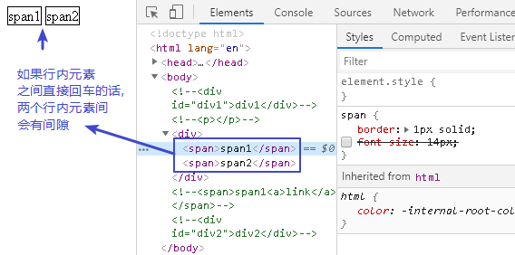
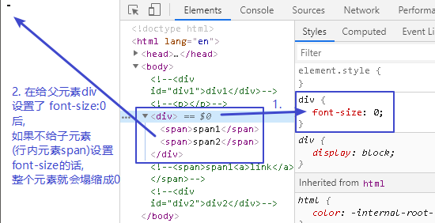
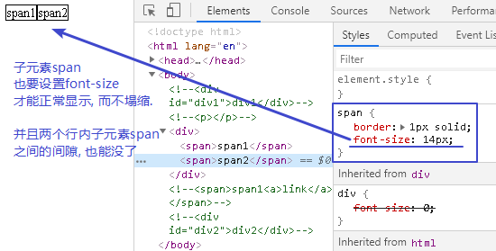
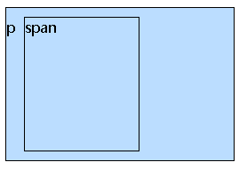

= css 块级元素, 行内元素, 行内块级元素
:toc:

---

== 1. 块级元素 -> display：block

---

== 2. 行内元素 -> display：inline

行内元素的特点:

- 不可设置宽高. 盒子的宽高, 就是它里面元素内容(比如文本内容)的宽高来撑起来的.
- 但可以设置paddding.
- margin只能够设置水平方向的边距，即：margin-left和margin-right，设置margin-top和margin-bottom无效.
- 行内元素内, 只能放行内元素，不能放块级元素(<a>除外).

---

==== (1) 多个"inline, 或inline-block"元素之间, 会有空隙问题

编辑代码时，行内元素与行内元素间, 如果有换行或者回车，会有间隙(4px).

==== -- 解决方法1: 把这些行内元素,写在同一行上

[source,html]
....

....

原因是: HTML 代码中的所有连续的空格或空行（换行）, 都会被显示为一个空格，不管是在元素内容中, 还是在元素标签之间。 +
所以, 当你想让它们在同一行连续显示的话，就让所有的代码之间没有空格，也不要换行。

---

==== -- 解决方法2: 给"父元素"或者<body>设置css属性: font-size:0; 并且行内元素也必须要设置font-size值. 不设的话, 行内元素会塌缩成0高度.

**将父元素的字体大小设为0, 就能把"空格字符"压缩成0, 因此空格就会消失. 但由于子元素是继承了父元素的font-size属性值的, 所以子元素的字体大小也被压缩成0了. 所以我们必须重新设置子元素的font-size值, 以覆盖掉父元素的font-size的0值.**

如果你只设置了父元素的font-size:0, 而没有设子元素的font-size的话, 子元素就会继承父元素的font-size属性, 导致子元素的文本变成0高度! 塌缩了. 所以子类必须设置font-size属性, 以覆盖父类的此属性值.

因此, 我们应该写成:
[source, css]
....
div{
    font-size: 0; /*父元素要设 font-size: 0*/
}

span {
    border: 1px solid;
    font-size: 14px; /*子元素(行内元素)也要设font-size属性*/
}
....

---

==== (2) 多张图片之间, 也有间隙的问题

图片的间隙问题, 也是因为我们的换行、缩进所导致的。 +
解决方法同样是: 给父元素div, 设置 font-size: 0, 图片之间的间隙就没有了.

[source,html]
....

     
     

....

[source,css]
....
div {
    font-size: 0;
}
....

---

== 3. 行内块级元素-> display：inline-block

为了能够让元素 既能够不独占一行，又可以设置宽度和高度, 可以把它设为"行内块级元素".

[source, css]
....
span {
    display: inline-block;
    width: 50%; /*设为"行内块级"元素后, 就可以给它设置宽高了*/
    height: 150px;
}
....

---

