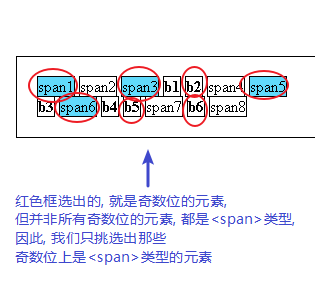
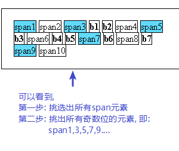
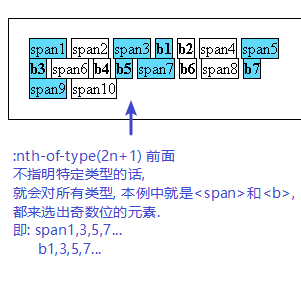

= css 伪类 pseudo-class
:toc:

---

一个冒号（:）表示伪类，两个冒号（::）表示伪元素。

---

== 选中某index位置处的, 必须是"某特定类型"的元素 -> ele:nth-child(n)

ele:nth-child(n)是指**父元素下第n个元素且这个元素为ele，若不是，则选择失败。**

n从0开始递增.  +
-n, 复制的话, 就会从负方向增加计数: 先从0 开始，之后往下 -1, -2, ...

[source,html]
....

    span1
    span2
    span3
    <b>b1</b>
    <b>b2</b>
    span4
    span5
    <b>b3</b>
    span6
    <b>b4</b>
    <b>b5</b>
    span7
    <b>b6</b>
    span8

....

[source,css]
....
span:nth-child(2n+1) {
    /*n从0开始递增, 2n+1就是选中奇数位的span元素
    本处操作, 第1步: 先挑出所有奇数位的元素,
    第2步: 再来判断该位置处的元素, 是否是类型,
    如果是, 则ok, 选中它; 如果不是, 则忽略掉它.
    */
    background-color: #61dafb;
}
....

---

== 选中"某类型"元素的, 第index位置处的元素.

ele:nth-of-type(n)是指父元素下第n个ele元素

[source,css]
....
span:nth-of-type(2n+1) {
    /*本处操作, 第1步: 先找出所有类型的元素
    第2步: 再来挑出所有处于奇数位的元素
    */
    background-color: #61dafb;
}
....

注意: 如果 ":nth-of-type" 冒号前面不指出你要寻找哪个特定元素的话, 就会对所有类型的元素, 都来查找它们某index处的元素.

比如:
[source,css]
....
.cls_father :nth-of-type(2n+1) {
    /*本处操作, 挑出每一类元素各自的处于奇数位的元素*/
    background-color: #61dafb;
}
....

---

== a链接的伪类

[source,css]
....
a:link {color:black;}
a:visited {color: #b92fff;}
a:hover {text-decoration:none;color: green}
a:active {color:red;} /*从悬浮到按下鼠标这个动作, 即active状态*/
....

注意: a链接的这4个伪类, 顺序必须如上! 否则, 浏览器可能不会显示预期结果。为了记住这4个顺序, 你可以巧记成:**“LoVe? HA!”** , 大写字母就是每个伪类的头一个字母。

---

