= css 浮动流
:toc:

---

== 浮动流的特点

- **浮动流, 不在普通流中.** 事实上, 它是一种"半脱离标准流"的排版方式.

- 浮动流只有一种排版方式: 就是水平排版. 它只能设置某个元素"左对齐"或者"右对齐". 注意: 没有"居中对齐"! 即没有center这个取值.
- 由于没有"居中对齐"这个选项, 所有在浮动流中, 也不可以使用margin: 0 auto; 的.

- 由于浮动流只能"水平左/右对齐", 所以浮动流是不区分 block, inline, inline-block的! 所有元素都可以水平排版.
- 并且既然不区分block, inline, inline-block, 因此所有元素也都能设置weight和height.

- 换言之, 浮动流中的元素, 和标准流中的inline-block元素很像.
- 垂直方向使用"标准流", 水平方向使用"浮动流".

---

== 浮动流, 只能在水平方向排版

[source, css]
....
.div1 {
    width: 30px;
    height: 30px;
    background: #00b3ff;
 }

.div2 {
    width: 50px;
    height: 50px;
    background: #5bff68;
    float: left; //浮动

}

.div3 {
    width: 30px;
    height: 30px;
    background: #ff61a6;
    float: left //浮动
}
....

上例, div1不浮动, div2和3浮动. +
由于标准流是"从上往下"排的, 所以div1(仍然是标准流) 和div2,3 , 也是上下排. +
但由于div2和3是"浮动流"的, 所以它们之间才左右排.

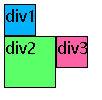

---

== 浮动流中, 所有元素都可以设置 width 和 height

下面是: 左浮动, 和 右浮动:
[source, css]
....
div, span {
    border: 1px solid;
}

div { /*父元素*/
    width: 200px;
    height: 100px;
}

span { /*子元素*/
    /*原本, 在"标准流"中的inline元素是无法设置宽高的,
     但如果它们变成了"浮动流"后, 就能设置宽高了*/
    width:50px;
    height:50px
}

span:nth-child(1) {
    float: right /*右浮动, 即相对于它的父元素的最右边对齐*/
}

span:nth-child(2) {
    float: left /*左浮动*/
}
....
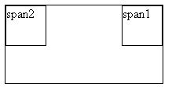

---

== block块级元素是"浮动流"的话, 会遮盖掉不浮动的元素.

如果前面一个元素(是display: block)浮动了, 而后面一个元素没有浮动 , 那么前一个元素就会(上浮)盖住后面一个元素.  +
**浮动流的元素只有遇到父级的边界, 或者相邻的浮动元素, 才会停下来.**

[source, css]
....
span:nth-child(1) {
    float: left; /*是浮动流. 左浮, 因此span1 会浮动到span2(不是浮动流)的上一层, 遮盖掉span2*/
    display: block; /*必须设成block元素才能生效*/
    background: #00B7FF;
    width:50px;
    height:50px
}

span:nth-child(2) { /*不是浮动流*/
    display: block;
    background: #b6ff9b;
    width:70px;
    height:70px
}
....

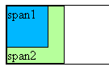

---

==== 虽然"浮动"的元素, 会遮盖掉"不浮动"的元素, 但不会遮盖"不浮动"元素中的文本内容

浮动元素不会挡住没有浮动元素中的文字, 后者元素中的文字, 会自动给浮动的元素让出位置,  这个就是浮动流元素会有"字围现象".

比如下例: 第一个图片元素左浮, 第二个文章元素不浮动. 虽然第一个元素会盖住第二个元素, 但是却不会盖住第二个元素中的文字! 文字会像流水一样, 自动让开第一个元素的位置.

[source, html]
....

Lorem100

....

[source, css]
....
.div1 {
    width: 50px;
    height: 50px;
    background: #00b3ff;
    float: left
}
....

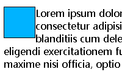

---

== 父元素如果只有一个子元素, 子元素变成浮动流后, 子元素就飞了(上浮), 就脱离了父元素的控制, 父元素就会坍塌.

在标准流中, 子元素内容的高度, 可以撑起父元素的高度. 但如果把子元素, 设置成浮动流, 父元素就会坍塌. 即, 浮动元素, 是不能够撑起父元素的高度的.

[source, css]
....
div {
    border: 1px solid;
    padding: 10px;
}

.cls_father{
    background: #61dafb;
}

.cls_son{
    width: 50px;
    height: 50px;
    float: left; /*子元素一浮动, 父元素就会塌缩*/
    background: greenyellow;
}
....

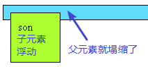

---

==== 解决方法1: 隔墙法: 给父元素一个新儿子(空div), 并让它清除左右的浮动 (不推荐使用)

注意: 在企业开发中, 隔墙法比较少用. 因为它添加了额外的空div.

但还是介绍一下: +
由于子元素变成了浮动流后, 就脱离了父元素的控制, 所以我们再给父元素添加一个儿子, 加个空div元素(称之为"隔墙"), 并把这个新儿子, 设置css属性:  clear: both; 该属性及值, 用来清除两边的浮动. +
**clear 属性规定了元素的哪边上, 不允许出现浮动元素。**

clear参数值说明：

- none : 允许两边都可以有浮动对象
- both : 不允许有浮动对象
- left : 不允许左边有浮动对象
- right : 不允许右边有浮动对象

**一个元素设置了clear属性后, 就不再向前一个浮动元素对齐，会换行, 重新开始排。**

[source, css]
....
p {
    float: left;
}

.div2 p:nth-child(1) {
    clear: left;   /*清除div2中第一个p子元素 "向左边浮动"的效果.*/
}
....

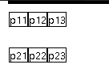

其实不一定必须是要空的
, 只要是空的"块级元素"就行，因为只有块，才可以横向撑满.

[source, html]
....

    
son

    

    <!- 由于cls_son已经浮动了, 所以脱离了标准了,
    所以我们必须再添加一个div元素, 来撑起父元素cls_father-->

....

[source, css]
....
div {
    border: 1px solid;
    /*padding: 10px;*/
}

.cls_father{
    background: #61dafb;
}

.cls_son{
    width: 50px;
    height: 50px;
    float: left; /*大儿子浮动流后, 就飞了*/
    background: greenyellow;
}

.cls_隔墙{
    clear:both; /*给父元素一个新儿子, 并给它清除两边的浮动*/
}
....

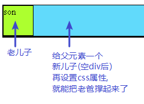

---

==== 解决方法1-2: 外墙法: 在两个浮动元素中间,添加一个空块级元素

外墙法就是, 在两个浮动元素中间, 添加一个空块级元素div, 并设置clear=both, 清除它两边的浮动效果.

[source, html]
....

    
son1

    

    <!--外墙法: 在两个浮动元素中间,添加一个空块级元素div,设置clear=both -->
    
son2

....

[source, css]
....
div {
    border: 1px solid;
    /*padding: 10px;*/
}

.cls_father{
    background: #61dafb;
}

.cls_son{
    width: 50px;
    height: 50px;
    float: left;
    background: greenyellow;
}

.cls_隔墙{
    clear:both;
}
....

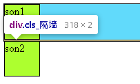

---

==== 解决方法1-3: 内墙法: 在第一个浮动元素的子元素中最后一个位置处, 加上空div作为"墙".

有两个浮动元素A和B, 要让B换行排列, 就在A内部最后位置处(即A里面的最后一个子元素位置处), 添加一个div元素, 同样设置clear=both属性.

[source, html]
....

    
son1

    
son2

    

 <!--内墙法-->

    
son3

    
son4

....

[source, css]
....
div {
    border: 1px solid;
    /*padding: 10px;*/
}

.cls_father{
    background: #61dafb;
}

.cls_son{
    width: 50px;
    height: 50px;
    float: left;
    background: greenyellow;
}

.cls_隔墙{
    clear:both;
}
....

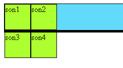

---

==== "外墙法"与"内墙法"的区别

|===
|区别 |外墙法 |内墙法

|方式:
|在两个浮动盒子"中间", 添加一个额外的空的"块级元素"
|在第一个浮动盒子里面的"所有子元素的最后", 添加一个额外的空的"块级元素"

|第1个盒子的margin-bottom属性
|失效 ×
|能生效 √

|第2个盒子的margin-top属性
|能生效 √
|能生效 √

|能否撑起第一个盒子的高度
|外墙法, 不能撑起第一个盒子的高度
|内墙法(是作为第一个盒子的子元素存在的), 可以撑起第一个盒子的高度.
|===

---

==== 解决方法2: 给父元素加上 overflow:hidden

给父元素添加一句"overflow:hidden"，就能让父元素包住离了文档流的浮动子元素.

[source, css]
....
.cls_father {
    background-color: #abe2fb;
    overflow: hidden; /*给父元素加上这个*/
}

.cls_son {
    width: 50px;
    height: 50px;
    background-color: #b0939a;
    float: left;
}
....

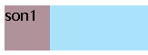

hidden是overflow属性的一个神奇用法，它可以帮助我们隐藏溢出的元素，清除浮动和解除坍塌。然而，这种方法也有一个缺点 ----使用overflow:hidden 会隐藏任何超出容器的边界的内容。

为了解决大文本问题，只需添加 word-wrap:break-word 到容器，这能迫使文本换行到一个新的行。

[source, css]
....
.container {
    word-wrap: break-word;
}
....

子元素如果是图片的话, 为了防止图像扩大超出父元素容器的边界，要添加max-width:100%，它会调整图像的大小, 以符合容器的最大宽度。

[source, css]
....
.container img {
    max-width: 100%;
    height: auto;
}
....

---

==== 解决方法3: 给父元素添加上高度 (不推荐)

在企业开发中, 我们能不写高度就不写高度, 所以这方式不推荐.

---

==== 解决方法4: 伪元素选择器, 添加一个伪的"子元素"作为"墙"

伪元素没有改变文档结构，它只是在结构外, 即在指定元素的内容前面或后面, 另加一个没有实际存在的元素（即伪元素）。

伪元素是(双冒号)，伪类是（单冒号） +
比如 ::before, 就是用来在元素之前添加内容(作为新的子元素)。

....
标签名称::before{
    属性名称:值;
}
给指定标签的内容前面添加一个"子元素"

标签名称::after{
    属性名称:值;
}
给指定标签的内容后面添加一个"子元素"
....

伪元素的特点有:

- 默认地，伪元素是inline行内元素，不过可以用display属性改变这一点。
- 伪元素中的文本等内容, 要用content属性来添加. 伪元素如果没有设置“content”属性，则该伪元素是无用的。
- 要隐藏这个新添加的伪子元素, 可以使用visibility:hidden属性.

[source, html]
....

    
son

    
son

    
son

    
son

....

[source, css]
....
div {
    /*float: left;*/
    border: 1px solid;
}

.cls_father {
    background-color: #abe2fb;
}

.cls_son {
    width: 50px;
    height: 50px;
    background-color: #b0939a;
    float: left;
}

.cls_father:nth-child(1)::after{ /*在第一个cls_father元素的内部的最后一位, 添加一个伪元素*/
    clear: both; /*同样别忘了清除两边浮动*/
    display: block;
    content: ""; /*伪元素如果没有设置“content”属性，伪元素是无用的。*/
    /*visibility: hidden;*/
    height: 10px; /*要隐藏这个伪元素, 只要把宽高设成0就行了 */
    width:10px;
    background-color: #b00020;
}
....

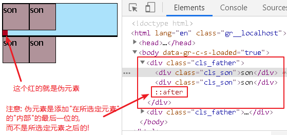

---

