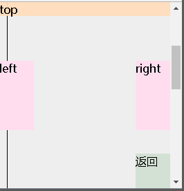

= css 定位流
:toc:

---

== 定位流的特点

一切皆为框. +
把一些文本添加到一个块级元素（比如 div）的开头。即使没有把这些文本定义为段落，它也会被当作段落对待.

[source,html]
....

    some text /*无名块框*/
    
Some more text.

....

在这种情况下，这个框称为"无名块框"，因为它不与专门定义的元素相关联。

定位的基本思想很简单，它允许你定义某盒子的"元素框"相对于"其正常位置" 偏移的位置. 基准点可以是:

|===
|偏移时的参考基准点| 是哪种定位

|相对于"原先的自己"
|-> 相对定位 position: relative;  +
和"自己"的距离关系, 是relative的

|相对于"另一个元素" +
(<body>, 或拥有postion属性的祖先元素)
|-> 绝对定位 position: absolute;  +
和"别人"的距离关系, 是absolute的

|相对于"浏览器窗口" +
(不随滚动条的滚动而移动)
|-> 固定定位 position: fixed;  +
和"浏览器窗口"的露脸face关系, 是fixed的
|===

总结:

|===
| |是否脱离"标准流" |是否区分block, inline, inline-block | 偏移时的定位参考点

|相对定位
|×
|√
|以自己原先的坐标位置, 为参考点来偏移

|绝对定位
|√
|×
|以最近的有position属性的祖先, 为参考点来偏移.  +
如果所有祖先都没有position属性, 就以<body>元素为参考点.

|固定定位
|√
|×
|以浏览器窗口的首屏, 为参考点来偏移
|===

---

== 1. 静态定位 position: static

HTML 元素的默认值，即没有定位，遵循正常的文档流对象,（忽略 top, bottom, left, right 或者 z-index 声明）。

---

== 2. 相对定位 position: relative -> 不会脱离"标准流", 以老的自身原位置为偏移基准点

- 是相对于该元素自身原先在标准流中的位置, 来进行偏移移动. 即, **以“原本该元素”的左上位置为中心点，**根据设置的left和top进行位置的偏移。
- 通过top, bottom, left, right, 来设置相对于其原先位置的偏移量。并通过z-index 来进行层次分级 。
- 它原本所占的空间仍保留.

[source,css]
....
.cls_father {
    border: 1px solid;
    width: 200px;
    height: 200px;
}

.cls_son {
    display: inline-block;
    border: 1px solid;
    width: 50px;
    height: 50px;

}

.cls_son:nth-child(2){
    position: relative; /*相对于自己原本的位置, 进行偏移*/
    left: 10px;
    top: 30px;
}
....

---

==== "相对定位"依然在标准流中, 因此依然区分 block, inline, inline-block

相对定位, 依然在"标准流"中, 因此inline元素依然是无法设置宽高的.

---

==== 同时设置"内外边距"和"相对定位", 则程序自动会做的步骤是: 先padding/margin, 后偏移

另外, 由于"相对定位"依然在标准流中, 没有"上浮"出去, 因此"相对定位"的a元素加了padding或margin后, 依然会把其他"非相对定位"的b,c...元素挤到旁边去.

比如: 有一个"相对定位"的元素div2:

[source,css]
....
.div2 {
    background: rgb(204, 227, 209);
    border: 1px solid #000;
    position: relative;
    left: 50px;
    top:50px;
}
....

image:./img_ui/css 定位流-3.png[]

下面来给它加margin和padding属性, css渲染时的步骤其实是这样的:

1. div2先添加padding和margin
2. div3根据第(1)步中的div2的内外边距位置,  来进行"让位".
3. 然后div2再进行偏移.
:

[source,css]
....
.div2 {
    background: rgb(204, 227, 209);
    border: 1px solid #000;
    position: relative; /*相对定位*/
    left: 50px;
    top:50px;
    margin: 40px; /*加上外边距*/
    padding: 10px; /*加上内边距*/
}
....

可以看到, div3受到了div2的内外边距的影响, 而移位了.

注意, 上面div3 和 div2 重叠的一部分. 这正是 div2先padding/margin, 再偏移 后的结果. +
由于"相对定位"的div2依然在标准流中, 所以div3永远会根据老的(未偏移的)div2的位置, 来确定自己的位置.

---

== 3. 绝对定位 position: absolute -> 会脱离标准流, 以拥有"定位流"(有奶)的祖先元素为参考点 (有奶便是娘)

- 绝对定位, 就是相对于<body>, 或者某个定位流中的祖先元素来定位。
- 默认情况下, 所有的"绝对定位"的元素, 无论有没有祖先元素, 都会以body作为参考点.
- 如果一个"绝对定位"的son元素有祖先元素, 并且该祖先元素中, 有一个father元素拥有"定位流"属性(即它有position属性), 则该son元素,就会以拥有position属性的father元素作为参考点.
- 如果该son元素, 有多个祖先father元素, 都有position属性, 那son会以离它最近的那个father元素, 作为偏移时的参考点.
- **绝对定位的元素是脱离"标准流"的**, 不会占用标准流中的位置.

[source,css]
....
.cls_father {
    border: 1px solid;
    width: 200px;
    height: 200px;
    position: relative;
    left: 10px;
    top: 50px;
}

.cls_son {
    display: inline-block;
    border: 1px solid;
    width: 50px;
    height: 50px;

}

span{
    border: 1px solid;
    position: absolute; /* "绝对定位"会使元素脱离"标准流"*/
    left: 10px;
    top: 40px;
    height: 50px; /*既然已经脱离"标准流", 则所有元素,都可以设置宽高*/
    background-color: #61dafb;
}
....

如果一个绝对定位的元素(x), 有祖先元素, 并且祖先元素也是定位流, 而且祖先元素中, 有多个元素都是定位流, 则这个x元素, 会以离他最近的那个拥有定位流的祖先元素, 为参考点. (有奶便是娘, 无论有奶的是爸爸, 爷爷, 还是先祖)

[source,css]
....
.爷爷{
    width: 150px;
    height: 150px;
    background: #fee4e3;
    position: absolute;
    top: 50px;
    right: 25px;
}

.爸爸{
    width: 100px;
    height: 100px;
    background: #cce3d1;
    position: relative;
}

.儿子 {
    width: 50px;
    height: 50px;
    background: #c6c0e2;
    position: absolute;
    /*既然爸爸和爷爷, 都有奶(是定位流),
     则儿子就找离它最近的有奶的元素, 即爸爸, 作为参考点.*/
    bottom: 20px;
    right: 20px;
}
....

---

==== 绝对定位, 脱离了标准流. 因此所有元素不再区分block, inline, inline-block了, 都可以设置宽高

---

==== "绝对定位"的元素, 若其父元素没有设置position属性, 则以<body>为基准来进行偏移

绝对定位"的盒子(元素), 是相对于离它最近的一个"已定位的"盒子进行定位的（默认是<body>）；离他最近的盒子的定位, 可以是"相对定位"（relative）的, 也可以是"绝对定位"（absolute）的, 也可以是固定定位(fixed) , 但不能是静态定位static.

**在开发中，一般操作是: 将父元素设置成"相对定位"的**(但是不代表只能是相对定位). +
**"绝对定位"大多配合"相对定位"来使用，一般不会单独出现。即, 父元素设成"相对定位", 子元素设成"绝对定位". 即-> "子绝父相".**

[source,css]
....
.cls_father {
    border: 1px solid;
    width: 200px;
    height: 200px;
    position: relative; /*父元素相对定位*/
    left: 10px;
    top: 50px;
}

.cls_son {
    display: inline-block;
    border: 1px solid;
    width: 50px;
    height: 50px;

}

span{
    border: 1px solid;
    position: absolute; /* "绝对定位"会使元素脱离"标准流"*/
    right: 0px;
    bottom: 0px;
    height: 50px; /*既然已经脱离"标准流", 则所有元素,都可以设置宽高*/
    background-color: #61dafb;
}
....

绝对定位的元素, 如果其父元素, 没有设置过定位的话(即没有设置position属性的话)，则默认就会以<body>来作为偏移的基准点. <body>的边界位置处, 就是0, 越向页面里面走, 数值越大.

如果一个绝对定位的元素是以<body>作为参考点, 那么它其实是以**网页"首屏"的宽度和高度**作为参考点, 而不是以"整个网页"的宽度和高度作为参考点.

---

==== 父相子绝 -> 父元素用"相对定位", 子元素用"绝对定位"

相对定位和绝对定位, 一般都是用来做覆盖效果的, 当看到某个元素覆盖在另外一个元素上时, 第一时间就要想到定位流。 +
** 换句话说, 父元素用(父相)"相对定位", 没有脱离标准流, 就能用来做"画面的ps背景图层"; 子元素用(子绝)绝对定位, 已经脱离标准流了, 上浮了, 就能用来做"ps前景图层". 这样父子元素之间, 就有了"上下图层"的关系, 可以用来做"覆盖"等效果的布局了.**

定位元素的覆盖关系:

- 默认情况下, **有定位的元素, 一定会盖住没有定位的元素.**
- 默认情况下, 写在后面的定位元素, 会盖住前面的定位元素.
- 默认情况下, 所有元素的z-index值都是0, 如果设置了元素的z-index值, 那么谁比较大, 谁就显示在前面.

案例: 在某菜单上面, 做一个固定的红色的小icon

"相对定位"的弊端: +
由于"相对定位"不会脱离"标准流", 会继续在标准流中占用一份空间, 所以不利于布局界面.

[source,html]
....
<ul>
    <li>name1</li>
    <li>name2</li>
    <li>name3</li>
    <li>name4
        </img></li>
    <li>name5</li>
    <li>name6</li>
    <li>name7</li>
    <li>name8</li>
</ul>
....

[source,css]
....
* {
    margin: 0;
    padding: 0;
}

ul {
    --宽度: 800px;
    --高度: 50px;
    list-style: none;
    width: var(--宽度);
    height: var(--高度);
    background: #bbddff;
    margin: 0 auto;
    margin-top: 50px;

}

ul li {
    float: left;
    width: calc(var(--宽度) / 8);
    line-height: var(--高度);
    /*将文字行高,设置为与盒子一致后, 文字就能相对于盒子垂直居中*/
    text-align: center; /*文字水平居中*/
    position: relative;
    /*要想使下面的img元素相对于这里的li父元素, 使用"绝对定位",
    这里的父元素也必须是一个定位流!!*/
}

ul li:nth-child(4) {
    background: yellow;
}
ul li:nth-child(4) img{
    position: absolute; /*绝对定位*/
    top:0;
    left: calc(var(--宽度)/8/2);
}
....

- "子绝(绝对定位)父相(相对定位)" : 子元素用"绝对定位", 父元素用"相对定位", 这样, 子元素就以父元素为参考点, 来定位自己.
- 如果子元素不使用"绝对定位", 使用"相对定位"就会保留子元素老的身体所在位置, 不利于布局.
- 如果父元素不使用"相对定位", 子元素就不会以父元素作为移动参考点, 而是以<body>元素作为参考点.

但, 上面的, 还没有完全水平居中, 如何做到真正的水平居中呢?

---

==== 让"绝对定位"的元素"水平居中"

在"绝对定位"中, 不存在 margin: 0 auto 属性来设置水平居中. 因此这个属性设置无效.

我们可以用一种技巧来做, 分两步:

1. 把子元素, 先向右移, 空出左边(父元素的一半宽度)
2. 然后, 再把子元素, 向左移(自身的一半宽度)
这样, 子元素最终就会是在父元素的水平居中位置处.

[source,css]
....
* {
    margin: 0;
    padding: 0;
}

ul {
    --ul宽度: 800px;
    --ul高度: 50px;
    list-style: none;
    width: var(--ul宽度);
    height: var(--ul高度);
    background: #bbddff;
    margin: 0 auto;
    margin-top: 50px;

}

ul li {
    float: left;
    --子元素li的宽度 : calc(var(--ul宽度)/8);
    width: var(--子元素li的宽度);
    line-height: var(--ul高度);
    /*将文字行高,设置为与盒子一致后, 文字就能相对于盒子垂直居中*/
    text-align: center; /*文字水平居中*/
    position: relative;
    /*要想使下面的img元素相对于这里的li父元素, 使用"绝对定位",
    这里的父元素也必须是一个定位流!!*/
}

ul li:nth-child(4) {
    --img的宽度:24px;
    background: yellow;
}
ul li:nth-child(4) img{
    position: absolute; /*绝对定位*/
    top:0;
    left: 50%;  /* 第1步: 左边空出父元素宽度的一半*/
    margin-left: calc(var(--img的宽度)/2*(-1));
    /*第2步: img的左侧外边距, 再往左边移动 img自身宽度的一半.*/
}
....

image:./img_ui/css 定位流-12.png[]

---

==== 一个"绝对定位"的元素, 会忽略祖先元素的padding, (但不会忽略祖先元素的margin)

[source,css]
....
.cls_father {
    border: 1px solid;
    width: 200px;
    height: 200px;
    position: relative; /*父元素是相对定位*/
    left: 10px;
    top: 50px;
    padding:20px; /*父元素有padding*/
}

span{
    border: 1px solid;
}

span:nth-child(2) {
    position: absolute; /*第二个span(子元素) 是绝对定位*/
    left: 150px;
    top: 50px
}
....

image:./img_ui/css 定位流-8.png[]

---

== 4. 固定定位 -> 脱离了"标准流"

- 固定定位, 可以让某个盒子, **不随着滚动条的滚动而滚动。无论滚动条移到哪里, 该元素永远在你眼前固定住.**
- 固定定位的元素, 是**脱离"标准流"**的, 不会占用"标准流"中的位置.
- 正因为它脱离了标准流, 因此也就不区分block, inline, inline-block了.

[source,css]
....
span:nth-child(2) {
    position: fixed; /*固定定位*/
    left: 150px;
    top: 50px
}
....

"固定定位"的应用场景有:

- 网页对联广告
- 网页头部通栏(穿透效果)
- 回到顶部按钮

练习, 实现下面的页面, 有四个元素是固定定位的 +

[source,html]
....

content

top

left

right

<a class="back" href="#">返回</a>  // a标签的链接的值, #号即默认返回顶部.
....

[source,css]
....
* {
    margin: 0;
    padding: 0;
}

body {
    background: #eeeeee;
}

.top {
    width: 100%;
    height: 20px;
    background: #ffddbbee;
    position: fixed; /*固定定位*/
    top: 0;
    left: 0;
}

.left, .right {
    --宽_两侧:50px;
    --高_两侧:100px;
    width: var(--宽_两侧);
    height: var(--高_两侧);
    background: #ffddeeff;
}

.left {
    position: fixed; /*固定定位*/
    left: 0;
    top: calc(50% - calc(var(--高_两侧)/2)); /*距离顶部是, 页面高度的一半处,再减去(即再向上移动)自身高度的一半, 即能垂直居中*/
}

.right {
    position: fixed; /*固定定位*/
    top: calc(50% - calc(var(--高_两侧)/2));
    right: 0;
}

.back {
    width: 50px;
    height: 50px;
    background: #d3e0d4;
    position: fixed; /*固定定位*/
    bottom: 0;
    right: 0;
}

.content {
    width: 10px;
    height: 1000px;
    border: 1px solid #000;
}
....

---

== 5. z-index属性

- z-index 属性设置元素的堆叠顺序, 即: 该属性设置一个定位元素沿 z 轴的位置。如果为正数，则离用户更近，为负数则表示离用户更远。
- Z-index 仅能在拥有position属性的元素身上奏效!
- 默认情况下, 所有元素的z-index值都是0, 如果设置了元素的z-index值, 那么谁比较大,谁就显示在前面.
- 父元素没有z-index值, 那么子元素谁的z-index大, 谁盖住谁.
- 父元素z-index值不一样, 那么父元素谁的z-index大, 谁盖住谁.

---

==== 默认情况下, "定位流"的元素, 会覆盖住"标准流"的元素.

[source,css]
....
div {
    width: 100px;
    height: 100px;
}

.div1 {
    background: #fce7e0;
}

.div2 {
    background: #d3e0d4;
    position: relative; /*定位流---相对定位*/
    top: 50px;
    left: 50px;
}

.div3 {
    background: #deeff0;
}
....

---

==== 默认情况下, "定位流"的元素, 后面编写的, 会覆盖前面编写的

[source,css]
....
div {
    width: 100px;
    height: 100px;
}

.div1 {
    background: #fce7e0;
    position: absolute; /*定位流---绝对定位*/
    top: 0;
    left: 0;
}

.div2 {
    background: #d3e0d4;
    position: absolute; /*定位流---绝对定位*/
    top: 50px;
    left: 50px;
}

.div3 {
    background: #deeff0;
    position: absolute; /*定位流---绝对定位*/
    top: 100px;
    left: 100px;

}
....

---

==== z-index值越大, 离你就越近

有时, 你会遇到导航条被遮蔽的情况, 如: +

这时,你就可以给导航条设置 z-index值, 提高它的权重.

[source,css]
....
.导航条 {
    width: 100%;
    height: 20px;
    background: #c7bee1;
    position: fixed;
    z-index: 1;  //默认值为0, 现在增加权重到1
    text-align: center;
}
....

---

==== 从父现象(拼爹原则)

- 如果两个子元素的父元素, 都没有设置 z-index属性的话, 那么就看子元素本身的 z-index属性的值, 谁大谁就显示在最上层.

- 如果两个子元素的父元素, 有设置了 z-index属性, 那么子元素的 z-index属性就会失效, 就看它们的父元素的z-index属性谁大,  哪个爹的值大, 谁的儿子就显示在最上层.

下面, 两个父元素没有 z-index属性, 就看各自的子元素, 谁的 z-index属性的值更大了.

[source,html]
....

f1
    
s1

f2
    
s2

....

[source,css]
....
.son1 {
    background: #c7bee1;
    position: fixed;
    top: 20px;
    left: 20px;
    z-index: 2;
}

.son2 {
    background: #f9ead1;
    position: fixed;
    top: 40px;
    left: 40px;
    z-index: 1;

}
....

下面, 两个父元素有 z-index属性, 就不看各自的子元素了, 看各自的父亲本身, 谁的 z-index属性的值更大, 谁的儿子就排在最上层.

[source,css]
....
.son1 {
    background: #c7bee1;
    position: fixed;
    top: 20px;
    left: 20px;
    z-index: 2;
    /*由于父元素有 z-index属性, 所以子元素的这个z-index属性就无效了*/
}

.son2 {
    background: #f9ead1;
    position: fixed;
    top: 40px;
    left: 40px;
    z-index: 1; /*无效*/
}

.father1 {
    position: relative;
    /*要想使用z-index属性, 本元素必须是定位流,
    至于是相对定位/ 绝对定位/ 固定定位,  用哪个都无所谓, 只要不是静态定位就行!*/
    z-index: 1;
}

.father2 {
    position: relative;
    z-index: 2; /*父亲有z-index属性, 就比较父亲间的哪个大*/
}
....

---

== 案例试验

==== "父相子绝" 练习1

布局这个界面: +

[source,html]
....

    
    
    
    
Lorem ipsum dolor sit amet, consectetur adipisicing elit. Aliquam, vitae.

....

[source,css]
....
* {
    margin: 0;
    padding: 0;
}

.father {
    --div宽:300px;
    --div高:300px;
    border: 1px solid #000;
    position: relative; /*父相*/
    width: var(--div宽);
    height: var(--div高);
    background: #bbddff;
    margin: 0 auto;
    margin-top: 100px;
}
div .img_主图{
    width: var(--div宽);

}
div .img_热{
    width: calc(var(--div宽)/5);
    /* display: block; */  // 绝对定位的元素会脱离标准流, 所以这条语句就没用了.
    position: absolute;
    left:0;
    top:0;
}

div .img_价格{
    width: calc(var(--div宽)/2);
    /* display: block; */
    position: absolute; /*子绝*/
    top:100px;
    left: -10px;
}

div .内容介绍 {
    width:var(--div宽);
    padding: calc(var(--div宽)/20) calc(var(--div宽)/10);
    box-sizing: border-box;
}

....

---

==== "父相子绝" 练习2

布局这个界面: 左右有箭头, 并且右下角有自动翻页数字 +

[source,html]
....

    
    
(-

    
-)

    <ul>
        <li>1</li>
        <li>2</li>
        <li>3</li>
        <li>4</li>
        <li>5</li>
    </ul>

....

[source,css]
....
* {
    margin: 0;
    padding: 0;
}

.father {
    --宽: 500px;
    --高: 280px;
    width: var(--宽);
    height: var(--高);
    border: 1px solid #000;
    margin: 0 auto;
    margin-top: 100px;
    position: relative; /*父相*/
}

.father img {
    width: var(--宽);
    height: var(--高);
}

.left_arrow, .right_arrow {
    --箭头图宽: 30px;
    --箭头图高: 50px;

    width: var(--箭头图宽);
    height: var(--箭头图高);
    background: rgba(0, 0, 0, 0.5);
    line-height: var(--箭头图高); /*设置行高, 文本垂直居中*/
    text-align: center; /*文本水平居中*/
    color: white;

}

.left_arrow {
    position: absolute; /*子绝*/
    left: 0px;
    top: calc(var(--高) / 2);
    margin-top: calc(var(--箭头图高) / 2 * (-1))
}

.right_arrow {
    position: absolute; /*子绝*/
    right: 0;
    top: calc(var(--高) / 2);
    margin-top: calc(var(--箭头图高) / 2 * (-1));

}

ul {
    --ul宽: calc(var(--宽) / 3);
    --ul高: 30px;
    width: var(--ul宽);
    height: var(--ul高);
    background: #bbddff;
    list-style: none;

    position: absolute; /*子绝*/
    /*left: var(--宽);*/
    /*  left和right,只要写一个就行了, 既然下面写了right, 这里就不需要left语句了.*/
    right: 10px;
    /*top: var(--高);*/
    /*  top和bottom,两者也只要写一个就行了, 既然下面谢了bottom, 这里就不需要再写top了*/
    bottom:10px;
    /*margin-left: calc(var(--ul宽)*(-1));*/
    /*margin-top: calc(var(--ul高)*(-1));*/
}

ul li {
    float: left;
    width: calc(var(--ul宽) / 5);
    line-height: var(--ul高);
    text-align: center;

}

....

---

