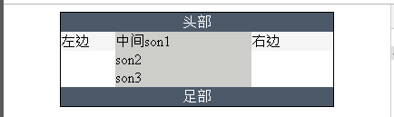

= css 布局
:toc:

---

== 布局的原则:
- 先用标准流,布局从上往下的大块; +
再用浮动流, 布局每一个大块中的从左到右的小块.
- 绝大多数情况下, 都不要去设定元素的"高度". 只需设置"宽度".

---

== 水平居中

==== "子元素"在"父元素"中 "水平居中" -> margin:0 auto

margin: 0 auto 能实现子元素盒子, 在父元素中"水平居中" (但不能实现"垂直居中").

单个盒子元素要居中, 可以设置为 **margin:0 auto，意思就是上下边距为0，左右边距为auto，就是自动适应(宽度相等)。**

为什么auto能实现水平居中？这是因为**水平方向的 auto，其计算值取决于可用空间（剩余空间）。**

[source, css]
....
div {
    /*float: left;*/
    /*
    注意:加入margin:0 auto, 就不能加入float浮动样式!
    否则 margin:0 auto 会失效
    */
    border: 1px solid;
}

.cls_father {
    width: 200px;
    height: 200px;
    background-color: #abe2fb;
}

.cls_son {
    width: 100px;
    height: 100px;
    background-color: #b0939a;
    margin: 0 auto; //加入这句!
}
....

效果 +

下面, 想象这样一个场景，一个宽100px的p被包含在一个宽500px的div内，此时设置 p 的 margin-left 值为 auto，大家觉得结果会怎样？

[source, html]
....

father 
son

....

[source, css]
....
div {
    width: 200px;
}

p {
    width: 50px;
    margin-left: auto;
}
....

结果得到了，p相对于包含块(father)右对齐了，这与规范描述一致。margin-left:auto; 自动占据了包含块的所有可用空间，即 500 - 100px = 400px。也就是说auto最后的计算值为400px，即margin-left:400px;

那么同理, 如果是margin-right: auto; 则结果会相当于左对齐。

到这里，相信大家都知道为什么 margin: auto; 和 margin: 0 auto; 能实现水平居中了。因为左右方向的auto值, 均分了可用空间，使得块元素得以在包含块内居中显示。

---

==== 区别: margin: 0 auto (让子元素在父元素中水平居中), 和 text-align: center (让盒子内的文字或图片水平居中)

|===
|属性 |功能

|text-align: center
|是设置"文字和图片"的水平居中.

|margin: 0 auto
|是设置"元素盒子自己"相对于父元素, 是否水平居中.
|===

margin属性可以有 1 到 4 个值。
[source, css]
....
margin:10px 5px 15px 20px;  /*表示:上, 右, 下, 左的外边距.*/
margin:10px 5px 15px;       /*上10, 左右5, 下15 px*/
margin:10px 5px;            /*上下10, 左右5 px*/
margin:10px;                /*4 个外边距都是 10px*/
....

如果margin的值是auto, 意思是: 让浏览器自己计算外边距。

[source, css]
....
.son1{
    width: 150px;
    height: 150px;
    background: #99bb33;
    margin: 0 auto; //让本元素相对于父元素, 水平居中
}
....

效果 +

[source, css]
....
.son1{
    width: 150px;
    height: 150px;
    background: #99bb33;
    margin: 0 auto;
    text-align: center; // 文字或图片, 水平居中
}
....

效果 +

---

==== 让"文本"在"父元素"中"水平居中" -> text-align: center;

对文本, 想要它水平居中，只需要对其"父级元素"设置text-align: center;

[source,html]
....

    Lorem ipsum.

....

[source,css]
....
.cls_father {
    border: 1px solid;
    width: 200px;
    height: 200px;
    text-align: center; /*在父元素中加上这句, 就能让文本水平居中*/
}
....

---

== 垂直居中

要实现元素的"垂直居中"，有人会想到css中的vertical-align属性，但是它只对拥有valign特性的元素才生效，例如表格元素中的<td>、<th>、<caption>等. 而像
、这样的元素是没有valign特性的，因此使用vertical-align对它们不起作用。

==== "子元素"在"父元素"中 "垂直居中" ->

---

==== "单行文本"垂直居中 -> 将文本的line-height值, 和其父元素的height值, 设为一致即可

对于单行文本，我们只需要将"文本行高"(line-height)和"所在区域高度"(height)设为一致即可.

[source,html]
....

    Lorem ipsum.

....

[source,css]
....
.cls_father {
    border: 1px solid;
    width: 200px;
    height: 100px;
    line-height: 100px; /*设置line-height 与父级元素的height相等*/
    text-align: center; /*设置文本"水平居中"*/
    overflow: hidden; /*防止内容超出容器 或者产生自动换行*/
}
....

---

==== "多行文本"垂直居中 / 父级元素高度"不固定"

多行文本垂直居中分为两种情况:

- 一个是父级元素高度"不固定"，随着内容变化；
- 另一个是父级元素高度"固定"。

**父级高度不固定的时，父级元素的高度会被内部文本撑开。**所以, 我们可以通过给父元素设置内填充（padding）, 来使子元素文本, 看起来像是在父元素中垂直居中的样子.只需设置父元素的padding-top和padding-bottom的值相等：

比如, 默认情况下, 父元素没有高度时, 会这个效果:

[source,html]
....

    Lorem ipsum dolor sit amet, consectetur adipisicing elit. Amet, iusto?

....

[source,css]
....
.cls_father {
    border: 1px solid;
    width: 200px; /*父元素没有设置高度*/
    text-align: center; /*设置文本水平居中*/
}
....

效果 +

下面, 我们来给"父元素"加上相同值的"上下内边距", 让"子元素"看起来貌似是在父元素中"垂直居中"的效果.

[source,css]
....
.cls_father {
    border: 1px solid;
    width: 200px;
    text-align: center; /*设置文本水平居中*/
    padding: 50px 0; /*给父元素,设置相同的上下padding*/
}
....

---

==== "多行文本"垂直居中 / 父级元素高度"固定"

---

== 三栏 /父元素固定宽度

[source,html]
....

    
左边

    

        
中间son1

        
son2

        
son3

    

    
右边

....

[source,css]
....
.cls_father {
    border: solid 1px;
    margin: 0 auto; /*水平居中对齐*/
    width: 300px;
}

.cls_father::after{
    /*给父元素中最后一个子元素后, 加上一个伪元素, 用来撑起父元素的高度.
    因为父元素的子元素都是浮动流, 飞走了, 父元素会坍塌. */
    clear: both;
    content: '';
    display: block;
    height: 0;
}

.cls_left {
    float: left; /*为了横向排, 需要设成浮动流*/
    width: 20%;
    background-color: rgb(245, 245, 245);
}

.cls_center { /*为了横向排, 需要设成浮动流*/
    float: left;
    width: 50%;
}

.cls_son {
    background-color: #cdcdc9;
}

.cls_right{
    float: left; /*为了横向排, 需要设成浮动流*/
    width: 30%;
    background-color: rgb(245, 245, 245);
}
....

**通常, 整个father元素的宽度, 常常设成960px**, 因为这个宽度适合所有现代显示器，而且**能
够被16、12、10、8、6、5、4 和3 整除**，不仅容易计算等宽分栏的数量，而且计
算结果也能得到没有小数的像素数。

---

==== 加上"头部", "足部"栏

[source,html]
....

    
头部

    
左边

    

        
中间son1

        
son2

        
son3

    

    
右边

    
足部

....

[source,css]
....
.cls_father {
    border: solid 1px;
    margin: 0 auto; /*水平居中对齐*/
    width: 300px;
}

.cls_father::after{
    /*给父元素中最后一个子元素后, 加上一个伪元素, 用来撑起父元素的高度.
    因为父元素的子元素都是浮动流, 飞走了, 父元素会坍塌. */
    clear: both;
    content: '';
    display: block;
    height: 0;
}

.cls_left {
    float: left; /*为了横向排, 需要设成浮动流*/
    width: 20%;
    background-color: rgb(245, 245, 245);
}

.cls_center { /*为了横向排, 需要设成浮动流*/
    float: left;
    width: 50%;
}

.cls_son {
    background-color: #cdcdc9;
}

.cls_right{
    float: left; /*为了横向排, 需要设成浮动流*/
    width: 30%;
    background-color: rgb(245, 245, 245);
}

.cls_head, .cls_foot {
    background-color: #4c5969;
    color: white;
    text-align: center;
    clear: both; /*清除两边浮动, 即让本元素另起一行排*/
}
....

