= flex布局 (Flexible Box 弹性布局)
:toc:
---

== 基本概念: 容器（flex container）

官方文档 https://developer.mozilla.org/zh-CN/docs/Web/CSS/flex

任何一个容器都可以指定为 Flex 布局。容器内的所有子元素, 自动成为容器成员，称为 Flex 项目（flex item），简称"项目(即子项)"。

image:./img_ui/flex-1.png[]

注意: **设为 Flex 布局以后，子元素的float、clear和vertical-align属性将失效。**

[source, css]
....
.box{
  display: flex;
}
....

行内元素也可以使用 Flex 布局。
[source, css]
....
.box{
  display: inline-flex;
}
....

Webkit 内核的浏览器，必须加上-webkit前缀。
[source, css]
....
.box{
  display: -webkit-flex; /* Safari */
  display: flex;
}
....

---

== 第一个例子

由于一个容器,包含着里面的子项, 所以flex的属性, 也就分成"容器属性"和"子项属性"两大类.  +
下面是第一个例子, 请注意哪些属性是专属于"容器"的(不能用在"子项"上), 哪些属性是专属于"子项"的(不能用在"容器"上).

效果 +
image:/img_ui/flex布局_第一个例子.png[]

[source, typescript]
....
import React from 'react';
import ReactDOM from 'react-dom';
import Chance from 'chance' //该模块能生成随机数据

let insChance = new Chance() //生成实例

export default class Cpn_Index extends React.Component {
    constructor(props) {
        super(props)
        this.state = {
            wordBeClicked: '', //被点击到的单词
            arrName: [], //该数组会由生命周期函数componentDidMount()来初始化它
        }
    }

    render() {
        return (
            <React.Fragment>
                
index

                

                    {this.state.arrName.map((item, index, arr) => {
                        return (
 {
                                this.fn_theWordBeClicked(event)
                            }}
                        >{item}
)
                    })}
                

                
点击的单词是: {this.state.wordBeClicked}

            </React.Fragment>
        )
    }

    componentDidMount() {
        let arrName = []
        for (let i = 0; i < 20; i++) {
            arrName.push(`"(${i+1}) ${insChance.name()}",`) //给state中的arrName数组, 增添20个元素
        }
        this.setState({arrName: arrName})
    }

    fn_theWordBeClicked = (event) => {
        this.setState({wordBeClicked: event.target.innerText})
    }
}

let objCss = {
    容器: { /*里面有专属于容器的flex属性*/
        display: 'flex',
        height: '200px',
        border: "solid 1px",
        // flexDirection: 'row-reverse', /*每行中的元素, 从右到左排*/
        flexWrap: 'wrap', /*一行超过容器宽度, 就换行*/
        alignContent: "flex-start", //行与行的行距, 不平均分配容器的高度, 而是采用默认的固定行距.
    },

    子项: { /*里面有专属于子项的flex属性*/
        width: '33.33%',
        // flexGrow: 1, //一行中无论有几个元素, 都平均分配容器的宽度
    }
}
....

---

== + 总结

|===
|属性添加在哪个上面? |属性 |属性

|容器(父元素) +
display:flex;
|(1) 主轴的**箭头方向**  +
**flex-direction**
|(4) 子元素的**水平对齐**方式 +
**justify-content** +
记忆: **首字母jc(警察),有肌肉(row 即"行"), "行"是"水平"上的.**

|
|(2) 子元素是否**换行**  +
**flex-wrap**
|(5) 子元素的**垂直对齐**方式 +
**align-items** +
记忆: **首字母ai(爱), 爱的要轰轰烈烈（column列），所以是"列"上面的.**

|
|(3) 主轴方向(flex-direction) + 子元素是否换行(flex-wrap)  +
=  简写 **flex-flow** +
- 记忆: **是否像水一样能"流动"(换行)**
|(6) 子元素**多行的垂直对齐**方式 +
**align-content** +
记忆: **首字母ac(爱吃), 爱吃很多类东西, 所以是"多行"**
|
|
|

|item项目(子元素)
|(1) 子元素**瓜分**父元素的**剩余空间**  +
**flex-grow** +
- 默认为0, 值即分子. +
- 本item的占比数/所有item的占比总数
|(5) 子元素在排队上的**插队权重** +
**order** +
- 默认为0. 数值越小, 越排前面

|
|(2) 子元素总宽超过父元素时, 如何**压缩** +
**flex-shrink** +
- 默认为1, 值越大, 压缩越厉害. +
- 值为0时, 不压缩
|(6) 单个子元素**各自的垂直对齐**方式 +
**align-self** +
- 能覆盖align-items属性.
- 默认为auto, 表示继承父元素的align-items属性. 如果没有父元素, 则等同于stretch

|
|(3) 子元素的**初始宽度**(即在拿到瓜分或压缩前的宽度) +
**flex-basis** +
- 能覆盖width属性
- 默认值auto,即item的本来大小。
|

|
|(4) flex-grow + flex-shrink + flex-basis +
=简写 **flex** +
- 默认为 0 1 auto; +
- 值 auto表示 1 1 auto, 即:可瓜分,可压缩; +
- 值none表示0 0 auto, 即:不瓜分, 也不压缩
|

|===

---

== 容器的6个属性

==== 容器属性1: 主轴的方向（即容器里面的item的排列方向） -> flex-direction

[source, css]
....
.box {
  /*flex-direction属性, 有4个值*/
  flex-direction: row | row-reverse | column | column-reverse;
}
....

[source,css]
....
.cls_father {
    display: flex; /*指定为flex容器*/
    border: 1px solid;
    margin: 30px;
    padding: 10px;
    width: 100px;
}

/*flex-direction是容器属性, 要加在flex容器身上, 而不是它里面的item身上!*/
.cls_father:nth-child(1) {
    flex-direction: row;
    /*（默认值）主轴为水平方向，从左向右。 → */
}

.cls_father:nth-child(2) {
    flex-direction: row-reverse;
    /*主轴为水平方向, 从右向左, ← */
}

.cls_father:nth-child(3) {
    flex-direction: column;
    /*主轴为垂直方向, 从上往下, ↓ */
}

.cls_father:nth-child(4) {
    flex-direction: column-reverse;
    /*主轴为垂直方向, 从下往上, ↑ */
}

span { /*既然其父元素是"flex容器", 则里面的子元素span, 就是"容器成员"item了*/
    border: 1px solid;
}
....

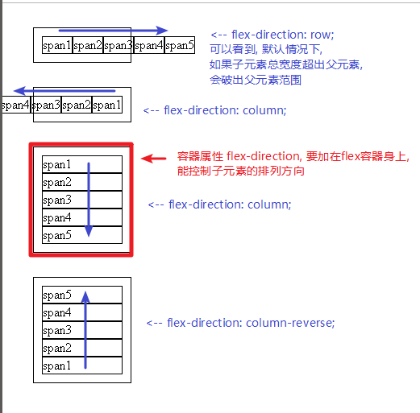

---

==== 容器属性2: flex-wrap -> 子元素总宽超出容器(即父元素)的范围后, 是否换行?

默认情况下，子元素item都只排在一条线（又称"轴线"）上。如果一条轴线排不下，你可以使用flex-wrap属性, 来让子元素换行。

[source,css]
....
.box{
  flex-wrap: nowrap | wrap | wrap-reverse;
}
....

flex-wrap 属性有3个值:

|===
|值 |功能

|nowrap
|（默认）：不换行

|wrap
|换行，第一行在上方.

|wrap-reverse
|换行，第一行在下方. 从下往上换行

|===

[source,css]
....
.cls_father {
    display: flex; /*指定为flex容器*/
    border: 1px solid;
    margin: 30px;
    padding: 10px;
    width: 100px;
}

/*flex-wrap是容器属性, 要加在flex容器身上, 而不是它里面的item身上!*/
.cls_father:nth-child(1) {
    flex-wrap: nowrap;
    /*（默认）：不换行 */
}

.cls_father:nth-child(2) {
    flex-wrap: wrap;
    /*换行，第一行在上方 */
}

.cls_father:nth-child(3) {
    flex-wrap: wrap-reverse;
    /*换行，第一行在下方 */
}

span { /*既然其父元素是"flex容器", 则里面的子元素span, 就是"容器成员"item了*/
    border: 1px solid;
}
....

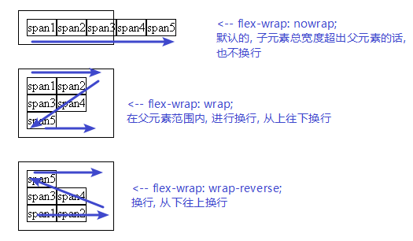

---

==== 容器属性3: flex-flow -> 是 flex-direction 和 flex-wrap属性 的简写形式

....
flow: 流动. 换言之, 即子元素是否在父元素容器内"流动"(即换行)
....

默认值为row nowrap。

[source,css]
....
.box {
  flex-flow: <flex-direction> || <flex-wrap>;
}
....

---

==== 容器属性4: justify-content -> 子元素在父元素(容器)中的"水平对齐"方式: 左对齐 /右对齐 /居中对齐 /头尾的子元素顶边 /平分空间

....
justify: (v.) To justify printed text means **to adjust the spaces between the words** so that each line of type is exactly the same length. 使 (文本) 对齐
....

[source,css]
....
.box {
  justify-content: flex-start | flex-end | center | space-between | space-around;
}
....

它可取5个值，具体的水平对齐方式, 与轴的方向有关。下面假设主轴为"从左到右"的:

|===
|值 |功能

|flex-start
|（默认值）：水平左对齐

|flex-end
|水平右对齐

|center
|水平居中

|space-between
|两端对齐，子元素item之间的间隔都相等。

|space-around
|每个子元素item两侧的间隔相等。 +
所以，item之间的间隔, 比项目与边框的间隔大一倍。
|===

[source,css]
....

.cls_father {
    display: flex; /*指定为flex容器*/
    margin: 30px;
    width: 300px;
    background-color: #e4e4e0;
}

/*justify-content是容器属性, 要加在flex容器身上, 而不是它里面的item身上!*/
.cls_father:nth-child(1) {
    justify-content: flex-start;
    /*（默认值）：左对齐 */
}

.cls_father:nth-child(2) {
    justify-content: flex-end;
    /*右对齐 */
}

.cls_father:nth-child(3) {
    justify-content: center;
    /*居中对齐 */
}

.cls_father:nth-child(4) {
    justify-content: space-between;
    /*两端对齐，项目之间的间隔都相等 */
}

.cls_father:nth-child(5) {
    justify-content: space-around;
    /*每个项目两侧的间隔相等 */
}

span { /*既然其父元素是"flex容器", 则里面的子元素span, 就是"容器成员"item了*/
    border: 1px solid;
}
....

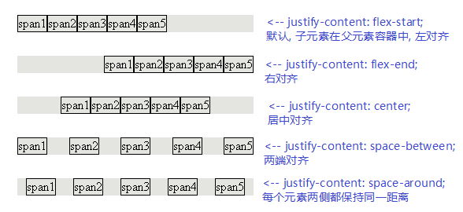

---

==== 容器属性5: align-items -> 子元素item, 在父元素容器中的"垂直对齐"方式 : 顶端对齐, 底端对齐, 垂直居中, 垂直两端对齐, 以文字基线为对齐

[source,css]
....
.box {
  align-items: flex-start | flex-end | center | baseline | stretch;
}
....

align-items属性, 定义项目在交叉轴上如何对齐。 +
它可取5个值。具体的对齐方式, 与交叉轴的方向有关，下面假设交叉轴为"从上到下"。

|===
|值 |功能

|flex-start
|子元素, 对齐到交叉轴的"起点"上

|flex-end
|子元素, 对齐到交叉轴的"终点"上

|center
|子元素, 对齐到交叉轴的"中点"上

|baseline
|子元素item的第一行文字的基线, 对齐

|stretch（默认值）
|如果item未设置高度, 或设为auto，将占满整个容器的高度.
|===

[source,css]
....
.cls_father {
    display: flex; /*指定为flex容器*/
    margin: 30px;
    height: 300px;
    width: 50%;
    background-color: #e4e4e0;
}

/*align-items是容器属性, 要加在flex容器身上, 而不是它里面的item身上!*/
.cls_father:nth-child(1) {
    align-items: stretch;
    /*（默认值）：如果item未设置高度, 或设为auto，将占满整个容器的高度. */
}

.cls_father:nth-child(2) {
    align-items: flex-start;
    /* 垂直方向上顶端对齐 */
}

.cls_father:nth-child(3) {
    align-items: flex-end;
    /*垂直方向上底端对齐 */
}

.cls_father:nth-child(4) {
    align-items: center;
    /*垂直方向上居中对齐 */
}

.cls_father:nth-child(5) {
    align-items: baseline;
    /*垂直方向上, 按文字的基线对齐 */
}

span { /*既然其父元素是"flex容器", 则里面的子元素span, 就是"容器成员"item了*/
    border: 1px solid;
}

span:nth-child(1){
    height: 20%;
}
span:nth-child(2){
    height: 70%;
    font-size: 0.5em;
}
span:nth-child(3){
    height: 40%;
    font-size: 2em;
}
span:nth-child(4){
    height: 50%;
}
span:nth-child(5){
    height: 10%;
    font-size: 1.5em;
}
....

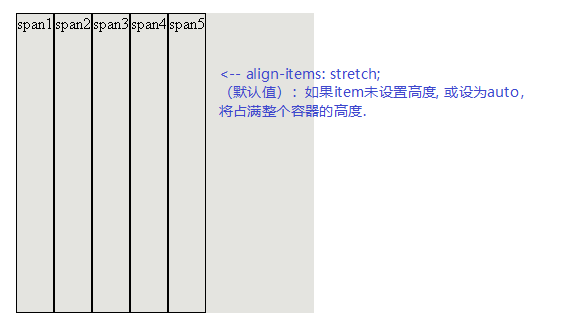

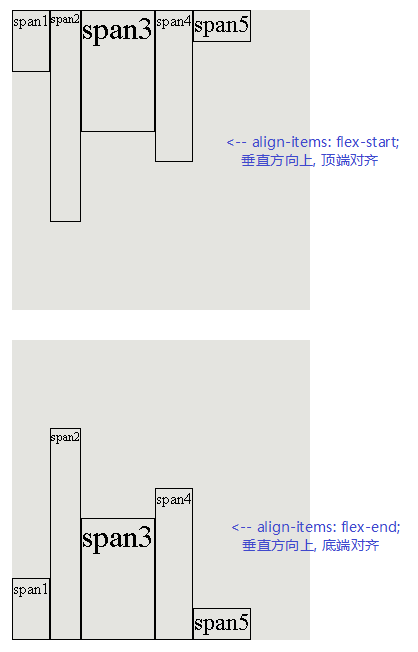

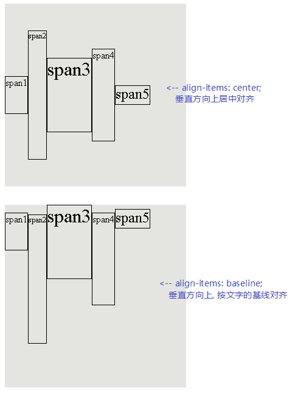

---

==== 容器属性6: align-content ->

align-content属性定义了多根轴线的对齐方式。如果项目只有一根轴线，该属性不起作用。

**align-content只对多行元素有效，会以多行作为整体进行对齐，容器必须开启换行**。

[source, Javascript]
----
.box {
  align-content: flex-start | flex-end | center | space-between | space-around | stretch;
}
----

该属性可取6个值:

|===
|值 |功能

|flex-start|与交叉轴的"起点"对齐。
|flex-end|与交叉轴的"终点"对齐。
|center|与交叉轴的"中点"对齐。
|space-between|与交叉轴"两端对齐"，轴线之间的"间隔平均分布"。
|space-around|每根轴线"两侧的间隔都相等"。所以，轴线之间的间隔, 比轴线与边框的间隔大一倍。
|stretch|（默认值）：轴线"占满"整个交叉轴。
|===

[source, css]
....
.cls_father{
    display: flex;
    flex-wrap: wrap; /*子元素总宽, 若超出父元素宽度, 则换行*/
    align-content: flex-start;
    /*所有子元素作为一个整体, 垂直方向对齐于父元素(容器)的顶部*/
    margin: 20px;
    border: 1px solid;
    height: 300px;
    width: 200px;
    background-color: #e2dfdf;
}
....

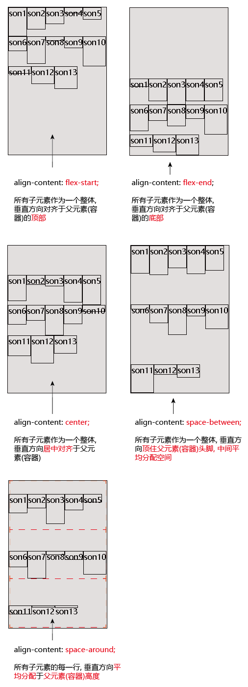

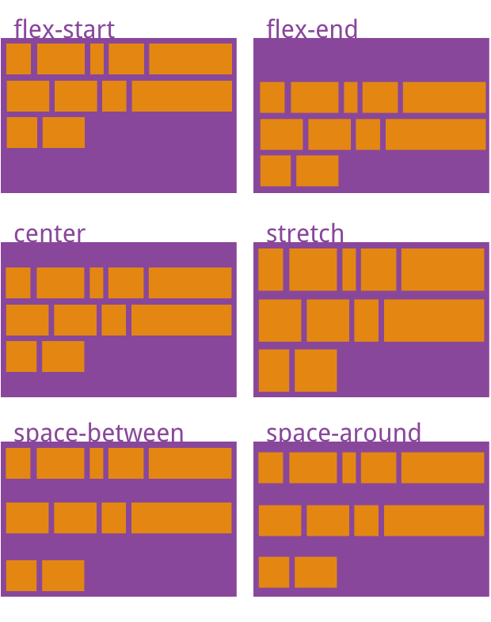

---

== item的6个属性

==== item的属性1: 某个item(即子元素)的插队顺序 -> order

order属性定义item的排列顺序。数值越小，排列越靠前，默认为0。

[source, css]
....
.cls_father {
    display: flex;
    flex-wrap: wrap; /*子元素总宽, 若超出父元素宽度, 则换行*/
    align-content: stretch;
    /*所有子元素作为一个整体, 垂直方向对齐于父元素(容器)的顶部*/
    margin: 20px;
    /*border: 1px solid;*/
    height: 30px;
    /*width: 200px;*/
    background-color: #e2dfdf;
}

.cls_son {
    border: 1px solid;
    width: 10%;
}

.cls_son:nth-child(3) {
    order: -1; /*order默认是0*/
}

.cls_son:nth-child(5) {
    order: -2;
}
....

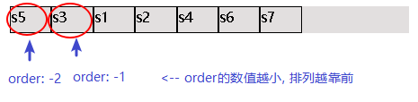

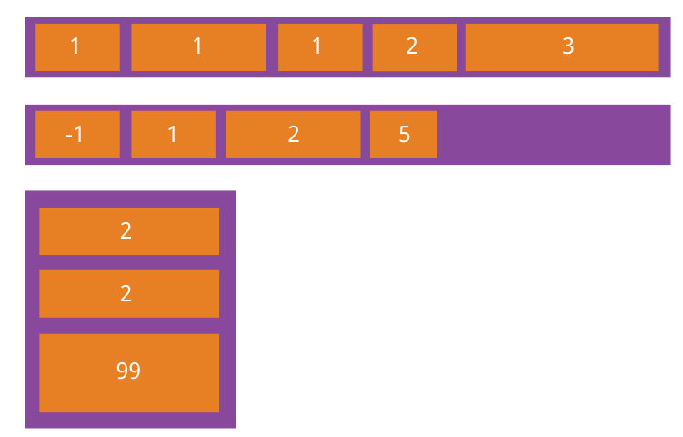

---

==== item的属性2: 子元素“瓜分”父元素(容器)的“剩余空间”-> flex-grow

该属性用来设置当父元素的宽度大于所有子元素的宽度的和时（即父元素会有剩余空间），子元素如何分配父元素的剩余空间。 +
 **flex-grow的默认值为0**，意思是该元素不索取父元素的剩余空间，如果值大于0，表示索取。值越大，索取的越厉害。

flex-grow属性定义item的放大比例，默认为0，即如果存在剩余空间，也不放大。

例如:

|===
|容器总宽400px|item1 |item2 |item3 |容器的剩余空间

|宽度
|50px
|70px
|100px
|180px  +
= 400-(50+70+100)

|flex-grow
|0
|2
|1
|容器的剩余空间,  +
就会分配3份(item2占2份, item3占1份)

|最终各item +
占用的空间宽度
|50px +
=50px+(180*0)
|190px +
=70px+(180*(2/3))
|160px +
=100px+(180*(1/3))
|0px  +
(即容器的剩余空间,  +
被各item全部瓜分完毕)
|===

如果所有item(即所有子元素)的flex-grow属性都为1，则它们将等分(平均瓜分)剩余空间（如果有的话）。 +
如果一个item的flex-grow属性为2，其他item都为1，则前者占据的剩余空间将比其他item多一倍。

- 默认情况下, item不瓜分父元素的剩余空间

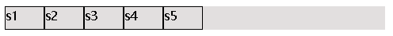

- flex-grow: 1; 表示独吞父元素100%的剩余空间

[source, css]
....
.cls_son:nth-child(3) {
    flex-grow: 1; /*父元素容器的剩余空间, 我100%全要了! */
}
....

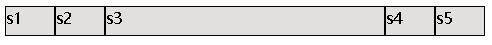

- 多个item共同来瓜分父元素的剩余空间

[source, css]
....
.cls_son:nth-child(3) {
    flex-grow: 2; /*父元素容器的剩余空间, 我瓜分掉2/3 */
}

.cls_son:nth-child(5) {
    flex-grow: 1; /*父元素容器的剩余空间, 我瓜分掉1/3 */
}
....

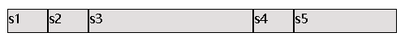

---

==== item的属性3:  当item总宽, 超出容器宽度时, item如何压缩宽度 -> flex-shrink

该属性用来设置，当父元素的宽度小于所有子元素的宽度的总和时（即子元素会超出父元素），子元素如何缩小自己的宽度的。  +
**flex-shrink的默认值为1**，当"父元素的宽度"小于"所有子元素的宽度的总和"时，子元素的宽度会减小。值越大，减小的越厉害。如果值为0，表示不减小。

flex-shrink 决定了子元素缩小系数，但在具体计算的时候，其实它还受到了 flex base size 的影响。

|===
| |公式

|单个item的权重
|item的宽度*flex-shrink系数

|总权重
|(每个item的宽度*flex-shrink系数)的总和

|每个item要收缩的空间为
|((item的宽度*flex-shrink系数)/总权重)* 需要收缩的总宽度

|===

例如:

|===
|容器总宽400px|item1 |item2 |item3 |容器的剩余空间

|
|250px
|150px
|100px
|所有item的总宽= 250+150+100 =500px, 容器放不下，超出的空间(500-400=100px)需要被每个子项根据自己设置的flex-shrink 来进行吸收。

|flex-shrink
|1(也是默认值)
|2
|2
|

|该item需要吸收的空间 +
((item的宽度*flex-shrink系数)/总权重)* 需要收缩的总宽度
|((250*1)/总权重(250*1+150*2+100*2))* 100 =33.33
| ((150*2)/总权重(250*1+150*2+100*2))* 100 =40
| ((100*2)/总权重(250*1+150*2+100*2))* 100 =26.66
| 33.33+40+26.66 = 正好等于"所有容器的总宽"超出"盒子"的空间100px

|该item的最终宽度
|250 - 33.33 = 216.66px
|150 - 40 = 110px
|100 - 26.66 = 73.33px
|216.66+110+73.33 = 总和正好等于400px, 即容器的宽度

|===

注意: 在使用  父元素容器不要设 flex-wrap: wrap; 否则"超出容器宽度"的子元素item就会换行了, 而不会只显示在一行上面.

[source, css]
....
.cls_father {
    display: flex;
    /*flex-wrap: wrap;
    !* 要想flex-shrink生效, 这个flex-wrap属性千万不要写! 否则子元素直接就换行了*!
    */
    margin: 30px;
    height: 30px;
    width: 400px;
    background-color: #e2dfdf;
}

.cls_son:nth-child(1){
    width:250px ;
    flex-shrink: 1;
    background-color: #b0939a;
}

.cls_son:nth-child(2){
    width:150px ;
    flex-shrink: 2;
    background-color: #bddcfb;
}

.cls_son:nth-child(3){
    width:100px ;
    flex-shrink: 2;
    background-color: #55806b;
}
....

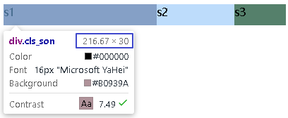

---

==== item的属性4: item的初始宽度 -> flex-basis

这个flex-basis值呢，表示在分配额外空间之前，成员占据的空间，默认值为auto，意思就是你本来占多少就是多少。但也可以自己设置长度(px)。 +
这个值的效果就是确定在释放和分配空间的时候，你的初值是多少。

flex-basis属性用来设置元素的宽度，其实，width也可以设置宽度。**如果元素上同时设置了width和flex-basis，那么width 的值就会被flex-basis覆盖掉。**

width和flex-basis属性的区别比较:

|===
|值|width |flex-basis

|0|完全没显示|根据内容撑开宽度

|非0
|数值相同时, flex-basis和width两者等效
| 同时设置时，flex-basis优先级高, 会覆盖width属性值

|flex-basis: auto
|
|flex-basis: auto时, 如设置了width则元素尺寸由width决定；没有设置则由内容决定.
|===

flex-basis是主轴方向上的尺寸! 默认主轴是横向的, 则flex-basis即等于width. 如果主轴竖过来了, 则flex-basis就等于height了.

[source, css]
....
.cls_son:nth-child(1){
    width:250px ;
    flex-basis: 300px; /*flex-basis会覆盖掉width*/
    flex-shrink: 1;
    background-color: #b0939a;
}
....

又例:

[source,css]
....
.box,.son{
    border: 1px solid;
}

.box{
    display: flex;
}

.box:nth-child(1) .son{
    flex: 1 1 0
    /*flex-basis是指定初始尺寸，
    当设置为0时（绝对弹性元素），此时相当于告诉flex-grow和flex-shrink
    在伸缩的时候不需要考虑我的尺寸；
    即不管item的宽度如何, 都能实现最终宽度上的平均分割父元素空间.
    本例有两个son, 则这两个son就是平分父元素空间, 即每个son最终宽度是各占50%空间
    */
}

.box:nth-child(2) .son{
    flex: 1 1 auto
    /*当flex-basis设置为auto时（相对弹性元素），
    此时则需要在伸缩时将元素尺寸纳入考虑。*/
}

....

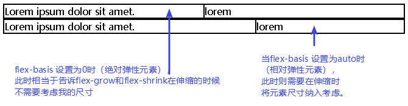

---

==== item的属性5: flex -> 就是flex-grow，flex-shrink，flex-basis三者的缩写形式

flex属性其实就是flex-grow，flex-shrink，flex-basis三者的缩写形式。默认值为0 1 auto。后两个属性可选。

该属性有两个快捷值：

|===
|快捷值 |说明

|auto (1 1 auto) +
或 flex：auto；
|占满额外空间，可缩放

|none (0 0 auto) +
或 flex: none;
|不占额外空间，不可缩放
|===

完整总结:

|===
|flex的取值 |flex-grow +
(默认0) | flex-shrink +
(默认1. +
值越大压缩越厉害. +
若值为0则不压缩) | flex-basis +
(默认auto, 即你本来占多少就是多少) | 等同于

|默认情况
|0
|1
|auto
|

|none
|0
|0
|auto
|0 0 auto //常用于固定尺寸,不伸缩

|auto
|1
|1
|auto
|1 1 auto

|1个非负的值num
|num专门用来指flex-grow的值.
|1
|0
|num 1 0%

|一个长度或百分比num +
比如 flex: 0%; +
（注意 0% 是一个百分比而不是一个非负数字）
|1
|1
|num专门用来指flex-basis的值.
|1 1 num +
比如 {flex: 0%;} 即=> 1 1 0% +
{flex: 24px;} 即=> 1 1 24px

|2个非负数字,  +
比如（2，3） +
第一个数字指flex-grow +
第二个数字指flex-shrink +
flex-basis 取 0%
|num1
|num2
|0%
|2 3 0%

|1个非负数字, 和一个长度/或百分比 +
则分别视为 flex-grow 和 flex-basis 的值， +
flex-shrink 取 1
|num1
|1
|num2
|例如{flex: 2 300px;} => 即 2 1 300px

|===

---

==== item的属性6: 单独控制每个子元素的垂直对齐形式 -> align-self

align-self属性允许单个item项目有与其他项目不一样的对齐方式，可覆盖align-items属性。默认值为auto，表示继承父元素的align-items属性，如果没有父元素，则等同于stretch。

该属性可取6个值，除了auto，其他都与align-items属性完全一致。

[source, Javascript]
----
.item {
  align-self: auto | flex-start | flex-end | center | baseline | stretch;
}
----

[source, css]
....
.cls_father {
    display: flex;
    margin: 30px;
    height: 100px;
    width: 300px;
    background-color: #e2dfdf;
}

.cls_son {
    border: 1px solid;
    width: 10%;
}

.cls_son:nth-child(1) {
    align-self: flex-start;
}

.cls_son:nth-child(2) {
    align-self: flex-end;
}

.cls_son:nth-child(3) {
    align-self: center;
}

.cls_son:nth-child(4) {
    align-self: baseline;
}

.cls_son:nth-child(5) {
    align-self: stretch;
}

.cls_son:nth-child(6) {
    align-self: auto;
}
....

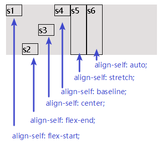

---
