= flex 布局案例 (flex中, 三个属性的默认值是 0 1 auto  <-不扩张, 只压缩; 扩张或压缩前, 本item的宽度原先是什么就是什么)
:toc:

---

== 用flex来写"常见布局"

flex布局是一种**一维布局模型，一次只能处理一个维度（一行或者一列）上的元素布局**. 作为对比的是二维布局CSS Grid Layout，可以同时处理行和列上的布局。

也就是说，**flex布局大部分的属性都是作用于主轴的，因为弹性元素永远沿主轴排列**。在交叉轴上很多时候只能被动地变化。

---

==== 案例1: 子元素在父元素中来居中, 孙元素在子元素中来居中 -> 父元素和子元素, 都设成flex布局

[source,html]
....

    

        gs1
        gs2
    

....

[source,css]
....
.cls_father {
    display: flex;
    justify-content: center; /*水平方向 居中对齐*/
    align-items: center; /* 垂直方向 居中对齐*/

    margin: 30px;
    height: 200px;
    width: 300px;
    background-color: #e2dfdf;
}

.cls_son {
    display: flex;
    /*父元素设为flex布局后, 子元素也能继续设成flex布局,
    这样就能为孙元素, 设置容器属性支持的属性了*/
    justify-content: center; /*水平方向 居中对齐*/
    align-items: center; /* 垂直方向 居中对齐*/

    border: 1px solid;
    padding: 10px;
    width:40%;
    height: 40%;
}

.cls_gs{
    border: 1px solid;
}
....

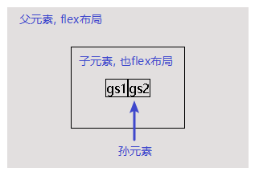

---

==== 案例2: 筛子布局 (三行三列)

我们来实现这个布局:

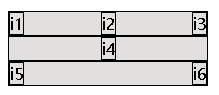

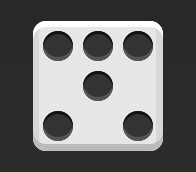

可以看出, 这是分成三行, 第一行有三个item, 第二行有1个item, 第三行有2个item.

[source,html]
....

    

        i1
        i2
        i3
    

    

        i4
    

    

        i5
        i6
    

....

[source,css]
....
.box{
    display: flex;
    flex-wrap: wrap;
    margin: 20px;
    width: 200px;
    background-color: #e2dfdf;
}

.row{
    display: flex;
    flex-basis: 100%; /*把每一行的宽度, 设为父元素的100%宽*/
    border: 1px solid;
}

.row:nth-child(1){
    justify-content: space-between;
}

.row:nth-child(2){
    justify-content: center;
}

.row:nth-child(3){
    justify-content: space-between;
}

.item{
    border: 1px solid;
}
....

---

==== 案例3: 每行中的item平均分配该行的空间

最简单的网格布局，就是平均分布。在容器里面平均分配空间，跟上面的骰子布局很像，但是需要设置项目的自动缩放。

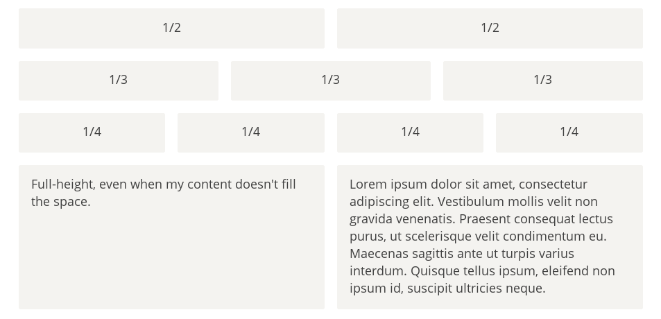

分几步实现这个效果:

1. box为flex布局, 并允许子元素(row)在超出box宽度时, 换行(flex-wrap: wrap;)
2. row也为flex布局, 并且每个row独占父元素(box)的100%宽度(flex-basis: 100%;), 这样, 每个row就是一行一个row, 从上到下垂直排列了.
3. 每一行(row)的item 设置自己的宽度(flex-basis: 33.333%等等;), 并允许每个item平均瓜分父元素(row)的剩余空间(flex-grow: 1;)

[source,css]
....

    

        
i1 JavaScript

        
i2 java

    

    

        
i1 python

        
i2 kotlin

        
i3 typeScript

    

    

        
i1 react

        
i2 swift

        
i3 oc

        
i4 golang

    

    

        
Lorem ipsum dolor sit amet, consectetur adipisicing elit. Aliquam doloremque ex neque nesciunt porro quaerat quidem sequi sunt voluptate voluptatibus.

        
Lorem ipsum dolor sit amet, consectetur adipisicing elit. Vel, veritatis.

    

....

[source,css]
....
.box{
    display: flex;
    flex-wrap: wrap; /*若子元素(row)的总宽超出box宽度, 允许换行*/
    margin: 20px;
    background-color: #e2dfdf;
}

.row{
    display: flex;
    flex-basis: 100%; /*每row都独占100%宽度*/
}

.item{
    border: 1px solid;
    flex-grow: 1; /*每个item平均瓜分父元素的剩余空间*/
}

.row:nth-child(1) .item{
    flex-basis: 50%;
}

.row:nth-child(2) .item{
    flex-basis: 33.333%;
}

.row:nth-child(3) .item{
    flex-basis: 25%;
}

.row:nth-child(4) .item{
    flex-basis: 50%;
}
....

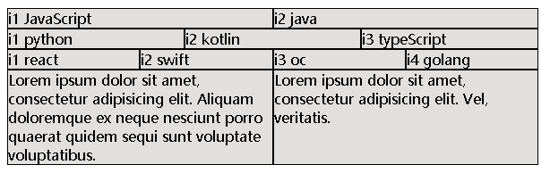

---

==== 案例4. 一行中, 某些个item是固定比例, 让其他item占满剩余空间

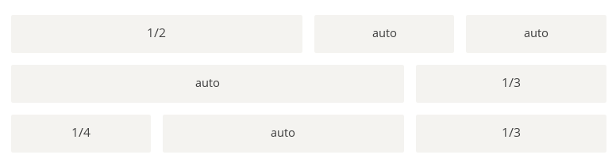

[source,html]
....

    

        
i1 python

        
i2 kotlin

        
i3 typeScript

    

    

        
i1 JavaScript

        
i2 java

    

    

        
i1 react

        
i2 swift

        
i3 oc

    

....

[source,css]
....
.box {
    display: flex;
    flex-wrap: wrap; /*若子元素(row)的总宽超出box宽度, 允许换行*/
    margin: 20px;
    background-color: #e2dfdf;
}

.row {
    display: flex;
    flex-basis: 100%; /*每row都独占100%宽度*/
}

.item {
    border: 1px solid;
    flex-grow: 1; /*每个item平均瓜分父元素的剩余空间*/
}

.row:nth-child(1) .item:nth-child(1) {
    flex: 0 0 50%; /*不去瓜分, 也不压缩, 说保持父元素的50%宽就是50%宽!*/
    /*注意! 千万别只写成 flex-basis: 50%; !! 虽然它默认不会去瓜分剩余空间, 但宽度空间不够时, 默认会被压缩!*/
}

.row:nth-child(2) .item:nth-child(2) {
    flex: 0 0 33.33%;

}

.row:nth-child(3) .item:nth-child(1) {
    flex: 0 0 25%;
}

.row:nth-child(3) .item:nth-child(3) {
    flex: 0 0 33.33%;
}
....

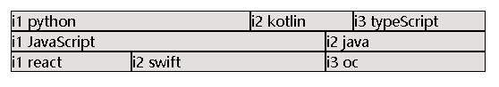

---

==== 案例5. 圣杯布局: 垂直三行, 中间行又分"左中右"三列. -> 上,中(左中右),下

圣杯布局（Holy Grail Layout）, 即页面从上到下，分成三个部分：头部（header），躯干（body），尾部（footer）。其中躯干又水平分成三栏，从左到右为：导航、主栏、副栏。

步骤: **原则是: 先弄行, 后弄每一行中的列.**

1. 先创建row, 由于是有head 有foot, 所以整个框架是上中下三行, 我们在box中创建三个div, **把box的主轴竖过来**(flex-direction: column;)
2. 由于第二行, 即center部分, 需要放主体网页内容, 所以我们要让它占据父元素的所有剩余空间(flex-grow: 1;) 虽然flex-grow在主轴是从左到右时, 是占据父元素的宽度剩余空间, 但本例中**我们把主轴竖过来了, 因此flex-grow瓜分的就是父元素高度的剩余空间了.**
3. 第二行又分成"左中右"三列, 所以**第二行, 也要设成flex布局(display: flex;), 此处, 我们没有旋转它的主轴方向, 所以默认的flex的主轴就是从左到右横向的.**
4. 然后,我们把第二行的"中"栏, 瓜分掉所有父元素的宽度的剩余空间(flex-grow: 1;), "左栏"和右栏"设置成固定的宽度, 用绝对单位(em), 而非相对单位(%是相对单位, 只会相对于父元素宽度的百分比的). 因为如果你用相对单位的话, 当你缩放浏览器窗口时, 窗口宽度就变化了, 会导致"左栏"和右栏"的宽度也随之压缩或放大, 宽度就不固定了!

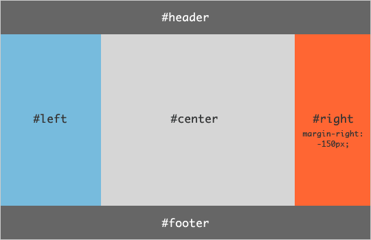

[source,html]
....

    
head

    

        
c_left

        
c_center

        
c_right

    

    
foot

....

[source,css]
....
.box {
    display: flex;
    flex-direction: column; /*从上到下, 垂直布局*/
    min-height: 50vh;
    margin: 20px;
    background-color: #e2dfdf;
}

div {
    border: 1px solid;
}

.head, .foot {
    flex: 0 0 100%;
    text-align: center;
    flex-basis: 3em;
    /*由于主轴是垂直的, 所以这里的flex-basis,
    设置的就不是宽度了, 而是高度.
    另外, height属性无效, 所以只能用flex-basis来设置高度
    */
}

.center {
    display: flex;
    flex-grow: 1; /*瓜分父元素的剩余空间.
    由于本例主轴是垂直的, 所以就会垂直方向上占满父元素剩余空间*/

}

.center_left, .center_right{
    flex: 0 0 5em;
    /*em：它是描述相对于应用在当前元素的字体尺寸，
    所以它也是相对长度单位。
    一般浏览器字体大小默认为16px，则2em == 32px；
    所以无论浏览器窗口如何变化, 这个em尺寸固定不变. 相当于是绝对尺寸
    */
}

.center_center{
    flex-grow: 1;
}
....

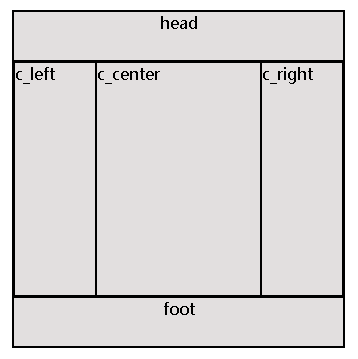

---

==== 案例6: 输入框的布局 -> 一行中有三列, 中间item占满整个剩余空间宽度

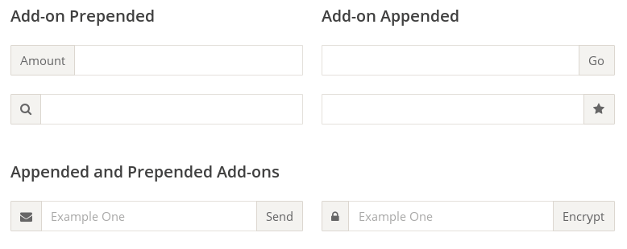

我们常常需要在输入框的前方添加提示文字，后方添加按钮。

[source,html]
....

    
info

    

    
btn

....

[source,css]
....
.clsBtnBox {
    display: flex;
    margin: 20px;
    background-color: #e2dfdf;
}

.clsBtnBox div {
    border: 1px solid;
}

.clsInputField{
    flex: 1 0 auto; /*只扩张, 不压缩, 宽度原先是什么就是什么*/
    /*flex中, 三个属性的默认值是 0 1 auto  <--不扩张, 只压缩; 扩张或压缩前, 本item的宽度原先是什么就是什么*/
}
....

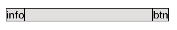

---

==== 案例7: 小图在左(或右)上角悬挂

有时，主栏的左侧或右侧，需要添加一个图片栏。

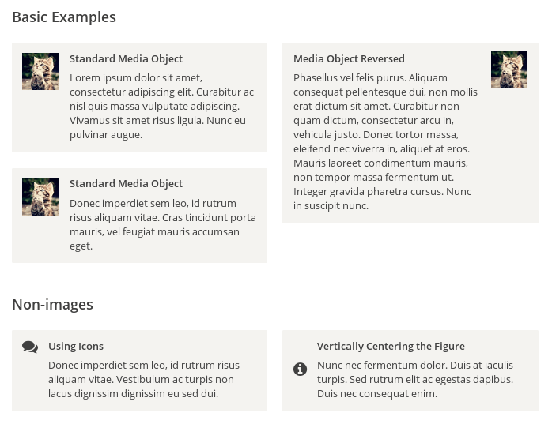

[source,html]
....

    

        
    

    
Lorem ipsum dolor sit amet, consectetur adipisicing elit. Ab aliquam architecto beatae
        blanditiis dolor impedit inventore itaque quis, quod voluptates!
    

....

[source,css]
....
.f, .f_img, .s_img, .s_text {
    border: 1px solid;
    height: 10em;
}

.f { /*本案例的最高层及的父元素*/
    display: flex;
}

.f_img { /*img图片的父元素*/
    /*注意: 如果想让img图片垂直方向居中, 就必须给它先外包一个父元素,
    因为align-items属性只能用在父元素(容器)身上! 而不能用在子元素上!
    如果你直接写在子元素身上, 是无效的.
    这就是为什么你有时会发现, 无法设置"垂直居中/水平居中"的问题, 因为你这两个属性写错地方了!*/
    display: flex;
    /*align-items: center;*/
}

.s_img { /*img图片*/
    height: 3em;
    margin-right: 1em;
}
....

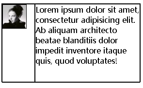

---

==== 让foot栏, 永远在底部

有时，页面内容太少，无法占满一屏的高度，底栏就会抬高到页面的中间。这时可以采用Flex布局，让底栏总是出现在页面的底部。

[source,html]
....

    
head

    
center

    
foot

....

[source,css]
....
.head,.center,.foot{
    border: 1px solid;
}

.box{
    display: flex;
    flex-direction: column; /*主轴改成垂直方向, 从上到下*/
    min-height: 100vh;
}

.center{
    flex-grow: 1; /*中间栏, 瓜分掉主轴(已是垂直的)全部剩余空间*/
}
....

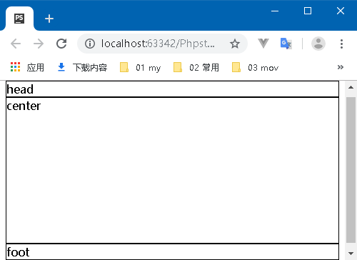

---

==== 每行item数固定, 比如每行3个item, 则如果有13个item, 就会自动变成5行(3*4行+1=13)

[source,html]
....

    
s1

    
s2

    ...
    
s13

....

[source,css]
....
.box,.son{
    border: 1px solid;
}

.box{
    display: flex;
    flex-wrap: wrap;
    min-height: 100vh;
    align-content: flex-start;
}

.son{
    flex: 0 0 33.33%;
    box-sizing: border-box; /*以border为国境线,向内压缩宽高.
    换言之, box-sizing指定谁，宽高就定准在谁身上.*/
    /*height: 2em;*/
}
....

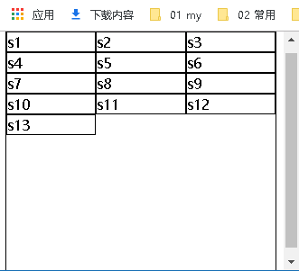

---

