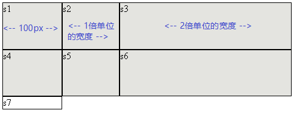

= grid 容器身上的属性
:toc:

---

== 基本概念

==== 背景介绍

CSS在处理网页布局方面, 一直做的不是很好。无论是用float(浮动)，position（定位）和inline-block（行内块）布局，这些方法本质上是hack，遗漏了很多功能，例如垂直居中。

后来出了flexbox(盒子布局)，仅仅是一维布局. +
Grid布局是**第一个**专门为解决布局问题而创建的CSS模块. grid与flexbox能很好的配合使用.

flex没有"单元格"的概念, 它只是指定item针对轴线的位置. +
**grid有"单元格"的概念, 记住: "单元格"和"item(或元素)"是两个东西. Grid 会将容器划分成"行"和"列"，由此产生"单元格". 然后你能将item 放在任何"单元格"(或单元格合并成的"区域")中.**

**即, 与flexbox布局类似，grid中, 一开始item的排列顺序并不重要，可以放置在容器的任何位置. 你能非常容易地重新排列你的item。**

如果你不放心chrome对你要试验的新功能的支持度, 可以开启“体验新功能”: 输入chrome://flags，找到"experimental web platform features"，启用, 并重启浏览器.

---

==== grid 中的基本概念

- 容器（container）: 是采用grid网格布局的区域
- 项目（item）: 容器内部采用网格定位的子元素. **Grid 布局只对item生效。** +
注意：**item只能是容器的顶层子元素，不包含item的子元素.** 比如下面例子中的代码, 
元素就不是item。  +

[source,html]
....

  

1

  

2

  

3

....

- 行（row）: 容器里面的水平区域
- 列（column）: 容器里面的垂直区域. 下图中，水平的深色区域就是"行"，垂直的深色区域就是"列"。 +

- 单元格（cell）: 行和列的交叉区域
- 网格线（grid line）: 即划分网格的线. 水平网格线, 划分出行; 垂直网格线, 划分出列。 +
正常情况下，n行有n + 1根水平网格线，m列有m + 1根垂直网格线，比如三行就有四根水平网格线。 +
下图是一个 4 x 4 的网格，共有5根水平网格线, 和5根垂直网格线。  +
image:./img_ui/grid-2.png[250,250]

Grid 布局的属性分成两类:

- 一类定义在容器上面，称为"容器属性"；
- 另一类定义在item项目上面，称为"项目属性"。

---

====  总结

设置在网格容器上的属性
....
display
grid-template-columns
grid-template-rows
grid-template-areas
grid-column-gap
grid-row-gap
grid-gap
justify-items
align-items
justify-content
align-content
grid-auto-columns
grid-auto-rows
grid-auto-flow
grid
....

设置在网格项上的属性
....
grid-column-start
grid-column-end
grid-row-start
grid-row-end
grid-column
grid-row
grid-area
justify-self
align-self
....

---

== ---------- 下面全是"容器的属性" (而非"item的属性") ----------

== 容器属性/ 01. display: grid -> 让一个容器采用grid网格布局

[source,css]
....
.box {
  display: grid;
}
....

默认情况下，容器元素都是"块级元素"(即容器元素, 会独占一行)，但也可以设成"行内元素"(让容器元素和其他元素, 并列显示)。

[source,css]
....
.box {
  display: inline-grid;
}
....

注意，**设为grid网格布局以后，容器子元素（item项目）的float、display: inline-block、display: table-cell、vertical-align和column-*等设置都将失效。**

---

== 容器属性/ 02. grid-template-columns (列宽) / grid-template-rows (行高)

容器在指定了用网格布局以后，接着就要划分行和列:

- grid-template-columns : 定义每一列的"列宽"，
- grid-template-rows : 定义每一行的"行高"。

[source,html]
....

    
s1

    ...
    
s7

....

[source,css]
....
.father {
    display: grid;
    height: 20vh;
    background-color: #e4e4e0;
    grid-template-rows: 33.33% 33.33% 33.33%; /*行高.  三个数字, 代表分成三行.  单位可以是px, %*/
    grid-template-columns: 20% 40% 30%; /*三个列的列宽*/
}

.son {
    border: 1px solid;
}
....

注意! "单元格"的宽高, 和"item/元素"的宽高, 不是同一个事物! 下图就明显看出来了:

---

==== repeat()函数 -> 能用来重复某个数值

对于重复的值, 还可以使用repeat()函数来输入.  +
语法:
....
repeat(重复的次数, 重复哪个值)
....

[source,css]
....
.father {
    height: 20vh;
    background-color: #e4e4e0;

    display: grid;
    grid-template-rows: repeat(4,25%); /*4行, 每行的高度是父元素的25%*/
    grid-template-columns: repeat(4,25%); /*4列*/
}

.son {
    border: 1px solid;
}
....

又例:

[source,css]
....
.father {
    height: 20vh;
    width: 320px;
    background-color: #e4e4e0;

    display: grid;
    grid-template-rows: repeat(2,50%); /*2行*/
    grid-template-columns: repeat(3, 50px 100px); /*将50px和100px这两列,重复3次, 即最终会有6列.
    本例中, 如果6列的总宽超出了父元素盒子的宽度, 则不会自动换行, 会破出去*/
}

.son {
    border: 1px solid;
}
....

grid-template-columns属性对于网页布局非常有用。两栏式(即两列)布局只需要一行代码。

[source,css]
....
.box {
  display: grid;
  grid-template-columns: 70% 30%; /*左边栏设为70%宽，右边栏设为30%宽*/
}
....

传统的十二列网格布局，写起来也很容易。

[source,css]
....
grid-template-columns: repeat(12, 1fr);
....

---

==== auto-fill 关键字 -> 让itme自动换行

有时，单元格的大小是固定的，但是容器(即父元素)的大小不确定。如果希望每一行（或每一列）容纳尽可能多的单元格，这时可以使用auto-fill关键字表示自动填充。

比如, 而我们可以定义一个单元格(为固定的宽高), 然后让它自动复制, 填满整个盒子.

[source,css]
....
.father {
    height: 50vh;
    background-color: #e4e4e0;

    display: grid;
    grid-template-rows: repeat(auto-fill, 20%); /*按行高20% 来填充满整个容器盒子的高度, 即最终会有5行*/
    grid-template-columns: repeat(auto-fill, 30%); /*即最终会有3列*/
}

.son {
    border: 1px solid;
}
....

又例

[source,css]
....
.father {
    height: 50vh;
    background-color: #e4e4e0;

    display: grid;
    grid-template-columns: repeat(4, 1fr); /*4列, 每列(宽度)的比例相同, 即1:1:1:1*/
    grid-template-rows: repeat(6,1fr); /*即最终会有6行, 每行(高度)的比例也相同*/
}

.son {
    border: 1px solid;
}
....

又例
[source,css]
....
.father {
    height: 20vh;
    width: 320px;
    background-color: #e4e4e0;

    display: grid;
    grid-template-rows: repeat(2,50%); /*2行*/
    grid-template-columns: repeat(auto-fill, 50px 100px); /*将50px和100px这两列,重复3次, 即最终会有6列.
    然后自动填充，直到容器不能放置更多的列。即,会自动换行!*/
}

.son {
    border: 1px solid;
}
....

---

==== fr关键字 -> 用来表示多个item之间的宽度"比例"关系

为了方便表示比例关系，网格布局提供了fr关键字（fraction 的缩写，意为"片段"）。 +
如果两列的宽度分别为1fr和2fr，就表示后者是前者的两倍。

[source,css]
....
.father {
    height: 20vh;
    width: 320px;
    background-color: #e4e4e0;

    display: grid;
    grid-template-rows: repeat(2,50%); /*2行*/
    grid-template-columns: 1fr 2fr 3fr; /*3列, 宽度比例分别是1:2:3*/
}

.son {
    border: 1px solid;
}
....

又例:

[source,css]
....
.father {
    height: 20vh;
    width: 320px;
    background-color: #e4e4e0;

    display: grid;
    grid-template-rows: repeat(2,50%); /*2行*/
    grid-template-columns: repeat(2, 1fr 3fr); /*重复两次2列, 两列的宽度比例, 分别是1:3*/
}

.son {
    border: 1px solid;
}
....

fr可以与"绝对长度的单位"结合使用，这时会非常方便。

[source,css]
....
.father {
    height: 20vh;
    background-color: #e4e4e0;

    display: grid;
    grid-template-rows: repeat(2, 50%); /*2行*/
    grid-template-columns: 100px 1fr 3fr; /*3列
       注意: 本例,我们没有设置盒子的宽度width,
       因此, 这里设成3列, 第一列是固定宽度100px, 后面两列宽度的比例是 1:3,
       就相当于是第一列固定, 后面两列的宽度会自动缩放了!*/
}

.son {
    border: 1px solid;
}
....

上面代码表示，第一列的宽度为100像素，第二列的宽度是第三列的1/3。

---

==== minmax() -> 设定"最小值"和"最大值"的阈限

minmax()函数能产生一个长度范围，表示长度就在这个范围之中。它接受两个参数，分别为最小值和最大值。

[source,css]
....
.father {
    height: 20vh;
    background-color: #e4e4e0;

    display: grid;
    grid-template-rows: repeat(2, 50%); /*2行*/
    grid-template-columns: 1fr 1fr minmax(200px,1fr); /*3列，
    其中第三列的minmax(200px, 1fr)表示列宽不小于200px，不大于1fr。*/
}

.son {
    border: 1px solid;
}
....

---

==== auto关键字 -> 由浏览器自己决定长度, 相当于瓜分掉整个父元素剩余空间

auto关键字表示由浏览器自己决定长度。

[source,css]
....
.father {
    display: grid;
    height: 20vh;
    background-color: #e4e4e0;
    grid-template-rows: repeat(2, 50%); /*2行*/
    grid-template-columns: 100px auto 100px; /*效果等价于 100px 1fr 100px;*/
    /*第二列的宽度，基本上等于该列单元格的最大宽度，
    除非单元格内容设置了min-width，且这个值大于最大宽度。*/
}

.son {
    border: 1px solid;
}
....

---

==== grid-template 和 grid 属性 -> 都是某些个属性的合并简写而已 (不推荐用)

|===
|属性名 |说明

|grid-template
|是grid-template-columns, grid-template-rows, grid-template-areas 这三个属性的合并简写形式。

|grid
|是grid-template-rows、grid-template-columns、grid-template-areas、 grid-auto-rows、grid-auto-columns、grid-auto-flow 这六个属性的合并简写形式。
|===

从易读易写的角度考虑，还是建议不要合并属性.

---

== 容器属性/ 03. row-gap(行间距) / column-gap(列间距) / gap(前两个属性的合并简写)

[source,css]
....
.father {
    height: 20vh;
    background-color: #e4e4e0;

    display: grid;
    grid-template-rows: repeat(3,33.33%); /*3行*/
    grid-template-columns: repeat(2,50%); /*2列*/
    row-gap: 1em; /*行间距*/
    column-gap: 2em; /*列间距*/
}

.son {
    border: 1px solid;
}
....

---

==== gap属性 -> 是column-gap 和 row-gap的合并简写形式

gap属性的语法如下:
[source,css]
....
gap: <row-gap> <column-gap>;
....

[source,css]
....
.father {
    height: 20vh;
    background-color: #e4e4e0;

    display: grid;
    grid-template-rows: repeat(3,33.33%); /*3行*/
    grid-template-columns: repeat(2,50%); /*2列*/
    gap: 2em 1em; /*行距, 列间距*/
}

.son {
    border: 1px solid;
}
....

**如果gap属性省略了第二个值，浏览器认为第二个值等于第一个值。**

....
根据最新标准，上面三个属性名的grid-前缀已经删除，grid-column-gap和grid-row-gap写成column-gap和row-gap，grid-gap写成gap。
....

---

== 容器属性/ 04. justify-items /align-items /place-items -> 每个"元素"在各自"单元格"中的对齐方式

这些属性, 用来设置每个"元素"在各自"单元格"中的对齐方式.

[source,css]
....
.box {
  justify-items: start | end | center | stretch;
  align-items: start | end | center | stretch;
}
....

|===
|属性 |功能

|justify-items
|设置"item元素"在"单元格"中的"水平对齐"方式（左中右）

|align-items
|设置"item元素"在"单元格"中的"垂直对齐"方式（左中右）

|place-items: <align-items> <justify-items>;
|是align-items和justify-items属性的合并简写形式(即, 先设垂直对齐, 再设水平对齐). +
如果省略第二个值，则浏览器认为与第一个值相等。
|===

align-items 和 justify-items 这两个属性的值, 都可以取下面4种:

|===
|值 |功能

|start
|"item元素"对齐"单元格"的"起始边缘"。

|end
|"item元素"对齐"单元格"的"结束边缘"。

|center
|"item元素"在"单元格"中"居中对齐"。

|stretch（默认值）
|拉伸，占满单元格的整个宽度。 +
如果item元素已经设定了自己的宽高(height, weight), 则就以元素自己的宽高为准, 即会覆盖掉这里的stretch.
|===

例如:
[source,css]
....
.father {
    height: 50vh;
    background-color: #e4e4e0;

    display: grid;
    grid-template-rows: repeat(3, 33.33%); /*3行*/
    grid-template-columns: repeat(3, 33.33%); /*3列*/
    justify-items: end; /*每个item在自己的单元格中, 水平右对齐*/
}

.son {
    border: 1px solid;
}

....

又例:
[source,css]
....
justify-items: center; /*每个item在自己的单元格中, 水平方向居中对齐*/
align-items: center; /* 每个item在自己的单元格中, 垂直方居中对齐*/
....

又例:

[source,css]
....
.father {
    height: 50vh;
    background-color: #e4e4e0;

    display: grid;
    grid-template-rows: repeat(3, 33.33%); /*3行*/
    grid-template-columns: repeat(3, 33.33%); /*3列*/

    justify-items: end; /*每个item在自己的单元格中, 水平方向右对齐*/
    align-items: end; /* 每个item在自己的单元格中, 垂直方向下对齐*/
}

.son {
    border: 1px solid;
}
....

又例:

[source,css]
....
place-items: center end; /*每个item在自己的单元格中, 垂直居中对齐, 水平右对齐*/
....

案例:

我们来实现这个效果 +

[source,html]
....

    
head

    
main

    

        
s1

        
s2

        
s3

        
s4

    

....

[source,css]
....
.cls_father {
    margin: 50px;
    height: 40vh;
    background-color: #e4e4e0;

    display: grid;
    grid-template-rows: 3em 1fr 3em;
    row-gap: 0.5em; /*设置子元素行的行距*/
}

.son {
    border: 1px solid;
}

.foot {
    display: grid; /*foot也是一个容器*/
    grid-template-columns: repeat(4, 1fr); /*分成4列,均宽*/
    justify-items: center; /*元素在自己的单元格中, 水平居中*/
    align-items: center; /*元素在自己的单元格中, 垂直居中*/
}

.foot .son{
    width: 1.5em; /*如果子元素不设置自己的宽高, 它就会自动stretch(撑满)自己的整个单元格空间*/
    height: 1.5em;
}
....

---

== 容器属性/ 05. justify(align)-items / place-items

---

== 容器属性/ 06. justify(align)-content /place-content -> 整个item区域, 在容器里面的对齐方式

[source,css]
....
.container {
  justify-content: start | end | center | stretch | space-around | space-between | space-evenly;

  align-content: start | end | center | stretch | space-around | space-between | space-evenly;
}
....

|===
|属性 |功能

|justify-content
|整个item区域, 在容器里面的"水平对齐"方式（左中右）

|align-content
|整个item区域, 在容器里面的"垂直对齐"方式（上中下）

|place-content: <align-content> <justify-content>
|是align-content 和 justify-content属性的合并简写形式. +
如果省略第二个值，浏览器就会假定第二个值等于第一个值。
|===

justify-content 和 align-content 这两个属性的写法完全相同，都可以取下面这些值:

|===
|值|功能

|start
|对齐容器的"起始边框"

|end
|对齐容器的"结束边框"

|center
|容器内部居中

|stretch
|item项目大小没有指定时，则拉伸占据整个网格容器。

|space-around
|每个项目两侧的间隔相等。所以，项目之间的间隔, 比项目与容器边框的间隔大一倍。

|space-between
|项目与项目的间隔相等，项目与容器边框之间没有间隔。

|space-evenly
|项目与项目的间隔相等，项目与容器边框之间也是同样长度的间隔。
|===

[source,html]
....

    
head

    
main

    

        
s1

        ...
        
s4

    

....

[source,css]
....
.cls_father {
    margin: 50px;
    height: 50vh;
    background-color: #e4e4e0;

    display: grid;
    grid-template-rows: 50px 1fr 70px;
    grid-auto-flow: row dense; /*让子元素, 像水流一样, 自动填满前面的空白空间*/
}

.foot{
    display: grid; /*foot也是一个容器*/
    grid-template-columns: repeat(4,30px); /*分成4列, 每列列宽30px*/
    justify-content: center; /*将本box中的所有item元素, 作为一个整体, 来进行水平居中对齐*/
}

.foot .son{
    border: 1px solid;
    height: 30px; /*每个元素的高度是30px, 其宽度则在上面的.foot中定义了(每列宽30px)*/
}
....

justify-content属性的其他值的效果如下:

[source,css]
....

.cls_father {
    margin: 50px;
    height: 500vh;

    display: grid;
    grid-template-rows: repeat(auto-fill, 100px);
    /*行高100px, 自动复制下去
       但如果本父元素不设高度的话, 子元素的高度会被挤压?? */
    row-gap: 1.5em; /*设置子元素行的行距*/
}

.son {
    border: 1px solid;
    height: 30px; /*每个元素的高度是30px, 其宽度则在上面的.foot中定义了(每列宽30px)*/
}

.foot {
    background-color: #e4e4e0;
    display: grid; /*foot也是一个容器*/
    grid-template-columns: repeat(4, 30px); /*分成4列, 每列列宽30px*/
}

.foot:nth-child(1) {
    justify-content: space-between;
    /*将本box中的所有item元素, 作为一个整体,
    来进行水平方向两端顶到父元素的边对齐*/
}

.foot:nth-child(2) {
    justify-content: space-around;
}

.foot:nth-child(3) {
    justify-content: space-evenly;
}

.foot:nth-child(4) {
    justify-content: center;
}

.foot:nth-child(5) {
    justify-content: end;
}

.foot:nth-child(6) {
    justify-content: stretch;
    /*item项目大小没有指定时，该属性会拉伸item占据整个网格容器。*/
}

....

---

== 容器属性/ 07. grid-template-areas -> 定义"区域"（area）

一个"区域（area）"由单个或多个单元格组成。 +
网格区域一定是矩形的, 无法设置T形或L形的区域。

---

== 容器属性/ 08. grid-auto-flow -> item的排序顺序(先行后列 /先列后行)

**划分网格以后，容器里的item子元素(即各个html tag元素)会按照顺序，自动放置在每一个单元格中。**默认的放置顺序是"先行后列"，即先填满第一行，再开始放入第二行。

这个顺序由grid-auto-flow属性决定，默认值是row，即"先行后列"。也可以将它设成column，变成"先列后行"。

[source,css]
....
.father {
    height: 20vh;
    background-color: #e4e4e0;

    display: grid;
    grid-template-rows: repeat(3, 33.33%); /*3行*/
    grid-template-columns: repeat(3, 33.33%); /*3列*/
    grid-auto-flow: column; /*item的排序, 先列后行*/
}

.son {
    border: 1px solid;
}
....

grid-auto-flow 的值, 除了设成row和column外，还可以设成row dense和column dense。这两个值的作用是: 在某些item的位置是固定的时, 让后面的item元素, 能像水流一样, 流动到前面的空白空间中(填满)。

---

==== 让item元素往前面流动, 能占据前面的空白空间 -> grid-auto-flow: row dense;

首先, 默认情况下, 我们在定义了item s1和s2的位置后, 会是如下效果:

[source,css]
....
.cls_father {
    margin: 50px;
    height: 40vh;
    background-color: #e4e4e0;

    display: grid;
    grid-template-columns: repeat(3, 1fr);
    grid-template-rows: repeat(4, 1fr);
}

.son:nth-child(1) {
    background-color: #9ad7ff;
    grid-column: 1/ span 2;
}

.son:nth-child(2) {
    background-color: #e4baff;
    grid-column: 2/ span 1;
}

.son:nth-child(3) {
    background-color: #b0ffde;
}

.son:nth-child(4) {
    background-color: #ffbeb6;
}
....

可以看到, s1后面, 和s2前面, 有两个空白空间.

我们将"容器属性"grid-auto-flow的值, 设为"row dense", 就能让后面的item元素, 往前排, 填充前面空白的空间. 即, 元素的排序可以不按正常顺序来.  +
换言之, **比如有4个人, 排成这样:  "a,空,b,空,c,d" . 其中, a和b两个人的位置是固定的, 不能动. 但c和d可以动, 它们就能往前面排, 占据前面的空间. 最终结果就会是: "a, (c), b, (d)".**

[source,css]
....
.cls_father {
    margin: 50px;
    height: 40vh;
    background-color: #e4e4e0;

    display: grid;
    grid-template-columns: repeat(3, 1fr);
    grid-template-rows: repeat(4, 1fr);
    grid-auto-flow: row dense; /*让item元素, 像水流一样, 自动填满前面的空白空间*/
}

.son:nth-child(1) {
    background-color: #9ad7ff;
    grid-column: 1/ span 2;
}

.son:nth-child(2) {
    background-color: #e4baff;
    grid-column: 2/ span 1;
}

.son:nth-child(3) {
    background-color: #b0ffde;
}

.son:nth-child(4) {
    background-color: #ffbeb6;
}
....

---

== 容器属性/ 09. 将单元格合并成"区域", 来将item元素放进这些"区域"中 -> grid-template-areas(容器的属性->给"单元格区域"起名字) 要配合 grid-area(item的属性 -> 将某item元素, 丢进某个"区域"中) 来使用

grid-area属性, 用来指定将某个item放在哪一个区域中。比如:

[source,css]
....
.item-1 {
  grid-area: e; /*将元素item-1, 放到e区域中*/
}
....

grid-area属性的作用是:

1. 用作 "grid-row-start, grid-column-start, grid-row-end, grid-column-end" 的的合并简写形式，直接指定item的位置。
2. 能为网格项提供一个名称，以便可以 被使用网格容器 grid-template-areas属性创建的模板进行引用。

[source,css]
....
.item {
  grid-area: <name> | <row-start> / <column-start> / <row-end> / <column-end>;
}
....

[source,html]
....

    
head...

    
side...

    

        
s1

        ...
        
s11

    

    

        
数据统计表

        
发布命令

        
所有数据库

        
设置

    

....

[source,css]
....

.cls_father {
    margin: 50px;
    height: 80vh;
    background-color: #e4e4e0;

    display: grid;
    grid-template-rows: 40px 1fr 40px; /*3行*/
    grid-template-columns: 100px 1fr; /*2列*/
    /*下面来给各单元格, 起名字. grid-template-areas 要配合 grid-area 来使用.*/
    grid-template-areas: 'head head' 'side main' 'foot foot';
}

/*下面, 将某元素, 丢进指定名字的单元格中.*/
.cls_head {
    background-color: #9ad7ff;
    grid-area: head;
    /*将cls_head元素, 丢进 head 单元格(或区域)中.
      本例有两个单元格叫head名字, 因此, 就会将这两个单元格合并成一个"区域".
      */
}

.cls_side {
    background-color: #e4baff;
    grid-area: side;
}

.cls_main {
    background-color: #b0ffde;
    grid-area: main; /*将 cls_main元素, 丢进 main单元格(或区域)中*/

    display: grid; /*同样设成grid布局*/
    grid-template-columns: repeat(3, 1fr); /*3列*/
    grid-template-rows: repeat(auto-fill, 1fr); /*让行数, 自动填充下去.
    即我只要求每列3个单元格, 至于行数是多少? 我不管, 你自动顺延下去就行.*/
}

.cls_foot {
    background-color: #ffbeb6;
    grid-area: foot;

    display: grid; /*同样设成grid布局*/
    grid-template-columns: repeat(4, 1fr); /*分成4列*/
}

.cls_foot .son {
    border: 1px solid;
}

....

---

==== 对于你不想起名字的单元格, 用点号"."来表示它们就行了

其实, 对于不需要合并的单元格, 你根本就无需给它们起名成"区域名". 直接用点号"."来代表它们就行了. 如下: side和main不需要合并成一个区域, 就用点号来代表它们就行.

[source,css]
....
grid-template-areas: 'head head'
                     '. .'
                     'foot foot';
....

---

==== css会自动帮你把"区域"的边线, 命名成: (1)起始行线, 起始列线 都叫做=> "区域名-start" / (2)结束行线, 结束列线 都叫做 => "区域名-end"

只要你给"区域"起了名字, 那css就会自动帮你把该"区域"的四条边线, 分别命名成:

|===
|区域的边线 |css会自动帮你命名成

|起始的行线和列线
|区域名-start

|结束的行线和列线
|区域名-end

|===

比如:

[source,html]
....

    
head...

    
side...

    
main...

    

        
数据统计表

        
发布命令

        
所有数据库

        
设置

    

....

[source,css]
....
.cls_father {
    margin: 50px;
    height: 80vh;
    background-color: #e4e4e0;

    display: grid;
    grid-template-rows: 40px 1fr 40px; /*3行*/
    grid-template-columns: 100px 1fr; /*2列*/

    /*下面来给各单元格, 起名字. grid-template-areas 要配合 grid-area 来使用.*/
    grid-template-areas: 'head head'
                         'side main'
                         'foot foot';
}

/*下面, 将某元素, 丢进指定名字的单元格中.*/
.cls_head {
    background-color: #9ad7ff;
    grid-area: head-start / head-start/ main-end / main-end; /*注意这些边线的名字!
    将cls_head元素, 丢进 "起始行线/起始列线/结束行线/结束列线" 的"区域"中*/
}

.cls_side {
    grid-area: side;
}

.cls_main {
    grid-area: main; /*将 cls_main元素, 丢进 main单元格(或区域)中*/

    display: grid; /*同样设成grid布局*/
    grid-template-columns: repeat(3, 1fr); /*3列*/
    grid-template-rows: repeat(auto-fill, 1fr);
    /*让行数, 自动填充下去.
       即我只要求每列3个单元格, 至于行数是多少? 我不管, 你自动顺延下去就行.*/
}

.cls_foot {
    grid-area: foot;

    display: grid; /*同样设成grid布局*/
    grid-template-columns: repeat(4, 1fr); /*分成4列*/
}

.cls_foot .son {
    border: 1px solid;
}
....

---

== 容器属性/ 10. grid-auto-rows(columns) -> 当item的数量超出单元格总数时, 此属性能用来设置新增加的单元格行高和列宽

有时候, 比如你的单元格只设置了3行3列共9个, 但你的item元素却有11个, 超出了单元格的总数. 此时, 这时，浏览器会自动帮你生成多余的单元格，以便放置item。

那么这些新增的单元格, 你就可以使用grid-auto-columns 和 grid-auto-rows 属性, 来设置它们的列宽和行高。

比如:
[source,css]
....
.father {
    /*height: 20vh;*/
    background-color: #e4e4e0;

    display: grid;
    grid-template-columns: repeat(3, 1fr);
    grid-template-rows: repeat(2,3em);
    grid-auto-rows: 5em; /*对"为了安置多出来的item而自动生成"的单元格, 进行"行高"设置*/
}

.son {
    border: 1px solid;
    height: 2em;
    width:2em;
}
....

**如果你不指定这两个属性，则浏览器会根据单元格中item的大小，自行决定新增网格的列宽和行高。(换言之, 新增单元格的行高, 就是item元素的行高)**

比如, 如果你把上例中的 "  grid-auto-rows: 5em; " 这句去掉, 效果就是:

---

