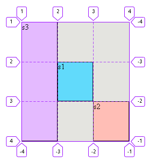
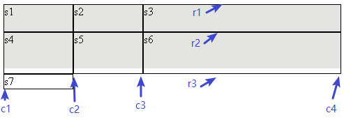
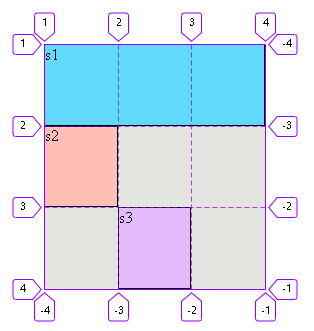
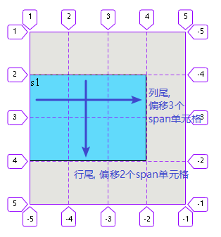
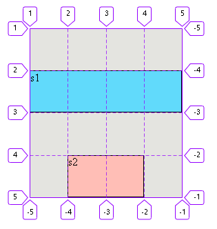
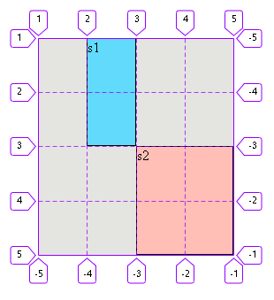
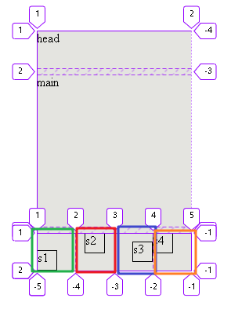

= grid 项目item身上的属性
:toc:

---

== ---------- 下面全是"item的属性" (而非"容器的属性") ----------

== 将item元素, 摆放到任意单元格(或区域)中

item的位置是可以指定的，具体方法就是指定该item的四个边框，分别定位在哪根网格线上。

|===
|属性 |说明

|grid-row-start属性
|起始行线(即"上边框")所在的水平网格线

|grid-row-end属性
|结束行线(即"下边框")所在的水平网格线

|grid-column-start属性
|起始列线(即"左边框")所在的垂直网格线

|grid-column-end属性
|结束列线(即"右边框")所在的垂直网格线

|===

使用这四个属性，如果产生了项目的重叠，则使用z-index属性指定项目的重叠顺序。

---

==== grid-row(column)-start(end) -> 根据网格线(的起始与结束)编号, 来摆放元素

[source,css]
....
.father {
    height: 40vh;
    background-color: #e4e4e0;

    display: grid;
    grid-template-columns: repeat(3, 1fr); /*3列, 每列(宽度)的比例相同, 即1:1:1*/
    grid-template-rows: repeat(3,1fr); /*3行*/
}

.son {
    border: 1px solid;
}

/*把son1, 放在中间格子*/
.son:nth-child(1) {
    background-color: #61dafb;
    grid-row-start: 2;      /*行线开始的位置*/
    grid-row-end: 3;        /*行线结束的位置*/

    grid-column-start: 2;   /*列线开始的位置*/
    grid-column-end: 3;     /*列线结束的位置*/

}

/*把son2, 放在右下角格子*/
.son:nth-child(2) {
    background-color: #ffbeb6;
    grid-row-start: 3;
    grid-row-end: 4;

    grid-column-start: 3;
    grid-column-end: 4;
}

/*把son3, 放在左边完整的第一列, 占满三行*/
.son:nth-child(3) {
    background-color: #e4baff;
    grid-row-start: 1;
    grid-row-end: 4;

    grid-column-start: 1;
    grid-column-end: 2;
}

....

---

==== 给网格线, 自定义名字

在grid-template-columns属性和grid-template-rows的属性值中，还可以使用方括号，来指定每一根网格线的名字，方便以后的引用。

[source,css]
....
.father {
    height: 20vh;
    background-color: #e4e4e0;

    display: grid;
    grid-template-columns: [c1] 100px [c2] 100px [c3] auto [c4];
    grid-template-rows: [r1] 40px [r2] 60px [r3] auto [r4];
}

.son {
    border: 1px solid;
}
....

网格布局允许同一根线有多个名字，比如[fifth-line row-5]。

---

==== 根据网格线(的起始与结束)的名字, 来摆放元素进去

[source,css]
....

.father {
    margin: 50px;
    height: 40vh;
    background-color: #e4e4e0;

    display: grid;
    grid-template-rows: [r1-start] 1fr [r1-end r2-start] 1fr [r2-end r3-start] 1fr [r3-end];
    grid-template-columns: [c1-start] 1fr [c1-end c2-start] 1fr [c2-end c3-start] 1fr [c3-end];
}

.son {
    border: 1px solid;
}

/*把son1, 放在整个第一行格子中*/
.son:nth-child(1) {
    background-color: #61dafb;
    grid-row-start: r1-start; /*行线开始的位置*/
    grid-row-end: r1-end; /*行线结束的位置*/

    grid-column-start: c1-start; /*列线开始的位置*/
    grid-column-end: c3-end; /*列线结束的位置*/
}

/*把son2, 放在中间行的左边格子处*/
.son:nth-child(2) {
    background-color: #ffbeb6;
    grid-row-start: r2-start;
    grid-row-end: r2-end;

    grid-column-start: c1-start;
    grid-column-end: c1-end;
}

/*把son3, 放在第三行的中间格子处*/
.son:nth-child(3) {
    background-color: #e4baff;
    grid-row-start: r3-start;
    grid-row-end: r3-end;

    grid-column-start: c2-start;
    grid-column-end: c2-end;
}

....

---

==== 用repeat()函数建立的行列, 也能对其网格线, 自定义名字.

注意写法! 对于repeat() 中的自定义名字的栅格线, 引用它们时,
就不是 "r1-start" 这样的写法了! 而是 "r-start 1" 这样的写法.

[source,css]
....
.father {
    margin: 50px;
    height: 40vh;
    background-color: #e4e4e0;

    display: grid;
    grid-template-rows: repeat(3, [r-start] 1fr [r-end]);
    grid-template-columns: repeat(3, [c-start] 1fr [c-end]);
}

.son {
    border: 1px solid;
}

/*把son1, 放在整个第一行格子中*/
.son:nth-child(1) {
    background-color: #61dafb;
    grid-row-start: r-start 1; /*行线开始的位置*/
    /*注意写法! 对于repeat() 中的自定义名字的栅格线, 引用它们时,
    就不是 "r1-start" 这样的写法了! 而是 "r-start 1" 这样的写法.
    */
    grid-row-end: r-end 1; /*行线结束的位置*/

    grid-column-start: c-start 1; /*列线开始的位置*/
    grid-column-end: c-end 3; /*列线结束的位置*/
}

/*把son2, 放在中间行的左边格子处*/
.son:nth-child(2) {
    background-color: #ffbeb6;
    grid-row-start: r-start 2;
    grid-row-end: r-end 2;

    grid-column-start: c-start 1;
    grid-column-end: c-end 1;
}

/*把son3, 放在第三行的中间格子处*/
.son:nth-child(3) {
    background-color: #e4baff;
    grid-row-start: r-start 3;
    grid-row-end: r-end 3;

    grid-column-start: c-start 2;
    grid-column-end: c-end 2;
}
....

效果同上图.

---

==== 行/列的结束线, 可以用一个基于"行/列开始线"偏移的单元格数量, 来确定. -> grid-row(column)-end: span 数字;

比如 "grid-row-end: span 2;" 意思就是该行的"结束线", 是以该行的"起始线"为基准点, 偏移两个单元格后得到.

span关键字，表示"跨越"，即结束边线, 相对于起始边线, 跨越了多少个单元格。

[source,css]
....
.father {
    margin: 50px;
    height: 40vh;
    background-color: #e4e4e0;

    display: grid;
    grid-template-rows: repeat(4, 1fr);
    grid-template-columns: repeat(4, 1fr);
}

.son {
    border: 1px solid;
}

/*把son1, 放在整个第一行格子中*/
.son:nth-child(1) {
    background-color: #61dafb;
    grid-row-start: 2; /*行线开始的位置*/
    grid-row-end: span 2;
    /*行线结束的位置: 以"行线开始的位置"为基准点, 偏移两个单元格的位置
       注意!! 无论单元格里的元素是什么tag类型的, 这里必须写成"span"!!
       换言之, 这里的span指的是单元格, 而不是tag名字!
       */

    grid-column-start: 1; /*列线开始的位置*/
    grid-column-end: span 3; /*列线结束的位置, 以"grid-column-start"为基准点,偏移3个单元格处*/
}
....

---

==== 给item(元素)进行定位的简写操作 -> gird-row(column) (推荐使用!)

语法: 可以同时设置"起始线"与"结束线".
....
gird-row : 行起始线 / 行结束线   /*用'/'来分隔开前后两个值*/
grid-column : 列起始线 / 列结束线
....

[source,css]
....
.father {
    margin: 50px;
    height: 40vh;
    background-color: #e4e4e0;

    display: grid;
    grid-template-rows: repeat(4, 1fr);
    grid-template-columns: repeat(4, 1fr);
}

.son {
    border: 1px solid;
}

/*把son1, 放在整个第2行格子中*/
.son:nth-child(1) {
    background-color: #61dafb;
    grid-row: 2/3; /*行的起始线是2, 结束线是3*/
    grid-column: 1/5; /*列的起始线是1, 结束线是5*/
}

/*把son2, 放在第4行的中间两个格子处*/
.son:nth-child(2) {
    background-color: #ffbeb6;
    grid-row: 4/5;
    grid-column: 2/4;
}
....

同样,  也可以用相对于"起始线"的偏移(单元格)量, 来确定"结束线"的位置.

[source,css]
....
.father {
    margin: 50px;
    height: 40vh;
    background-color: #e4e4e0;

    display: grid;
    grid-template-rows: repeat(4, 1fr);
    grid-template-columns: repeat(4, 1fr);
}

.son {
    border: 1px solid;
}

/*把son1, 放在第2列的第1,2个单元格中*/
.son:nth-child(1) {
    background-color: #61dafb;
    grid-row: 1/span 2;
    grid-column: 2/span 1;
}

/*把son2, 放在第右下角的4个单元格中*/
.son:nth-child(2) {
    background-color: #ffbeb6;
    grid-row: 3/ span 2;
    grid-column: 3/ span 2;
}
....

---

== item元素, 在"单元格"中的对齐方式

==== 让每个"item元素"在各自"单元格"中的对齐方式, 都不同 -> justify-self /align-self /place-self

|===
|属性 |功能

|justify-self
|每个"item元素"在各自"单元格"中的"水平对齐"方式. +
即, 该属性只作用于单个item, 所以它是item属性.

|align-self
|每个"item元素"在各自"单元格"中的"垂直对齐"方式

|place-self
|是align-self 和justify-self属性的合并简写形式. +
如果省略第二个值，place-self属性会认为这两个值相等。

|===

justify-self 和 align-self 属性, 可以取下面四个值:

- start：对齐单元格的起始边缘。
- end：对齐单元格的结束边缘。
- center：单元格内部居中。
- stretch：拉伸，占满单元格的整个宽度（默认值）。

[source,css]
....
.cls_father {
    margin: 50px;
    height: 40vh;
    background-color: #e4e4e0;

    display: grid;
    grid-template-rows: 3em 1fr 3em;
    row-gap: 0.5em; /*设置子元素行的行距*/
}

.son {
    border: 1px solid;
}

.foot {
    display: grid; /*foot也是一个容器*/
    grid-template-columns: repeat(4, 1fr); /*分成4列,均宽*/
    /*justify-items: center; !* 让所有元素在自己的单元格中, 水平居中*!*/
    /*align-items: center; !* 让所有元素在自己的单元格中, 垂直居中*!*/
}

.foot .son {
    width: 1.5em;
    height: 1.5em;
}

.foot .son:nth-child(1) {
    justify-self: start; /*让本元素, 在自己的单元格中, 水平左对齐*/
    align-self: end; /*让本元素, 在自己的单元格中, 垂直下对齐*/
}

.foot .son:nth-child(2) {
    justify-self: center;
    align-self: start;
}

.foot .son:nth-child(3) {
    justify-self: end; /*让本元素, 在单元格中, 水平右对齐*/
    align-self: center; /*让本元素, 在单元格中, 垂直居中*/
}
....

---