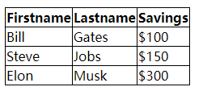
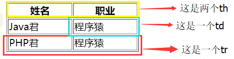
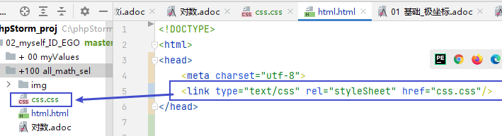

- 在asciidoc中使用html 和 JavaScript
	- 将html代码, 写在 两个 ++++ 里面
		-
-
-
- html
	- 插入图片
	  collapsed:: true
		- ```
		  
		  ```
	- 在html中给元素设置id, 然后在css中引用该id, 并赋予样式
	  collapsed:: true
		- ```
		  // html中给元素设置id
		  
		  
		  //css中, 用 #号调用该id
		  #mypic {
		  width: 20%;
		  }
		  ```
	- 在html中插入latex公式
	  background-color:: red
	  collapsed:: true
		- ```
		  <script id="MathJax-script" async src="https://cdn.
		  jsdelivr.net/npm/mathjax@3/es5/tex-mml-chtml.js">
		  </script>
		  
		  \( 公式 \) 以添加"行内公式"，
		  \[ 公式 \] 以添加"独行公式"。
		  
		  如:
		  \( x^2 + y^2 = z^2 \)
		  ```
	- 插入表格
	  collapsed:: true
		- **tr**：这是表中的“行”。每一行是一个tr（table row）。
		- **th**：这是表头，也就是每一列的标题（table head）。
		- **td**：这是表的每一个单元格
		- **th**与**td**的区别是：**th**内部的文本样式为**居中+粗体**，**td** 内的文本样式为**左对齐+普通文本**。
		- <table>
		      <tr>
		          <th>Firstname</th>
		          <th>Lastname</th>
		          <th>Savings</th>
		      </tr>
		      <tr>
		          <td>Bill</td>
		          <td>Gates</td>
		          <td>$100</td>
		      </tr>
		      <tr>
		          <td>Steve</td>
		          <td>Jobs</td>
		          <td>$150</td>
		      </tr>
		      <tr>
		          <td>Elon</td>
		          <td>Musk</td>
		          <td>$300</td>
		      </tr>
		  </table>
		- 
		- 
-
- css
	- 在html中外链css
	  collapsed:: true
		- ```
		  <link type="text/css" rel="styleSheet"  href="CSS文件路径" />
		  ```
		- 
	- 表格边框单线化
	  collapsed:: true
		- ```
		  table, td, th {
		      border: 1px solid black;
		  }
		  
		  table {
		      border-collapse: collapse;
		      width: auto;
		  }
		  ```
	-
-
- JavaScript
	- 在html中外链JavaScript
	  collapsed:: true
		- ```
		  <script type="text/javascript" src="js.js"></script>
		  ```
	- 遍历并输出每一个p元素中的文本内容
	  collapsed:: true
		- ```
		  window.onload = function() {
		      let allP = document.querySelectorAll("p")  //获取所有的p元素
		  
		      for (i in allP){
		          console.log(allP[i].innerText);  //遍历并输出每一个p元素中的文本内容. 显然, 这里的 i,不是代表序列中的每个元素, 而只是元素的索引.
		      }
		  }
		  ```
	- 遍历并获取每一个图片的原始尺寸
	  collapsed:: true
		- naturalWidth 和 naturalHeight 属性, 能获取图片的原始尺寸. 前提是：必须在图片完全下载到客户端浏览器才能判断
		- ```
		  window.onload = function () {
		      let allimg = document.querySelectorAll("img");
		      for (i in allimg) {
		          console.log(allimg[i].naturalWidth); //获取所有图片的原始尺寸, 亲测可行, 并且不受你在标签中给它设置缩放比例的影响. 依然能获得图片本身的尺寸
		      }
		  }
		  ```
	- 将每一个图片, 设置(缩放)为原始尺寸的n倍
	  background-color:: red
	  collapsed:: true
		- ```
		  window.onload = function () {
		      let myimgsize = 0
		      let allimg = document.querySelectorAll("img");
		      
		      for (i in allimg) {
		          myimgsize= allimg[i].naturalWidth; //获取所有图片的原始宽度尺寸
		          allimg[i].width=myimgsize*0.3 //将图片宽度,重新设置为原式尺寸的0.3倍
		      }
		  }
		  ```