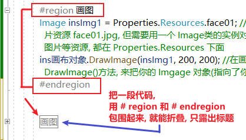

= visual studio 常用快捷键
:sectnums:
:toclevels: 3
:toc: left

---

== 折叠代码

---

[options="autowidth"]
|===
|Header 1 |Header 2

|快速格式化代码
|Ctrl(按住不放)+K+D

|快速输入 Console.WriteLine()
|cw + 两次Tab

|for循环
|for + 两次Tab
|===

---

== 行操作

[options="autowidth"]
|===
|Header 1 |Header 2

|复制本行到下一行上
|Ctrl + D

|移动行
|alt + 上下键

|将选中行, 往下移一行位置
|Alt+Shift+T

|删除当前行
|Shift+Delete
|===

---

== 匹配括号

[options="autowidth"]
|===
|Header 1 |Header 2

|快速找到括号的另一半匹配位置
|ctrl+}

|在匹配的括号内, 选中里面的全部文本(包括包围它们的括号)
|Ctrl + Shift +}
|===

---

== 注释 & 格式化代码

[options="autowidth"]
|===
|Header 1 |Header 2

|注释
|ctrl+k , 然后按住ctrl不放, 再按c

|取消注释
|ctrl+k , 然后按住ctrl不放, 再按u

|快速格式化代码
|Ctrl(按住不放)+K+D

|===

---

== 切换大小写

[options="autowidth"]
|===
|Header 1 |Header 2

|转换为大写
|Ctrl + Shift + U

|转换为小写
|Ctrl + U
|===
