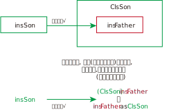

= 类型转换
:sectnums:
:toclevels: 3
:toc: left
---

==== string + int, 则 int 也会被转成 string类型

数字加字符串, 这个操作, 会把数字自动转成字符串类型.

[source, java]
----
int age = 3;
double money = 8;

Console.WriteLine(age+money);  //11
Console.WriteLine(age+"+"+money);  //3+8  ← 因为数字加字符串, 相当于都转成了字符串
Console.WriteLine("a+b"+age+money);  //a+b38  ← age先和前面的字符串合并, 就会先把age转成了字符串, 再把money也转成了字符串, 最终就是 不存在数字的加减了.
Console.WriteLine("a+b"+(age+money));  //a+b11
----

---

==== string -> int

将字符串数字, 转成int型数字, 要用这个方法 : Convert.ToInt32(你的字符串类型的数字)

[source, java]
----
int a = Convert.ToInt32(Console.ReadLine()); // 该 Console.ReadLine()方法, 返回的是 string 类型的数据. 所以我们要用 Convert.ToInt32() 将"该string类型的数字", 转成 int 类型.
int b = Convert.ToInt32(Console.ReadLine());
int c = a + b;
Console.WriteLine(c);
----

---

==== int → char

[source, java]
----
int num = 103;
char c = (char)num;   //(char) 是强制类型转换成"字符类型".但注意, 大字节的变量数据, 强赛到小字节的变量空间里, 会导致数据丢失.
Console.WriteLine(c);  //本例会打印出一个"g"
----

---

== 将"父类实例", 转成属于"子类类型"的

子类变量insSon, 不能指向父类实例insFather. 但我们可以通过强制类型转换, 来讲父类实例insFather, 转成属于子类类型的 (ClsSon)insFather, 于是, 子类变量insSon, 就能指向这个实例了 insSon = (ClsSon)insFather.

[source, java]
----
static void Main(string[] args)
{

    ClsFather insFather;
    ClsSon insSon;

    insFather = new ClsSon(); //父类变量, 指向子类的实例
    insFather.fnFather(); //from fahter  ← 即使父类变量, 指向子类实例, 它也不会忘记自己是属于父类的, 只会访问到父类中的方法, 而不能访问到子类中的方法.

    // insSon =new ClsFather();  //这句会报错, 因为子类变量, 不能指向父类实例.

    insSon = (ClsSon)insFather; // 但你可以用强制类型转换, 把父类实例, 转成子类类型, 这样,  子类变量 insSon 就能指向该实例对象(insFather)了.   这样后, 该子类变量, 既记得自己属于子类, 也记得自己属于父类. 于是就,  既可以调用子类中的方法, 也可以调用父类中的方法
    insSon.fnFather(); //from fahter
    insSon.fnSon(); //from son

    //上面的强制类型转换, 还可以写成更简单的形式:
    insSon = insFather as ClsSon;  // 这句的意思就相当于 insSon = (ClsSon)insFather;  即: insSon这个变量, 会指针指向 "被强制类型转换成子类ClsSon类型"的父类实例 insFather.
    insSon.fnFather(); //from fahter
    insSon.fnSon(); //from son
}
----

即, 将父类实例"降级成"子类类型后, 才能被另一个子类变量指向.

---

