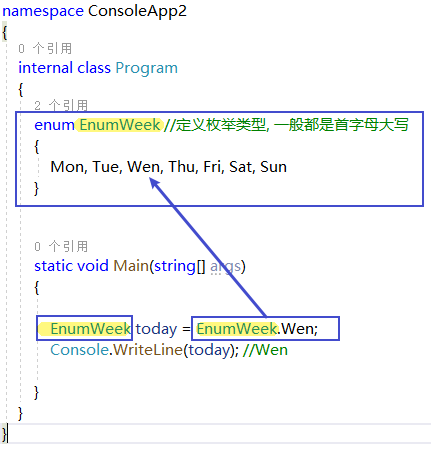

= 枚举类型
:sectnums:
:toclevels: 3
:toc: left

---

== 定义一个枚举类型, 代码要写在 main函数前面.

[source, java]
----
enum type职业  //定义一个枚举类型的变量. 注意, 枚举类型的定义, 必须放在main函数前面
{
  皇帝, 丞相, 大都督, 刺史, 太守, 将军  //注意:这些字符串不需要加双引号
}

static void Main(string[] args)
{
type职业 status诸葛亮 = type职业.丞相;
Console.WriteLine(status诸葛亮); //丞相
}
----

.标题
====
例子: 用枚举类型, 来封装一周七天

====

---

