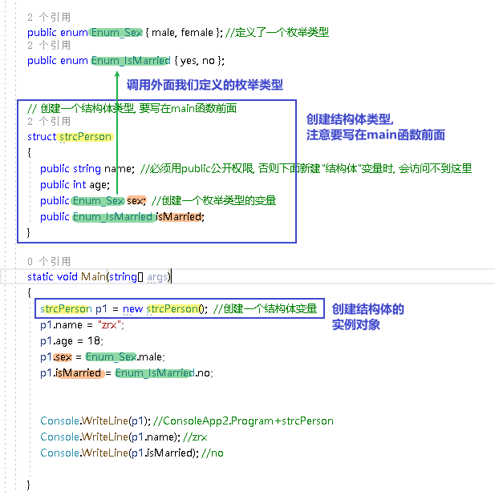

= 枚举类型
:sectnums:
:toclevels: 3
:toc: left

---

== 创建"结构体"类型, 并实例化出一个对象
[source, java]
----
public enum Enum_Sex { male, female }; //定义了一个枚举类型
public enum Enum_IsMarried { yes, no };

// 创建一个结构体类型, 要写在main函数前面
struct strcPerson
{
    public string name;  //必须用public公开权限, 否则下面新建"结构体"变量时, 会访问不到这里
    public int age;
    public Enum_Sex sex;  //创建一个枚举类型的变量
    public Enum_IsMarried isMarried;
}

static void Main(string[] args)
{
    strcPerson p1 = new strcPerson();  //创建一个结构体变量
    p1.name = "zrx";
    p1.age = 18;
    p1.sex = Enum_Sex.male;
    p1.isMarried = Enum_IsMarried.no;

    Console.WriteLine(p1); //ConsoleApp2.Program+strcPerson
    Console.WriteLine(p1.name); //zrx
    Console.WriteLine(p1.isMarried); //no
}
----

---

== 创建"结构体类型"的数组

[source, java]
----
// 创建一个结构体
struct STRC_PERSON
{
  public string name;
  public int age;
}

static void Main(string[] args)
{
  STRC_PERSON[] arrStrcPerson = new STRC_PERSON[3]; //创建一个数组(含3个元素的长度), 里面放的元素是"结构体类型"的.
  arrStrcPerson[0].name = "zrx";
  arrStrcPerson[1].name = "wyy";
  arrStrcPerson[2].name = "zm";

  Console.WriteLine(arrStrcPerson); //ConsoleApp2.Program+STRC_PERSON[]

  foreach (var item in arrStrcPerson)
  {
      Console.WriteLine(item.name); //输出3行, 分别是 zrx, wyy, zm
  }
}
----

---

== 在结构体中, 可以定义"方法(函数)"

[source, java]
----
// 创建一个结构体
struct STRC_PERSON
{
  public string name;
  public int age;

  public void fnPrintInfo()  // 在结构体中, 可以定义方法(即函数)
  {
      Console.WriteLine("name:{0}, age:{1}", name, age);
  }
}

static void Main(string[] args)
{
  STRC_PERSON p1 = new STRC_PERSON();
  p1.name = "zrx";
  p1.age = 19;
  p1.fnPrintInfo(); //name:zrx, age:19
}
----

---
