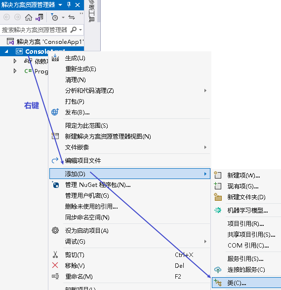
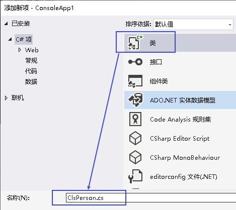
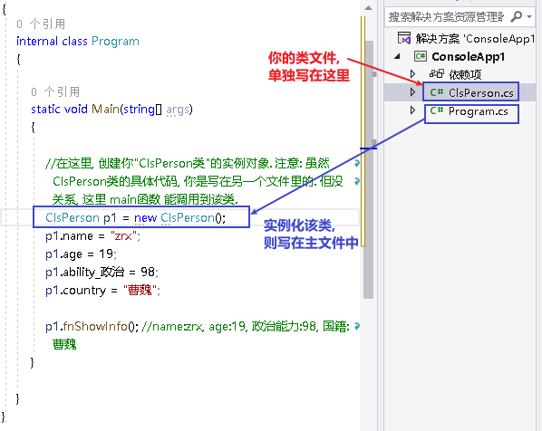
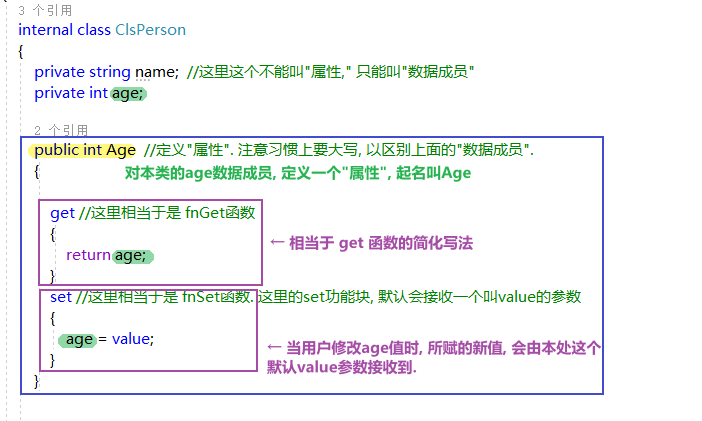

= 类
:sectnums:
:toclevels: 3
:toc: left

---

C# 中, 习惯上, 一个"类" 就放在一个cs文件里. (文件名, 就跟你的类名保持一致就行了.) 而不要把多个类写在一个文件中.

== 类方法

==== 添加"类文件"的方法

现在, 你就有了一个专门存放类的文件, 名叫 ClsPerson.cs, 输入代码:

[source, java]
----
using System;
using System.Collections.Generic;
using System.Linq;
using System.Text;
using System.Threading.Tasks;

namespace ConsoleApp1
{
  //创建一个"人"类
  internal class ClsPerson
  {
      public string name;
      public int age;
      public int ability_政治;
      public string country;

      public void fnShowInfo()
      {
          Console.WriteLine("name:{0}, age:{1}, 政治能力:{2}, 国籍:{3}", name, age, ability_政治, country);
      }

  }
}
----

然后, 你回到主文件 Program.cs中, 输入:

[source, java]
----
using System.IO.Compression;

namespace ConsoleApp1
{
  internal class Program
  {

      static void Main(string[] args)
      {

          //在这里, 创建你"ClsPerson类"的实例对象. 注意: 虽然 ClsPerson类的具体代码, 你是写在另一个文件里的. 但没关系, 这里 main函数 能调用到该类.
          ClsPerson p1 = new ClsPerson();
          p1.name = "zrx";
          p1.age= 19;
          p1.ability_政治 = 98;
          p1.country = "曹魏";

          p1.fnShowInfo(); //name:zrx, age:19, 政治能力:98, 国籍:曹魏
      }

  }
}
----

即:

---

== 访问权限

==== 将类中的数据, 设为 private 私有访问权限.

在定义类时, 将数据前面 加上private关键词, 则该数据, 就无法在"该类的实例"中访问到, 也无法修改它的值.  +
换言之, private 访问权限, 就意味着该数据只能在"类的内部"能被访问到.

- public 公有访问。不受任何限制。
- private 私有访问。只限于本类成员访问，子类，实例都不能访问。
- protected 保护访问。只限于本类和子类访问，实例不能访问。
- internal 内部访问。只限于本项目（程序集）内访问，其他不能访问。
- protected internal 内部保护访问。只限于本项目（程序集）或是子类访问，其他不能访问

在 类文件中: +
[source, java]
----
internal class ClsBus
{
  private int speed;
  private int spaceArea;  // 访问权限设成 private后, 这个属性, 就只能在类的内部被访问到, 而不能在实例中访问到
  public string name;

  public void fnRun()
  {
      Console.WriteLine("your bus {0}  is running ...", name);
  }
}
----

---

==== 那么对于类中的 private数据, 我们如何在实例中, 来访问和修改它呢? 在类中添加 get 和 set 方法

在类中, 我们一般把所有数据, 都设为private私有的, 然后通过 get 和 set方法, 来暴露给用户, 来修改私有的属性值. 你就可以在这些函数方法里, 添加"验证代码"了.  +
比如 , 用户想修改密码, 就先验证用户的身份信息, 正确了才能继续使用set函数来修改密码这个数据.

类文件中: +
[source, java]
----
namespace ConsoleApp1
{
  //创建一个"人"类
  internal class ClsPerson
  {
      private string name = "";
      private string id身份证号="000"; //默认为000
      private string password = "123456"; //默认密码为123456

      public void fnGetPassword() // get函数
      {
          Console.WriteLine("你的当前password 是: {0}",password);
      }

      public void fnSetPassword()  // set函数. 里面可以设置"验证代码"
      {
          while (true)
          {
              Console.WriteLine("输入你正确的身份证号, 才能更改密码");
              string tempID= Console.ReadLine();

              if (tempID == id身份证号)
              {
                  Console.WriteLine("验证身份通过");
                  break; //跳出while循环
              }
              else
              {
                  Console.WriteLine("你输入的身份证号码错误!");
              }
          }

          Console.WriteLine("请输入新密码");
          password  = Console.ReadLine(); //上面的验证通过后, 就允许用户来更改密码了
      }

  }
}
----

---

== 属性

对每一个类中的 private数据, 都要设置 get和set函数, 太麻烦了! 所以 C# 提供了一种简单的方法来实现这个功能 --- 这就是"属性". +
类中的"属性", 其功能 相当于把get和set函数, 总和到一起了. 其实就是将get 和set函数 打包的简便写法.

类中: +
[source, java]
----
internal class ClsPerson
{
  private string name;  //这里这个不能叫"属性," 只能叫"数据成员"
  private int age;

  public int Age  //定义"属性". 注意习惯上要大写, 以区别上面的"数据成员".
  {

      get //这里相当于是 fnGet函数
      {
          return age;
      }
      set //这里相当于是 fnSet函数. 这里的set功能块, 默认会接收一个叫value的参数
      {
          age = value;
      }
  }

  //构造函数
  public ClsPerson(string name, int age)
  {
      this.name = name;  //this就代表你之后实例化本类对象时, 当时创建出的那一个实例对象
      this.age = age;
  }

  public void fnInfo()
  {
      Console.WriteLine("info : 姓名:{0}, 年龄:{1}",name,age);
  }
}
----

即: +

主页面中, 这样写: +
[source, java]
----
ClsPerson p1 = new ClsPerson("zrx",19);
p1.Age = 10;  //赋值, 会直接调用类中"Age属性"中的 get块(功能相当于get函数)
Console.WriteLine(p1.Age); //10  ←读取, 会直接调用类中"Age属性"的set块
----
你会发现, 虽然"Age属性"的体内是函数功能, 但我们在使用它时, 可以把它当做一个普通的"数据成员"变量来使用. 很方便.

---

== ★  如何在一个项目里面, 使用另一个项目里的类?

详见我 "visual studio 设置.adoc" 页面中的笔记.

---

== ----------  ----------

---

== "实例对象"的变量名, 只是个指针

由类实例化出来 的对象, 其变量名, 只是个指针而已.

类中:
[source, java]
----
//创建一个"人"类
internal class ClsPerson
{
private string name;

public ClsPerson(string name) //构造函数
{
    this.name = name;
}

public string Name //创建name的属性
{
    get
    {
        return name;
    }
    set
    {
        name = value;
    }
}
----

主文件中: +
[source, java]
----
static void Main(string[] args)
{
    ClsPerson p1 = new ClsPerson("zrx"); // p1变量, 只是个指针, 它指向 ClsPerson实例化出来的一个对象.
    Console.WriteLine(p1.Name); //zrx

    ClsPerson p2;  //创建p2对象, 这里没有对它进行初始化赋值
    p2 = p1; // 让 p2 指针指向p1对象, 现在, p2和p1这两个指针, 都指向同一块内存地址了.
    Console.WriteLine(p2.Name); //zrx  ← 现在, p2就完全接收了p1里面的数据.

    p2.Name = "wyy";  //由于p2指针指向了p1, 所以我们修改p2对象的name数据(Name属性), 就相当于是修改了 p1对象的name数据.
    Console.WriteLine(p1.Name); //wyy

    p1 = null; // 断开p1的指针, 不再指向任何具体对象了.
    //Console.WriteLine(p1.Name);  // 这里就会报错了, 因为 p1指针, 指向了空的内存地址.
    Console.WriteLine(p2.Name); //wyy  ← p2不受影响
}
----

---

