= 类
:sectnums:
:toclevels: 3
:toc: left

---

C# 中, 习惯上, 一个"类" 就放在一个cs文件里. (文件名, 就跟你的类名保持一致就行了.) 而不要把多个类写在一个文件中.

== 类方法

==== 添加"类文件"的方法

image:img/0004.png[,]

image:img/0005.png[,]

现在, 你就有了一个专门存放类的文件, 名叫 ClsPerson.cs, 输入代码:

[source, java]
----
using System;
using System.Collections.Generic;
using System.Linq;
using System.Text;
using System.Threading.Tasks;

namespace ConsoleApp1
{
  //创建一个"人"类
  internal class ClsPerson
  {
      public string name;
      public int age;
      public int ability_政治;
      public string country;

      public void fnShowInfo()
      {
          Console.WriteLine("name:{0}, age:{1}, 政治能力:{2}, 国籍:{3}", name, age, ability_政治, country);
      }

  }
}
----

然后, 你回到主文件 Program.cs中, 输入:

[source, java]
----
using System.IO.Compression;

namespace ConsoleApp1
{
  internal class Program
  {

      static void Main(string[] args)
      {

          //在这里, 创建你"ClsPerson类"的实例对象. 注意: 虽然 ClsPerson类的具体代码, 你是写在另一个文件里的. 但没关系, 这里 main函数 能调用到该类.
          ClsPerson p1 = new ClsPerson();
          p1.name = "zrx";
          p1.age= 19;
          p1.ability_政治 = 98;
          p1.country = "曹魏";

          p1.fnShowInfo(); //name:zrx, age:19, 政治能力:98, 国籍:曹魏
      }

  }
}
----

即:

image:img/0006.png[,]

---

== 访问权限

==== 将类中的数据, 设为 private 私有访问权限.

在定义类时, 将数据前面 加上private关键词, 则该数据, 就无法在"该类的实例"中访问到, 也无法修改它的值.  +
换言之, private 访问权限, 就意味着该数据只能在"类的内部"能被访问到.

在 类文件中: +
[source, java]
----
internal class ClsBus
{
  private int speed;
  private int spaceArea;  // 访问权限设成 private后, 这个属性, 就只能在类的内部被访问到, 而不能在实例中访问到
  public string name;

  public void fnRun()
  {
      Console.WriteLine("your bus {0}  is running ...", name);
  }
}
----

---

==== 那么对于类中的 private数据, 我们如何在实例中, 来访问和修改它呢? 在类中添加 get 和 set 方法

在类中, 我们一般把所有数据, 都设为private私有的, 然后通过 get 和 set方法, 来暴露给用户, 来修改私有的属性值. 你就可以在这些函数方法里, 添加"验证代码"了.  +
比如 , 用户想修改密码, 就先验证用户的身份信息, 正确了才能继续使用set函数来修改密码这个数据.

类文件中: +
[source, java]
----
namespace ConsoleApp1
{
  //创建一个"人"类
  internal class ClsPerson
  {
      private string name = "";
      private string id身份证号="000"; //默认为000
      private string password = "123456"; //默认密码为123456

      public void fnGetPassword() // get函数
      {
          Console.WriteLine("你的当前password 是: {0}",password);
      }

      public void fnSetPassword()  // set函数. 里面可以设置"验证代码"
      {
          while (true)
          {
              Console.WriteLine("输入你正确的身份证号, 才能更改密码");
              string tempID= Console.ReadLine();

              if (tempID == id身份证号)
              {
                  Console.WriteLine("验证身份通过");
                  break; //跳出while循环
              }
              else
              {
                  Console.WriteLine("你输入的身份证号码错误!");
              }
          }

          Console.WriteLine("请输入新密码");
          password  = Console.ReadLine(); //上面的验证通过后, 就允许用户来更改密码了
      }

  }
}
----

---

== 构造函数

"构造函数"的作用, 是用来在"实例化"该类时, 对实例化出的对象, 进行数据赋值.

注意: 构造函数有这几个特点: +
- 构造函数的函数名, 要和类名一致. +
- 构造函数不需要返回值.
- 构造函数中, 要使用this关键词, 来代表"实例对象"自己.
- 如果你不手动显式的写一个构造函数, 则程序会自动帮你在类里面, 创建一个"无参的构造函数". +

在类文件中: +
[source, java]
----
namespace ConsoleApp2
{
  internal class ClsPerson
  {
      public string name;
      public int age;

      //构造函数
      public ClsPerson(string name, int age)
      {
          this.name = name;  //this就代表你之后实例化本类对象时, 当时创建出的那一个实例对象
          this.age = age;
      }

      public void fnInfo()
      {
          Console.WriteLine("info : 姓名:{0}, 年龄:{1}",name,age);
      }
  }
}
----

即: +
image:img/0007.png[,]

然后在主文件中, 就可以在"实例化该类"时, 直接给这些 name, age数据 来赋值了. 这样, 每一个实例对象, 都有自己专门的name,age等数值.

主文件中: +
[source, java]
----
static void Main(string[] args)
{
  ClsPerson p1 = new ClsPerson("zrx",19);  // 实例化时, 直接进行赋值
  p1.fnInfo(); //info : 姓名:zrx, 年龄:19
}
----

---

== 属性

对每一个类中的 private数据, 都要设置 get和set函数, 太麻烦了! 所以 C# 提供了一种简单的方法来实现这个功能 --- 这就是"属性". +
类中的"属性", 其功能 相当于把get和set函数, 总和到一起了. 其实就是将get 和set函数 打包的简便写法.

类中: +
[source, java]
----
internal class ClsPerson
{
  private string name;  //这里这个不能叫"属性," 只能叫"数据成员"
  private int age;

  public int Age  //定义"属性". 注意习惯上要大写, 以区别上面的"数据成员".
  {

      get //这里相当于是 fnGet函数
      {
          return age;
      }
      set //这里相当于是 fnSet函数. 这里的set功能块, 默认会接收一个叫value的参数
      {
          age = value;
      }
  }

  //构造函数
  public ClsPerson(string name, int age)
  {
      this.name = name;  //this就代表你之后实例化本类对象时, 当时创建出的那一个实例对象
      this.age = age;
  }

  public void fnInfo()
  {
      Console.WriteLine("info : 姓名:{0}, 年龄:{1}",name,age);
  }
}
----

即: +
image:img/0008.png[,]

主页面中, 这样写: +
[source, java]
----
ClsPerson p1 = new ClsPerson("zrx",19);
p1.Age = 10;  //赋值, 会直接调用类中"Age属性"中的 get块(功能相当于get函数)
Console.WriteLine(p1.Age); //10  ←读取, 会直接调用类中"Age属性"的set块
----
你会发现, 虽然"Age属性"的体内是函数功能, 但我们在使用它时, 可以把它当做一个普通的"数据成员"变量来使用. 很方便.

---

== 类的继承 (父类, 子类)

我们先写一个父类, 然后写两个子类, 继承自该父类.  然后在其中第二个子类中, 我们重写(覆盖掉)父类的一个方法.

最终的文件结构会如下:

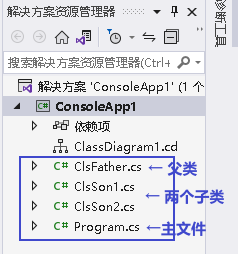

.标题
====
例如： +
父类的文件: +
[source, java]
----
internal class ClsFather
{
    private string name;
    private int age;

    public void fnCan1()
    {
        Console.WriteLine("会爬");
    }

    public void fnCan2()
    {
        Console.WriteLine("会游");
    }
}

----

子类1 (ClsSon1)的文件 :
[source, java]
----
internal class ClsSon1 : ClsFather // 在子类后面, 写冒号, 和父类名称. 这样子类就继承了父类
{

}
----

子类2 (ClsSon1)的文件 :
[source, java]
----
internal class ClsSon2: ClsFather
{
    public string language; //添加一个子类2自己的数据

    public void fnCan2() //重写继承自父类的 fnCan2方法. 会覆盖掉父类的同名方法.
    {
        Console.WriteLine("会走(子类2专属)");
    }
}
----

然后在主文件中: +
[source, java]
----
static void Main(string[] args)
{
 ClsFather insFather  = new ClsFather(); //创建一个父类的实例对象
    insFather.fnCan1(); //会爬
    insFather.fnCan2(); //会游

    ClsSon1 insSon1 = new ClsSon1(); //创建一个"子类1"的对象.
    insSon1.fnCan1(); //会爬  ← 子类能调用"其继承的父类"中的方法
    insSon1.fnCan2(); //会游

    ClsSon2 insSon2 = new ClsSon2();
    insSon2.fnCan2(); //会走(子类2专属) ←由于在 ClsSon2 这个子类中, 我们覆盖了父类的同名方法, 所以这里, 就能直接子类2自己的该方法了.
}
----
====

.标题
====
例如：

本例的类图如下:

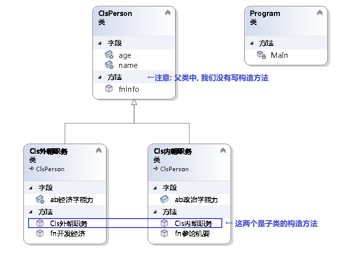

父类页面: +
[source, java]
----
internal class ClsPerson
{
    protected string name; //protected权限, 依然是私有的, 但能开放给子类访问.
    protected int age;

    //构造函数 ← 注意!! 父类中, 不需要写构造函数! 否则, 子类的构造函数中, 没法融入从父类继承来的变量数据, 会报错.  所以下面注释掉的代码都不需要写!
    //public ClsPerson(string name, int age)
    //{
    //    this.name = name;
    //    this.age = age;
    //}

    public void fnInfo()
    {
        Console.WriteLine("name: {0}, age:{1}",name,age);
    }

}
----

子类1的页面: +
[source, java]
----
internal class Cls内朝职务: ClsPerson //继承自父类 ClsPerson
{
    public int ab政治学能力;

    //构造函数
    public Cls内朝职务(string name, int age,int ab政治学能力) //这里, 除了在子类中定义的新添加的数据变量外, 还要把从父类中继承过来的数据变量, 也要写在这里. 进行赋值.
    {
        this.ab政治学能力 = ab政治学能力;
        this.name = name;
        this.age = age;
    }

    public void fn参论机要()
    {
        Console.WriteLine("{0} 参论机要. 政治能力是{1}", this.name, this.ab政治学能力);
    }
}
----

子类2的页面: +
[source, java]
----
internal class Cls外朝职务: ClsPerson  //继承自父类 ClsPerson
{
    protected int ab经济学能力;

    //构造函数
    public Cls外朝职务(string name, int age,int ab经济学能力) //别忘了, 在子类的构造方法中, 要把从父类继承来的数据, 也一起带进来赋值
    {
        this.ab经济学能力 = ab经济学能力;
        this.name = name;
        this.age = age;
    }

    public void fn开发经济()
    {
        Console.WriteLine("{0} 开发经济...  经济能力是{1}",this.name, this.ab经济学能力);
    }
}
----

主页面 +
[source, java]
----
static void Main(string[] args)
{
    Cls内朝职务 ins內朝官 = new Cls内朝职务("zrx", 16,99);
    ins內朝官.fnInfo(); //name: zrx, age:16
    ins內朝官.fn参论机要(); //zrx 参论机要. 政治能力是99

    Cls外朝职务 ins外朝官 = new Cls外朝职务("诸葛亮", 27, 98);
    ins外朝官.fn开发经济(); //诸葛亮 开发经济...  经济能力是98
}
----

====

---

==== 子类的构造函数, 继承父类的构造函数

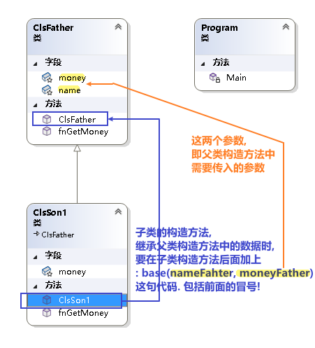

.标题
====
例如：

父类页面: +
[source, java]
----
internal class ClsFather
{
    protected string name;
    protected int money;

    //构造函数
    public ClsFather(string name, int money)
    {
        this.name = name;
        this.money = money;
    }

    public void fnGetMoney()
    {
        Console.WriteLine(this.money);
    }
}
----

子类页面: +
[source, java]
----
internal class ClsSon1 : ClsFather
{
    protected int money;  //这里子类覆盖了父类中同名的money数据

    public ClsSon1(int moneySon, string nameFahter, int moneyFather) : base(nameFahter, moneyFather)  //注意: 父类中有一个有参构造函数. 所以你子类定义构造函数时,必须把父类的构造函数中的数据也带进来赋值. 相当于"子类的构造函数"继承了"父类的构造函数", 所以要在子类构造函数后面, 加上 ":base(父类构造函数中的参数)"这个语句.  如果你父类的构造函数是无参的, 才不需要在这里传递父类的参数.
    {
        this.money = moneySon;
        base.money = moneyFather;  //base 就指代"父类", 这里, 我们在子类里面, 即在子类实例化时, 传参时, 可以连带给父类的实例中的数据来赋值,
        base.name = nameFahter;
    }

    public void fnGetMoney()
    {
        Console.WriteLine("儿子的钱是{0}, 父亲{1}的钱是{2}", this.money, base.name, base.money);
    }
}
----

image:img/0024.png[,]

主页面: +
[source, java]
----
static void Main(string[] args)
{
    ClsFather insFather = new ClsFather("zrx", 3000);
    insFather.fnGetMoney(); //3000

    ClsSon1 insSon1 = new ClsSon1(800, "zrx", 3000); //因为我们在ClsSon1子类的构造函数里, 规定要传入三个参数: 儿子的钱, 父亲的名字,父亲的钱
    insSon1.fnGetMoney(); //儿子的钱是800, 父亲zrx的钱是3000
}
----
====

一般, 我们不会在子类中, 去覆盖父类中的同名数据, 只会去覆盖同名方法(函数). 比如, 同样是 "fn_工作()", 子类的工作生态, 可能和父类的工作生态不一致. 所以可以在子类中, 重写父类的同名方法.

---

==== 查看类图 (类的继承关系图)

先在 visual studio 的菜单:  工具 -> 获取工具和功能

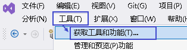

安装 "扩展开发"

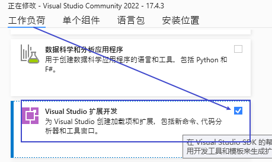

然后, 在"单个组件"中, 搜索"类", 勾选"类设计器".

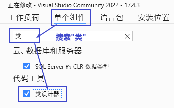

然后, 点整个界面右下角的"修改" (相当于是安装功能)

选菜单: 视图 -> 类视图

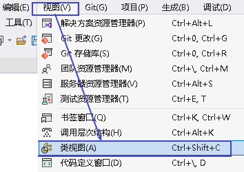

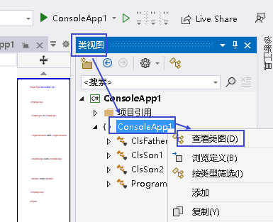

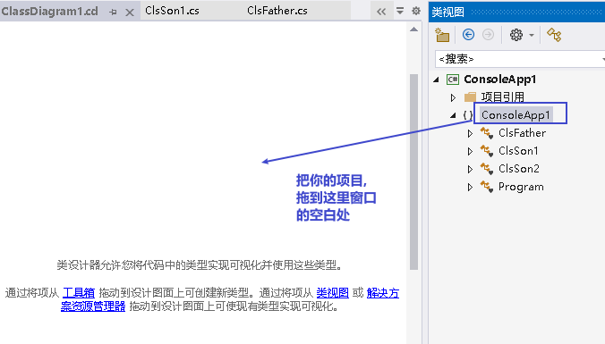

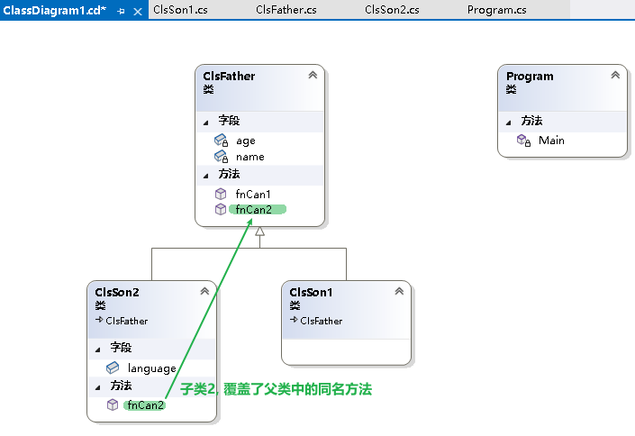

---

== 子类中, 重写父类的同名方法

==== 虚方法 (即在子类中,重写父类中的同名方法)

.标题
====
父类中 +
[source, java]
----
internal class ClsFather
{
    public virtual void fnTalking() //virtual 让本方法, 变成了"虚方法"
    {
        Console.WriteLine("父类的口才");
    }
}
----

子类中 +
[source, java]
----
internal class ClsSon:ClsFather
{
    public override void fnTalking()  // 在子类中, 你要重写父类的同名方法, 只要先输入 "override+空格", 软件就会提示你要重写哪个父方法.
    {
        Console.WriteLine("子类的口才");
    }
}
----

主文件中 +
[source, java]
----
static void Main(string[] args)
{
    ClsSon insSon = new ClsSon();
    insSon.fnTalking(); //子类的口才
}
----

====

---

==== "父类变量", 若指向"子类的实例", 则会忘掉"父类中不存在的子类中的方法" (即无法调用子类中的方法).

.标题
====
例如：

image:img/0026.png[,]

父类 +
[source, java]
----
internal class ClsFather
{
    public virtual void fnTalking() //virtual 让本方法, 变成了"虚方法"
    {
        Console.WriteLine("父类的口才");
    }
}
----

子类:
[source, java]
----
internal class ClsSon:ClsFather
{
    public override void fnTalking()  // 在子类中, 你要重写父类的同名方法, 只要先输入 "override+空格", 软件就会提示你要重写哪个父方法.
    {
        Console.WriteLine("子类的口才");
    }
}
----

子类2:
[source, java]
----
internal class ClsSon2 : ClsFather
{
    public  void fn子类2专属方法()
    {
        Console.WriteLine("fn子类2专属方法");
    }
}
----

主文件 +
[source, java]
----
static void Main(string[] args)
{
    ClsFather insFather;
    insFather = new ClsSon(); //父类类型的变量, 居然能指向"子类实例"上!
    insFather.fnTalking(); //子类的口才   ← 这里, 父类变量能访问到子类中的方法, 是因为父类中有子类的同名方法存在.

    insFather = new ClsSon2();  // 同样可行. 父类类型的变量, 可以指向该父类的"任意子类"的"实例"上!
    // insFather.fn子类2专属方法();  //但是这句会报错. 因为虽然 insFather 的确指向了子类2的实例对象, 但由于 insFather 是从父类申明而来的, 所以它无法访问(会忘记)自己能访问到子类2 中的方法. 相当于 白天鹅跟了丑小鸭后,  会忘掉自己会飞.

    // ClsSon insSon = new ClsFather(); // 这句会报错, 无法将子类变量, 指向父类.  记忆就是: 父亲可以指(指向)责儿子; 反之儿子则不能指责(指向)父亲
}
----
====

---

==== 隐藏方法 (即子类覆盖父类的同名方法)

在子类中, 要覆盖父类的同名方法, 要在子类这个方法前 使用关键词 new.

.标题
====
例如：

父类:
[source, java]
----
internal class ClsFather
{
    public  void fnTalking()
    {
        Console.WriteLine("父类的口才");
    }
}
----

子类: +
[source, java]
----
internal class ClsSon:ClsFather  //子类继承自父类
{
    public new void fnTalking()  //要覆盖父类中的同名方法, 在这里要加 new 关键词
    {
        Console.WriteLine("子类的口才");
    }
}
----

主文件: +
[source, java]
----
static void Main(string[] args)
{
    ClsSon insSon = new ClsSon();
    insSon.fnTalking(); //子类的口才

    ClsFather insFather = new ClsSon();  // 父类变量, 指向子类的实例对象
    insFather.fnTalking(); //父类的口才  ← 你发现, 虽然父类中有子类的同名方法, 但是父类变量指向子类实例后, 调用该同名方法时, 依然执行的是父类中的方法, 而不是子类中的方法. 这就是本"隐藏函数"和"虚函数"在重写父类方法的区别所在.
    //即, 子类中, 用"虚函数"方式 重写的父类方法,   父类变量指向子类对象, 再调用子类的方法, 会执行"子类中的方法". 而屏蔽掉执行"父类中的方法".
    // 如果用"隐藏函数"的方法, 来改写的父类方法. 父类变量指向子类对象, 再调用子类的方法, 会执行"父类中的方法". 而屏蔽掉执行"子类中的方法".
}
----

image:img/0027.png[,]

====

---

== 抽象类

类和函数, 能用 abstract 关键词, 把它们变成"抽象"的.

抽象类:

- 类是一个模板, 抽象类就是一个不完整的模板.
- 抽象类不能被实例化, 不能使用new关键字. 所以抽象类只能作为其他类的基类.
- 也不能被密封.
- 如果派生类(即子类)没有实现所有的抽象方法，则该"派生类"也必须声明为"抽象类".
- 抽象类中, 可以包含普通函数, 和抽象函数.
- 抽象类如果含有抽象的变量或值，则它们要么是null类型，要么包含了对非抽象类的实例的引用。
- 如果一个"非抽象类"从"抽象类"中派生，则其必须通过"重载"来实现所有继承而来的抽象成员。

抽象函数:

- 抽象函数, 只有函数定义, 没有函数体. 即抽象函数本身也是虚拟的 virtual.

.标题
====
例如：

抽象类: +
[source, java]
----
abstract internal class abstClsLife  //抽象类, 用 abstract 申明
{
    public abstract void fn觅食(); //抽象方法, 不需要函数体.

    public void fnMove() //抽象类中, 可以包含普通的方法
    {
        Console.WriteLine("本生命体在移动");
    }
}
----

抽象类的子类 ClsFather +
[source, java]
----
internal class ClsFather:abstClsLife // 父类继承自抽象类
{
    public  void fnTalking()
    {
        Console.WriteLine("父类的口才");
    }

    public override void fn觅食()  // 在子类中, 对其父类(是抽象类)中的"抽象方法"的重写 , 要用 override 关键词
    {
        Console.WriteLine("父类在觅食");
    }
}
----

主文件中 +
[source, java]
----
static void Main(string[] args)
{
    ClsFather insFather = new ClsFather();
    insFather.fn觅食(); //父类在觅食

    abstClsLife insLife = new ClsFather(); // 我们将抽象类的变量, 指针指向其子类 "ClsFather类"的实例.
    insLife.fn觅食(); //父类在觅食
    insLife.fnMove(); //本生命体在移动  ← 虽然, insLife 所指向的子类"ClsFather类"中没有 fnMove()方法, 但抽象类中有, 所以这里依然能找到父类中的该方法.
    //insLife.fnTalking(); //这句会报错. 虽然 "ClsFather类" 中有这个方法, 但抽象类中却没有这个方法. 所以无法被调用.
}
----

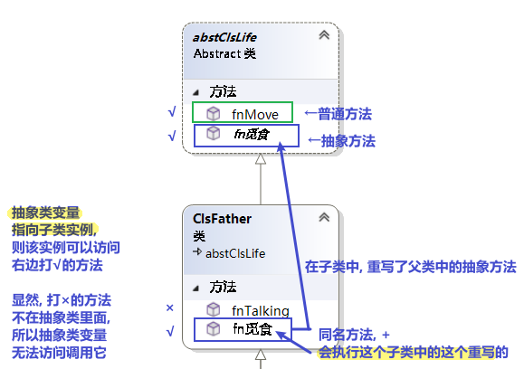

总结就是: 父类变量, 即使指向子类对象, 也没忘了本身父类中的方法! (身在曹营心在汉). 即, 只执行父类中有的, 和父类和子类共同有的东西(交集部分. 比如同名函数). 而忽略掉父类中不存在的东西(哪怕这些东西子类中有), 也不执行.
====

---

== 密封类

---

== ----------  ----------

---

== "实例对象"的变量名, 只是个指针

由类实例化出来 的对象, 其变量名, 只是个指针而已.

类中:
[source, java]
----
//创建一个"人"类
internal class ClsPerson
{
private string name;

public ClsPerson(string name) //构造函数
{
    this.name = name;
}

public string Name //创建name的属性
{
    get
    {
        return name;
    }
    set
    {
        name = value;
    }
}
----

主文件中: +
[source, java]
----
static void Main(string[] args)
{
    ClsPerson p1 = new ClsPerson("zrx"); // p1变量, 只是个指针, 它指向 ClsPerson实例化出来的一个对象.
    Console.WriteLine(p1.Name); //zrx

    ClsPerson p2;  //创建p2对象, 这里没有对它进行初始化赋值
    p2 = p1; // 让 p2 指针指向p1对象, 现在, p2和p1这两个指针, 都指向同一块内存地址了.
    Console.WriteLine(p2.Name); //zrx  ← 现在, p2就完全接收了p1里面的数据.

    p2.Name = "wyy";  //由于p2指针指向了p1, 所以我们修改p2对象的name数据(Name属性), 就相当于是修改了 p1对象的name数据.
    Console.WriteLine(p1.Name); //wyy

    p1 = null; // 断开p1的指针, 不再指向任何具体对象了.
    //Console.WriteLine(p1.Name);  // 这里就会报错了, 因为 p1指针, 指向了空的内存地址.
    Console.WriteLine(p2.Name); //wyy  ← p2不受影响
}
----

---

