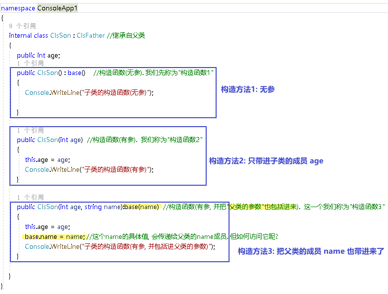

= 类 - 构造函数
:sectnums:
:toclevels: 3
:toc: left

---

== 构造函数

"构造函数"的作用, 是用来在"实例化"该类时, 对实例化出的对象, 进行数据赋值.

注意: 构造函数有这几个特点: +
- 构造函数的函数名, 要和类名一致. +
- 构造函数不需要返回值. 构造函数没有返回值, 连 void 也不能写.
- 构造函数的修饰符, 必须是 public.
- 构造函数中, 要使用this关键词, 来代表"实例对象"自己.
- 如果你不手动显式的写一个构造函数, 则程序会自动帮你在类里面, 创建一个"无参的构造函数". +

在类文件中: +
[source, java]
----
namespace ConsoleApp2
{
  internal class ClsPerson
  {
      public string name;
      public int age;

      //构造函数
      public ClsPerson(string name, int age)
      {
          this.name = name;  //this就代表你之后实例化本类对象时, 当时创建出的那一个实例对象
          this.age = age;
      }

      public void fnInfo()
      {
          Console.WriteLine("info : 姓名:{0}, 年龄:{1}",name,age);
      }
  }
}
----

即: +
image:img/0007.png[,]

然后在主文件中, 就可以在"实例化该类"时, 直接给这些 name, age数据 来赋值了. 这样, 每一个实例对象, 都有自己专门的name,age等数值.

主文件中: +
[source, java]
----
static void Main(string[] args)
{
  ClsPerson p1 = new ClsPerson("zrx",19);  // 实例化时, 直接进行赋值
  p1.fnInfo(); //info : 姓名:zrx, 年龄:19
}
----

---

== 子类的构造函数

==== 构造函数是"无参数"的情况下

.标题
====
例如：

父类 +
[source, java]
----
internal class ClsFather
{
    public ClsFather() //构造函数
    {
        Console.WriteLine("父类的构造函数");
    }
}
----

子类 +
[source, java]
----
internal class ClsSon : ClsFather //继承自父类
{
    public ClsSon():base()       //构造函数, 这里是无参的. 注意, 这里有 ":base()"代码. 说明继承自父类的构造函数.
    {
        Console.WriteLine("子类的构造函数");
    }
}
----

主文件 +
[source, java]
----
static void Main(string[] args)
{
    ClsSon insSon = new ClsSon();
}
----
主文件会输出:
....
父类的构造函数
子类的构造函数
....

可以看出, 子类继承自父类后, 在实例化子类对象时, 会先执行父类的构造函数, 再执行子类的构造函数.
====

---

==== 构造函数是"有参数"的情况下

.标题
====
例如：

父类 +
[source, java]
----
internal class ClsFather
{
    public string name;

    // 下面, 可以同时写多个构造函数, 只要传入的参数不同就行了.
    public ClsFather() //构造函数(无参)
    {
        Console.WriteLine("父类的构造函数(无参)");
    }

    public ClsFather(string name) //构造函数(有参)
    {
        this.name = name;
        Console.WriteLine("父类的构造函数(有参)");
    }
}
----

子类 +
[source, java]
----
internal class ClsSon : ClsFather //继承自父类
{
    public int age;
    public ClsSon() : base()    //构造函数(无参). 我们先称为"构造函数1"
    {
        Console.WriteLine("子类的构造函数(无参)");

    }

    public ClsSon(int age)  //构造函数(有参).  我们称为"构造函数2"
    {
        this.age = age;
        Console.WriteLine("子类的构造函数(有参)");
    }

    public ClsSon(int age, string name):base(name)  //构造函数(有参, 并把"父类的参数"也包括进来).  这一个我们称为"构造函数3"
    {
        this.age = age;
        base.name = name; //这个name的具体值, 会传递给父类的name成员. 但如何访问它呢?
        Console.WriteLine("子类的构造函数(有参, 并包括进父类的参数)");
    }

}
----

主文件 +
[source, java]
----
internal class Program
{

    static void Main(string[] args)
    {

        ClsSon insSon = new ClsSon(); //子类实例化时, 无参传入
        /* 会输出:
        父类的构造函数(无参)
        子类的构造函数(无参)
        */

        ClsSon insSon2 = new ClsSon(19);  //子类实例化时, 给构造函数传入参数
        /*会输出:
         父类的构造函数(无参)  //这说明, 无论你的子类实例化时, 传不传入参数, 父类的无参构造函数都会被调用.
        子类的构造函数(有参)  //子类实例化时, 传入参数, 就会调用子类的"有参构造函数", 而忽略"无参构造函数".
         */

        ClsSon insSon3 = new ClsSon(19, "爸爸的名字诸葛亮"); //既然你实例化时, 连带父类的成员name 的具体值, 也一并传入了, 于是就会调用子类中相应的"构造函数3"了.
        /*会输出:
         父类的构造函数(有参)
        子类的构造函数(有参, 并包括进父类的参数)
         */

    }
}
----

image:img/0031.png[,]

====

'''

== 构造函数, 调用另一个字段赋值最全的构造函数

但是, 上面的多个构造函数, 里面有同名的字段, 在每个构造函数里面我们都给它赋值了(比如 this.age = age, 在每个构造函数里都写了这句代码), 这造成了代码的重复编写. 太麻烦了

所以, 我们要让后面的构造函数, 去调用前面那个"赋值已经写的比较全的构造函数". 比如, 你第一个构造函数, 字段已经都赋值过了. 那么你第二个函数就能直接调用第一个构造函数, 以免重复赋值. 方法如下:

.标题
====
例如：

ClsPerson类:

[,subs=+quotes]
----
public class ClsPerson
{
    public int Id { get; set; }
    public string Name { get; set; }
    public int Age { get; set; }
    public int Ablity政治能力 { get; set; }

    public ClsPerson(int id, string name, int age, int ablity政治能力) {
        Id = id;  //这句其实就是 this.Id = id; 的简化写法.
        Name = name;
        Age = age;
        Ablity政治能力 = ablity政治能力;
    }

    //下面, 我们就让下面的构造函数, 来调用上面的构造函数. 注意: 下面的构造函数中, 只写了两个字段(id 和 age), 所以另两个字段(name 和 "Ablity政治能力"), 你就可以给它们赋默认值. 即 name="",  Ablity政治能力=0. 然后, *this这个关键词, 就代表调用上面那个写的最全的构造函数. 即把我们的两个需要用户赋值的字段 id 和 age, 和我们赋予了默认值的字段 name 和 政治能力, 都传进上面的最全的构造函数中来处理.  即, 下面这个只有两个参数的构造函数, 其实是调用了上面那个最全的4个参数的构造函数来处理的!*
    public ClsPerson(int id, int age) *: this(id,"",age,0)* {

    }

    public override string ToString()
    {
        return $"{nameof(Id)}: {Id}, {nameof(Name)}: {Name}, {nameof(Age)}: {Age}, {nameof(Ablity政治能力)}: {Ablity政治能力}";
    }
}
----

主文件中:
[,subs=+quotes]
----
ClsPerson insP = new ClsPerson(1,19);  *//只传两个参数的值, 即 id=1, age=19. 则另两个参数, 就会使用默认值.*
Console.WriteLine(insP); //Id: 1, Name: , Age: 19, Ablity政治能力: 0
----

image:img/0145.png[,]

====

'''

