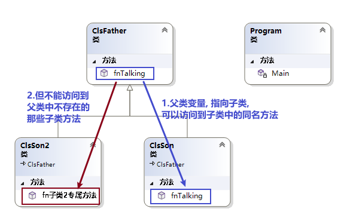
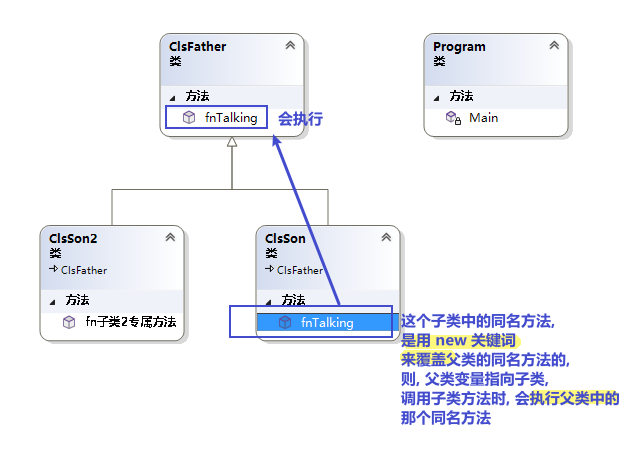

= 类 : 隐藏方法
:sectnums:
:toclevels: 3
:toc: left

---

== 子类中, 重写父类的同名方法

==== "父类变量", 若指向"子类的实例", 则会忘掉"父类中不存在的子类中的方法" (即无法调用子类中的方法).

.标题
====
例如：

父类 +
[source, java]
----
internal class ClsFather
{
    public virtual void fnTalking() //virtual 让本方法, 变成了"虚方法"
    {
        Console.WriteLine("父类的口才");
    }
}
----

子类:
[source, java]
----
internal class ClsSon:ClsFather
{
    public override void fnTalking()  // 在子类中, 你要重写父类的同名方法, 只要先输入 "override+空格", 软件就会提示你要重写哪个父方法.
    {
        Console.WriteLine("子类的口才");
    }
}
----

子类2:
[source, java]
----
internal class ClsSon2 : ClsFather
{
    public  void fn子类2专属方法()
    {
        Console.WriteLine("fn子类2专属方法");
    }
}
----

主文件 +
[source, java]
----
static void Main(string[] args)
{
    ClsFather insFather;
    insFather = new ClsSon(); //父类类型的变量, 居然能指向"子类实例"上!
    insFather.fnTalking(); //子类的口才   ← 这里, 父类变量能访问到子类中的方法, 是因为父类中有子类的同名方法存在.

    insFather = new ClsSon2();  // 同样可行. 父类类型的变量, 可以指向该父类的"任意子类"的"实例"上!
    // insFather.fn子类2专属方法();  //但是这句会报错. 因为虽然 insFather 的确指向了子类2的实例对象, 但由于 insFather 是从父类申明而来的, 所以它无法访问(会忘记)自己能访问到子类2 中的方法. 相当于 白天鹅跟了丑小鸭后,  会忘掉自己会飞.

    // ClsSon insSon = new ClsFather(); // 这句会报错, 无法将子类变量, 指向父类.  记忆就是: 父亲可以指(指向)责儿子; 反之儿子则不能指责(指向)父亲
}
----
====

---

==== 隐藏方法 (即子类覆盖父类的同名方法)

在子类中, 要覆盖父类的同名方法, 要在子类这个方法前 使用关键词 new.

.标题
====
例如：

父类:
[source, java]
----
internal class ClsFather
{
    public  void fnTalking()
    {
        Console.WriteLine("父类的口才");
    }
}
----

子类: +
[source, java]
----
internal class ClsSon:ClsFather  //子类继承自父类
{
    public new void fnTalking()  //要覆盖父类中的同名方法, 在这里要加 new 关键词
    {
        Console.WriteLine("子类的口才");
    }
}
----

主文件: +
[source, java]
----
static void Main(string[] args)
{
    ClsSon insSon = new ClsSon();
    insSon.fnTalking(); //子类的口才

    ClsFather insFather = new ClsSon();  // 父类变量, 指向子类的实例对象
    insFather.fnTalking(); //父类的口才  ← 你发现, 虽然父类中有子类的同名方法, 但是父类变量指向子类实例后, 调用该同名方法时, 依然执行的是父类中的方法, 而不是子类中的方法. 这就是本"隐藏函数"和"虚函数"在重写父类方法的区别所在.
    //即, 子类中, 用"虚函数"方式 重写的父类方法,   父类变量指向子类对象, 再调用子类的方法, 会执行"子类中的方法". 而屏蔽掉执行"父类中的方法".
    // 如果用"隐藏函数"的方法, 来改写的父类方法. 父类变量指向子类对象, 再调用子类的方法, 会执行"父类中的方法". 而屏蔽掉执行"子类中的方法".
}
----

====

---
