= 委托 delegate
:sectnums:
:toclevels: 3
:toc: left

---

委托类型, 本身是个类Classs, 所以要和其他的类, 并排的写, 而不要写在类里面.

ClsTest类:
[,subs=+quotes]
----
namespace ConsoleApp2 {
    internal class ClsTest {

        //下面这个委托类, 应该写在ClsTest类的外面, 如果你像下面这样写在另一个类里面的话, 调用它时, 就要把它当做类的字段来使用了.
        *public delegate int del委托指针(int a, int b);*

        public static *int fn求和(int a, int b)* {
            return a+b;
        }
    }
}
----

主文件
[,subs=+quotes]
----
*ClsTest.del委托指针 ins委托指针 = new ClsTest.del委托指针(ClsTest.fn求和);* //"del委托指针"因为写在了"ClsTest"类的里面, 所以我们就只能把它当做类的字段来进行调用. 写成"ClsTest.del委托指针", 然后,我们创建出这个委托类的实例对象"ins委托指针",让它指针指向"ClsTest.fn求和"函数.

Console.WriteLine(*ins委托指针.Invoke(4, 6)*); //10
Console.WriteLine(*ins委托指针(4, 6)*); //10 ← 也可以这样传参,并执行委托指针指向的函数.
----

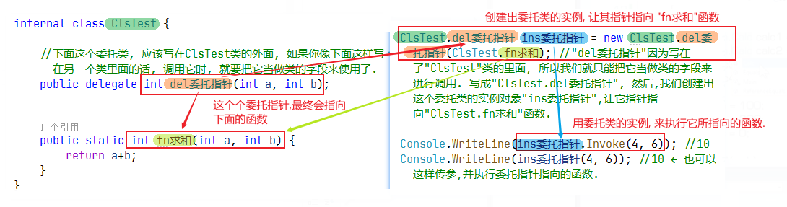

'''

== ★★ 将函数作为参数传递给另一个函数

函数没有返回值, 其类型就是 Action (单纯的动作, 不需要交互) +
函数有返回值, 其类型就是 Func (函数. 需要沟通交互)

==== 要传递的函数A"没有返回值, 也没有参数"的情况 -> fnB(Action fnA的函数名)

[,subs=+quotes]
----
//无参函数, 无返回值
static void fn你好() {
    Console.WriteLine("你好");
}

//这个函数(A)会接受另一个函数B(无参的)作为参数传入. B无参的话, A对其参数的类型, 要写成Action
static void fn计算耗时(*Action fn传入的函数*) {
    fn传入的函数();
    Console.WriteLine("耗时, 100秒");
}

fn计算耗时(fn你好);
----

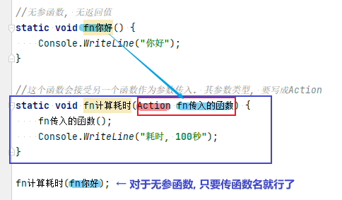

---

==== 要传递的函数A"没有返回值, 但有参数"的情况 -> fnB(fnA的参数1, fnA的参数2,..., Action<fnA的参数1的类型, fnA的参数2类型,...> fnA的函数名)

[,subs=+quotes]
----
internal class Program
{
    //无返回值, 但有参的函数. 下面这个A函数, 之后会被作为参数传入函数B中
    static void fnA(string argA1, int argA2)
    {
        Console.WriteLine("fnA:{0},{1}", argA1, argA2);
    }

    //B函数会接受"有参的A函数"作为参数传入. 其参数类型, 要写成 Action<A函数的参数类型>. 同时,A函数自己的参数值, 也要传给B函数, 这样, 在B函数体内, 才能把A函数名, 和A函数的参数, 组装起来, 运行该A函数.
    static void fnB(*string argA函数的参数1, int argA函数的参数2, Action<string, int> fn函数指针*)
    {
        *fn函数指针(argA函数的参数1, argA函数的参数2); //"fn函数指针"会指向A函数的函数体. 因为在调用B函数时, 我们会传入A函数的函数名. 由"fn函数指针"来接收它. 这样, 两个函数名的指针,就都指向A函数的函数体了.*
    }

    //下面是main函数
    static void Main(string[] args)
    {
        *fnB("zrx", 19, fnA); //要把A函数自己的函数名, 和A函数的实际参数值, 都送进B函数中.*

    }
}
----

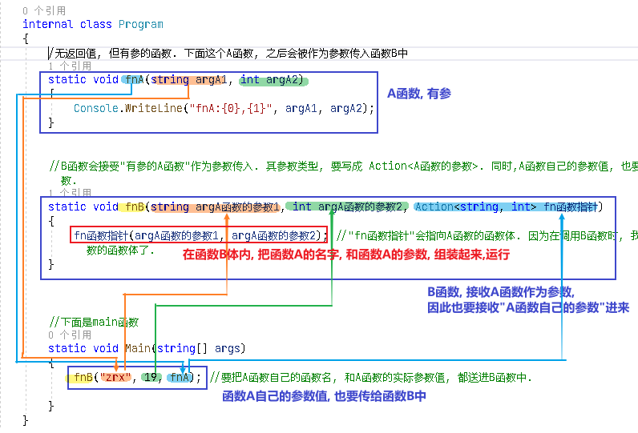

---

==== 要传递的函数A"有返回值, 但没有参数"的情况 -> fnB(Func<fnA的返回值类型> fnA的函数名)

[,subs=+quotes]
----
internal class Program
{
    //A函数, 有返回值, 但无参. 它之后会被作为参数传入函数B中
    static string fnA()
    {
       return string.Format("fnA 无参, 有返回值");
    }

    //B函数会接受"无参, 有返回值的A函数"作为参数传入. 函数A的类型, 要写成 Func<A函数的返回值类型 >.
    static void fnB(*Func<string> fn函数指针*)
    {
        string strRes = fn函数指针(); //"fn函数指针"会指向A函数的函数体. 因为在调用B函数时, 我们会传入A函数的函数名. 由"fn函数指针"来接收它. 这样, 两个函数名的指针,就都指向A函数的函数体了.
        Console.WriteLine(strRes);
    }

    //下面是main函数
    static void Main(string[] args)
    {
        *fnB(fnA)*; //只需把A函数自己的函数名,送进B函数中即可. 因为A函数是无参数的, 所以就不需要给函数B 送进"函数A的参数"了.
    }
}
----

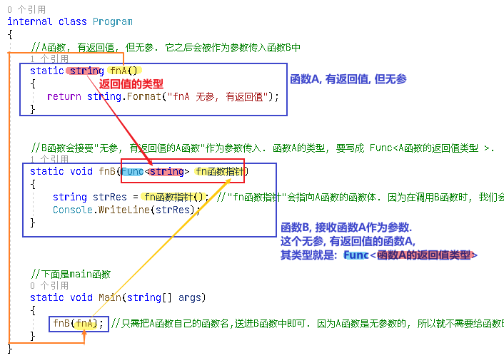

---

==== 要传递的函数A"有返回值, 有参数"的情况 -> fnB(fnA的参数1, fnA的参数2, Func<fnA的参数1类型, fnA的参数2类型, ..., fnA的返回值类型> fnA的函数名)

[,subs=+quotes]
----
internal class Program
{
    //A函数, *有返回值*, 也有参. 它之后会被作为参数传入函数B中
    static *string* fnA(string argA1, int argA2)
    {
       return string.Format("fnA:{0},{1}", argA1, argA2);
    }

    //B函数会接受"有参, *有返回值的A函数"作为参数传入. 其参数类型, 要写成 Func<A函数的参数1类型, A函数的参数2类型, ... A函数的返回值类型 >.* 同时,A函数自己的参数值和返回值, 也要传给B函数, 这样, 在B函数体内, 才能把A函数名, 和A函数的参数, 组装起来, 运行该A函数.
    static void fnB(*string argA函数的参数1, int argA函数的参数2,  Func<string, int,string> fn函数指针*)
    {
        string strRes = *fn函数指针(argA函数的参数1, argA函数的参数2);* //"fn函数指针"会指向A函数的函数体. 因为在调用B函数时, 我们会传入A函数的函数名. 由"fn函数指针"来接收它. 这样, 两个函数名的指针,就都指向A函数的函数体了.
        Console.WriteLine(strRes);
    }

    //下面是main函数
    static void Main(string[] args)
    {
        *fnB("zrx", 19, fnA);* //要把A函数自己的函数名, 和A函数的实际参数值, 都送进B函数中.
    }
}
----

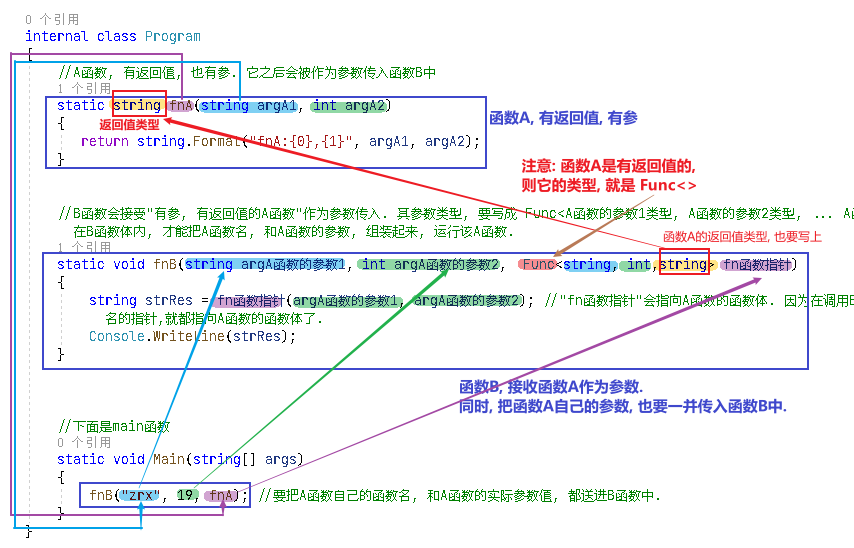

---

== 委托  (相当于一个指针, 指向另一个函数体)

C# 中的委托（Delegate）类似于 C 或 C++ 中函数的指针。委托（Delegate） 是存有对某个方法的引用的一种"引用类型变量"。引用可在运行时被改变。
委托（Delegate）特别用于实现"事件"和"回调方法"。所有的委托（Delegate）都派生自 System.Delegate 类。

委托类型的变量, 其实就相当于一个指针, 能指向另一个函数体. 从而这个委托变量, 就能当做那个函数来执行. +
委托, 就相当于它只有灵魂(有参数和返回值),没有身体(没有函数体),  它必须依附(指针指向)在一个身体(其他函数体)上, 才能执行那个函数功能.

在C#中使用一个类，分为两个阶段。首先，需要定义这个类，告诉编译器这个类由什么字段和方法组成，然后实例化这个类的一个对象。使用委托也要经过这两个步骤。首先，定义要使用的委托(类)，告诉编译器这委托（类）表示的是哪种类型的方法，然后创建委托的实例。它们都是要即先声明，再实例化。只是有点不同，类在实例化之后叫对象或实例，但委托在实例化后仍叫委托。

定义委托类似于方法的定义，但没有方法体，定义的前面要加关键字delegate。**委托相当类，所以可以在定义类的任何地方定义委托，也就是说可以在类外部，也可以在类内部定义，当然也可以在委托定义上使用任意的访问修饰符。**定义委托类型时就指明了该委托类型的实例所能接受的方法的返回类型和其参数。
执行委托实例跟执行方法一样，直接在委托实例后加括号，并在括号中填入该委托所对应参数。

[source, java]
----
static void fn卖房(int money, int age)
{
  Console.WriteLine("我是中介, 帮你卖房. 你的年龄是{0}, 资产是{1}", money, age);
}

static void fn理财投资(int money, int age)
{
  Console.WriteLine("我是中介, 帮你理财投资. 你的年龄是{0}, 资产是{1}", money, age);
}

//定义委托, 用delegate关键词.  注意, 定义委托类型时, 必须写在main函数前面.
delegate void MY委托(int money, int age); //这里, 1. 我们定义了一个委托类型, 叫"my委托"(注意,这里还不是变量, 只是个类型, 就像你自定义创建的"结构体"类型一样), 它就像"函数定义"一样, 有返回值, 有参数. 注意, 它的返回值和参数, 必须和你要挂钩到的"真正函数的返回值和参数", 完全一致.  2. 另外, 委托不需要写函数体. 因为我们这个委托会借用其他的函数体.

static void Main(string[] args)
{
  //下面, 我们再实例化这个委托类型, 创建出一个委托类型的变量
  MY委托 dlg中介;

  dlg中介= fn卖房;   //我们将委托变量, 指针指向函数"fn卖房", 现在, 这个委托变量, 就可以执行"fn卖房"的函数功能了.
  dlg中介(3000, 18); //我是中介, 帮你卖房. 你的年龄是3000, 资产是18

  //现在, 我们将这个委托变量, 重新指向另一个函数体.
  dlg中介 = fn理财投资;
  dlg中介(3000, 18); //我是中介, 帮你理财投资. 你的年龄是3000, 资产是18
}
----

即 +
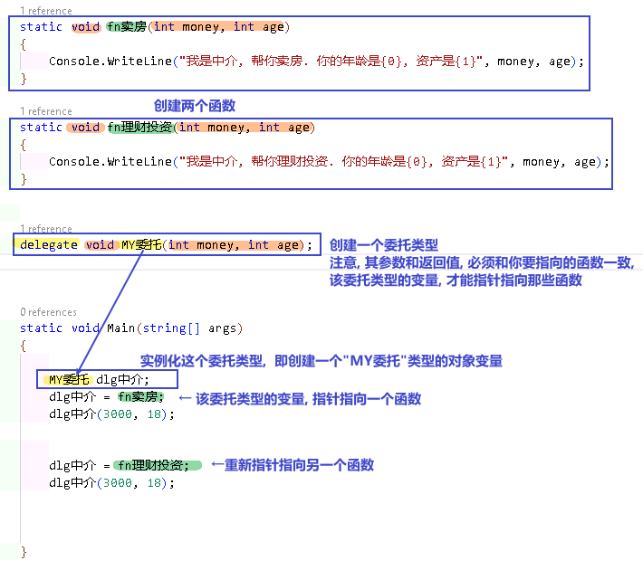

.标题
====
例子: 给函数1传入另一个函数.  即 函数1, 接收一个"函数类型"的参数"函数2"进来.   这个参数"函数2", 其类型, 我们就可设为"委托类型".

[source, java]
----
delegate void Dlg委托类();  //创建委托类, 这里我们没有给它设置接收的函数参数
static void fn日常运营(Dlg委托类 var委托) //这个函数接收一个"函数类型的参数", 会把传入的函数, 赋值给 "var委托"这个变量.
{
  Console.WriteLine("听取属下提案");
  var委托();   //执行这个"委托变量"指向的函数, 即作为参数传入"本fn日常运营()函数"中的 "fn判断是否出征他国()函数".
}

static void fn判断是否出征他国()
{
  Console.WriteLine("军方判断是否出征敌国");
}

static void Main(string[] args)
{
  fn日常运营(fn判断是否出征他国); //给函数, 传入另一个函数作为参数.
}
----

即: +
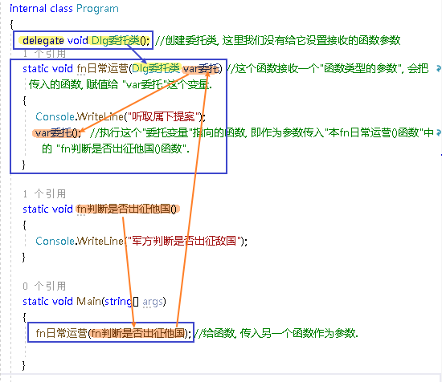

这个程序的输出是: +
听取属下提案 +
军方判断是否出征敌国
====

.标题
====
例如：
[source, java]
----
namespace ConsoleApp2
{
    internal class Program
    {
        //声明一个委托类型, 就像定义一个函数一样, 但没有函数体.
        delegate void dlgFn委托中介(string name);

        static void fn计算投资收益(string name)
        {
            Console.WriteLine("我在帮{0}计算投资收益",name);
        }

        static void Main(string[] args)
        {
            //创建一个委托类的变量, 让它指向"fn计算投资收益"函数, 代理这个函数的功能.
            dlgFn委托中介 insDlg中介实例 = new dlgFn委托中介(fn计算投资收益); //一旦声明了委托类型，委托对象必须使用 new 关键字来创建，且传入一个指向的函数。
            insDlg中介实例("zrx"); //我在帮zrx计算投资收益

            //也可以在创建委托的变量时, 指向null, 之后再让它指向一个函数体.
            dlgFn委托中介 ins中介2 = null;  //该委托变量, 先指针指向null
            ins中介2 = fn计算投资收益; //然后,在让它指向一个具体的函数方法.
            ins中介2("slf"); //我在帮slf计算投资收益

        }
    }
}
----

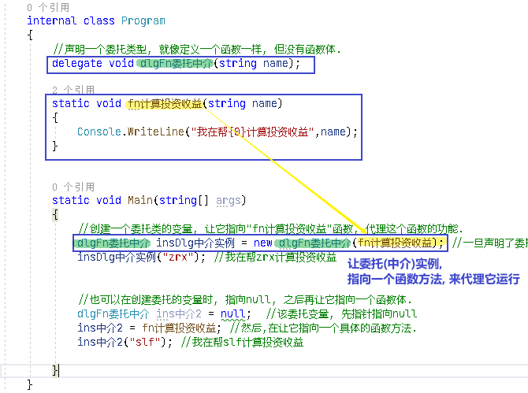
====

---

==== 可以创建一个"委托类型"的数组, 里面存放n个函数方法, 就可以来遍历调用这些函数方法.

"Cls数学计算"类文件:
[source, java]
----
internal class Cls数学计算
{
    public static double fn乘以2倍(double num)
    {
        return num * 2;
    }

    public static double fn平方(double num)
    {
        return num * num;
    }
}
----

主文件:
[source, java]
----
internal class Program
{
    //声明一个委托类型, 就像定义一个函数一样, 但没有函数体.
    delegate double dlgFn委托中介(double num);

    static void Main(string[] args)
    {
        //我们可以创建一个"委托类型"的数组, 里面存放n个函数方法, 就可以来遍历调用这些函数方法.
        dlgFn委托中介[] arr委托数组 = { Cls数学计算.fn乘以2倍, Cls数学计算.fn平方 }; //我们创建一个委托类型的数组, 里面的元素,就是对函数的引用

        foreach (var singleFn in arr委托数组)
        {
            Console.WriteLine(singleFn(5)); //遍历采用数组中的每一个函数, 给它们传入共同的参数5, 就会输出10(=5的2倍) 和 25(=5的平方).
        }

    }
}
----

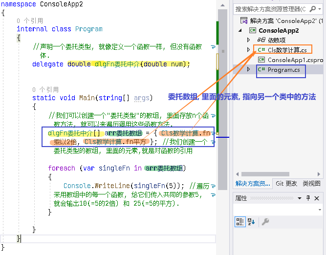

---

==== 委托类型的变量, 它指向的函数fn1, 和fn1要接收的参数var, 这两样东西, 可以传递给另一个函数B, 在函数B体内组装起来.

[source, java]
----
namespace ConsoleApp2
{
    internal class Program
    {
        //声明一个委托类型, 就像定义一个函数一样, 但没有函数体.
        delegate double dlgFn委托中介(double num);

        //定义一个和上面的"委托类型", 参数和返回值 都吻合的函数方法
        static double fn圆面积(double num半径)
        {
            double num圆面积 = Math.PI*Math.Pow(num半径, 2); //Math.Pow(num, 2) 表示: 做num的2次方
            return num圆面积;
        }

        static  double fn组装工厂(dlgFn委托中介 ins委托要指向的具体函数, double num委托所指向的调用函数要接收的参数)
        {
            dlgFn委托中介 ins中介 = ins委托要指向的具体函数;
            double res =ins中介(num委托所指向的调用函数要接收的参数);
            return res;
        }

        static void Main(string[] args)
        {
            //我们可以将委托变量, 和它的参数, 都传进另一个函数中组装起来
            Console.WriteLine(fn组装工厂(fn圆面积, 5)); //78.53981633974483

        }
    }
}
----

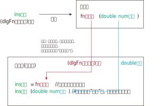

---

== Action泛型委托 (无返回值)

c# 帮我们内置了几种委托, 可以直接使用. 包括 Action类型委托, 与Func委托. +
C＃包含内置的泛型委托类型 Func 和 Action，因此在大多数情况下您不需要手动定义自定义委托。

除了我们自己定义委托类型，微软的类库中也为我们内置Action<T>和Func<T>的泛型委托，这样就可以免得我们自己去定义委托类型了，我们可以直接使用内置的委托类型。

　　泛型Action<T>委托表示引用一个void返回类型的方法，该委托内存在不同的变体，它最多可传递16 个参数。非泛型Action委托类型可以调用带无返回类型且无参数的方法。

　　Func<T>委托类似于Action<T>委托，不同的是Func<T>调用的是带有返回类型的方法。Func<T>也定义了不同的变体，它最多可以传递16个参数和一个返回类型。Func<out TResult>委托类型可以调用带返回类型且无参数的方法。

Action委托:

- Action委托至少0个参数，至多16个参数，无返回值。
- Action 表示无参，无返回值的委托。
- Action<int,string> 表示有传入参数int,string，无返回值的委托。
- Action<int,string,bool> 表示有传入参数int,string,bool，无返回值的委托。
- Action<int,int,int,int> 表示有传入4个int型参数，无返回值的委托。
- Action 委托与 Func 委托相同，只是 Action 委托 不返回任何内容。返回类型必须为 void。

.标题
====
例如： Action类的变量, 指向一个无返回值, 也无参的 函数
[source, java]
----
internal class Program
{
    static void fn无返回值函数()
    {
        Console.WriteLine("无返回值的函数");
    }

    static void Main(string[] args)
    {
        Action dlgAc = null; //Action类的变量, 只能指向"无返回值的函数"
        dlgAc = fn无返回值函数;
        dlgAc(); //无返回值的函数
    }
}

----
====

.标题
====
例如： Action类的变量, 指向一个无返回值, 但"有参"的函数

[,subs=+quotes]
----
internal class Program
{
    static void fn无返回值函数(string name)
    {
        Console.WriteLine("{0}, 我是无返回值的函数",name);
    }

    static void Main(string[] args)
    {
        *Action<string> dlgAc* = null; //Action类是泛型的, 它可以指向你"给定参数类型"的函数
        *dlgAc = fn无返回值函数*;
        dlgAc("zrx"); //zrx, 我是无返回值的函数
    }
}
----
====

.标题
====
例如：
如果要指向有两个参数的函数呢?

[,subs=+quotes]
----
    internal class Program
    {
        static void *fn无返回值函数(string name, int age)*
        {
            Console.WriteLine("{0}, {1}岁, 我是无返回值的函数",name, age);
        }

        static void Main(string[] args)
        {
            *Action<string, int> dlgAc* = null;
            dlgAc = fn无返回值函数;
            *dlgAc("zrx",19)*; //zrx, 19岁, 我是无返回值的函数
        }
    }
----
====

---

== Func委托 (有返回值)

Func 委托代表有返回类型的委托。

- Func 至少0个输入参数，至多16个输入参数，根据返回值泛型返回。必须有返回值，不可void。
- Func<int> 表示没有输入参数，返回值为int类型的委托。
- Func<object,string,int> 表示传入参数为object, string ，返回值为int类型的委托。
- Func<object,string,int> 表示传入参数为object, string， 返回值为int类型的委托。
- Func<T1,T2,,T3,int> 表示传入参数为T1,T2,,T3(泛型)，返回值为int类型的委托。

.标题
====
例如：
[,subs=+quotes]
----
internal class Program
{
    static *string fn有返回值函数(string name, int age)*
    {
        return string.Format("{0}, {1}岁, 我是有返回值的函数", name, age);
    }

    static void Main(string[] args)
    {
        *Func<string, int, string> dlgAc = fn有返回值函数*; //注意, 这里 Func<> 泛型中指定它参数的类型时, 别忘了要把返回值的类型也写在里面! 比如这里, 前两个是输入参数的类型, 第三个是返回值的类型 string. *千万别忘了返回值类型也要写, 否则报错!*

        string res = dlgAc("zrx", 19);
        Console.WriteLine(res); //zrx, 19岁, 我是有返回值的函数
    }
}
----

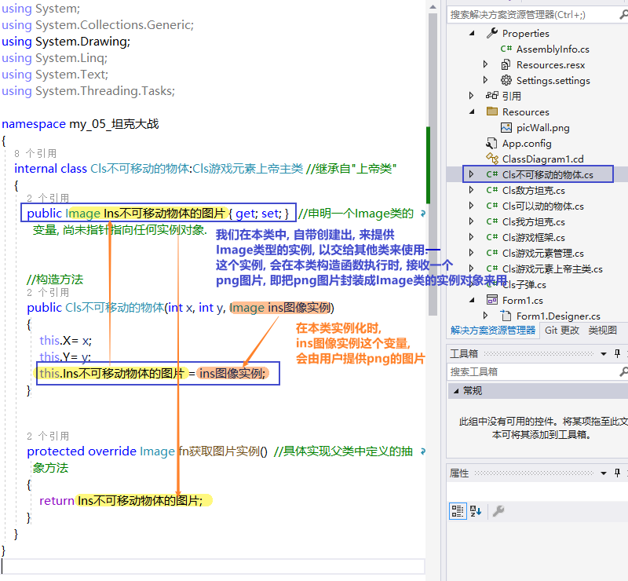

====

---

== 多播委托

委托也可以包含多个方法，这种委托称为多播委托。

当调用多播委托时，它连续调用每个方法。在调用过程中，委托必须为同类型，返回类型一般为void，这样才能将委托的单个实例合并为一个多播委托。如果委托具有返回值和/或输出参数，它将返回最后调用的方法的返回值和参数。（有些书上和博客说多播委托返回类型必须为void，并且不能带输出参数，只能带引用参数，是错误的）。

[,subs=+quotes]
----
internal class Program
{
    static void fn1()
    { Console.WriteLine("fn1"); }

    static void fn2()
    { Console.WriteLine("fn2"); }

    static void fn3()
    { Console.WriteLine("fn3"); }

    static void Main(string[] args)
    {
        *Action ins多播委托* = fn1; //只指向一个函数体, 相当于"单播委托"
        ins多播委托(); //fn1

        //下面, 让委托变量, 指向两个函数
        *ins多播委托 += fn2*;
        ins多播委托(); //输出两行: fn1,fn2

        *ins多播委托 -= fn1*; //将fn1方法, 从委托里删除
        ins多播委托();//fn2  ← 原来委托同时指向fn1, fn2两个方法, 现在指针指向删除掉fn1后, 就只剩下 fn2了

        //可以连续多次添加同一个方法
        ins多播委托 += fn3;
        ins多播委托 += fn3;
        ins多播委托 += fn3;
        ins多播委托(); //连续输出三次 fn3

        //另外, 多播委托,如果有返回值的话, 也只能返回最后一个函数的返回值. 即：多播委托的返回类型不是void类型时，只能获取最后一个被调用方法的返回值，前面的所有方法会被抛弃。

        //*多播委托是一个集合, 我们可以拿到这个集合. 该集合是 Delegate[]类型的*, 注意, D是大写!
        *Delegate[] arrDlg多播委托集合 = ins多播委托.GetInvocationList();* //GetInvocationList()方法是: 按照调用顺序, 返回此多路广播委托的调用列表。GetInvocationList() 能够返回 这个委托的方法链表。

        foreach (var item in arrDlg多播委托集合)
        {
            *item.DynamicInvoke()*; //遍历执行多播委托集合里面的每一个函数.
                                  //DynamicInvoke() 方法 :动态调用（后期绑定的）当前委托列表中的所有方法。 可以依次全部调用 ，也可以指定调用其中的某一条。
        }

    }
}
----

.标题
====
多播委托, 可以用在让一个人a, 帮一堆人(b,c,d...)做他们本该做的事上面. 如 每个人都能自己买东西, 但我们可以让一个人a, 来代理其他所有人, 一起买东西 (a是总采购, 来代理他们来买东西). 即, a会调用其他人身上的"购买"方法.

例如:

Cls采购员:
[,subs=+quotes]
----
namespace ConsoleApp2
{

    //委托
    #delegate void dlg采购员身上的委托(); //声明一个委托#

    internal class Cls采购员
    {
        public string Name { get; set; }
        #public dlg采购员身上的委托 ins采购员身上的委托函数指针 = null; //创建一个委托变量.#

        //构造函数
        public Cls采购员(string name)
        {
            Name = name;
        }

        public void fn外出采购()
        {
            Console.WriteLine("{0}外出采购了", Name); //注意, 这里因为用了Name属性, 而非name字段, 所以要用大写的Name了

            if (ins采购员身上的委托函数指针 != null)
            {
                #ins采购员身上的委托函数指针();#
            }
        }
    }
}
----

Cls普通员工
[,subs=+quotes]
----
namespace ConsoleApp2
{
    internal class Cls普通员工
    {
        public string Name { get; set; }

        public Cls普通员工(string name) //构造函数
        {
            Name = name;
        }

        *public void fn买吃的()*
        {
            Console.WriteLine("普通员工{0}买吃的", Name);
        }

        *public void fn买喝的()*
        {
            Console.WriteLine("普通员工{0}买喝的", Name);
        }

    }
}
----

主文件
[,subs=+quotes]
----
internal class Program
{

    static void Main(string[] args)
    {
        Cls采购员 ins采购员 = new Cls采购员("zrx");
        Cls普通员工 ins普通员工1 = new Cls普通员工("slf");
        Cls普通员工 ins普通员工2 = new Cls普通员工("wyy");
        Cls普通员工 ins普通员工3 = new Cls普通员工("zzr");

        //我们把"采购员实例"身上的"委托指针", 指向其他三个实例身上的函数方法. 即, 委托指针, 就同时指向了三个普通员工实例各自身上的方法. 相当于采购员, 会帮三个员工去做(代理了)他们本身该做的事情(方法)了
        *ins采购员.ins采购员身上的委托函数指针 += ins普通员工1.fn买吃的;*
        ins采购员.ins采购员身上的委托函数指针 += ins普通员工2.fn买喝的;
        ins采购员.ins采购员身上的委托函数指针 += ins普通员工3.fn买吃的;

        *ins采购员.fn外出采购();*
        /* 输出:
         zrx外出采购了
        普通员工slf买吃的
        普通员工wyy买喝的
        普通员工zzr买吃的
        */

    }
}
----
====

'''

== 委托,除了当做指向另一个函数的函数指针外, 还可以用在"回调函数 callback"上

函数指针的调用，即是一个通过函数指针调用的函数；

如果你把函数的指针（地址）作为参数传递给另一个函数，当这个指针被用来调用其所指向的函数时，就说这是回调函数。

In computer programming, a callback is any executable code that is passed as an argument to other code, which is expected to call back (execute) the argument at a given time. This execution may be immediate as in a synchronous callback, or it might happen at a later time as in an asynchronous callback.

即：把一段可执行的代码像参数传递那样传给其他代码，而这段代码会在某个时刻被调用执行，就叫做回调。如果代码立即被执行就称为同步回调，如果在之后晚点的某个时间再执行，则称为异步回调。

使用回调函数，和普通函数调用区别：

1）在主入口程序中，*把回调函数像参数一样传入库函数。这样一来，只要我们改变传进库函数的参数，就可以实现不同的功能，且不需要修改库函数的实现，变的很灵活，这就是"解耦"。*

'''

== 函数指针, 用在模板函数里. 作为一个参数, 用来指向任何它想指向的函数. 即接收"任何它所指向函数的返回值".

[,subs=+quotes]
----

namespace ConsoleApp1 {

    //下面这个类, 专门定义"产品设计图方案"的信息. 和设计公司无关.
    class Cls产品设计图 {
        public string Name硬件产品名字 { get; set; }
        public string Name外包的设计公司名字 { get; set; }
    }

    //苹果公司 = box
    class Cls苹果公司 {
        public Cls产品设计图 Ins产品设计图 { get; set; }
        public string Name外包的制造商名字 { get; set; } //苹果公司内部留档, 第三方制造商的信息.

    }

    //我们的委托指针(函数指针), 定义在"富士康类"里面的方法上
    class Cls富士康 {

        public string name = "富士康";

        //*下面这个函数方法, 返回值类型是"Cls苹果公司"类的, 这个函数接收一个参数, 这个参数的类型是个委托类型, 即是一个函数指针, 这个指针指向的函数, 会返回"Cls产品设计类"的返回值.*
        //换言之, 这个函数, 输入一个"产品设计图方案", 进行内部加工后, 输出一个"苹果公司产品的实例". 即, 富士康会拿到(输入)设计图纸, 然后制造出(输出)iphone苹果产品.
        *public Cls苹果公司 fn代工厂进行生产(Func<Cls产品设计图> del委托指针) {*
            //先拿到"产品设计图"的实例. 这个实例, 会由另一个函数返回给我们. 但"另一个函数"究竟是哪一个函数, 我们现在还不知道. 所以就先用一个"委托指针",来代表那个函数.
            Cls产品设计图 ins外包机构设计出来的产品设计图 = del委托指针.Invoke(); //del委托指针, 所指向的函数, 返回值是"Cls产品设计图"类型的.

            Cls苹果公司 ins苹果公司 = new Cls苹果公司();

            ins苹果公司.Ins产品设计图 = ins外包机构设计出来的产品设计图; //我们从外包公司, 拿到了他们设计的"产品设计方案图", 交给苹果公司
            ins苹果公司.Name外包的制造商名字 = this.name; //富士康(本类)将自己的公司名字, 交给苹果公司存档.

            return ins苹果公司; //富士康,将制造好的苹果硬件, 交还给苹果公司.
        }
    }

    class Cls第三方设计公司甲 {
        public Cls产品设计图 fn设计公司进行设计() {
            Cls产品设计图 ins产品设计图 = new Cls产品设计图();
            ins产品设计图.Name硬件产品名字 = "iphone手机"; //第三方设计公司甲, 给苹果公司做iPhone手机的设计方案.
            ins产品设计图.Name外包的设计公司名字 = "设计公司甲"; //第三方设计公司甲,把自己的名字, 交给"产品设计类"的实例中的字段,存档.
            return ins产品设计图; //把设计出了的方案, 交还给苹果公司
        }
    }

    class Cls第三方设计公司乙 {
        public Cls产品设计图 fn设计公司进行设计() {
            Cls产品设计图 ins产品设计图 = new Cls产品设计图();
            ins产品设计图.Name硬件产品名字 = "apple watch 苹果手表"; //第三方设计公司甲, 给苹果公司做另一个硬件的设计方案.
            ins产品设计图.Name外包的设计公司名字 = "设计公司乙";
            return ins产品设计图; //把设计出了的方案, 交还给苹果公司
        }
    }

    //下面是main函数
    internal class Program {
        static void Main(string[] args) {

            // 先创建出富士康, 和第三方设计公司的实例对象
            Cls第三方设计公司甲 ins第三方设计公司甲 = new Cls第三方设计公司甲();
            Cls第三方设计公司乙 ins第三方设计公司乙 = new Cls第三方设计公司乙();
            Cls富士康 ins富士康 = new Cls富士康();

            //我们来新建一个委托指针, 之后会传给富士康类里面的"fn代工厂进行生产"方法, 因为这个方法, 就是要接收一个"委托指针类型"的参数的.
            Func<Cls产品设计图> del委托指针_指向甲设计公司中的函数 = new Func<Cls产品设计图>(ins第三方设计公司甲.fn设计公司进行设计); //这个"del委托指针_指向甲设计公司中的函数",会指向"ins第三方设计公司甲.fn设计公司进行设计"函数, 后者这个函数, 正好是返回"Cls产品设计图"类型的东西. 符合"del委托指针"的参数和返回值类型要求.

            Func<Cls产品设计图> del委托指针_指向乙设计公司中的函数 = new Func<Cls产品设计图>(ins第三方设计公司乙.fn设计公司进行设计); //再创建一个委托指针, 指向"乙设计公司"中的函数.

            //下面, 我们就可以给富士康实例中的"fn代工厂进行生产"方法,, 传入"委托指针"类型的参数了.
            Cls苹果公司 ins苹果产品1 = ins富士康.fn代工厂进行生产(del委托指针_指向甲设计公司中的函数); //富士康中的这个函数, 会返回"return ins苹果公司"类型的东西.
            Console.WriteLine(ins苹果产品1.Ins产品设计图.Name硬件产品名字); //iphone手机
            Console.WriteLine(ins苹果产品1.Ins产品设计图.Name外包的设计公司名字); //设计公司甲
            Console.WriteLine(ins苹果产品1.Name外包的制造商名字); //富士康

            Console.WriteLine("------------");

            Cls苹果公司 ins苹果产品2 = ins富士康.fn代工厂进行生产(del委托指针_指向乙设计公司中的函数); //富士康中的这个函数, 会返回"return ins苹果公司"类型的东西.
            Console.WriteLine(ins苹果产品2.Name外包的制造商名字); //富士康
            Console.WriteLine(ins苹果产品2.Ins产品设计图.Name硬件产品名字); //apple watch 苹果手表
            Console.WriteLine(ins苹果产品2.Ins产品设计图.Name外包的设计公司名字); //设计公司乙

        }
    }
}

----

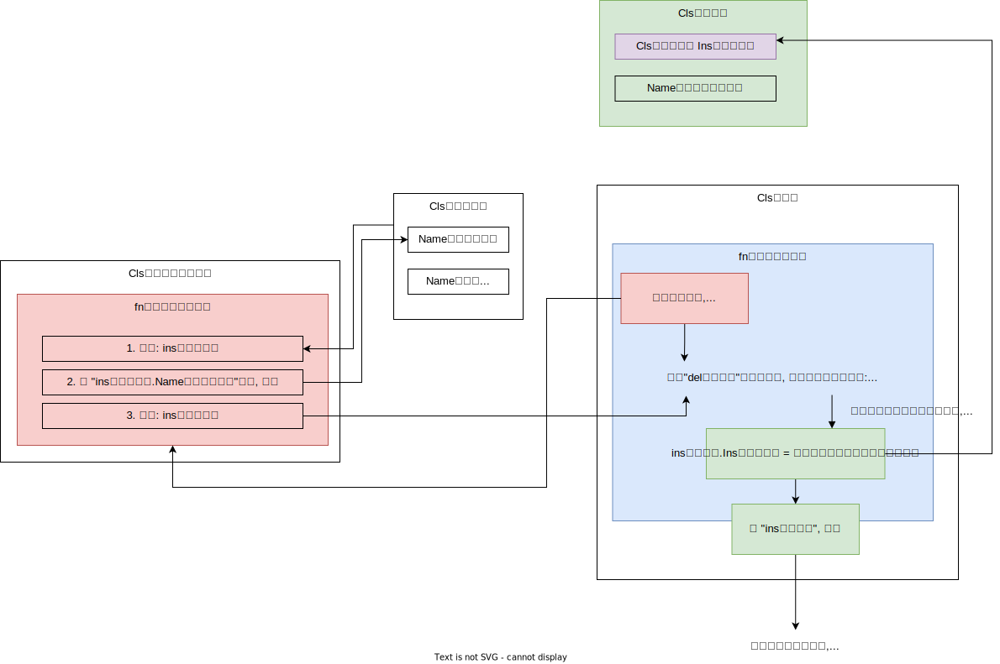

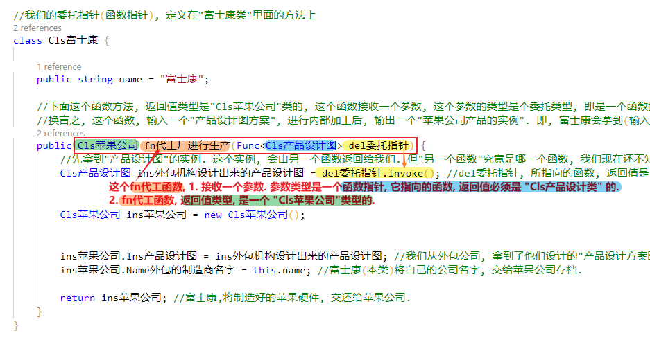

**所以, 回调就是, 我预留这个函数指针位置. 之后我想指针指向谁, 就能调用那个目标函数来执行.
**

'''

== 隐式异步调用

- 同步: 是指 你做完了, 我再在你的基础上,接着做. (即单线程)
- 异步: 是指 我们几个同时做. (即多线程)

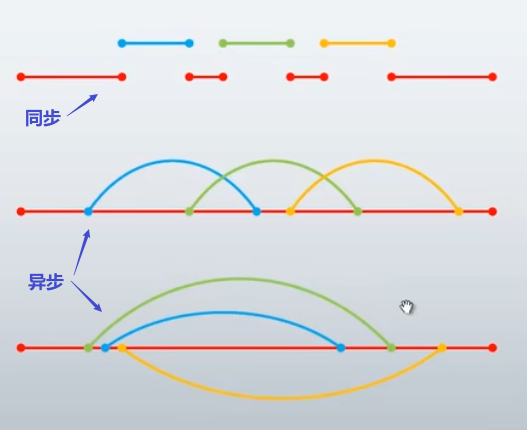

Invoke和BeginInvoke都是调用委托实体的方法，前者是同步调用，即它运行在主线程上，当Invode处理时间长时，会出现阻塞的情况，而BeginInvke是异步操作，它会从新开启一个线程，所以不会租塞主线程，在使用BeginInvoke时，如果希望等待执行的结果 ，可以使用EndInvoke来实现，这在.net framework4.5之后，被封装成了async+await来实现，代码更简洁，更容易理解。

java语言, 则完全使用接口 interface, 来取代一些对委托的使用.

