= 接口
:sectnums:
:toclevels: 3
:toc: left

---

== 接口 interface

一般, 我们习惯在"接口"的变量名中, 加个 "IF", 表示它是 interface类型.

- 接口中, 一般只包含"方法". 并且, 接口中只包含方法的声明, 而没有方法的实现.
接口中, 只做了成员的声明, 而没有定义(没有具体的函数体). 成员的定义是派生类的责任。接口只是提供了派生类应遵循的标准结构。
- 接口本身并不实现任何功能，它只是和声明"实现该接口"的对象, 订立一个必须实现哪些行为的契约。
- 接口不能有"构造函数"，也不能有字段，接口也不允许运算符重载。
- 接口定义中不允许声明成员的修饰符，接口成员都是公有的.

创建一个接口:

image:img/0034.png[,]

image:img/0035.png[,]

.标题
====
接口文件:

[,subs=+quotes]
----
using System;
using System.Collections.Generic;
using System.Linq;
using System.Text;
using System.Threading.Tasks;

namespace my03_接口
{
    internal *interface InterfaceFly*
    {
        public void fnFly(); *//在本接口中, 我们定义一个fly飞翔方法.*
        public void fn隐身();
    }
}
----

用来实现接口的"类文件":
[,subs=+quotes]
----
using System;
using System.Collections.Generic;
using System.Linq;
using System.Text;
using System.Threading.Tasks;

namespace my03_接口
{
    internal *class Cls我 : InterfaceFly  // 本类, 将要实现 InterfaceFly接口*
    {

        *public void fnFly()  //在本类中, 来具体实现"接口中定义的方法".*
        {
            Console.WriteLine("Cls我, 这个类, 具体实现了 fly 方法");
        }

        public void fn隐身()
        {
            Console.WriteLine("Cls我, 这个类, 具体实现了 \"隐身\"方法");
        }
    }
}
----

主文件
[,subs=+quotes]
----
namespace my03_接口
{
    internal class Program
    {
        static void Main(string[] args)
        {
            Cls我 my = new Cls我();
            my.fn隐身(); //Cls我, 这个类, 具体实现了 "隐身"方法
        }
    }
}
----

====

.标题
====
引入接口, 就能让类与类之间的耦合, 变松

又如：

[,subs=+quotes]
----
namespace ConsoleApp4 {

    //接口
    *interface Itf手机 {*
        void fn拨号();
        void fn上网();
        void fn装app();
    }

    //下面的类, 来实现上面的接口
    *class Cls苹果手机 : Itf手机 {*
        public void fn拨号() {
            Console.WriteLine("苹果手机, 拨号...");
        }

        public void fn上网() {
            Console.WriteLine("苹果手机, 上网...");
        }

        public void fn装app() {
            Console.WriteLine("苹果手机, 装app...");
        }
    }

    //谷歌手机, 也实现上面的接口
    class Cls谷歌手机 : Itf手机 {
        public void fn拨号() {
            Console.WriteLine("谷歌手机, 拨号...");
        }

        public void fn上网() {
            Console.WriteLine("谷歌手机, 上网...");
        }

        public void fn装app() {
            Console.WriteLine("谷歌手机, 装app...");
        }
    }

    //用户类
    class Cls消费者 {
        *private Itf手机 ins手机;  //有一部接口类型的手机*

        //构造函数
        *public Cls消费者(Itf手机 ins手机) {*
            this.ins手机 = ins手机;
        }

        public void fn用户使用手机() {
            this.ins手机.fn拨号();
            this.ins手机.fn上网();
            this.ins手机.fn装app();
        }

    }

    //主函数
    internal class Program {
        static void Main(string[] args) {

            *Cls消费者 ins消费者 = new Cls消费者(new Cls苹果手机()); //给用户实例, 传入一步实现了接口的苹果手机.*
            ins消费者.fn用户使用手机();

            //输出:
            // 苹果手机, 拨号...
            // 苹果手机, 上网...
            // 苹果手机, 装app...

            *Cls消费者 ins消费者2 = new Cls消费者(new Cls谷歌手机()); //给用户实例, 传入一步实现了接口的谷歌手机.*
            ins消费者2.fn用户使用手机();
            //输出:
            // 谷歌手机, 拨号...
            // 谷歌手机, 上网...
            // 谷歌手机, 装app...

        }//
    }
}
----

====

*接口, 就是为了类与类之间"解耦合"的目的而生. +
但注意:当类实现一个接口的时候，类与接口之间的关系也是“紧耦合”.*

'''

==== 接口变量, 可以指针指向"任何实现了该接口的具体类的实例对象"

.标题
====
例如：

接口:
[,subs=+quotes]
----
using System;
using System.Collections.Generic;
using System.Linq;
using System.Text;
using System.Threading.Tasks;

namespace my03_接口
{
    internal *interface InterfaceFly*
    {
        public void fnFly(); //在本接口中, 我们定义一个fly飞翔方法.
        public void fn隐身();
    }
}
----

实现了该接口的 "Cls我"类

[,subs=+quotes]
----
using System;
using System.Collections.Generic;
using System.Linq;
using System.Text;
using System.Threading.Tasks;

namespace my03_接口
{
    internal *class Cls我 : InterfaceFly  // 本类, 将要实现 InterfaceFly接口*
    {

        public void fnFly()  //在本类中, 来具体实现"接口中定义的方法".
        {
            Console.WriteLine("Cls我, 这个类, 具体实现了 fly 方法");
        }

        public void fn隐身()
        {
            Console.WriteLine("Cls我, 这个类, 具体实现了 \"隐身\"方法");
        }
    }
}
----

实现了该接口的 "Cls别人"类
[,subs=+quotes]
----
using System;
using System.Collections.Generic;
using System.Linq;
using System.Text;
using System.Threading.Tasks;

namespace my03_接口
{
    internal *class Cls别人 : InterfaceFly //本类实现了该接口*
    {
        public void fnFly()
        {
            Console.WriteLine("Cls别人, 这个类, 具体实现了 fly 方法");
        }

        public void fn隐身()
        {
            Console.WriteLine("Cls别人, 这个类, 具体实现了 fly 方法");
        }
    }
}
----

主文件
[,subs=+quotes]
----
namespace my03_接口
{
    internal class Program
    {
        static void Main(string[] args)
        {
            *InterfaceFly v接口变量;  //这里,我们定义了一个接口变量, 让它可以指向"任何实现了该接口的具体类的实例对象".  即, 这个接口变量的指针, 指向那个类的实例, 就能调用该类实例中的方法.*

            *v接口变量 =new Cls我();  // 让接口变量,指向 "Cls我"类的实例.*
            v接口变量.fnFly(); //Cls我, 这个类, 具体实现了 fly 方法

            *v接口变量 = new Cls别人(); // 让接口变量,指向 "Cls别人"类的实例.*
            v接口变量.fn隐身(); //Cls别人, 这个类, 具体实现了 fly 方法
        }

    }
}
----

上面, v接口变量, 由于指向了不同的类的实例, 就能"变身"为不同角色, 执行不同功能. 这就是"多态" (多种形态).

image:img/0036.png[,]
====

'''

== 接口的继承

.标题
====
例如：

父接口
[,subs=+quotes]
----
internal *interface IF父接口*
{
    public void fn父接口中的方法();
}
----

子接口
[,subs=+quotes]
----
internal *interface IF子接口: IF父接口   //子接口, 继承自父接口*
{
    public void fn子接口中的方法();
}
----

实现接口的"类"
[,subs=+quotes]
----
internal *class Cls我 : IF子接口  // 本类, 将要实现 "IF子接口", 由于"子接口", 继承了"父接口", 所以"子接口"中就有两个方法了, 都要被具体实现*
{
    public void fn子接口中的方法()
    {
        Console.WriteLine("Cls我, 实现了\"子接口\"中的方法");
    }

    public void fn父接口中的方法()
    {
        Console.WriteLine("Cls我, 实现了\"父接口\"中的方法");
    }
}
----

主文件
[,subs=+quotes]
----
Cls我 my = new Cls我();
my.fn子接口中的方法(); //Cls我, 实现了"子接口"中的方法
my.fn父接口中的方法(); //Cls我, 实现了"父接口"中的方法
----
====

---

==== C#中的类, 允许同时继承多个接口.

[,subs=+quotes]
----
internal *class Cls我 : ClsFather, IF子接口, IF父接口*
//一个类, 既继承了"父类", 又继承了"接口"时, 接口必须写在后面.
// 并且, *C#中的类, 不允许同时继承多个父类, 但允许同时继承多个接口.*
----

'''

== IEnumerable 接口

*C#常用集合, 都实现了ICollection 和 IEnumerable接口，这是能使用foreach的关键所在。*

image:img/0157.png[,]

而我们自定义的集合，**IEnumerable中定义了一个GetEnumerator()方法，IEnumerator 依靠MoveNext() 和 Current, 来达到Foreach的遍历。** +
*第一次遇到foreach里的对象时, 就会去执行继承IEnumerable类中的GetEnumerator()方法，接着每次执行in关键字, 就会去执行MoveNext()方法，每次取数据则是调用Current属性。*

IEnumerable接口, 并不是我们看到的只有一个方法，它还有4个扩展方法。其中Cast<T>()和OfType<T>()这2个方法, 非常实用。

*有时候对于非泛型集合比如ArrayList，它只实现了IEnumerable接口, 而没有实现IEnumerable<T>接口，因此无法使用标准查询运算。*

*IEnumerable接口是非常的简单，只包含一个抽象的方法GetEnumerator()，它返回一个可用于循环访问集合的IEnumerator对象。对于所有数组的遍历，都来自IEnumerable接口。*

**IEnumerator对象有什么呢？它是一个真正的集合访问器，没有它，就不能使用foreach语句遍历集合或数组，因为只有IEnumerator对象才能访问集合中的项，**假如连集合中的项都访问不了，那么进行集合的循环遍历是不可能的事情了。

'''

== 依赖反转

类与类之间的分工合作, 叫做"依赖",

在软件系统中，类不是孤立存在的，类与类之间存在各种关系。根据类与类之间的耦合度从弱到强排列，UML 中的类图有以下几种关系：依赖关系、关联关系、聚合关系、组合关系、泛化关系和实现关系。其中泛化和实现的耦合度相等，它们是最强的。

依赖关系

**依赖（Dependency）关系, 是一种"使用关系"，它是对象之间耦合度最弱的一种关联方式，是临时性的关联。**在代码中，某个类的方法, 通过局部变量、方法的参数, 或者对静态方法的调用, 来访问另一个类（被依赖类）中的某些方法, 来完成一些职责。

特点：

1：是一种使用关系 +
2：是一种临时关系

**在 UML 类图中，依赖关系使用带箭头的虚线来表示，箭头从使用类指向被依赖的类。**如下图所示是人与手机的关系图，人通过手机的语音传送方法打电话。 *(人类, 只是借用你手机实例, 来实现打电话(函数方法)的目的,  而不是把你手机实例嵌入在我的类里面.)*

image:img/0158.png[,]

关联关系
关联（Association）关系是对象之间的一种引用关系，**用于表示一类对象与另一类对象之间的联系，如老师和学生、师傅和徒弟、丈夫和妻子等。**关联关系是类与类之间最常用的一种关系，*分为一般关联关系、聚合关系和组合关系。我们先介绍一般关联。*

特点：
1：是一种引用关系
2：可以是双向的
3：可以是单向的

**在 UML 类图中，双向的关联可以用带两个箭头或者没有箭头的实线来表示，单向的关联用带一个箭头的实线来表示，箭头从使用类指向被关联的类。**也可以在关联线的两端标注角色名，代表两种不同的角色。

**在代码中, 通常将一个类的对象, 作为另一个类的成员变量, 来实现关联关系。**如下图所示是老师和学生的关系图，*每个老师可以教多个学生，每个学生也可向多个老师学，他们是双向关联。  (你的类型实例, 嵌入到我的字段中, 而且是互相嵌入, 你中有我, 我中有你.)*

image:img/0159.png[,]

聚合关系

聚合（Aggregation）关系是关联关系的一种，*是强关联关系，是整体和部分之间的关系，是 has-a 的关系。*

*聚合关系也是通过成员对象来实现的，其中成员对象是整体对象的一部分，但是成员对象可以脱离整体对象而独立存在。例如，学校与老师的关系，学校包含老师，但如果学校停办了，老师依然存在。 (单项嵌入)*

特点：
1：是一种强关联关系
2：是一种拥有的关系

在 UML 类图中，**聚合关系可以用带空心菱形的实线来表示，菱形指向整体。**如下图所示是大学和教师的关系图。

image:img/0160.png[,]

组合关系

*组合（Composition）关系, 也是关联关系的一种，也表示类之间的整体与部分的关系，但它是一种更强烈的聚合关系，是 contains-a 关系。*

在组合关系中，*整体对象可以控制部分对象的生命周期，一旦整体对象不存在，部分对象也将不存在，部分对象不能脱离整体对象而存在。例如，头和嘴的关系，没有了头，嘴也就不存在了。*

特点：
1：是一种强关联关系
2：是一种包含的关系
3： 整体对象控制部分对象的生命周期

在 UML 类图中，**组合关系用"带实心菱形的实线"来表示，菱形指向整体。**如下图所示是头和嘴的关系图。

image:img/0161.png[,]

泛化关系

泛化（Generalization）关系, **是对象之间耦合度最大的一种关系，表示一般与特殊的关系，是父类与子类之间的关系，是一种继承关系，是 is-a 的关系。*

特点：
1：是对象间耦合度最大的一种关系
2：是一种继承关系

在 UML 类图中，**泛化关系用带空心三角箭头的实线来表示，箭头从子类指向父类。**

**在代码实现时，使用面向对象的"继承"机制, 来实现泛化关系。**例如，Student 类和 Teacher 类都是 Person 类的子类，其类图如下图所示。

image:img/0162.png[,]

实现关系
**实现（Realization）关系, 是接口与实现类之间的关系。**在这种关系中，类实现了接口，类中的操作实现了接口中所声明的所有的抽象操作。

特点：
1：*耦合度最大的一种关系*
2：是一种继承关系

**在 UML 类图中，实现关系使用带空心三角箭头的虚线来表示，箭头从实现类指向接口。**例如，汽车和船实现了交通工具，其类图如下图所示。

image:img/0163.png[,]

什么是依赖和耦合

　　依赖，就是关系，代表了软件实体之间的联系。软件的实体可能是模块，可能是层次，也可能是具体的类型，**不同的实体直接发生依赖，也就意味着发生了耦合。**所以，依赖和耦合在我看来是对一个问题的两种表达，依赖阐释了耦合本质，而耦合量化了依赖程度。因此，对于关系的描述方式，就可以从两个方面的观点来分析。

　　从依赖的角度而言，可以分类为：

　　　　· 无依赖，代表没有发生任何联系，所以二者相互独立，互不影响，没有耦合关系。

　　　　· **单向依赖，**关系双方的依赖是单向的，代表了影响的方向也是单向的，*其中一个实体发生改变，会对另外的实体产生影响，反之则不然，耦合度不高。*

　　　　· **双向依赖，关系双方的依赖是相互的，**影响也是相互的，耦合度较高。

*低耦合，高内聚*

　　低耦合，代表了实现最简单的依赖关系，尽可能地减少类与类、模块与模块、层次与层次、系统与系统之间的联系。低耦合，体现了人类追求简单操作的理想状态，按照软件开发的基本实现技巧来追求软件实体之间的关系简单化，正是**大部分设计模式力图追求的目标；低耦合，降低了一个类或一个模块发生修改对其他类或模块造成的影响，将影响范围简单化。**在本文阐释的依赖关系方式中，*实现单向的依赖，实现抽象的耦合，都是实现"低耦合"的基础条件。*

　　**高内聚，**一方面代表了职责的统一管理，一方面体现了关系的有效隔离。例如单一职责原则其实归根结底是对功能性的一种指导性体现，*将功能紧密联系的职责, 封装为一个类（或模块）*，而判断的准则正是基于引起类变化的原因。所以，封装离不开依赖，而抽象离不开变化，二者的概念和本质都是相对而言的。因此，高内聚的目标体现了以隔离为目标进行统一管理的思想。

　　为了达到低耦合、高内聚的目标，通常意义上的**设计原则和设计模式其实都是朝着这个方向实现的：**

　　　　· *尽可能实现单项依赖。*

　　　　· *不需要进行数据交换的双方，不要实现多此一举的关联，人们将此形象称为“不要向陌生人说话（Don't talk to strangers）”。*

　　　　· **保持内部的封装性，关联的双方不要深入实现细节进行通信，**这是保证高内聚的必需条件。

'''

.标题
====
例如：
下面的代码, 耦合性就很强:

[,subs=+quotes]
----
namespace ConsoleApp4 {

    //引擎类
    *class Cls引擎 {*
        public int Num发动机转速 { get; private set; }
        public void fn发动机启动(int num油门大小) {
            this.Num发动机转速 = 1000 * num油门大小;
        }
    }

    //汽车类
    *class Cls汽车 {*
        private *Cls引擎 ins引擎;  //这里, 两个类就产生了耦合*
        public int Num速度 { get; private set; } //这个字段不需要在实例化本类时赋值, 而是会在下面的"fn汽车启动()"方法中, 才给它赋值.

        //构造函数
        public Cls汽车(Cls引擎 ins引擎) {
            this.ins引擎 = ins引擎;
        }

        public void fn汽车启动(int num油门大小) {
            ins引擎.fn发动机启动(num油门大小);
            this.Num速度 = ins引擎.Num发动机转速 / 100;
        }
    }

    //主函数
    internal class Program {
        static void Main(string[] args) {

            Cls引擎 ins引擎 = new Cls引擎();
            Cls汽车 ins汽车 = new Cls汽车(ins引擎);

            ins汽车.fn汽车启动(num油门大小: 3);
            Console.WriteLine(ins汽车.Num速度); //30

        }
    }
}
----

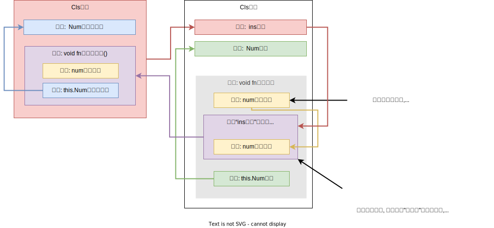

====

依赖反转:  A类依赖B类, 就是"依赖";   A类实现了"x接口", 就是"依赖的反转". 即A类向上依赖x接口.

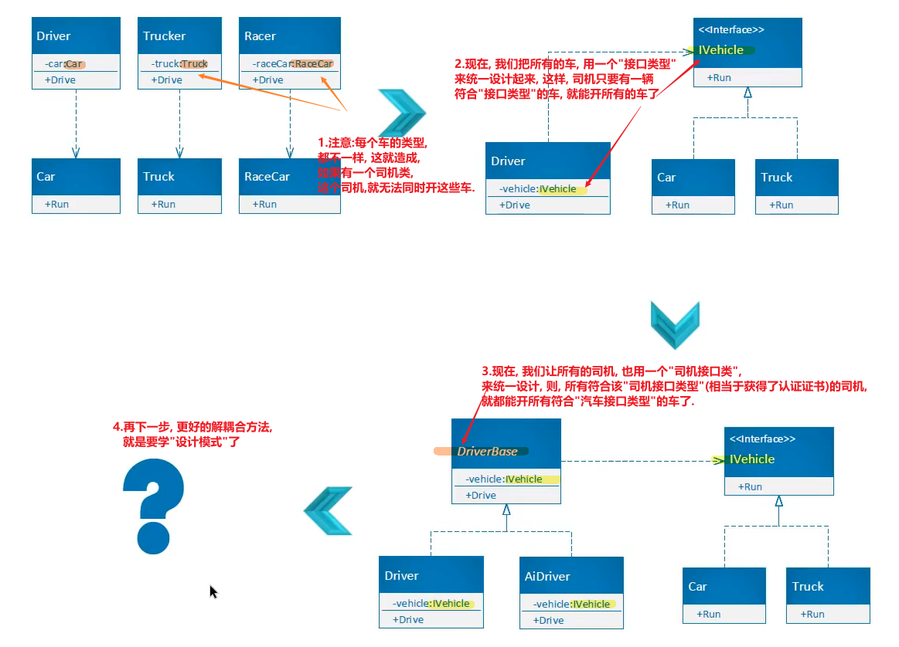

'''

== 单元测试

首先, 我们要测试的代码是:

[,subs=+quotes]
----

namespace ConsoleApp4 {

    //接口
    *public interface Itf电源类的接口 {*
        int fn获取电池电量值();
    }

    //电源类
    *public class Cls电源 :Itf电源类的接口{ //要实现接口*
        public int fn获取电池电量值() {
            return 100;
        }
    }

    //电扇类
    public class Cls电扇 {
        *private Itf电源类的接口 ins电源; //类型是"实现了电源类的接口(相当于是行业标准认证证书)"的类(拿到了"行业认证证书"的企业生产的电源, 有国家认证资质的企业生产的电源)*

        //构造函数
        public Cls电扇(Itf电源类的接口 ins电源) {
            this.ins电源 = ins电源;
        }

        public string fn电扇当前工作状态() {
            int num当前电量 = ins电源.fn获取电池电量值();

            if (num当前电量 <= 0) {
                return "电量为0, 电扇无法工作";
            }
            else if (num当前电量 <100) {
                return "电量所剩不多, 电扇只能开小档";
            }
            else if (num当前电量 < 200) {
                return "电量正常, 电扇工作正常";
            }
            else {
                return "电池损坏, 电扇无法工作";
            }

        }
    }

    //主函数
    internal class Program {
        static void Main(string[] args) {

        }
    }
}
----

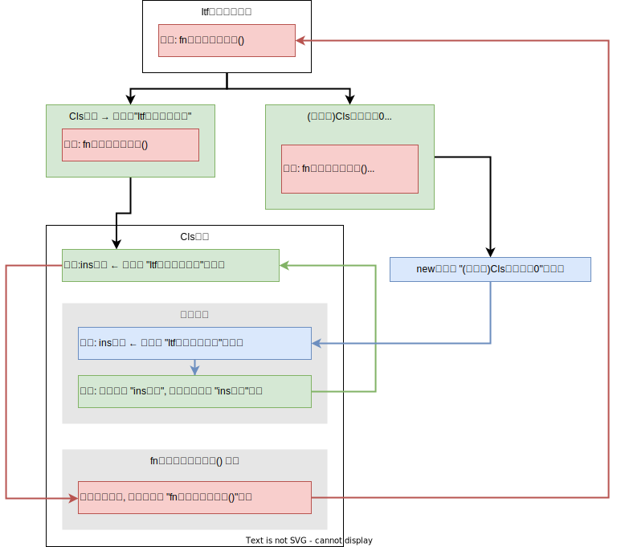

在项目上, 右键, 新建项目, 搜索 test, 新建msTest 测试项目.

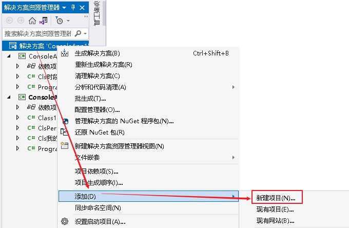

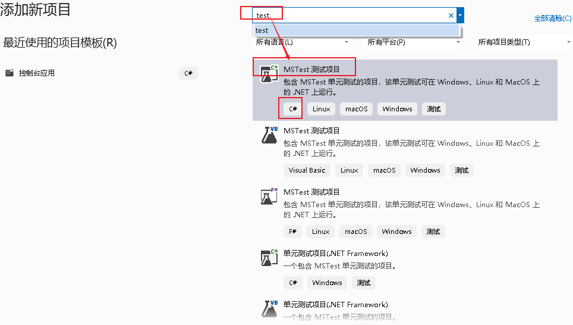

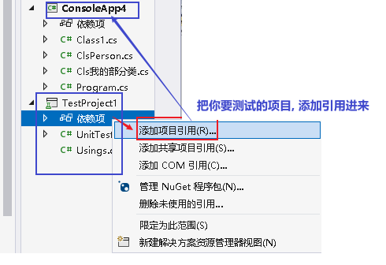

在菜单"测试"里面, 打开"测试资源管理器"

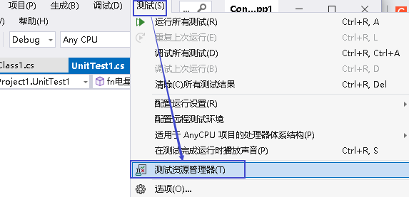

具体方法件: https://blog.csdn.net/zp19860529/article/details/115047604

现在, 我们在测试页面中(也是个类文件), 写:

[,subs=+quotes]
----
using ConsoleApp4;

namespace TestProject1 {

    [TestClass]
    *public class UnitTest1 {*  //专门用来"做测试"的类
        [TestMethod]
        public void fn电量等于0的测试() {

            Cls电扇 ins电扇 = new Cls电扇(new Cls电量等于0()); *//"Cls电扇"这个类, 实例化时, 要传入一个"实现了电源类接口"的类的实例对象. 而我们在本测试页面上写的 "Cls电量等于0"类, 就是实现了这个"Itf电源类的接口"的类, 符合要求, 所以可以传给 "Cls电扇"类的实例中, 作为里面字段的赋值.*

            *//下面, assert.AreEqual(你期望会有的结果值, 实际的值）*
            string str期望的值 = "电量为0, 电扇无法工作";
            string str实际的值 = ins电扇.fn电扇当前工作状态();
            *Assert.AreEqual(str期望的值, str实际的值);* // true

        }
    }

    class Cls电量等于0 : Itf电源类的接口 {
        public int fn获取电池电量值() {
            return 0;  //将电量直=0, 返回回去.
        }
    }
}
----

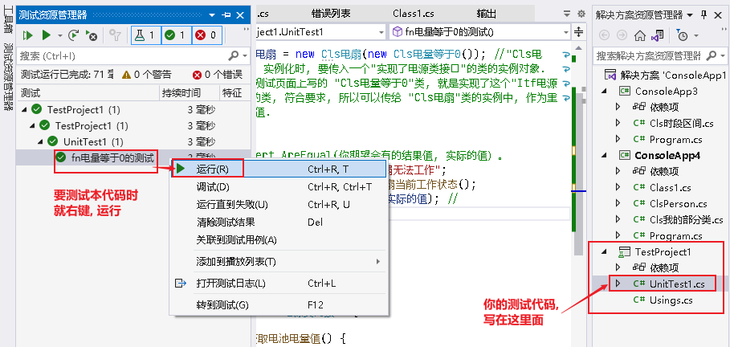

为了一次性测试"程序对多个输入值的不同反应", 我们要使用 moq

继续, 下载 moq

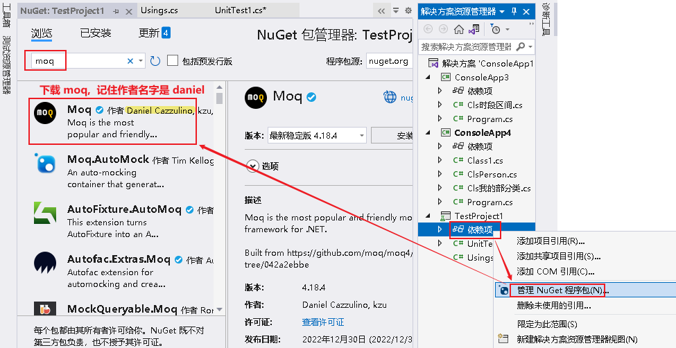

'''

== 接口隔离原则(ISP)

接口隔离原则(ISP)
设计应用程序的时候，如果一个模块包含多个子模块，那么我们应该小心对模块做出抽象。设想该模块由一个类实现，我们可以把系统抽象成一个接口。但是要添加一个新的模块扩展程序时，如果要添加的模块只包含原系统中的一些子模块，那么系统就会强迫我们实现接口中的所有方法，并且清寒要编写一些哑方法。这样的接口被称为肚胖接口或者被污染的接口，使用这样的接口将会给系统引入一些不当的行为，这些不当的行为可能导致不正确的结果，也可能导入资源浪费。

1.接口隔离
接口隔离原则（Interface Segregation Principle, ISP）表明客户端不应该被强迫实现一些他们不会使用的接口，应该把胖接口中的方法分组，然后用多个接口替代它，每个接口服务于一个子模块。简单地说，就是使用多个专门的接口比使用单个接口要好很多。

ISP 的主要观点如下：

1）一个类对另外一个类的依赖性应当是建立在最小的接口上的。

ISP 可以达到不强迫客户（接口的使用方法）依赖于他们不用的方法，接口的实现类应该只呈现为单一职责的角色（遵循 SRP 原则） ISP 还可以降低客户之间的相互影响---当某个客户要求提供新的职责（需要变化）而迫使接口发生改变时，影响到其他客户程序的可能性最小。

2）客户端程序不应该依赖它不需要的接口方法（功能）。

客户端程序就应该依赖于它不需要的接口方法（功能），那依赖于什么？依赖它所需要的接口。客户端需要什么接口就是提供什么接口，把不需要的接口剔除，这就要求对接口进行细化，保证其纯洁性。

比如在继承时，由于子类将继承父类中的所有可用方法；而父类中的某些方法，在子类中可能并不需要。例如，普通员工和经理都继承自雇员这个接口，员工需要每天写工作日志，而经理不需要。因此不能用工作日志来卡经理，也就是经理不应该依赖于提交工作日志这个方法。

可以看出，ISP和SRP在概念上是有一定交叉的。事实上，很多设计模式在概念上都有交叉，甚至你很难判断一段代码属于哪一种设计模式。

ISP强调的是接口对客户端的承诺越少越好，并且要做到专一。当某个客户程序的要求发生变化，而迫使接口发生改变时，影响到其他客户程序的可能性小。这实际上就是接口污染的问题。

2.对接口的污染
过于臃肿的接口设计是对接口的污染。所谓的接口污染就是为接口添加不必要的职责，如果开发人员在接口中增加一个新功能的目的只是减少接口实现类的数目，则此设计将导致接口被不断地“污染”并“变胖”。

“接口隔离”其实就是定制化服务设计的原则。使用接口的多重继承实现对不同的接口的组合，从而对外提供组合功能---达到“按需提供服务”。 接口即要拆，但也不能拆得太细，这就得有个标准，这就是高内聚。接口应该具备一些基本的功能，能独一完成一个基本的任务。

在实际应用中，会遇到如下问题：比如，我需要一个能适配多种类型数据库的 DAO 实现，那么首先应实现一个数据库操作的接口，其中规定一些数据库操作的基本方法，比如连接数据库、增删改查、关闭数据库等。这是一个最少功能的接口。对于一些 MySQL 中特有的而其他数据库里并不存在的或性质不同的方法，如 PHP 里可能用到的 MySQL 的 pconnect 方法，其他数据库里并不存在和这个方法相同的概念，这个方法也就不应该出现在这个基本的接口里，那这个基本的接口应该有哪些基本的方法呢？PDO已经告诉你了。

PDO 是一个抽象的数据库接口层，它告诉我们一个基本的数据库操作接口应该实现哪些基本的方法。接口是一个高层次的抽象，所以接口里的方法都应该是通用的、基本的、不易变化的。

还有一个问题，那些特有的方法应该怎么实现？根据ISP原则，这些方法可以在别一个接口中存在，让这个“异类”同时实现这两个接口。

对于接口的污染，可以考虑这两条处理方式：

利用委托分离接口。
利用多继承分离接口。
委托模式中，有两个对象参与处理同一个请求，接受请求的对象将请求委托给另一个对象来处理，如策略模式、代理模式等中都应用到了委托的概念。

在组件构建过程中，某些接口之间直接的依赖,常常会带来很多问题、甚至根本无法实现。*采用添加一层间接（稳定）接口，来"隔离"本来互相紧密关联的接口, 是一种常见的解决方案。*

典型模式
Facade 【注：解决系统内和系统外】
....
fa·çade n.   /fəˈsɑːd/
1.
the front of a building （建筑物的）正面，立面
2.
[ usually sing.] the way that sb/sth appears to be, which is different from the way sb/sth really is （虚假的）表面，外表

•
She managed to maintain a façade of indifference. 她设法继续装作漠不关心的样子。

•
Squalor and poverty lay behind the city's glittering façade. 表面的繁华掩盖了这座城市的肮脏和贫穷。

-> 来自face, 脸。
....

Proxy 【注：两个对象，由于安全/分布式/性能的原因不能直接依赖，必须隔离】
Adapter 【注：解决老接口和新接口的不匹配问题】
Mediator 【注：解耦系统内对象间的关联关系】

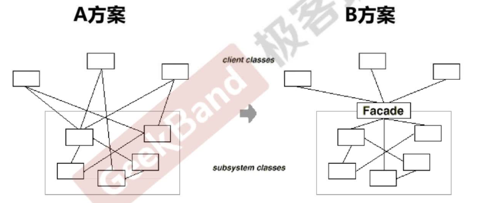

**上述 A 方案的问题在于: 组件的客户, 和组件中各种复杂的子系统, 有了过多的耦合，**随着外部客户程序和各子系统的演化，这种过多的耦合面临很多变化的挑战。

如何简化外部客户系统和系统间的交互接口？如何将外部客户程序的演化和内部子系统的变化之间的依赖相互解耦？

为子系统中的一组接口, 提供一个一致（稳定）的界面，Facade 模式定义了一个高层接口，这个接口使得这一子系统更加容易使用（复用）。——《设计模式》 GoF

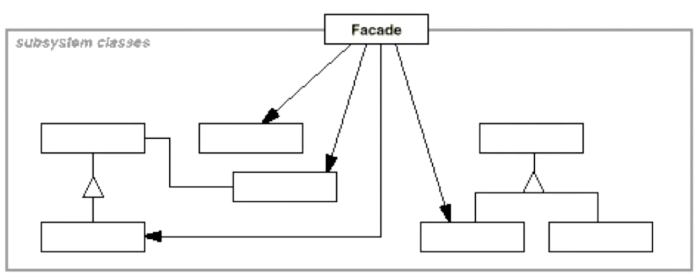

【注】：

Facade （稳定）
其他的可能会变化
8.1.5 要点总结
从客户程序的角度来看，*Facade模式简化了整个组件系统的接口，对于组件内部与外部客户程序来说，达到了一种“解耦”的效果——内部子系统的任何变化不会影响到Facade接口的变化。*
Facade设计模式更注重从架构的层次去看整个系统，而不是单个类的层次。*Facade很多时候更是一种架构设计模式。*
Facade设计模式并非一个集装箱，可以任意地放进任何多个对象。Facade模式中组件的内部应该是“相互耦合关系比较大的一系列组件”，而不是一个简单的功能集合。

[,subs=+quotes]
----
interface Itf坦克类接口 : Itf车类接口, Itf武器类接口 *//接口, 可以继承自多个接口*
----
