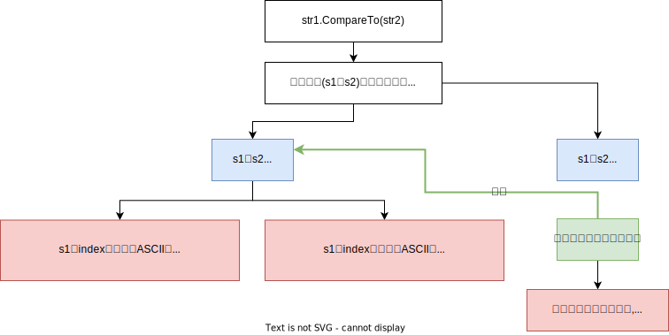
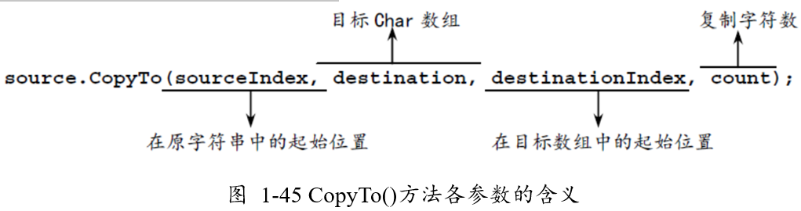


= 字符串
:sectnums:
:toclevels: 3
:toc: left

---

== string类型

string类型是"引用类型"而不是"值类型"。但是它的相等运算符, 却遵守"值类型"的语义。

string类型的变量, 是不可修改的. 所以 string类型的方法(函数), 不会修改原字符串, 只会指针指向新字符串的内存地址.

'''

== 增

==== 插入字符串 -> strObj.Insert(indexStart,newString) 

在字符串的某个索引位置处,插入一段新的字符串内容 -> strObj.Insert(indexStart,newString)

[,subs=+quotes]
----
string str ="zrx1981";
Console.WriteLine(*str.Insert(3,"---")*);  //zrx---1981
----

'''

== 删

'''

== 改 (字符串无法修改, 只会返回一个新字符串给你)

==== 替换string中的某些内容 → strObj.Replace(oldValue, newValue)

[,subs=+quotes]
----
string str1 = "zrx slf";

Console.WriteLine(*str1.Replace("slf","wyy")*); //zrx wyy ← *把slf 替换成 wyy.* 注意, 字符串是不可修改的, 所以这里 Replace()方法, 只是返回一个新字符串给你, 老字符串并没有改变.

Console.WriteLine(str1); //zrx slf  ← 老字符串并没有改变.
----

'''

==== 去除string头尾的空白字符 → strObj.Trim()

[,subs=+quotes]
----
str1.Trim()
----

'''

== 查

==== 查找某个字符的index索引位置 > strOjb.IndexOf(要找的字符)

[,subs=+quotes]
----
string str = "zrx1981";

//返回字符串中, 某个字符的索引位置
Console.WriteLine(*str.IndexOf("9")*);  //4
----

'''

==== 获取string的长度 → strObj.Length

[,subs=+quotes]
----
string str2 = "白日依山尽";
Console.WriteLine(*str2.Length*); //5

string str = "zrx";
Console.WriteLine(str.Length); //3

//字符串, 可以用索引值, 来取得里面的某个字符
Console.WriteLine(*str2[2]*); //依
----

'''

== 比较

==== 比较两个string → str1.compareTo(str2)

compareTo()方法, 返回值是: -1, 0, 1.

'''

== 拼接, 拆分, 截取

'''

==== 拼接n个字符串 →  string.Concat(str1, str2,str3,...)

[,subs=+quotes]
----
string str1 = "zrx";
string str2 = "slf";
Console.WriteLine(*string.Concat(str1,str2)*); //zrxslf  ← *注意: Concat()方法是String类的类方法, 不能被实例调用.* 即 不能写成 str1.Concat(str2).

string str3 = ",wyy";
string str4 = ",zm";
Console.WriteLine(*string.Concat(str1,str2,str3,str4)*); //zrxslf,wyy,zm ← *该"类方法"可以拼接任意多个字符串.*
----

'''

==== 将一个字符数组 char[] 中的所有字符元素, 合并成一个新的string返回. -> string.Join("连接符",arrChar)

[,subs=+quotes]
----
char[] arrChar = { 'a', 'b', 'c' };

Console.WriteLine(*string.Join("",arrChar)*); //abc  ← 第一个参数, 是每个字符元素间的连接符, 如果你不想要连接符, 就用空白字符串来代表连接符

Console.WriteLine(*string.Join("-",arrChar)*); //a-b-c
----

*这个方法好, 可以不用foreach循环, 来直接打印出数组中的所有元素.*

[,subs=+quotes]
----
int[] arr = { 0, 1, 2, 3, 4, 5 };
*Console.WriteLine(string.Join(",",arr));*  //0,1,2,3,4,5
----

'''

==== 拆分 →  strObj.Split(拆分点的标识)

[,subs=+quotes]
----
string str1 = "zrx,slf,wyy,zzr";

*string[] arrStr = str1.Split(','); // 将字符串中的值, 按逗号处来拆分. Split()方法, 会返回一个字符串数组*

foreach (string item in arrStr) {
           Console.WriteLine(item);
}
----

'''

==== 截取子字符串 → strObj.Substring(起始的index处, 截取的字符数量)

[,subs=+quotes]
----
string str1 = "zrx,slf,wyy,zzr";

Console.WriteLine(*str1.Substring(4)*); //slf,wyy,zzr  *← 从 index=4 开始, 往后截取到末尾, 保留这段子字符串.*

//也可以写成下面的形式, 更方便.
Console.WriteLine(*str1[4..]*);//slf,wyy,zzr

Console.WriteLine(*str1.Substring(4,3)*);//slf  *← 第一个参数4, 表示从index=4开始截取. 第二个参数3, 表示截取的字符数量, 即只截取3个字母, 而不要截取到整个末尾.*
----

'''

== 拷贝

==== strintg -> copy to -> char[]

将字符串中的内容, 拷贝到另一个 char[] 字符数组中. 

....
strObj.CopyTo(1.要拷贝的strObj的起始索引位置, 2.目标字符数组char[], 3.放到目标字符数组的startIndex, 4.共拷贝strObj几个字符?)
....

[,subs=+quotes]
----
char[] arrChar = new char[20]; //创建一个字符类型的数组, 共20个元素长度

for (int i = 0; i < arrChar.Length; i++) //把字符数组中的全部元素, 赋值为字符'0'
{
    arrChar[i] = '0';
}

string str1 = "0123456789";

*str1.CopyTo(4, arrChar, 1, 5); // 即, 将str1, 从第 index=4 的索引处开始(第一个参数), 拷贝5个字符(第四个参数), 到 arrChar数组中(第二个参数), 从后者的那个index开始放呢? 从index=1 开始放(第三个参数).*

foreach (char c in arrChar)
{
    Console.Write(c); // 04567800000000000000
}
----

'''
