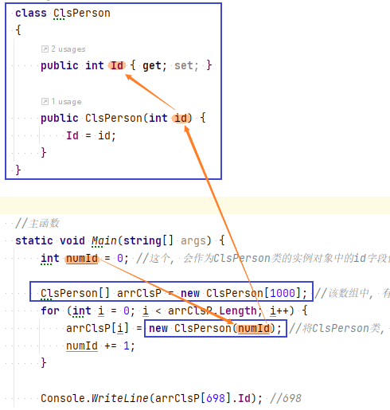


= [] 数组
:sectnums:
:toclevels: 3
:toc: left

---

== 数组

数组是"固定数量"的, 特定类型的变量集合(称为元素)。 +
为了实现高效访问，数组中的元素, 总是存储在连续的内存块中。 +
*一旦数组创建完毕，它的长度将不能更改.*

数组本身, 是"引用类型"的. 就数组变量, 也是指针而已.

[,subs=+quotes]
----
int[] arr1 = null;  //将数组变量, 这个指针指向空.
----

'''

== 新建数组

[,subs=+quotes]
----
*string[] arrSex = { "F", "M", "M" };*

//新建数组, 方式2:
*string[] arrNames = new string[10];  //声明,并创建一个10个元素的数组, 每个元素会赋默认值*

//新建数组,方式3:
*int[] arrAges = new int[] { 1, 2, 3, 4};*
----

例: 下面, 创建一个数组, 含有1000个元素. 里面每个元素都是class类型的(事实上装的是对class实例的引用地址. 即1000个指针). 然后, 实例化1000个 ClsPerson类的实例, 放入数组中.

[,subs=+quotes]
----
namespace ConsoleApp3
{
    internal class Program
    {
        //类
        class ClsPerson
        {
            public int Id { get; set; }
            public ClsPerson(int id) {
                Id = id;
            }
        }

        //主函数
        static void Main(string[] args) {

            int numId = 0; //这个, 会作为ClsPerson类的实例对象中的id字段值, 每多一个实例, 该值就递增加1.

            *ClsPerson[] arrClsP = new ClsPerson[1000]; //该数组中, 有1000个元素.*

            for (int i = 0; i < arrClsP.Length; i++) {
                *arrClsP[i] = new ClsPerson(numId); //将ClsPerson类, 做出1000个实例化的对象, 装到数组里面.*
                numId += 1;
            }

            Console.WriteLine(arrClsP[698].Id); //698
        }

    }
}
----

'''

==== 创建二维数组

最简单的方式是:

[,subs=+quotes]
----
*int[,]* arr二维数组 = new int[,]{  *// 若每行中的元素数量(即列数)都相同, 比如,每行都有5个元素, 或每行都有18个元素等 (而非第一行比如5个元素, 第二行变成了有8个元素,第三行又变成17个元素).  则 数组的类型要写成 int[,]*
    { 0, 1, 2 },
    { 3, 4, 5 },
    { 6, 7, 8 }
};
----

也可以省略 new 关键词, 直接赋值:
[,subs=+quotes]
----
int[,] arr二维数组 = {
    { 0, 1, 2 },
    { 3, 4, 5 },
    { 6, 7, 8 }
};
----

又如:
[,subs=+quotes]
----
//创建一个"每行的列数都不相同"的二维数组
*int[][]* arr二维数组 = { *//每行中的元素数量都不相同, 其类型, 就不能写成 int[,]了, 只能写成 int[][]*
    new int[]{ 0, 1, 2 },
    new int[]{ 11, 12, 13, 14, 15 },
    new int[]{ 100 },
};
----

又例:
[,subs=+quotes]
----
static void Main(string[] args) {

    **int[,] arr矩阵 = new int[3, 4]; // 创建一个"3行4列"的矩阵 (二维数组),  类型就写成 int[,]  ← 即n维数组, 每个维度, 要用逗号来分割. **

    *//多维数组, 每一维度中元素的长度, 是用 "GetLength(维度索引)"方法来获取的. 所以 arr.GetLength(0)就代表获得第一维度中的元素数量(即"行数"), arr.GetLength(1)就代表获得第二维度中的元素数量(即"列数").*
    for (int i = 0; i < *arr矩阵.GetLength(0);* i++) {
        for (int j = 0; j < *arr矩阵.GetLength(1);* j++) {
            arr矩阵[i, j] = (i * 4) + j;
        }
    }

    //遍历出二维数组中的每个元素.
    for (int i = 0; i < *arr矩阵.GetLength(0);* i++) {
        for (int j = 0; j < *arr矩阵.GetLength(1);* j++) {
            Console.Write(*arr矩阵[i, j]*+",");
        }
        Console.WriteLine();
    }
}
----

输出:
....
0,1,2,3,
4,5,6,7,
8,9,10,11,
....

'''

== 增

'''

== 删

'''

== 改

'''

== 查

'''

== 遍历

==== foreach()方法

[,subs=+quotes]
----
string[] names = { "zrx", "zzr", "wyy" };

*foreach (string item in names)* //遍历数组. 将数组中的每个元素, 赋值给 我们新建的string类型的 item变量
{
  Console.WriteLine(item); //打印出数组中的每个元素的值
}
----

'''

==== 方法: 先获取数组中元素的长度 (数组.Length属性), 然后使用for循环

[,subs=+quotes]
----
int arrLength = *arr我的数组.Length;*  // 该Length属性, 能获取数组的长度
Console.WriteLine(arrLength); //4

*for (int i = 0; i < arrLength; i++)*
{
  Console.WriteLine(*arr我的数组[i]*);
}
----

'''

==== 如果只是想打印观看一下数组里的所有元素的话, 可以使用 ->  string.Join("连接符",你的数组)

[,subs=+quotes]
----
int[] arr = { 0, 1, 2, 3, 4, 5 };
*Console.WriteLine(string.Join(",",arr));*  //0,1,2,3,4,5
----

'''

==== 使用 Array.ForEach(你的数组,item => Console.Write(item + ",")) 方法

[,subs=+quotes]
----
int[] arr你的数组 = { 0, 1, 2, 3, 4, 5 };
*Array.ForEach(arr你的数组, item => Console.Write(item + ","));* //0,1,2,3,4,5,
----

'''

