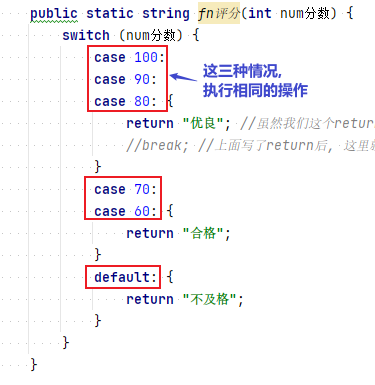
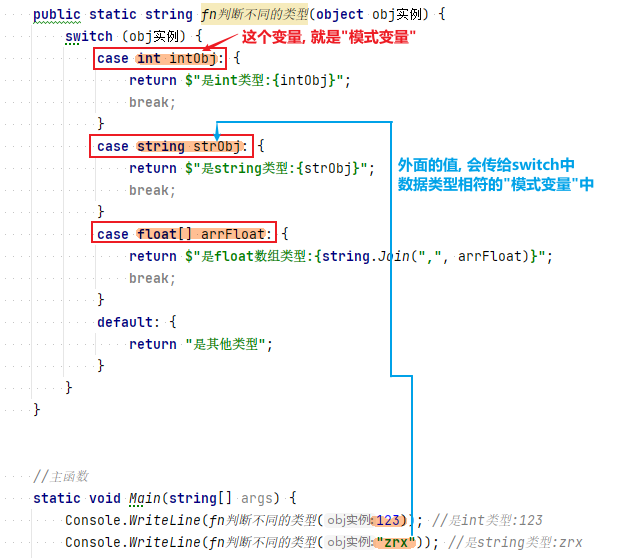
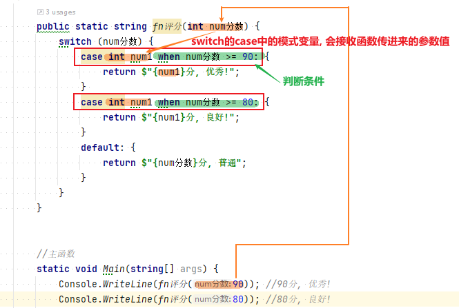
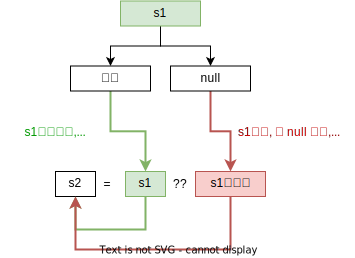

= if & Switch
:sectnums:
:toclevels: 3
:toc: left

---

== if... else if...

[source, java]
----
Console.WriteLine("输入x,y坐标\n");
int x = Convert.ToInt32(Console.ReadLine());
int y = Convert.ToInt32(Console.ReadLine());

if (x > 0 && y > 0)
{
Console.WriteLine("在象限1");
}
else if (x < 0 && y > 0) //当上面的条件不满足时, 再执行本处的条件判断
{
Console.WriteLine("在象限2");
}
else if (x < 0 && y < 0)
{
Console.WriteLine("在象限3");
}
else if (x > 0 && y < 0)
{
Console.WriteLine("在象限4");
}
else
{
Console.WriteLine("在坐标轴上");
}
----

---

== Switch

[source, java]
----
int num = Convert.ToInt32(Console.ReadLine());

switch (num)
{
  case 1: //当num=1时,就执行这条case语句
      Console.WriteLine("you input 1");
      break; //每条case语句,必须以 break; 结束!

  case 2:
      Console.WriteLine("you input 2");
      break;
  case 3:
      Console.WriteLine("you input 3");
      break;
  default:
      Console.WriteLine("you input other");
      break;
}
----

*每一个case子句结束时, 必须使用某种跳转指令, 显式指定下一个执行点* (除非你的代码本身就是一个无限循环)。这些跳转指令有:

- *break (跳转到switch语句的最后)*
- **goto case x (跳转到另外一个case子句) **
- *goto default (跳转到default子句)*
- *其他的跳转语句，例如 return、throw、continue 或者 goto label*

*注意: case子句的顺序, 会影响代码的输出结果. 因为如果第一个case子句发现自己已经满足了全部的case条件, 则第二个case子句永远不会执行。但default子句是一个例外，不论它出现在什么地方, 都会在最后才被执行.*

当多个case值, 要执行相同的代码时，可以按照顺序列出共同的case条件:

[,subs=+quotes]
----
internal class Program
    {
    //定义一个函数, 里面有swith语句
    public static string fn评分(int num分数) {
        switch (num分数) {
            *case 100:*
            *case 90:*
            *case 80: {*
                return "优良"; //虽然我们这个return,是写在switch里面的, 但这个return其实是属于函数管理的, 而不是属于Switch管理的, 所以它就会直接作为函数的返回值返回.
                //break; //上面写了return后, 这里就不需要再写 break了.
            }
            case 70:
            case 60: {
                return "合格";
            }
            default: {
                return "不及格";
            }
        }
    }

    //主函数
    static void Main(string[] args) {
        Console.WriteLine(fn评分(100)); //优良
        Console.WriteLine(fn评分(80)); //优良
        Console.WriteLine(fn评分(60)); //合格
        Console.WriteLine(fn评分(59)); //不及格
    }
}
----

'''

====  switch还能够判断不同的类型, 由"模式变量"来接收.

[,subs=+quotes]
----
internal class Program
{
    public static string fn判断不同的类型(object obj实例) {

        switch (obj实例) {
            *case int intObj: { //本例, 每个case语句, 都指定一种要匹配的数据类型, 和接收该类型的变量(即"模式变量"). 本处的 "intObj"就是"模式变量". 如果类型匹配成功, 就对该"模式变量"赋值.*
                return $"是int类型:{intObj}";
                break;
            }
            *case string strObj: {*
                return $"是string类型:{strObj}";
                break;
            }
            *case float[] arrFloat: {*
                return $"是float数组类型:{string.Join(",", arrFloat)}";
                break;
            }
            *default: {*
                return "是其他类型";
            }
        }
    }

    //主函数
    static void Main(string[] args) {
        Console.WriteLine(fn判断不同的类型(123)); //是int类型:123

        Console.WriteLine(fn判断不同的类型("zrx")); //是string类型:zrx

        float[] arrFloat = new float[] { 1.1f, 2.2f, 3.3f };
        Console.WriteLine(fn判断不同的类型(arrFloat)); //是float数组类型:1.1,2.2,3.3

        Console.WriteLine(fn判断不同的类型(new clsP())); //是其他类型

    }
}
----

'''

==== switch中, 可以使用 when来判断条件

[,subs=+quotes]
----
internal class Program
{
    public static string fn评分(int num分数) {
        switch (num分数) {
            *case int num1 when num分数 >= 90: {*
                return $"{num1}分, 优秀!";
            }
            *case int num1 when num分数 >= 80: {*
                return $"{num1}分, 良好!";
            }
            default: {
                return $"{num分数}分, 普通";
            }
        }
    }

    //主函数
    static void Main(string[] args) {
        Console.WriteLine(fn评分(90)); //90分, 优秀!

        Console.WriteLine(fn评分(80)); //80分, 良好!

        Console.WriteLine(fn评分(79)); //79分, 普通
    }
}
----

'''

== 三元运算符 -> 条件判断 ? 若前面的条件为真则用这前面的值 : 若条件为假则用这后面的值

三元条件运算符, 使用 q ? a : b 的形式. 即: 它在q为真时就计算a, 否则计算b.

[,subs=+quotes]
----
internal class Program
{
    static void Main(string[] args) {
        Console.WriteLine(fnMax(4,6)); //6
    }

    public static int fnMax(int a, int b) {
        *return (a > b) ? a : b;  //三元运算符, 这里的意思是, 若(a>b) 为true, 则返回前面的 a. 若为false, 则后面的返回b*
    }
}
----

条件运算符在LINQ语句中尤其有用.

'''

== null 条件运算符

(这个没做笔记, 具体看<c#核心技术指南>)

[,subs=+quotes]
----
StringBuilder s1 = null;
*StringBuilder s2 = (s1 == null ? null : s1); //这里问号?的意思是, 若s1的值为null, 就用冒号前面的值(即null), 否则, s1的值不为null, 就用冒号后面的值 s1.*
Console.WriteLine(s2);

//上面的判断代码, 其实可以写成:

string s3 = "zrx";
string s4 = (s3 == null ? null : s3);
Console.WriteLine(s4); //zrx

string s5 = "刘禅";
string s6 = (s5 == "刘禅" ? "诸葛亮" : "刘备"); //如果s5的值是"刘禅",就换成冒号前面的"诸葛亮"; 若s5的值不是"刘禅", 就换成"刘备".
Console.WriteLine(s6); //诸葛亮
----

'''

== null合并运算符 -> ??

null合并运算符, 写作 ??. 如下例子:

[,subs=+quotes]
----
string s1 = null;

*string s2 = s1 ?? "新值"; //??的意思就是, 若s1的值是null, 我就重新给你一个新值(即用??后面给的有值的值), 赋给 s2. 如果s1的值不是null, 是有值的话, 那就用你s1的值, 赋给s2. 换言之, 就是说, ??会判断, 你若有钱, 你就用你的钱; 你若没钱, 我给你钱.*

Console.WriteLine(s2); //新值
----

又如:
[,subs=+quotes]
----
string s1 = "我有值, 用我的!";
**string s2 = s1 ?? "新值"; ** //既然你s1有值, 我就直接用你的值, 而不会用"新值".
Console.WriteLine(s2); //我有值, 用我的!
----

null合并运算符, 同样适用于"可空的值类型".

'''

