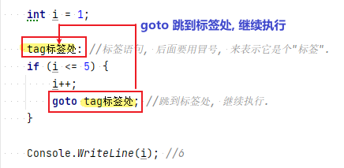

= 跳转 break, continue, goto, return, throw
:sectnums:
:toclevels: 3
:toc: left

---

== break -> 跳出轮回, 不陪你玩了

break语句: 用于结束迭代, 或switch语句的执行. 即, 不陪你完了, 我跳出五谷轮回.

[,subs=+quotes]
----
int num = 1;
int num总数 = 0;

while (true) {
    num总数 += num;
    num++;

    if (num >= 100) {
        num总数 += num; //从1加到100, 到达100后, 就退出while 循环
        *break; //结束迭代. 本例就是结束 while循环.*
    }
}

Console.WriteLine(num总数); //5050
----

'''

== continue -> 进入下一轮轮回, 继续玩

continue语句放弃循环体中其后的语句，继续下一轮迭代。 即, 相当于佛教中进入新的人生轮回, 进入下辈子.

[,subs=+quotes]
----
for (int i = 0; i < 10; i++) {
    if ((i % 2) == 0) {
        *continue; //如果除以2的余数是0的话, 即如果是偶数的话, 就放弃后面的语句执行,直接进入下一轮for循环中*
    }

    Console.Write(i + ","); //1,3,5,7,9,
}
----

'''

== goto

goto语句, 将执行点, 转移到语句块中的指定标签处。

格式如下:
....
goto statement-label;
....

或用于switch 语句内:
....
goto case case-constant;   // (Only works with constants, not patterns)
....

*标签语句, 仅仅是代码块中的"占位符"，位于语句之前，用"冒号后缀"表示:*

[,subs=+quotes]
----
int i = 1;

*tag标签处: //标签语句, 后面要用冒号, 来表示它是个"标签".*
if (i <= 5) {
    i++;
    *goto tag标签处; //跳到标签处, 继续执行.*
}

Console.WriteLine(i); //6
----

上面这段代码, 模拟了 for循环来遍历从1到5的数字.

'''

== return

return语句用于退出函数方法. 或返回一个值. +
return语句能够出现在方法的任意位置(除finally块中)。

'''

== throw

throw语句, 用来抛出异常, 以表示有错误发生.

'''

